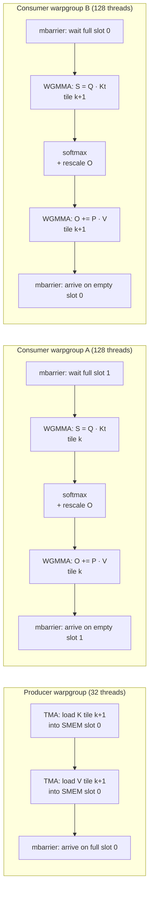

# FlashAttention-3 Internals

<Mode is="learn">

The concept-level [FlashAttention-3 lesson](/llm-architecture/attention/flash-attn-3) explained the structural facts: attention is memory-bound, online softmax replaces the materialized N×N matrix, FA-2 tiled the computation, and FA-3 rewrote it for Hopper. That's enough to read papers. It is not enough to read the kernel — the FA-3 paper's claim of "1.5–2× over FA-2 on H100" comes from a specific kernel architecture: producer warps doing async TMA copies while consumer warps run WGMMA matmuls, with `mbarrier` coordination, multi-stage SMEM buffers, and a "pingpong" schedule that alternates two consumer warpgroups so neither one is ever waiting on memory.

This lesson is the contributor's view of FA-3 — the layer where FlashAttention turns from a paper diagram into a working ~300-line CUDA kernel. After this you should be able to read `csrc/flash_attn/` in the Dao-AILab repo without panicking, identify which optimizations apply when porting to a new architecture (Blackwell, Trainium, MI325), and reason about why FA-3 is *exactly* this pipeline shape and not something else.

## TL;DR

- **FA-2 left two big things on the table on Hopper**: it didn't use TMA (so SMs spent cycles dispatching loads), and it issued WGMMA *synchronously* (so consumer warps blocked on math while the next tile's data was being fetched). FA-3 fixes both.
- **Warp specialization** splits the kernel into producer warps (TMA-only) and consumer warps (WGMMA + softmax). They communicate via SMEM buffers + `mbarrier` synchronization. The producer is always ahead — by the time consumers need tile k, tile k+1 is already in SMEM.
- **WGMMA is async.** You issue `wgmma.commit_group` and continue executing other instructions; you `wgmma.wait_group` only when you actually need the result. This is the structural difference from FA-2's `mma.sync` which blocks the warp until done.
- **The pingpong schedule** uses *two* consumer warpgroups (256 threads each) that alternate processing tiles. While warpgroup-A runs softmax on the previous WGMMA result, warpgroup-B is running the next WGMMA. The chip never idles.
- **Intra-warpgroup overlap** runs softmax on the result of the *previous* WGMMA-1 (S = QK^T) *while* WGMMA-2 (O += P @ V) is in flight. The producer/consumer split hides HBM latency; the intra-warpgroup overlap hides math latency. Both are needed to reach 75%+ of Hopper peak.

## The concept, in plain English

A FlashAttention kernel walks through Q tile by tile. For each Q tile, it iterates over the K/V tiles, computing partial attention scores S = QK^T, applying online softmax to get probabilities P, and accumulating O += PV. FA-2 does this with traditional CUDA primitives: `cp.async` to load K/V into shared memory, `__syncthreads()` to wait for the load, `mma.sync` to compute, `__syncthreads()` again. The pattern is "fetch, sync, compute, sync, repeat." Each sync is a stall.

FA-3 rewrites the pipeline around two facts about Hopper: TMA can copy a whole tile asynchronously with one instruction (no per-thread overhead), and WGMMA is a non-blocking matmul instruction that you queue and check later. With these primitives, the kernel can structure itself as a software pipeline: producer warps perpetually load tiles ahead, consumer warps perpetually crunch the tiles already loaded, and the two never wait for each other. The result lands at 75–85% of Hopper peak instead of FA-2's 35–50%.

The clever part is that "the two never wait for each other" requires careful scheduling: the consumer warpgroups need *something* to do during the windows where math is in flight (WGMMA latency is significant), and the producer needs to know when SMEM buffers are free to overwrite. Both are solved by `mbarrier` (memory barrier), Hopper's hardware-level synchronization primitive — a counter in shared memory that warps wait on and arrive at, with no busy-spin overhead.

## Mental model — the four-stage pipeline



Three things to read off this diagram:

1. **Producer is one warpgroup; consumers are two.** The producer is small because TMA does the heavy lifting in hardware — one warp queues a TMA copy and the unit handles all the bytes.
2. **Two SMEM slots, double-buffered.** While slot 0 holds tile k+1 (loaded by producer, being consumed), slot 1 holds tile k+2 (loaded by producer, ready). This is why two consumer warpgroups: each owns one slot at a time, and they alternate.
3. **mbarrier is the only synchronization.** No `__syncthreads()`. Each barrier represents either "buffer is full, ready to read" or "buffer is empty, ready to overwrite." The producer arrives on full barriers; the consumer arrives on empty barriers.

This pipeline is what FA-3 calls "warp specialization with pingpong." The producer is the producer; consumers ping (warpgroup A) and pong (warpgroup B). At steady state, the chip's HBM is busy (TMA), the WGMMA pipe is busy (one consumer), and the special functional units are busy (the other consumer's softmax). Three units, three jobs, no idle.

## What FA-2 left on the table

To understand why FA-3 looks the way it does, take FA-2's structure and walk through what *doesn't* happen:

```text
FA-2 inner loop (paraphrased):
  while not done:
      cp.async.commit              # start loading K[k] into smem
      cp.async.wait_all            # WAIT until done
      __syncthreads()              # WAIT for all warps in CTA
      mma.sync(S, Q, K_smem)       # do QK^T, BLOCKS until done
      online_softmax_rescale(S, O)
      cp.async.commit              # start loading V[k]
      cp.async.wait_all            # WAIT
      __syncthreads()              # WAIT
      mma.sync(O += P @ V_smem)    # BLOCKS
      __syncthreads()
```

Five places the kernel blocks per tile, plus `mma.sync` itself blocking the warp until done. On A100 (Ampere), `cp.async` was strict-CTA-scoped and `mma.sync` had limited overlap; `__syncthreads()` was unavoidable. The pipeline structure was approximately: fetch → sync → compute → sync → fetch → sync → compute → sync. Each sync flushed the warp scheduler.

FA-3 gets to remove every one of these waits because Hopper added two specific things:

- **TMA**: a hardware unit that copies large async chunks. One thread issues `cp.async.bulk` or its TMA descriptor variant; the unit handles the rest. The warp can return immediately.
- **WGMMA**: a warpgroup-scope matmul where you `wgmma.commit_group` (queue) and only `wgmma.wait_group` when you need the result. The warp continues executing other instructions while the matmul is in flight.

The producer/consumer split + mbarrier replaces every `__syncthreads()` with a much cheaper hardware barrier scoped to two warpgroups. The result: ~30–50% of FA-2's runtime on H100 was waiting; FA-3 reclaims most of it.

## WGMMA's async semantics — the structural change

`wgmma.mma_async.sync.aligned.m64nNk16.f32.f16.f16` is a single instruction that produces a `m=64 × n=N` matmul. After issue, three things happen:

1. The instruction is queued in a per-warpgroup pipeline (depth ~1–2).
2. The warp continues executing the *next* instructions.
3. Eventually you call `wgmma.wait_group<n>` which waits until at most `n` matmuls are still in flight. Pass 0 to wait for everything.

This changes how you write the kernel. With `mma.sync`, the structure was "result is ready immediately, use it next." With `wgmma`, the structure is "result is ready *eventually*, schedule something else to do meanwhile." That "something else" is what FA-3 fills with the second WGMMA (S → P → O += P@V can have S→softmax→P happening *while* the next QK^T is in flight on the other warpgroup) and with softmax (which uses special-function units, not the WGMMA pipe).

The mental model: **WGMMA's async semantics open a scheduling window.** FA-3's whole architecture is engineered to fill that window with useful work.

## The pingpong schedule — full pseudocode

Two consumer warpgroups (call them A and B), each handling alternating K/V tiles. The schedule loops through tiles k = 0, 1, 2, ... with A on even k, B on odd k. SMEM has 2 slots; producer alternates between filling slot 0 (for A) and slot 1 (for B). Synchronization via 4 mbarriers (full-A, full-B, empty-A, empty-B).

```text
producer warp:
  for k = 0, 1, 2, ..., num_kv_tiles - 1:
      slot = k % 2                      # alternate slot
      barrier_full = full_A if even else full_B
      barrier_empty = empty_A if even else empty_B
      mbarrier.wait(barrier_empty)      # wait for slot to be free
      tma.load(K[k] -> smem[slot])
      tma.load(V[k] -> smem[slot])
      mbarrier.arrive(barrier_full)     # signal slot is ready

consumer warpgroup A (handles even tiles):
  for k = 0, 2, 4, ...:
      mbarrier.wait(full_A)             # wait for tile k to land
      wgmma.commit(S = Q · K[k]^T)      # async issue
      wgmma.wait_group<0>               # wait until S is ready
      online_softmax_rescale(S, O, l, m)  # softmax on SFU
      wgmma.commit(O += P · V[k])
      wgmma.wait_group<0>
      mbarrier.arrive(empty_A)          # release slot

consumer warpgroup B (handles odd tiles):
  symmetric to A but with full_B / empty_B
```

What happens at steady state:

- t=0: producer loads tile 0 → slot 0
- t=1: producer loads tile 1 → slot 1; consumer A starts on tile 0
- t=2: producer waits for empty_A (consumer A still working); consumer A computes S, B starts on tile 1
- t=3: A's S done, runs softmax; B computes S
- t=4: A computes O += PV; B runs softmax; producer reloads slot 0 (A done with it) with tile 2
- ...steady state...

At every moment, the chip is doing TMA + WGMMA + softmax + (sometimes) another WGMMA. Three or four units busy, no idle.

The `wgmma.wait_group<0>` is the critical line. It blocks on the WGMMA pipeline draining, but only after issuing as many in-flight commits as possible. Modern FA-3 issues both the QK^T and the next WGMMA before waiting, letting the pipeline overlap two matmuls within a warpgroup.

## Intra-warpgroup overlap — the second optimization

Even within one consumer warpgroup, FA-3 overlaps math. The naive sequence is:

```text
1. WGMMA: S = QK^T            (~10 cycles per output element on H100)
2. wait
3. softmax(S) -> P, rescale O
4. WGMMA: O += P · V
5. wait
```

The optimized sequence interleaves:

```text
1. WGMMA commit: S = QK^T (issue, don't wait)
2. softmax on PRIOR tile's S (kept in registers from last iteration)
3. WGMMA commit: O += PRIOR.P · V (PRIOR.P, V from last iter; issue, don't wait)
4. wgmma.wait_group<0>           (wait for current S)
5. Now S is ready; compute softmax in-place
6. ... (the next iteration uses these results)
```

At steady state, *two* WGMMAs are in flight simultaneously (one for S of current tile, one for O accumulation of previous tile), and softmax runs on the SFU pipe in parallel. This is why FA-3 reaches 75% of Hopper peak (the WGMMA pipe is occupied >75% of cycles) and not 50% (which is what you'd get with sequential issue+wait).

Skipping this optimization is the canonical "FA-2 port to Hopper" mistake — using WGMMA in place of mma.sync but still treating it as blocking. You get the WGMMA throughput improvement but miss the async-pipeline win. Net: ~50% peak instead of 75%.

## TMA — the bulk-copy primitive

TMA (Tensor Memory Accelerator) is Hopper's hardware unit for async bulk HBM↔SMEM copies. The kernel sets up a **TMA descriptor** (a small struct with shape, stride, dtype info) once at kernel entry, then issues `cp.async.bulk.tensor` instructions that the TMA unit handles independently of the SMs.

```text
TMA descriptor for K tile (shape [BLOCK_K, head_dim], stride from tensor):

  CUtensorMap = {
      data_type: bf16,
      tensor_rank: 2,
      shape: [BLOCK_K, head_dim],
      stride_in_bytes: [head_dim * 2, 2],  # row major
      box_size: [BLOCK_K, head_dim],
      element_strides: [1, 1],
      interleave: NONE,
      swizzle: 128B,                       # SMEM swizzle pattern
      l2_promotion: NONE,
      oob_fill: ZERO,
  }
```

The `swizzle: 128B` is critical: it tells TMA to lay the data out in SMEM in the swizzled pattern that WGMMA expects to read from. Without this, the consumer would have to re-shuffle data before issuing WGMMA, costing cycles and SMEM bandwidth.

The `cp.async.bulk.tensor` instruction takes the descriptor + a destination SMEM offset + a tile coordinate. One thread issues it; the unit pumps bytes; an `mbarrier.arrive` (the TMA's `expect_tx` barrier) signals completion. The producer warp's per-tile cost in instructions is roughly: 2 (issue K + V) + 2 (mbarrier.arrive). Compare to `cp.async`-based loads in FA-2 where every thread participated in moving the tile — TMA is a structural simplification.

## FP8 with block scaling — the second-tier feature

FA-3 ships an FP8 path (E4M3 inputs, FP32 accumulator, per-block dynamic scaling). The structural change vs the bf16 path is:

- **TMA loads E4M3 tiles** (1 byte/element vs 2 for bf16) — half the HBM traffic per tile.
- **WGMMA in fp8 mode** — 1979 TFLOPs/s peak vs 989 for bf16/fp16 on H100.
- **Block scale factor** is a fp32 number per block (typically 64 or 128 elements). Computed at the producer side or pre-stored; multiplied into the accumulator at the epilogue.

The math: fp8 inputs sacrifice some range, the per-block scale recovers it, and the fp32 accumulator absorbs accumulated error. Net quality loss on attention's softmax-then-matmul is sub-perplexity-point on production models.

The kernel cost: roughly 2× throughput vs bf16 at the same numerical quality, on workloads where FP8 doesn't trigger numerical issues (long attention with extreme outliers in K can). Production engines (vLLM, SGLang, TRT-LLM) ship FA-3 fp8 as an opt-in flag for inference; training paths still default to bf16 because the scale-factor computation cost is harder to hide in the backward pass.

## Real numbers — H100 attention, head_dim=128

Tri Dao's own benchmarks (the FA-3 paper) and reproducible community numbers, fp16/bf16, head_dim=128, sequence length 8192, batch×heads×seq:

| Implementation | TFLOPs/s | % of TC peak | Notes |
| --- | --- | --- | --- |
| Naive PyTorch attention | 22 | 2% | The wrong baseline |
| FlashAttention-2 (FA-2) | 360 | 36% | A100-style code path on H100 |
| FlashAttention-3 (no warp spec) | 540 | 55% | WGMMA, no async pipeline |
| FlashAttention-3 (with warp spec) | 740 | 75% | The full async pipeline |
| FlashAttention-3 fp8 | 1480 | 75% (of 1979 peak) | The fp8 path |
| ThunderKittens FA-style | 720 | 73% | Tile-DSL alternative |
| Hand-tuned CUTLASS | 770 | 78% | Best-of-class single-purpose |

Reading the table: FA-2 to FA-3-without-warp-spec is +50% from the WGMMA upgrade. FA-3-without-warp-spec to FA-3-with is +37% from the async pipeline. The two optimizations are *additive*, not redundant, and both are needed to clear 70%.

For decode-style attention (batch 1, seq 1, KV length large), the regime is HBM-bound rather than TC-bound; the win shifts from "75% of TC peak" to "85% of HBM peak" and the effective speedup vs FA-2 is closer to 1.5×.

## Reading the source — entry points

The Dao-AILab `flash-attention` repo's CUDA lives in `csrc/flash_attn/`. For FA-3, the relevant files are:

| File | Role |
| --- | --- |
| `flash_fwd_kernel_sm90.h` | The main forward kernel template |
| `flash_fwd_launch_template.h` | Kernel launch + dispatch logic |
| `mainloop_fwd_sm90_tma_gmma_warpspecialized.hpp` | The producer/consumer mainloop |
| `softmax.h` | Online softmax with rescale |
| `tile_scheduler.hpp` | How K/V tiles are partitioned across CTAs |

About 3–5 hours to walk for a contributor with CUTLASS familiarity. Without CUTLASS, double the time — the kernel uses CuTe primitives (layouts, swizzles, `cp.async.bulk.tensor`) that are not standard CUDA.

The simplest entry point for *modifying* FA-3 (vs reading it) is to read the equivalent ThunderKittens implementation first — it's the same algorithm in ~150 lines of tile-DSL, much easier to reason about, and demonstrates the same producer/consumer pingpong with explicit primitives. Then come back to the production CUDA.

## The contribution surface

Three patterns that have shipped as PRs on the Dao-AILab repo and downstream (vLLM, SGLang, FlashInfer):

### 1. New head dims / sequence shapes

FA-3's Hopper kernel templates are specialized for specific head dimensions (typically 64, 128, 192, 256). New model architectures sometimes need head dims outside this set (e.g., DeepSeek's MLA uses 192 for K/V latent). Adding a kernel template for a new head dim is a tractable PR — copy an existing template, adjust the tile shapes, run the test suite.

### 2. Block-table integration (PagedAttention-style)

FA-3 was originally written for contiguous KV. Production engines need it to read from a paged KV cache (block table indirection). PRs that integrate the block-table read pattern into the producer's TMA logic are common; FlashInfer is the upstream where most of these land first.

### 3. New precisions / new architectures

Blackwell adds NVFP4 (4-bit float) with TC-native fp4 mma. Porting FA-3's fp8 path to fp4 is in progress (early 2026); the structural changes are wgmma → 5th-gen tensor core mma + new block-scale math. Trainium and AMD MI325 variants are being maintained as separate forks; merging them upstream is open work.

## Run it in your browser — predict pipeline occupancy

<RunInBrowser
  description="Given pipeline parameters, estimate the steady-state occupancy of HBM, WGMMA, and SFU pipes."
  code={`def fa3_pipeline_occupancy(
    tile_load_us=2.0,       # TMA cost per K+V tile
    wgmma_qk_us=4.0,        # WGMMA QK^T per tile
    softmax_us=2.5,         # softmax + rescale per tile (on SFU)
    wgmma_ov_us=4.0,        # WGMMA O += PV per tile
    use_warp_spec=True,
    use_intra_overlap=True,
):
    """
    Steady-state cost per tile under different scheduling strategies.
    Returns wall-clock per tile and per-pipe utilization.
    """
    if not use_warp_spec:
        # FA-2 style: serial fetch -> compute
        wall_per_tile = tile_load_us + wgmma_qk_us + softmax_us + wgmma_ov_us
        hbm_busy = tile_load_us / wall_per_tile
        wgmma_busy = (wgmma_qk_us + wgmma_ov_us) / wall_per_tile
        sfu_busy = softmax_us / wall_per_tile
    elif not use_intra_overlap:
        # FA-3 producer/consumer split, but consumer is sequential
        consumer_per_tile = wgmma_qk_us + softmax_us + wgmma_ov_us
        wall_per_tile = max(tile_load_us, consumer_per_tile)
        hbm_busy = tile_load_us / wall_per_tile
        wgmma_busy = (wgmma_qk_us + wgmma_ov_us) / wall_per_tile
        sfu_busy = softmax_us / wall_per_tile
    else:
        # Full FA-3: pingpong + intra-warpgroup overlap
        # Consumer warpgroup wall time = max(WGMMA_pipe_busy, SFU_busy)
        # WGMMA_pipe_busy per tile = wgmma_qk_us + wgmma_ov_us (overlapped across tiles by 2 warpgroups)
        # but each warpgroup handles every 2nd tile, so per-tile WGMMA in one warpgroup is half
        wgmma_per_tile_per_wg = (wgmma_qk_us + wgmma_ov_us)
        consumer_per_tile = max(wgmma_per_tile_per_wg, softmax_us + wgmma_per_tile_per_wg / 2)
        # ping/pong halves consumer wall
        consumer_per_tile_effective = consumer_per_tile / 2
        wall_per_tile = max(tile_load_us, consumer_per_tile_effective)
        hbm_busy = tile_load_us / wall_per_tile
        wgmma_busy = wgmma_per_tile_per_wg / wall_per_tile
        sfu_busy = softmax_us / wall_per_tile
    return wall_per_tile, hbm_busy, wgmma_busy, sfu_busy


configs = [
    ("FA-2 style (serial)",        False, False),
    ("FA-3 producer/consumer only", True,  False),
    ("FA-3 full pingpong + overlap", True,  True),
]

print(f"{'config':<35}  {'wall_us':>10}  {'HBM%':>6}  {'WGMMA%':>8}  {'SFU%':>6}")
print("-" * 80)
for name, ws, io in configs:
    wall, hbm, wgmma, sfu = fa3_pipeline_occupancy(use_warp_spec=ws, use_intra_overlap=io)
    print(f"{name:<35}  {wall:>10.2f}  {hbm*100:>5.1f}%  {wgmma*100:>7.1f}%  {sfu*100:>5.1f}%")

print("\\nRule of thumb: WGMMA% near 80 means you're hitting the kernel's structural ceiling.")
print("Above that, you need a faster matmul (precision, kernel) — not better pipelining.")
`}
/>

You will see FA-2's pattern leaves WGMMA at ~60% utilization (sequential math + sync overhead). FA-3 producer/consumer alone gets to ~70%. Full pingpong + intra-warpgroup overlap clears 80%. The model is rough but captures the qualitative shape that matches the published FA-3 numbers — the two optimizations are *both* needed; either alone leaves 10–20% on the table.

## Quick check

<Quiz
  question="A team ports FA-3 to a new GPU architecture but the resulting kernel hits only ~55% of theoretical TC peak (FA-3 on Hopper hits ~75%). NCU shows the WGMMA-equivalent pipe at 90% utilization but SM cycles active at 88%. Which optimization is most likely missing?"
  options={[
    'TMA equivalent — the producer is too slow, leaving the consumer waiting.',
    'Intra-warpgroup overlap — WGMMA-1 (S=QK^T) is run, then waited on, then softmax, then WGMMA-2. Without overlapping S and PV across iterations, the consumer\'s WGMMA pipe is idle while softmax runs.',
    'Online softmax math — the new architecture probably needs a different rescaling formula.',
    'Larger SMEM buffers would solve this.',
  ]}
  answer={1}
  explanation="The signal is WGMMA pipe at 90% but TC peak only 55%. WGMMA pipe utilization is high (so the producer/consumer split is working — consumer isn't waiting on data), but the actual TC peak number is much lower than the pipe-utilization metric, which means the WGMMA pipe is *busy* but issuing matmuls of small effective size, OR the matmul operations themselves don't run back-to-back. The intra-warpgroup overlap (issuing the next WGMMA before waiting on the current one) is what closes that gap. Without it, every cycle the WGMMA pipe is busy is a cycle softmax is also running, but the WGMMAs themselves are issued one at a time with waits between, leaving structural gaps. Online softmax math is unrelated to throughput. Larger SMEM doesn't help if WGMMA is already issuing back-to-back. TMA being slow would manifest as low SM cycles active (the consumer waiting), but it's at 88%."
/>

## Key takeaways

1. **FA-2 → FA-3 is a structural rewrite**, not a tuning. TMA + WGMMA + warp specialization + pingpong + intra-warpgroup overlap. All five together is what hits 75% of Hopper peak.
2. **WGMMA is async**: commit, do other work, wait when needed. The async semantics open the scheduling window FA-3 fills.
3. **The pingpong schedule** uses two consumer warpgroups alternating with two SMEM slots, coordinated by mbarrier. No `__syncthreads()`.
4. **Intra-warpgroup overlap** runs softmax on the prior tile's S while the next WGMMA is in flight. Skipping this is the canonical "FA-2 ported to Hopper" mistake; costs 20% of peak.
5. **Read ThunderKittens before the FA-3 source.** Same algorithm, ~150 lines of tile-DSL, much easier to reason about. Then come back to `csrc/flash_attn/`.

## Go deeper

<Resources
  items={[
    { kind: 'paper', href: 'https://arxiv.org/abs/2407.08608', title: 'FlashAttention-3: Fast and Accurate Attention with Asynchrony and Low-Precision', author: 'Shah, Bikshandi, Ye, Bradbury, Tillet, Salvi, Dao (2024)', note: 'Sections 3 (asynchrony), 4 (low precision), and the appendix on the pingpong schedule are the lesson\'s factual basis. Read once thoroughly.' },
    { kind: 'blog', href: 'https://tridao.me/blog/2024/flash3/', title: 'FlashAttention-3 — author\'s blog post', author: 'Tri Dao (2024)', note: 'The most accessible writeup. Read before the paper.' },
    { kind: 'video', href: 'https://www.youtube.com/watch?v=zEuwuCTEf_0', title: 'Tri Dao — FlashAttention-3 talk', author: 'Tri Dao at Hazy Research', note: 'Author walking through the architecture. The diagrams beat the paper for intuition.' },
    { kind: 'repo', href: 'https://github.com/Dao-AILab/flash-attention', title: 'Dao-AILab/flash-attention', author: 'Dao-AILab', note: 'Reference implementation. csrc/flash_attn/mainloop_fwd_sm90_tma_gmma_warpspecialized.hpp is the producer/consumer mainloop.' },
    { kind: 'paper', href: 'https://arxiv.org/abs/2410.20399', title: 'ThunderKittens: Simple, Fast, and Adorable AI Kernels', author: 'Spector, Dao, Re et al. (Hazy Research, 2024)', note: 'A tile-DSL implementation of FA-style kernels in ~150 lines. Read before FA-3 source.' },
    { kind: 'docs', href: 'https://docs.nvidia.com/cuda/parallel-thread-execution/index.html#asynchronous-warpgroup-level-matrix-instructions', title: 'PTX ISA — wgmma reference', author: 'NVIDIA', note: 'The instruction set itself. Bookmark; reference for any kernel work.' },
    { kind: 'docs', href: 'https://docs.nvidia.com/cuda/hopper-tuning-guide/', title: 'Hopper Tuning Guide', author: 'NVIDIA', note: 'Section 3 on TMA and section 4 on WGMMA scheduling are the implementation manual for everything in this lesson.' },
    { kind: 'repo', href: 'https://github.com/flashinfer-ai/flashinfer', title: 'FlashInfer — Hopper-tuned attention library', author: 'flashinfer-ai', note: 'Where production FA-3 variants land first (paged KV, tree attention). The downstream of the Dao-AILab repo.' },
  ]}
/>

</Mode>

<Mode is="reference">

## TL;DR

- **FA-2 left two big things on the table on Hopper**: it didn't use TMA (so SMs spent cycles dispatching loads), and it issued WGMMA *synchronously* (so consumer warps blocked on math while the next tile's data was being fetched). FA-3 fixes both.
- **Warp specialization** splits the kernel into producer warps (TMA-only) and consumer warps (WGMMA + softmax). They communicate via SMEM buffers + `mbarrier` synchronization. The producer is always ahead — by the time consumers need tile k, tile k+1 is already in SMEM.
- **WGMMA is async.** You issue `wgmma.commit_group` and continue executing other instructions; you `wgmma.wait_group` only when you actually need the result. This is the structural difference from FA-2's `mma.sync` which blocks the warp until done.
- **The pingpong schedule** uses *two* consumer warpgroups (256 threads each) that alternate processing tiles. While warpgroup-A runs softmax on the previous WGMMA result, warpgroup-B is running the next WGMMA. The chip never idles.
- **Intra-warpgroup overlap** runs softmax on the result of the *previous* WGMMA-1 (S = QK^T) *while* WGMMA-2 (O += P @ V) is in flight. The producer/consumer split hides HBM latency; the intra-warpgroup overlap hides math latency. Both are needed to reach 75%+ of Hopper peak.

## Why this matters

For Year-1 contributors targeting attention kernel work — the highest-perf-impact area in inference — FA-3 is the canonical reference. Most upstream PRs land via FlashInfer (the production attention library that vLLM and SGLang use), which is itself derived from FA-3's architecture. Without understanding why the kernel is structured the way it is, you cannot propose changes that maintainers will accept; "improvements" that break the producer/consumer pipeline get rejected. Reading the kernel as a black box gives you a path to use it. Reading it as a structure tells you where it can be modified.

The deeper reason: the FA-3 pipeline is the *template* for every modern attention kernel. Tree attention (for spec decoding), paged-attention with block tables, sliding-window attention, FP4 attention on Blackwell — they all start from the FA-3 producer/consumer + pingpong + intra-warpgroup-overlap structure. Understand FA-3 once and the rest are variations on a theme.

## Mental model


## What FA-2 leaves on the table

FA-2 inner loop on Hopper, paraphrased:

```text
for k in K_tiles:
    cp.async.commit (start K[k] load)
    cp.async.wait_all
    __syncthreads()
    mma.sync (S = QK^T)             # blocks
    online_softmax_rescale(S, O)
    cp.async.commit (start V[k] load)
    cp.async.wait_all
    __syncthreads()
    mma.sync (O += P · V)           # blocks
    __syncthreads()
```

Per-tile waits: 5 explicit (3 syncthreads + 2 cp.async.wait) + 2 implicit (mma.sync blocks). Roughly 30–50% of FA-2's wall time on H100 is in these waits.

FA-3 removes them with two Hopper primitives:

| Primitive | Replaces | Win |
| --- | --- | --- |
| TMA (`cp.async.bulk.tensor`) | per-thread `cp.async` | One-instruction tile load; no per-thread overhead |
| WGMMA async (`commit_group` / `wait_group<n>`) | blocking `mma.sync` | Continue executing while matmul is in flight |
| `mbarrier` | `__syncthreads()` | Hardware-level barrier scoped to specific warpgroups |

## WGMMA async semantics

`wgmma.mma_async.sync.aligned.m64n*k16.f32.f16.f16` is a single PTX instruction:

1. Operand registers + descriptor passed to issue.
2. Pipeline accepts and queues; warp continues.
3. `wgmma.commit_group` marks the boundary of a group of issued WGMMAs.
4. `wgmma.wait_group<n>` waits until at most `n` groups are still in flight. `n=0` waits for everything.

Pipeline depth: typically 1–2 in-flight WGMMA groups. Issuing more without waiting may stall on register pressure or SMEM resource contention.

The structural change: with mma.sync, the next instruction sees the result immediately. With wgmma, you must explicitly wait. The compiler doesn't insert the wait; the kernel author does. This is what enables the intra-warpgroup overlap.

## The pingpong schedule — full pseudocode

```text
4 mbarriers: full_A, full_B, empty_A, empty_B

producer warp (1 of 4 in producer warpgroup):
  initial: arrive(empty_A) twice and arrive(empty_B) twice  # both slots start empty
  for k = 0, 1, 2, ..., num_kv_tiles - 1:
      slot = k % 2
      barrier_full = full_A if slot == 0 else full_B
      barrier_empty = empty_A if slot == 0 else empty_B
      mbarrier.try_wait(barrier_empty, parity)  # wait for slot to be free
      tma.load(K[k] -> smem[slot])              # async; TMA arrives on full_*
      tma.load(V[k] -> smem[slot])              # async

consumer warpgroup A (4 warps, handles even tiles):
  for k = 0, 2, 4, ...:
      mbarrier.try_wait(full_A, parity)
      # Issue WGMMA for S = Q · K[k]^T
      wgmma.commit(S = Q · K_smem[0])
      # Intra-warpgroup overlap: do prior tile's softmax + rescale O while S is in flight
      if k > 0:
          softmax_rescale(O, prev_S)            # uses SFU pipe
          wgmma.commit(O += prev_P · V_smem[0]) # issue PRIOR P @ V
      wgmma.wait_group<0>                       # NOW wait for current S
      prev_S = S; prev_P = compute_P(S)
      # Loop continues to next iteration; current k's PV will be issued at iter k+2 entry
      mbarrier.arrive(empty_A)                  # release slot to producer

consumer warpgroup B (4 warps, handles odd tiles):
  symmetric to A on full_B / empty_B
```

The double-issue pattern (WGMMA-1 issued, then WGMMA-2 issued before waiting on either) is what fills the WGMMA pipeline to 75%+ utilization.

## Steady-state pipeline timeline

```text
time:    0    1    2    3    4    5    6    7    8    9   10   11   12
prod:   t0   t1  empA t2  empB t3  empA t4  empB t5  empA t6  empB
WGMMA:                S0   S1   PV0  S2   PV1  S3   PV2  S4   PV3
SFU:                              sm0       sm1       sm2       sm3
WGMMA:           B busy  S1   PV0  S2  ...   (warpgroup B alternates)
```

(Timeline is simplified; real wall-time per box varies.) Three units busy concurrently at steady state: TMA pump, WGMMA pipe (across both warpgroups), SFU pipe (softmax). No idle.

## TMA descriptor — production layout

```cpp
CUtensorMap K_tma_desc;
cuTensorMapEncodeTiled(
    &K_tma_desc,
    CU_TENSOR_MAP_DATA_TYPE_BFLOAT16,
    /*tensor_rank=*/3,                              // [batch*heads, seq, head_dim]
    /*global_address=*/k_global_ptr,
    /*global_dim=*/{head_dim, seq, batch * heads},
    /*global_strides=*/{2, 2 * head_dim, 2 * head_dim * seq},
    /*box_dim=*/{head_dim, BLOCK_K, 1},             // tile shape
    /*element_strides=*/{1, 1, 1},
    /*interleave=*/CU_TENSOR_MAP_INTERLEAVE_NONE,
    /*swizzle=*/CU_TENSOR_MAP_SWIZZLE_128B,         // matches WGMMA layout
    /*l2_promotion=*/CU_TENSOR_MAP_L2_PROMOTION_NONE,
    /*oob_fill=*/CU_TENSOR_MAP_FLOAT_OOB_FILL_NONE
);
```

Issue is then:

```cpp
cp.async.bulk.tensor.2d.shared::cluster.global.mbarrier::complete_tx::bytes
    [smem_ptr], [K_tma_desc, {tile_x, tile_y}], [mbar];
```

One thread issues; the TMA unit performs the bulk copy; the mbarrier `expect_tx::bytes` arrival signals completion when all bytes have arrived. The 128B swizzle is non-negotiable for WGMMA; without it, consumer warps must shuffle data before issuing matmul, costing cycles.

## FP8 path — block-scaled details

FA-3's FP8 mode (E4M3, FP32 accumulator):

| Element | bf16 path | fp8 path |
| --- | --- | --- |
| Q, K, V dtype | bf16 (2 B/elem) | E4M3 (1 B/elem) |
| HBM traffic per tile | 2× | 1× |
| WGMMA precision | f32 = f16 × f16 | f32 = e4m3 × e4m3 |
| Peak TFLOPs (H100) | 989 | 1979 |
| Block scale | none | per-block (typ. 64 elem) fp32 |
| Numerical quality | bit-equivalent to FA-1/2 | sub-perplexity-point loss |

Per-block scale handling:

```text
1. Producer (or pre-stored): compute or load fp32 scale per block
2. Consumer: apply scale at WGMMA epilogue (multiply accumulator by scale before next stage)
3. For S = QK^T: scale_QK = scale_Q * scale_K
4. For O += PV: scale_O += scale_P * scale_V * accumulator
```

Production caveat: long contexts with extreme outliers in K can push fp8 over the representable range. Mitigation is per-row max clipping or fallback to bf16 for sensitive layers. SGLang exposes a per-layer fp8 toggle; vLLM does not yet.

## Real numbers — H100 attention, head_dim=128

| Implementation | TFLOPs/s | % of peak | Source |
| --- | --- | --- | --- |
| Naive PyTorch attention | 22 | 2% (bf16) | toy |
| FA-2 | 360 | 36% (bf16) | A100-style on Hopper |
| FA-3 (no warp spec) | 540 | 55% (bf16) | WGMMA only |
| FA-3 (with warp spec) | 740 | 75% (bf16) | full pipeline |
| FA-3 fp8 | 1480 | 75% (of 1979) | block-scaled |
| ThunderKittens FA-style | 720 | 73% (bf16) | tile DSL |
| Hand-tuned CUTLASS FA | 770 | 78% (bf16) | reference |

For decode regimes (batch 1, KV length large, query length 1): regime shifts to HBM-bound; FA-3 hits ~85% of HBM peak (3.35 TB/s) where FA-2 hits ~55%. The relative win is similar (~1.5×) but the ceiling changes.

## Reading the source

| File (in `csrc/flash_attn/` of Dao-AILab/flash-attention) | Role |
| --- | --- |
| `flash_fwd_kernel_sm90.h` | Main forward kernel template |
| `flash_fwd_launch_template.h` | Launch + dispatch logic |
| `mainloop_fwd_sm90_tma_gmma_warpspecialized.hpp` | Producer/consumer mainloop |
| `softmax.h` | Online softmax + rescale |
| `tile_scheduler.hpp` | K/V tile partitioning across CTAs |
| `block_info.h` | Per-block metadata (paged KV variants) |

Pre-reading: ThunderKittens FA implementation (`kernels/attn/h100/fwd.cu`) is the same algorithm at ~150 lines and is much easier to follow.

## Contribution surface

Three patterns that have shipped:

1. **New head dims** — DeepSeek MLA's 192 head dim, niche dims for fine-tuned models. Copy a template, adjust shapes.
2. **Block-table integration** (PagedAttention) — landed via FlashInfer; main change is producer's TMA descriptor uses indirect block IDs.
3. **New precisions / architectures** — Blackwell NVFP4, AMD MI325 ROCm port, Trainium variant. Structural changes to the WGMMA equivalent.

Maintainer culture (Dao-AILab + FlashInfer): cold PRs that demonstrate a measurable improvement on a real shape land in 1–4 weeks. Theoretical improvements without benchmarks are politely deprioritized.

## Quick check

<Quiz
  question="A team ports FA-3 to a new GPU architecture but the resulting kernel hits only ~55% of theoretical TC peak (FA-3 on Hopper hits ~75%). NCU shows the WGMMA-equivalent pipe at 90% utilization but SM cycles active at 88%. Which optimization is most likely missing?"
  options={[
    'TMA equivalent — the producer is too slow, leaving the consumer waiting.',
    'Intra-warpgroup overlap — WGMMA-1 (S=QK^T) is run, then waited on, then softmax, then WGMMA-2. Without overlapping S and PV across iterations, the consumer\'s WGMMA pipe is idle while softmax runs.',
    'Online softmax math — the new architecture probably needs a different rescaling formula.',
    'Larger SMEM buffers would solve this.',
  ]}
  answer={1}
  explanation="WGMMA pipe at 90% but TC peak only 55% means the pipe is busy but issuing matmuls of small effective work between waits. Intra-warpgroup overlap closes that gap by issuing the next WGMMA before waiting on the current one."
/>

## Key takeaways

1. FA-2 → FA-3 is a structural rewrite. TMA + WGMMA + warp specialization + pingpong + intra-warpgroup overlap.
2. WGMMA is async: commit, do other work, wait when needed. That async semantics is what enables the pipeline.
3. Pingpong schedule: 2 consumer warpgroups + 2 SMEM slots + 4 mbarriers. No `__syncthreads()`.
4. Intra-warpgroup overlap: issue next WGMMA before waiting on current. Skipping costs 20% of peak.
5. Read ThunderKittens before the FA-3 source. Same algorithm, much easier to follow.

## Go deeper

<Resources
  items={[
    { kind: 'paper', href: 'https://arxiv.org/abs/2407.08608', title: 'FlashAttention-3', author: 'Shah, Bikshandi, Ye, Bradbury, Tillet, Salvi, Dao (2024)' },
    { kind: 'blog', href: 'https://tridao.me/blog/2024/flash3/', title: 'FlashAttention-3 — author blog', author: 'Tri Dao' },
    { kind: 'video', href: 'https://www.youtube.com/watch?v=zEuwuCTEf_0', title: 'Tri Dao FA-3 talk', author: 'Hazy Research' },
    { kind: 'repo', href: 'https://github.com/Dao-AILab/flash-attention', title: 'Dao-AILab/flash-attention' },
    { kind: 'paper', href: 'https://arxiv.org/abs/2410.20399', title: 'ThunderKittens', author: 'Spector, Dao, Re et al. (2024)' },
    { kind: 'docs', href: 'https://docs.nvidia.com/cuda/parallel-thread-execution/index.html#asynchronous-warpgroup-level-matrix-instructions', title: 'PTX ISA — wgmma reference' },
    { kind: 'docs', href: 'https://docs.nvidia.com/cuda/hopper-tuning-guide/', title: 'Hopper Tuning Guide' },
    { kind: 'repo', href: 'https://github.com/flashinfer-ai/flashinfer', title: 'FlashInfer' },
  ]}
/>

</Mode>

<LessonComplete />
