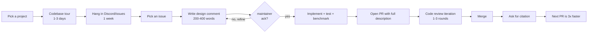

# OSS Contribution Playbook

<Mode is="learn">

The other lessons in this module teach you the codebase architecture: vLLM's scheduler and PagedAttention, SGLang's RadixAttention and frontend DSL, the speculative decoding verifier, FlashAttention-3's pipeline. After those, you can read the source. This lesson is about the part nobody writes about — how to actually *land* a PR. The skill that turns "I read the vLLM source" into "I shipped a perf-cited PR a maintainer named in a release note." That sentence is what unlocks Tier-1 inference-engineering interviews; the codebase fluency from the other lessons is the prerequisite, but it isn't sufficient on its own.

The single most-skipped step is the one that determines whether your first PR lands in 5 days or sits unreviewed for 4 months: writing a design comment on the issue *before* you write any code, and waiting for a maintainer to ack. Most cold PRs that stall do so because the contributor saw a problem, fixed it on a branch, opened a PR, and waited for someone to notice. Maintainers see hundreds of cold PRs a year; they triage by the cheapest signals (whether the design was discussed, whether the contributor knows the codebase, whether the description includes benchmarks). This lesson teaches the specific moves that pass that triage.

## TL;DR

- **The five rules**: (1) design comment before code, (2) scope under 200 LOC for first PR, (3) benchmarks for any perf claim, (4) follow the project's existing conventions exactly, (5) ask for citation explicitly after merge.
- **Pick the project by what you want.** vLLM = largest community, slowest review (1–3 weeks), highest visibility per PR. SGLang = smaller team, faster review (3–10 days), more contribution surface in less-tracked areas (structured output, RadixAttention). Triton = compiler-team gated, fewer PRs but higher kernel leverage. FlashInfer = the production attention library — active, tight feedback loop, where attention-kernel innovations land first.
- **The first PR teaches the codebase. The next four PRs land 3× faster.** Aim for 5 merged in 6 months as the realistic target. The portfolio matters more than any one PR.
- **Write the design comment in 200–400 words**: what you propose, scope estimate, test plan, benchmark methodology, links to relevant existing files. This is the artifact maintainers triage on.
- **The citation moment** is asking the reviewer, after merge: "if this is suitable for the next release notes, please mention by name — happy to draft a one-line summary." Most reviewers say yes to a courteous ask and forget if you don't ask.

## The concept, in plain English

A pull request is a piece of *code*; a contribution is a *relationship*. The code is what you wrote in the PR; the relationship is the trust the maintainer has built up that your code is the right code, that you understood the constraints, that this is the right thing to merge given everything else they're juggling. Maintainers don't merge code they don't trust; they triage to figure out whether to spend their attention building the trust. The disciplined moves in this lesson are all about making that triage cheap and fast for the maintainer — every minute they save deciding "is this contributor worth engaging with" is a minute they spend reviewing your code.

This isn't a corporate political game. It's the same mechanics that govern every collaborative engineering team: the engineer who shows up with a clear plan and asks the right questions before coding gets reviewed faster than the engineer who shows up with a 600-line PR and waits. OSS just makes the dynamic more visible because there's no manager to mediate.

## Mental model — the contribution lifecycle



Eight steps; the first three are about cost reduction (don't waste effort on the wrong target); the middle three are about the design contract (align on what you'll build before building it); the last two are about portfolio-building (the citation and the relationship are what makes the next PR easier).

## Picking a project — by goal, not by popularity

Different projects optimize for different things. Match by what you actually want.

| Project | Maintainer team | Review pace | Where contributions land easily | Where they don't |
| --- | --- | --- | --- | --- |
| **vLLM** | Large, vendor-affiliated (UCB Sky Lab, NVIDIA, Anyscale, Red Hat post-NM) | 1–3 weeks (slow) | New model architectures, quantization kernels, scheduler policies | Anything that touches V0 (maintenance), large rewrites, "improvements" that overlap maintainer roadmap |
| **SGLang** | Smaller, academic-led (UCB / Stanford) | 3–10 days (fast) | Structured output (XGrammar), RadixAttention extensions, scheduler policies, EAGLE per-arch ports | Areas that overlap vLLM's mature paths (Marlin INT4, FA-3 — usually merge there first) |
| **Triton** | Compiler team at OpenAI | 2–6 weeks (slow, careful) | Bug fixes, autotune improvements, new ops | Major architectural changes (compiler-team gated) |
| **FlashInfer** | Hazy Research / fast-moving | 3–10 days (fast) | Attention kernel innovations (paged KV, tree attention, new precisions) | Things outside attention-kernel scope |
| **llama.cpp** | Different culture (C++, no PyTorch) | 1–4 weeks | Quantization formats, model architectures, mobile/edge | Anything Python-flavored |

The Year-1 leverage hierarchy for AI-systems hiring:
1. **vLLM** — highest visibility per PR. Frontier labs ask "have you contributed to vLLM?"
2. **SGLang** — easier portfolio building. 5 PRs in 3 months is realistic.
3. **FlashInfer** — kernel-level credibility. Required for serious attention-kernel hires.
4. **Triton** — compiler-team credibility. Higher bar but rarer signal.

A balanced portfolio for the Year-1 OSS goal: 3–5 vLLM PRs (mostly model architectures, one perf PR) + 2–3 SGLang PRs (structured output or scheduler) + 1–2 FlashInfer PRs (kernel-level). Total 6–10 PRs across 3 projects, with at least one cited by maintainers.

## The codebase tour — the first 3 days

Before picking an issue, walk the codebase systematically. The previous lessons' "5-file source-reading paths" are the entry points; the goal of the tour is the *dependency graph*, not implementation detail.

A repeatable procedure:

1. **List the top-level directories.** `ls vllm/` or `ls python/sglang/`. For each, write one sentence on what lives there.
2. **For each major directory, find the entry point.** Usually the file with the longest module docstring or the highest line count.
3. **Read entry points only.** For each, write down: imports from where, called by what, exposed API. Don't read implementation in this pass.
4. **Build a dependency map.** A 1-page MAP.md committed to your fork's branch with `entry → role → callers`.

Cap each file at 5 minutes in this pass. The goal is the structure, not the code. After the tour, you can read any file in detail with the structure already in your head.

## Hanging in Discord/issues — the first week

Before picking an issue, *watch* the project for a week. No PRs, no issue creation, just reading. The signal you're looking for:

- **Which maintainers care about which subsystems.** vLLM has ~10 active maintainers; each has 1–2 areas they own. SGLang has ~5; each owns more. Their names appear in PR threads in those areas.
- **What kinds of PRs land fast vs stall.** Read the last 30 closed PRs. The ones that merged in under 5 days have something in common (small scope, prior issue discussion, benchmarks); the ones that stalled have something else (large diff, no design comment, contributor disagreed with feedback).
- **What kinds of issues get triaged immediately.** "This breaks X with reproducer" labels triage fast. "Could we improve Y?" without a reproducer often sit.

After a week, you'll have a list of 3 candidate maintainers (whose subsystems you understand) and 5 candidate issues (good-first-issue labels you've vetted). This list is what you draw from for your first PR target.

## Picking an issue — the three filters

Not every "good first issue" is a good first issue for *you*. Apply three filters:

**Filter 1: Is the maintainer who tagged it active?**

Open the maintainer's recent PR review history. If they've reviewed PRs in the last 7 days, they're active. If their last review was 3 months ago, the issue is orphaned — even if you finish it, no one will review.

**Filter 2: Is the scope realistically &lt;200 LOC for a first PR?**

Read the issue carefully. If the description includes "this might also need changes to X, Y, Z" — that's scope creep. If a previous attempted PR was closed, read why; usually the scope was wrong.

**Filter 3: Does it touch a subsystem you understand?**

Don't pick "add chunked prefill support to model X" if you haven't read the chunked-prefill code. Pick something where the change is *in* a subsystem you've read, not *requiring* you to learn three subsystems.

A good first PR target is: small scope (50–150 LOC), in a subsystem you've toured, owned by an active maintainer, with no prior failed attempts. Such issues exist; finding one takes 30 minutes of filtering.

## The design comment — the artifact maintainers triage on

Before writing any code, post a comment on the issue. 200–400 words. Five sections:

```text
## What I propose

[1-2 paragraphs describing the change. Be specific about which files
will be touched and what the API looks like.]

## Scope estimate

[1 paragraph estimating LOC by file. Include "I think this is X
LOC; if it grows past Y I'll re-scope." This sets expectations.]

## Test plan

[1 paragraph: which tests in tests/ I'll extend, which I'll add,
which edge cases I'll cover.]

## Benchmark methodology (if perf-related)

[1 paragraph: which workload I'll benchmark on, what numbers I'll
report (latency / throughput / accuracy delta). Include a reproducer
command.]

## Open questions

[1-3 specific questions for maintainers. Be precise; "is this the
right approach?" is too vague. "Should the new attention path
emit `attn_metadata.uses_v1_path` or extend the existing
`attn_metadata.kernel_kind` enum?" is the right level.]
```

Wait for at least one maintainer reaction before coding. Common outcomes:

- **"This looks reasonable; go ahead"** — green light. Implement.
- **"Could you scope this to just X?"** — they want a smaller PR. Implement that smaller version.
- **"There's already a PR for this"** — search PRs first; you missed one. Pick a different issue.
- **"This conflicts with [bigger refactor]"** — wait for the refactor or pick something else.
- **No response after 5 days** — gentle bump: "@maintainer: any thoughts on the design above? Happy to revise if a different approach would land better."

Skipping the design comment is the canonical "first PR sat for 4 months" mistake. The 30-minute investment up front saves weeks of waiting later.

## Writing the PR — the description matters more than the code

A maintainer's first 30 seconds with your PR is the description. If the description is a one-liner ("fixes #123"), they bounce; if it's structured, they engage. Use this template:

```text
Closes #123

## Summary

[2-3 sentences describing the change. Match the design comment.]

## Implementation

[3-5 bullets: which files changed, why each.]

## Tests

[Bullets: which tests added/modified. Mention coverage.]

## Benchmarks (perf PRs only)

| metric | before | after |
| --- | --- | --- |
| ...

Reproducer:
```bash
python benchmarks/your_bench.py --config X
```

## Open questions for review

[1-3 specific decisions you want the reviewer to weigh in on.]
```

The benchmark table is the biggest leverage. Maintainers reviewing perf PRs need numbers; if you provide them with reproducer commands, they merge faster. If you say "this is faster" without a number, expect "could you provide a benchmark?" and a 2-week round trip.

## Code review etiquette

Three rules that separate "merges in 1 week" from "merges in 1 month":

**1. Respond to every comment.** Even if it's "agreed, will fix in next push." Silence reads as "ignored." If you disagree, say so explicitly with reasoning — *don't* push back without comment.

**2. Push fixes as separate commits, not force-push.** Reviewers who already approved early commits get their re-reviews disrupted by force-push. Use small commits ("apply review feedback: rename foo to bar"); maintainers will squash before merge.

**3. When you genuinely disagree, ask first.** "I think the original approach is better because X. Would you mind if I pushed back on this point?" is much more effective than just not making the change. Most maintainers respect a thoughtful disagreement; few respect silent disregard.

The texture of a PR that lands fast: 1–3 review rounds, each addressed within 24 hours, with clear commit messages explaining each fix. PRs that take 10 review rounds usually have a contributor who skipped the design step and is iterating on direction during review.

## The citation moment

After merge, before moving on, post one comment:

> Thanks for the review! If this is suitable for the next release notes, I'd be happy to help draft a one-line summary — please mention by name if so.

This is the pivotal move. The maintainer can:
- Say yes and ask you to draft the line
- Say yes and write it themselves with your name
- Say "we don't usually do that for this size of change" — at which point you don't push

Most maintainers say yes to a courteous, low-pressure ask. The reason most contributors don't get cited is that they don't ask. The line in a release note (or a maintainer-authored blog post mentioning the PR) is what makes a PR portfolio "cited" rather than just "merged" — the difference is meaningful for hiring conversations.

## Common rejections — and how to avoid them

| Rejection reason | What you did | How to avoid |
| --- | --- | --- |
| "This conflicts with a planned refactor" | Picked an issue without checking the roadmap | Read the project's milestone tags and recent maintainer issue comments |
| "We don't merge V0 changes anymore" | Touched a deprecated code path | For vLLM, target `vllm/v1/`. Read the project's "active development paths" doc |
| "Could you provide a benchmark?" | Made a perf claim without numbers | Always include reproducer + before/after table for perf PRs |
| "This breaks API X" | Changed a public interface without realizing | Search the codebase + downstream users (vLLM users include 100s of repos) before changing public APIs |
| "Too large to review" | Submitted 800-LOC PR with no design discussion | Stay under 200 LOC for first PR; split into multiple PRs if larger |
| "We need a different design" | Skipped the design comment step | Always post the design comment first |

The first three are the most common. Each has a one-step fix that the disciplined contributor takes by default.

## Year-1 timeline expectations

Realistic milestones for a senior software engineer transitioning into AI systems:

| Month | Milestone | Cumulative PRs |
| --- | --- | --- |
| Month 1 | First PR opened (any size, doc/test/typo OK) | 1 |
| Month 2 | First merge | 1 |
| Month 3 | 3rd merge | 3 |
| Month 4 | First non-trivial PR (50–150 LOC) merged | 4 |
| Month 6 | First perf-cited PR | 5 |
| Month 9 | 8 merged total, across 2+ projects | 8 |
| Month 12 | 10 merged, ≥1 cited by name in release notes or maintainer post | 10 |

This is the Atlas Year-1 OSS goal in time-table form. Roughly half the contributors who hit Month 1 hit Month 12; the half who don't usually fall off between Months 2 and 4 (the friction phase between the first easy PR and the harder second one). The discipline this lesson teaches is what gets you across.

## Concrete walkthrough — a real recently-merged PR

Paraphrased from a recent vLLM PR. The author was new to the project; the PR added support for a new quantization format (FP8 KV per-token granularity for a specific model architecture). 145 LOC changed, merged in 6 days.

**Day 1**: Author posted on a 6-week-old issue: "I'd like to take this. Here's my proposed approach: I'll add `vllm/model_executor/layers/quantization/fp8_kv_per_token.py` mirroring the existing `fp8.py` structure. Scope ~120 LOC. Test plan: extend `tests/quantization/test_fp8.py` with a per-token variant. Benchmark: compare per-token vs per-tensor on Llama-3.1 70B fp8 KV at 4K and 16K context. One open question: should the per-token scale live in the KV cache block or as a separate buffer? I see arguments for both."

**Day 1 (4 hours later)**: Maintainer reply: "Great approach. Per-token scale should live in the block — see how `vllm/attention/backends/flashinfer.py` handles V scales. Go ahead."

**Day 3**: Author opens PR. Description includes: 145 LOC changed, summary of approach, benchmark table showing 0.05 ppl improvement and 4% throughput gain at 16K, reproducer command, two open review questions.

**Day 4**: Maintainer review: 6 comments (rename one variable, add docstring, simplify a conditional, address one open question, request additional test for boundary case, suggest the perf benchmark be moved to `benchmarks/`). Author responds within 24 hours, addresses all 6.

**Day 5**: Maintainer second review: approve. CI passes.

**Day 6**: Merge.

**Day 6 (later)**: Author comments: "Thanks for the thorough review! If this is suitable for the next release notes, happy to draft a one-line summary — please mention by name if so."

**Day 7**: Maintainer adds the PR to the next release-notes draft, name included.

This is the texture. Notice what's *not* there: no force-pushes, no defensive responses, no "but I think my way is better" without reasoning. The PR landed in 6 days because the design alignment happened on day 1.

## Run it in your browser — predict your portfolio's hiring signal

<RunInBrowser
  description="Estimate the hiring signal strength of an OSS portfolio based on PR count, citation, and project distribution."
  code={`def hiring_signal(prs_per_project, cited_count, has_perf_pr):
    """
    prs_per_project: dict mapping project name to merged PR count
    cited_count: number of PRs cited by name in release notes / blog
    has_perf_pr: bool — at least one PR shipped measurable perf
    """
    total_prs = sum(prs_per_project.values())
    project_count = sum(1 for v in prs_per_project.values() if v > 0)
    
    # Base signal from raw count (sub-linear past 5)
    if total_prs <= 0: base = 0
    elif total_prs <= 3: base = 30 + total_prs * 8       # 38 - 54
    elif total_prs <= 10: base = 54 + (total_prs - 3) * 4  # 58 - 82
    else: base = 82 + min(total_prs - 10, 10) * 1.5         # 83 - 97
    
    # Citation multiplier
    citation_bonus = min(cited_count * 12, 30)
    
    # Diversity bonus (across multiple projects)
    diversity_bonus = (project_count - 1) * 5 if project_count > 1 else 0
    
    # Perf-PR bonus
    perf_bonus = 8 if has_perf_pr else 0
    
    score = base + citation_bonus + diversity_bonus + perf_bonus
    return min(score, 100)


cases = [
    ("Just starting (1 PR vLLM, no cite)",
        {'vllm': 1}, 0, False),
    ("Atlas Year-1 target (5+5 split, 1 cite, 1 perf)",
        {'vllm': 5, 'sglang': 5}, 1, True),
    ("Atlas stretch (8 vLLM, 2 SGLang, 2 FlashInfer, 2 cites, 2 perf)",
        {'vllm': 8, 'sglang': 2, 'flashinfer': 2}, 2, True),
    ("PR-count vanity (15 docs PRs, no cite, no perf)",
        {'vllm': 15}, 0, False),
    ("Quality over count (3 vLLM, 1 cite, 1 perf)",
        {'vllm': 3}, 1, True),
]

print(f"{'profile':<60}  {'score':>5}")
print("-" * 70)
for label, prs, cites, perf in cases:
    s = hiring_signal(prs, cites, perf)
    print(f"{label:<60}  {s:>4.0f}/100")

print("\\nNote: 70+ is portfolio that opens Tier-1 inference interviews.")
print("85+ is portfolio that opens elite-lab inference interviews.")
`}
/>

You'll see "quality over count" (3 PRs with 1 citation) outscores "PR-count vanity" (15 docs PRs, no citation). The signal is depth × diversity, not raw count. The Atlas Year-1 target is in the 75–80 range — comfortably enough to open Tier-1 inference interviews; the stretch goal lands in the 85–90 range, which is what elite-lab loops respond to.

## Quick check

<Quiz
  question="You've been hanging in vLLM Discord for a week and identified an issue that looks like a clean 80-LOC perf improvement. The issue was tagged 'good first issue' 3 weeks ago by @maintainer-X. You've read the relevant subsystem and have a clear plan. What's your next move?"
  options={[
    'Start coding immediately — the issue is well-scoped and you understand it; design comments are a bureaucratic step.',
    'Post a 250-word design comment on the issue with proposed approach, scope estimate, test plan, benchmark methodology, and 2 open questions for the maintainer. Wait for maintainer ack before coding.',
    'Open a draft PR with the implementation so the maintainer can see the actual code before deciding.',
    'Send a DM to the maintainer to ask if you can take the issue.',
  ]}
  answer={1}
  explanation="The design-comment-first move is what separates first PRs that land in 5–10 days from ones that sit for months. A 30-minute design comment gets a maintainer's ack (typically within 1–3 days), establishes the contract, and opens the door to fast review when the PR opens. Coding immediately wastes effort if the maintainer wanted a different approach. Draft PRs are weaker than design comments — the maintainer has to wade through code to understand intent, vs reading 250 words. DMs to maintainers are off-channel and unsearchable; future contributors with similar issues can't learn from the conversation. The discipline is in the public design comment."
/>

## Key takeaways

1. **A PR is code; a contribution is a relationship.** The disciplined moves make triage cheap so maintainers spend their attention on your code rather than figuring out whether to engage.
2. **Design comment before code.** 200–400 words on the issue, wait for maintainer ack. The 30-minute investment determines whether the PR lands in days or months.
3. **Pick by goal, not by popularity.** vLLM = highest visibility, slow review. SGLang = portfolio building. FlashInfer = kernel credibility. Triton = compiler-team gated. Mix for a balanced Year-1 portfolio.
4. **First PR teaches the codebase; the next four are 3× faster.** Aim for 5 merged in 6 months, 10 in 12, with at least one cited.
5. **Ask for the citation.** "If this is suitable for the next release notes, please mention by name — happy to draft a one-line summary." Most reviewers say yes; the contributors who don't ask don't get cited.

## Go deeper

<Resources
  items={[
    { kind: 'docs', href: 'https://docs.vllm.ai/en/latest/contributing/overview.html', title: 'vLLM Contributing Guide', author: 'vLLM contributors', note: 'The official onboarding. Read fully before your first PR.' },
    { kind: 'docs', href: 'https://docs.sglang.ai/contributing.html', title: 'SGLang Contributing Guide', author: 'sgl-project', note: 'Smaller team; the PR conventions are slightly different from vLLM. Read both.' },
    { kind: 'docs', href: 'https://triton-lang.org/main/programming-guide/chapter-1/introduction.html', title: 'Triton Contributing', author: 'triton-lang', note: 'For compiler-level work. The PR culture is more cautious — alignment first matters even more.' },
    { kind: 'blog', href: 'https://blog.vllm.ai/', title: 'vLLM Blog', author: 'vLLM contributors', note: 'Read recent release notes to see what kinds of PRs get cited and how. The pattern is replicable.' },
    { kind: 'docs', href: 'https://github.com/vllm-project/vllm/issues?q=label%3A%22good+first+issue%22', title: 'vLLM "good first issue" filter', note: 'The issue queue. Apply the three-filter discipline before picking.' },
    { kind: 'video', href: 'https://www.youtube.com/watch?v=9ih0EmcXRHE', title: 'vLLM Office Hours — Architecture & Contributing', author: 'vLLM team', note: 'Maintainer-led 60-min walkthrough. Watch before submitting your first PR.' },
    { kind: 'blog', href: 'https://github.com/sourcegraph/handbook/blob/main/content/departments/engineering/teams/code-intelligence/contribution-guide.md', title: 'Sourcegraph Code Intelligence Contribution Guide', author: 'Sourcegraph', note: 'Excellent generic OSS contribution discipline; the principles transfer to AI inference projects.' },
    { kind: 'blog', href: 'https://www.kvcache.ai/2024-09-20-Mooncake-A-KVCache-centric-Disaggregated-Architecture-for-LLM-Serving/', title: 'Mooncake — A KVCache-centric Architecture', author: 'Moonshot AI (2024)', note: 'Frontier-research blog with the same depth-and-citation pattern landing OSS PRs require. Useful as a model for your own writeups.' },
  ]}
/>

</Mode>

<Mode is="reference">

## TL;DR

- **The five rules**: (1) design comment before code, (2) scope under 200 LOC for first PR, (3) benchmarks for any perf claim, (4) follow the project's existing conventions exactly, (5) ask for citation explicitly after merge.
- **Pick the project by what you want.** vLLM = largest community, slowest review (1–3 weeks), highest visibility per PR. SGLang = smaller team, faster review (3–10 days), more contribution surface in less-tracked areas (structured output, RadixAttention). Triton = compiler-team gated, fewer PRs but higher kernel leverage. FlashInfer = the production attention library — active, tight feedback loop, where attention-kernel innovations land first.
- **The first PR teaches the codebase. The next four PRs land 3× faster.** Aim for 5 merged in 6 months as the realistic target. The portfolio matters more than any one PR.
- **Write the design comment in 200–400 words**: what you propose, scope estimate, test plan, benchmark methodology, links to relevant existing files. This is the artifact maintainers triage on.
- **The citation moment** is asking the reviewer, after merge: "if this is suitable for the next release notes, please mention by name — happy to draft a one-line summary." Most reviewers say yes to a courteous ask and forget if you don't ask.

## Why this matters

Year-1 of an AI-systems career transition has one OSS milestone: a portfolio of 5–10 merged PRs across vLLM / SGLang / Triton / FlashInfer with at least one cited by maintainers. Achieving it isn't an IQ problem or a code-skill problem; it's a process-and-discipline problem. Engineers who skip the design comment, scope past 200 LOC on a first PR, or fail to ask for citation routinely fall short of the goal despite writing perfectly good code.

This lesson is the missing process layer. After this you should be able to identify a target, post a design comment, write a PR with a benchmark table, navigate review, and ask for citation — the full sequence that converts source-reading into a portfolio.

## Mental model


## Project comparison

| Project | Team | Review pace | Easy targets | Hard targets |
| --- | --- | --- | --- | --- |
| vLLM | Large, vendor-affiliated | 1–3 weeks | Models, quant kernels, scheduler policies | V0 changes, big rewrites, roadmap-overlap |
| SGLang | Smaller, academic-led | 3–10 days | Structured output, RadixAttention extensions, EAGLE per-arch | Mature paths covered by vLLM (Marlin, FA-3) |
| Triton | OpenAI compiler team | 2–6 weeks | Bug fixes, autotune, new ops | Major architectural changes |
| FlashInfer | Hazy Research | 3–10 days | Attention kernel innovations | Outside attention scope |
| llama.cpp | C++/no-PyTorch culture | 1–4 weeks | Quant formats, model arch, mobile/edge | Python-flavored work |

## The five rules — full table

| # | Rule | What it looks like done right | Common mistake |
| --- | --- | --- | --- |
| 1 | Design comment first | 200–400 words on issue, 5 sections | Skipping straight to code |
| 2 | Scope &lt; 200 LOC for first PR | One file or one cohesive change | "While I'm here" creep |
| 3 | Benchmarks for perf claims | Reproducer + before/after table | Vibes-based "it's faster" |
| 4 | Follow existing conventions exactly | Match imports, naming, test structure | Improving conventions in flight |
| 5 | Ask for citation explicitly | One sentence after merge | Hoping the reviewer mentions you |

## The codebase tour — repeatable procedure

```text
Day 1 (3 hours):
  - List top-level dirs; one sentence each
  - For each major dir, find the entry point file
  - Read entry points only; note imports and called-by

Day 2 (3 hours):
  - Build dependency map (entry → role → callers)
  - Commit MAP.md to your fork's branch
  - Identify the 3 most-modified files in the last 90 days

Day 3 (2 hours):
  - For each of those 3 files, read the most recent 5 PRs that touched it
  - Note: scope, review duration, maintainer review style
```

## Hanging in Discord/issues — what to track

| Signal | Where to read | What it tells you |
| --- | --- | --- |
| Maintainer activity in last 7 days | GitHub PR review history | Who's active vs orphaned |
| Subsystem ownership patterns | PR threads in specific files | Who reviews what |
| PR merge time distribution | Last 30 closed PRs | What lands fast |
| Failed PR patterns | Closed-without-merge PRs | What doesn't land |
| RFC-tagged proposals | Issues with "rfc" or "design" labels | What's coming next |

## The three-filter issue selection

| Filter | Question | How to check |
| --- | --- | --- |
| Maintainer active | Last review &lt; 7 days ago? | GitHub user activity tab |
| Scope &lt; 200 LOC | Issue says it stays in one file/system? | Read description carefully |
| Subsystem familiarity | Have you read the relevant code? | Reference your codebase tour notes |

If any filter fails, pick a different issue.

## The design comment — exact structure

```text
## What I propose
[1-2 paragraphs. Specific files. Specific API.]

## Scope estimate
[1 paragraph. LOC by file. "If it grows past Y, I'll re-scope."]

## Test plan
[1 paragraph. Tests to extend, tests to add, edge cases.]

## Benchmark methodology (if perf-related)
[1 paragraph. Workload, metrics, reproducer command.]

## Open questions
[1-3 specific decisions for maintainer.]
```

Wait 5 days for ack. If silent, gentle bump. If still silent after 7, pick a different issue.

## The PR description — exact structure

```text
Closes #123

## Summary
[2-3 sentences. Match the design comment.]

## Implementation
[3-5 bullets. Files changed and why.]

## Tests
[Bullets. Coverage detail.]

## Benchmarks (perf PRs only)
| metric | before | after |
| --- | --- | --- |
| ... | ... | ... |

Reproducer:
\`\`\`bash
python benchmarks/your_bench.py --config X
\`\`\`

## Open questions for review
[1-3 specific decisions.]
```

## Code review etiquette — the three rules

| Rule | Right move | Wrong move |
| --- | --- | --- |
| Respond to every comment | "Agreed, will fix" or "I disagree because X" | Silence |
| Push fixes as commits | Small commits with clear messages | Force-push, lose review state |
| When you disagree | Explicit reasoning + ask permission to push back | Silently not making the change |

## Citation request template

```text
Thanks for the review! If this is suitable for the next release notes,
I'd be happy to help draft a one-line summary — please mention by name
if so.
```

Three outcomes:
- "Yes, draft it" → write the line
- "Yes, I'll handle it" → done
- "We don't usually do that" → don't push; move on

## Common rejections — full table

| Rejection | Cause | Prevention |
| --- | --- | --- |
| "Conflicts with planned refactor" | Picked without checking roadmap | Read milestone tags + maintainer recent comments |
| "We don't merge V0 changes" | Touched deprecated code path | Target `vllm/v1/`; check active development paths |
| "Need a benchmark" | Perf claim without numbers | Always include reproducer + before/after table |
| "Breaks API X" | Changed public interface | Search downstream users (vLLM has 100s of repos using it) |
| "Too large to review" | Submitted &gt; 200 LOC without prior discussion | Stay under 200 LOC for first PR |
| "Need a different design" | Skipped design comment | Always design-comment first |

## Year-1 timeline

| Month | Milestone | Cum. PRs |
| --- | --- | --- |
| 1 | First PR opened | 1 |
| 2 | First merge | 1 |
| 3 | 3rd merge | 3 |
| 4 | First non-trivial (50–150 LOC) merged | 4 |
| 6 | First perf-cited | 5 |
| 9 | 8 merged across 2+ projects | 8 |
| 12 | 10 merged, ≥1 cited | 10 |

## Quick check

<Quiz
  question="You've been hanging in vLLM Discord for a week and identified an issue that looks like a clean 80-LOC perf improvement. The issue was tagged 'good first issue' 3 weeks ago by @maintainer-X. You've read the relevant subsystem and have a clear plan. What's your next move?"
  options={[
    'Start coding immediately — the issue is well-scoped and you understand it; design comments are a bureaucratic step.',
    'Post a 250-word design comment on the issue with proposed approach, scope estimate, test plan, benchmark methodology, and 2 open questions for the maintainer. Wait for maintainer ack before coding.',
    'Open a draft PR with the implementation so the maintainer can see the actual code before deciding.',
    'Send a DM to the maintainer to ask if you can take the issue.',
  ]}
  answer={1}
  explanation="Design comment first. 30-minute investment, 1–3 day ack, then fast review when the PR opens. Coding immediately wastes effort if the maintainer wanted a different approach. Draft PRs are weaker than design comments. DMs are off-channel and unsearchable."
/>

## Key takeaways

1. PR = code; contribution = relationship. Disciplined moves make triage cheap.
2. Design comment before code. 200–400 words; wait for ack.
3. Pick by goal: vLLM visibility, SGLang portfolio velocity, FlashInfer kernel credibility, Triton compiler credibility.
4. First PR teaches; subsequent PRs are 3× faster. Aim 5/6mo, 10/12mo, ≥1 cited.
5. Ask for citation. Most reviewers say yes; non-askers don't get cited.

## Go deeper

<Resources
  items={[
    { kind: 'docs', href: 'https://docs.vllm.ai/en/latest/contributing/overview.html', title: 'vLLM Contributing Guide' },
    { kind: 'docs', href: 'https://docs.sglang.ai/contributing.html', title: 'SGLang Contributing Guide' },
    { kind: 'docs', href: 'https://triton-lang.org/main/programming-guide/chapter-1/introduction.html', title: 'Triton Contributing' },
    { kind: 'blog', href: 'https://blog.vllm.ai/', title: 'vLLM Blog' },
    { kind: 'docs', href: 'https://github.com/vllm-project/vllm/issues?q=label%3A%22good+first+issue%22', title: 'vLLM good-first-issue filter' },
    { kind: 'video', href: 'https://www.youtube.com/watch?v=9ih0EmcXRHE', title: 'vLLM Office Hours — Architecture & Contributing' },
    { kind: 'blog', href: 'https://www.kvcache.ai/2024-09-20-Mooncake-A-KVCache-centric-Disaggregated-Architecture-for-LLM-Serving/', title: 'Mooncake KVCache-centric Architecture' },
  ]}
/>

</Mode>

<LessonComplete />
