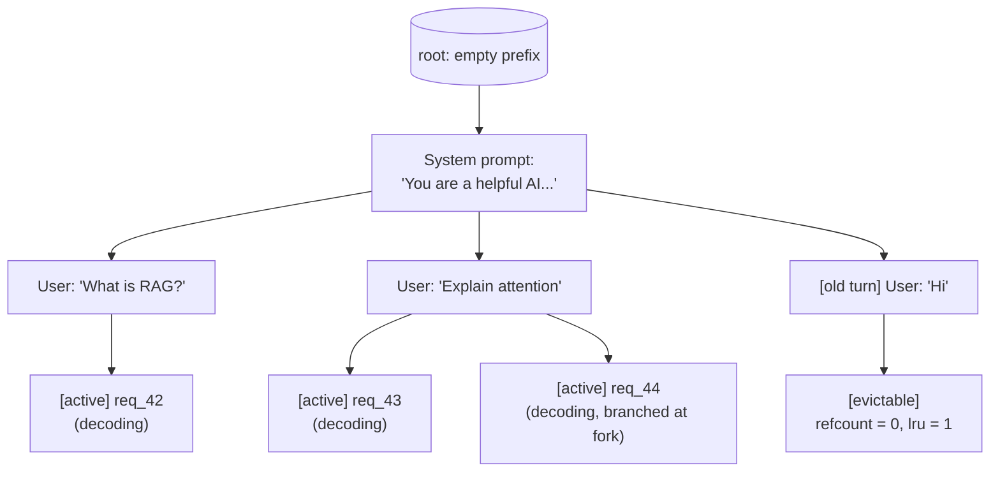

# SGLang Internals

<Mode is="learn">

If you read the vLLM Internals lesson first, you understand a serving stack as: scheduler that picks a batch, paged KV cache that makes admit/evict cheap, worker that runs the forward pass. SGLang is the same archetype with one structural change and one product change. The structural change: instead of a flat block pool, the KV cache is organized as a **radix tree** — every shared prefix becomes a tree node, every request is a leaf. The product change: a **frontend language** (`sgl.gen`, `sgl.select`, `sgl.fork`) that turns multi-turn LLM programs into first-class objects the engine can co-optimize. Two changes, but they cascade: cache reuse becomes automatic, structured generation becomes a native primitive instead of a wrapper, and a class of agent / RAG / multi-turn workloads that vLLM merely runs, SGLang actively *exploits*.

This lesson is the contributor's view of SGLang, paired with the vLLM lesson as a deliberate compare-and-contrast. After this you should be able to read a SGLang PR and identify whether it's at the frontend, the radix cache, the scheduler, or the kernels — and predict from a workload's prefix-sharing pattern whether it will run faster on vLLM or SGLang.

## TL;DR

- **SGLang is a continuous-batching engine like vLLM, but with a radix-tree KV cache** (`RadixAttention`) instead of a flat block pool. Shared prefixes between requests are *automatically* deduplicated as tree nodes; lookup is O(prefix_length).
- **Structured generation is native, not bolted on.** XGrammar/Outlines-style grammar masks integrate at the sampler with negligible overhead. Regex, JSON-schema, and CFG decoding are first-class.
- **A frontend DSL** (`sgl.gen`, `sgl.select`, `sgl.fork`, `sgl.assistant`) turns multi-turn LLM programs into objects the engine can co-schedule — fork/join semantics let one prompt "branch" into N parallel decode streams that share the prefix.
- **Where vLLM and SGLang diverge perf-wise**: SGLang wins on workloads with heavy prefix reuse (multi-turn chat, RAG, agent traces, branching). vLLM wins on independent-request high-throughput workloads where the radix tree's bookkeeping is overhead. Pick by workload.
- **Four extension points for contributors**: model architectures (`python/sglang/srt/models/`), attention/cache backends (`python/sglang/srt/layers/attention/`), scheduler policies (`python/sglang/srt/managers/scheduler.py`), structured-output backends (`python/sglang/srt/sampling/`). The structured-output surface is uniquely deep here — XGrammar integration, JSON-schema compilation, FSM compaction.

## The concept, in plain English

vLLM stores the KV cache as a flat pool of fixed-size blocks. When two requests share a system prompt, the engine spots the shared blocks (via prefix-cache hashing) and points both block tables at the same physical blocks. It works, but the data structure is a bag, and discovering shared prefixes is a separate index lookup.

SGLang flips that. The KV cache *is* a radix tree. The root is the empty prefix; each child node is a continuation of the prefix; each leaf is the active suffix of one or more in-flight requests. When a new request arrives, the engine walks the tree looking for the longest matching prefix — that's the whole "prefix cache hit" lookup, no separate index. When prefixes diverge, the tree branches. When a prefix becomes orphaned (no active requests below it), the node is eligible for eviction by an LRU policy on tree leaves.

The win is structural: a multi-turn conversation, a RAG retrieval where multiple queries share retrieved context, an agent run with shared chain-of-thought — all of these become a single tree node with multiple in-flight leaves rather than O(N²) cross-request prefix comparisons. The frontend DSL adds the second leverage: when your program *says* "fork from this prompt and decode 8 candidates," the engine knows in advance that all 8 will share the parent prefix and can lay them out in the tree before the first token is generated.

## Mental model — the radix tree of KV cache



Three things to read off this diagram:

1. **The system prompt is one tree node**, not three copies. All three active requests share its KV blocks.
2. **Forks are siblings on the tree**. `req_43` and `req_44` (a parallel decode for self-consistency, say) share their parent up to the divergence point.
3. **Old turns become evictable leaves.** When a conversation moves on, the previous turn's KV is still in the cache as a leaf with refcount 0 — kept until LRU pressure pushes it out.

Compared to vLLM's flat block pool with prefix hashing, the radix tree is a denser structure for workloads where the prefix DAG matches the call DAG. For independent requests with no shared prefixes, the tree degenerates to a list of leaves and adds bookkeeping overhead — that's the workload regime where vLLM tends to win.

## RadixAttention — the cache as a tree

The radix tree's nodes are not characters — they're aligned KV-block boundaries. SGLang's default block size is 1 token (more flexible than vLLM's 16-token blocks), at the cost of more bookkeeping. Each node stores:

```text
RadixNode:
    parent:      RadixNode | None
    children:    Dict[token_id_or_seq, RadixNode]
    kv_blocks:   List[block_id]      # KV cache locations for this node's tokens
    refcount:    int                 # active leaves below this node
    last_use:    timestamp           # for LRU eviction
    is_evictable: bool               # true if refcount = 0 and not pinned
```

Three operations:

**Lookup (when a request arrives):**

```python
def match_prefix(token_ids):
    node = root
    matched = 0
    while matched < len(token_ids):
        next_token = token_ids[matched]
        if next_token not in node.children:
            return node, matched   # longest match ends here
        node = node.children[next_token]
        matched += 1
    return node, matched           # full match
```

The walk is O(prefix_length), no hashing, no false positives. The returned node tells the request which KV blocks it inherits.

**Insert (after the lookup):**

```python
def insert_suffix(parent_node, token_ids):
    # Allocate KV blocks for the unmatched tail
    # Create a new child node under parent_node
    # Increment refcount up the chain
    new = RadixNode(parent=parent_node, ...)
    parent_node.children[token_ids[0]] = new
    increment_refcount_to_root(new)
    return new
```

**Evict (when memory is tight):**

```python
def evict_lru():
    # Find the leaf with refcount = 0 and oldest last_use
    victim = oldest_evictable_leaf()
    free_blocks(victim.kv_blocks)
    detach_from_parent(victim)
    # Compact: if parent now has zero children and refcount = 0, evict it too
```

Three properties fall out of this design:

1. **Prefix sharing is automatic** — never an opt-in feature.
2. **Eviction is structural** — you only ever evict leaves, so the cache never has dangling intermediate state.
3. **Cache hit rate scales with workload structure** — a multi-turn chat at 80% prefix-shared sees 80% of new request bytes already cached; vLLM has the same theoretical ceiling but pays a hash-lookup cost the radix tree has folded into the data structure.

## Structured generation — native, not bolted on

A common LLM serving requirement is "the output must be valid JSON conforming to this schema" or "the output must match this regex." Naive serving stacks pass this constraint to a wrapper layer that applies a token-level mask after each forward pass — every step, the wrapper computes which tokens are valid given the partial output, masks the logits, samples. The cost is the masking overhead, often 10–30% latency tax for complex grammars.

SGLang treats structured generation as a first-class scheduler concern. Each request can carry a **grammar state machine** (FSM compiled from regex, or a CFG compiled from JSON schema, or an XGrammar object). At each decode step, the sampler consults the FSM, masks invalid tokens, advances the state. The grammar compilation happens once at request admission, not per-step. With XGrammar (the modern integration), the masking overhead is sub-microsecond per step on H100 — effectively free.

```python
# Conceptual sampler integration
def sample_token(logits, request):
    if request.grammar_state is not None:
        valid_mask = request.grammar_state.valid_tokens()
        logits = mask_logits(logits, valid_mask)
    next_token = sample(logits, request.sampling_params)
    if request.grammar_state is not None:
        request.grammar_state = request.grammar_state.advance(next_token)
    return next_token
```

The implications:

- **Regex / JSON / CFG constraints don't add latency.** Production deployments use this for tool-calling, agent action protocols, structured extraction.
- **Compilation is the cost.** A complex JSON schema may take 100ms to compile to an FSM. SGLang caches compiled grammars by hash; the first request pays, subsequent ones don't.
- **The grammar surface is a contribution hotspot.** XGrammar landed as an external project; it's now SGLang's default. New grammar formats (e.g., the JSON-schema-with-references update) are common PR targets.

## The frontend DSL — co-scheduling multi-turn programs

SGLang ships a Python DSL that turns multi-turn LLM programs into objects:

```python
import sglang as sgl

@sgl.function
def multi_turn_extract(s, document):
    s += sgl.user(f"Read this document: {document}")
    s += sgl.assistant(sgl.gen("summary", max_tokens=200))
    s += sgl.user("Now extract three key facts as JSON.")
    s += sgl.assistant(sgl.gen("facts", json_schema=FACTS_SCHEMA))
```

The function is *traced*, not just executed. SGLang sees the whole control flow before issuing the first generation. Two leverage points fall out:

**Prefix co-scheduling**. The runtime knows that the second `sgl.gen` will reuse the entire prefix up to that point. It can pre-allocate the cache, place the request in the radix tree near the first call's leaf, and avoid any prefix re-computation.

**Branching with `sgl.fork`**. When you write:

```python
forks = s.fork(8)  # 8 parallel branches
for f in forks:
    f += sgl.gen("answer", max_tokens=100, temperature=0.7)
results = [f["answer"] for f in forks]
```

SGLang knows in advance that 8 generations will share the parent prefix. They become 8 sibling leaves under one parent node. The KV cache is allocated once for the prefix; only the suffixes diverge. For best-of-N sampling, self-consistency, and verifier-style decoding, this can save 60–80% of decode bytes relative to running the 8 generations as independent requests.

This is the product-level version of what vLLM does mechanically — vLLM also detects shared prefixes via hashing — but SGLang's frontend gives the engine the *intent* up front, so the cache layout and scheduling are co-optimized rather than reactive.

## SGLang vs vLLM — when each wins

A perf comparison requires matching workload to engine. Rough rules of 2026:

| Workload | Winner | Why |
| --- | --- | --- |
| Independent requests, no shared prefixes | vLLM | Radix tree adds overhead with no payoff |
| Multi-turn chat (system prompt shared) | SGLang | Prefix dedup is the headline win |
| RAG with retrieved context shared across queries | SGLang | Same as above |
| Agent runs with shared CoT prefixes | SGLang | Tree branching matches the call DAG |
| Best-of-N / self-consistency sampling | SGLang | `sgl.fork` co-schedules siblings |
| Pure decode throughput, batch 64+ | About even | Both are kernel-bound |
| Long context (32K+) at low batch | vLLM | Mature long-context attention paths |
| Quantized inference (INT4 / FP8) | vLLM | Marlin and FP8 mature first in vLLM |
| Structured output (JSON / regex / CFG) | SGLang | XGrammar overhead is sub-microsecond |
| Disaggregated prefill+decode at scale | vLLM | Production-ready first |

The pattern: **SGLang wins on workloads where prefix structure matches the program structure**. vLLM wins on independent high-throughput and on workloads where the matured kernel/quantization paths matter more than cache structure. Both are catching up to each other; the gap on any specific workload is rarely more than 30%.

For Year-1 OSS contribution, the implication: pick the engine whose subsystem you find most interesting. Maintainer culture is also worth weighing — SGLang's smaller team and faster review cycle means first PRs often land in 3–7 days vs vLLM's 1–3 weeks. Cumulative LOC is easier to build there for the portfolio.

## The four extension points — where SGLang PRs land

### 1. Model architectures — `python/sglang/srt/models/`

Same shape as vLLM: one file per architecture, fixed forward protocol. Adding a new model is the canonical first PR.

```python
class YourModelForCausalLM(nn.Module):
    def __init__(self, config, quant_config=None, ...): ...
    def forward(self, input_ids, positions, forward_batch, ...): ...
    def load_weights(self, weights): ...
```

Typical merge time: 3–10 days.

### 2. Attention / cache backends — `python/sglang/srt/layers/attention/`

The attention backend is decoupled from the cache layout. RadixAttention is the default; alternative backends include `triton_attention_backend`, `flash_attn_backend`, `paged_attention_backend` (compatibility with vLLM-style block layout). Adding a new attention kernel here gives you tree-aware lookups by default.

```python
class YourAttentionBackend:
    def init_forward_metadata(self, forward_batch): ...
    def forward(self, q, k, v, layer, forward_batch, save_kv_cache=True): ...
```

This is also where FlashInfer, FA-3, and any custom kernel target gets integrated. Highest perf-PR leverage.

### 3. Scheduler — `python/sglang/srt/managers/scheduler.py`

The scheduler integrates the radix-tree state into batch decisions. New policies that have landed: prefix-aware admission (admit requests that share prefixes with currently-running ones first), branched-fork co-scheduling (route forks of the same parent to consecutive batch slots for cache locality), priority-based preemption.

```python
class Scheduler:
    def schedule(self) -> SchedulerBatch:
        # Walk waiting queue, prefer requests with longer prefix matches
        # Build batch mixing prefill + decode
        # Co-schedule forks of the same parent
        ...
```

### 4. Structured-output backends — `python/sglang/srt/sampling/`

XGrammar is the default; Outlines and lm-format-enforcer are alternative backends. Contributing here means: a new grammar format, a faster FSM compaction, or a new constraint type (like "must include this string" — which compiles to a regex with a lookbehind).

The structured-output surface is uniquely deep on SGLang because it's first-class. It's the contribution area where you can ship something that has no equivalent in vLLM.

## Reading the source — the 5-file tour

For a first read, walk in this order. About 3 hours.

| File | What to learn |
| --- | --- |
| `python/sglang/srt/managers/scheduler.py` | Engine main loop, batch assembly, the radix-tree integration |
| `python/sglang/srt/mem_cache/radix_cache.py` | The radix tree itself — node structure, match/insert/evict |
| `python/sglang/srt/model_executor/forward_batch_info.py` | The forward-batch metadata struct (positions, seq_lens, block_table-equivalent) |
| `python/sglang/srt/layers/attention/triton_backend.py` | Default attention backend; how the radix tree's block table is consumed |
| `python/sglang/srt/sampling/structured_outputs.py` | XGrammar integration — how grammar masks plug into the sampler |

Read with the vLLM equivalents in a side window; the differences are educational.

## Concrete walkthrough — a typical SGLang PR

A real recent PR (paraphrased): "Add prefix-aware batch admission to scheduler." 60 lines changed, merged in 4 days.

The change:

1. **Sort the waiting queue** by longest prefix match against currently-running requests' prefixes (`scheduler.py`).
2. **Boost admission priority** for requests whose prefix is already in the radix tree.
3. **Test** — multi-turn-chat benchmark where requests share a system prompt; assert throughput improvement.

PR description: motivation (multi-tenant chat workload had low cache hit rate because admission was FIFO regardless of cache state), implementation summary (~30 lines plus tests), benchmark showing 22% throughput improvement on 8-turn-chat workload at batch 64, no regression on independent-request workload. Maintainer thread: one round of review (suggest making the priority boost configurable), then merged.

The texture: small, prefix-tree-aware, with a workload that demonstrates the win and a no-regression baseline. This is what landing perf-cited PRs on SGLang looks like.

## Run it in your browser — predict cache hit rate

<RunInBrowser
  description="Given a workload's prefix-sharing pattern, predict the radix tree's cache hit rate and the throughput multiplier vs no-cache."
  code={`def predict_radix_hit_rate(workload):
    """
    workload: list of dicts with keys 'prefix_tokens', 'unique_tokens', 'count'
    Returns: avg cached tokens per request / avg total tokens per request
    """
    total_tokens = 0
    cached_tokens = 0
    seen_prefixes = set()

    for entry in workload:
        prefix = entry['prefix_tokens']
        unique = entry['unique_tokens']
        count = entry['count']
        for _ in range(count):
            total_tokens += prefix + unique
            if prefix in seen_prefixes:
                cached_tokens += prefix       # full prefix hit
            seen_prefixes.add(prefix)
    return cached_tokens / total_tokens if total_tokens else 0


workloads = {
    "Independent-request, no overlap": [
        {'prefix_tokens': 0, 'unique_tokens': 1024, 'count': 100}
    ],
    "Multi-turn chat (shared system + history)": [
        {'prefix_tokens': 512, 'unique_tokens': 200, 'count': 1, 'group': 'A'},
        {'prefix_tokens': 512, 'unique_tokens': 200, 'count': 7, 'group': 'A'},
        {'prefix_tokens': 512, 'unique_tokens': 200, 'count': 1, 'group': 'B'},
        {'prefix_tokens': 512, 'unique_tokens': 200, 'count': 7, 'group': 'B'},
    ],
    "RAG with shared retrieval (8 questions per doc)": [
        {'prefix_tokens': 2048, 'unique_tokens': 100, 'count': 8, 'group': 'doc1'},
        {'prefix_tokens': 2048, 'unique_tokens': 100, 'count': 8, 'group': 'doc2'},
        {'prefix_tokens': 2048, 'unique_tokens': 100, 'count': 8, 'group': 'doc3'},
    ],
    "Best-of-N (sgl.fork) sampling": [
        {'prefix_tokens': 1024, 'unique_tokens': 200, 'count': 16, 'group': 'p1'},
        {'prefix_tokens': 1024, 'unique_tokens': 200, 'count': 16, 'group': 'p2'},
    ],
}

for name, w in workloads.items():
    rate = predict_radix_hit_rate(w)
    print(f"{name:<55} hit-rate = {rate*100:>5.1f}%")

print("\\nThroughput multiplier (very rough):")
print("  ~0%  hit -> 1.0x  (independent requests, no SGLang advantage)")
print("  ~50% hit -> 1.4x  (RAG, multi-turn — SGLang clearly wins)")
print("  ~80% hit -> 2.5x+ (heavy fork/best-of-N — SGLang dominates)")
`}
/>

The hit rate is essentially the prefix-overlap ratio of your workload. Anything above ~30% is where SGLang's structural advantage starts to matter; below that, vLLM's matured kernel paths usually win on absolute throughput.

## Quick check

<Quiz
  question="A production deployment has a workload of 10,000 short-context user queries against a single retrieval system: every request includes 4096 tokens of identical retrieved context, then a unique 100-token question, then ~200 tokens of generation. The team is choosing between vLLM and SGLang. Which is the right pick and why?"
  options={[
    'vLLM — its INT4 Marlin path is more mature and the workload is throughput-bound.',
    'SGLang — the 4096-token shared prefix gives a ~95% prefix hit rate; RadixAttention dedupes it once and serves all 10,000 queries against one tree node.',
    'Either — both engines hash prefixes; the difference is too small to matter.',
    'Custom build — neither default engine handles RAG-style prefix sharing well.',
  ]}
  answer={1}
  explanation="The shared 4096-token retrieved context is exactly the workload pattern SGLang's radix tree is designed for. With 10,000 queries sharing one prefix, the tree has one big internal node holding the retrieval context's KV blocks and 10,000 short leaves. Cache hit rate is ~95% (prefix tokens / total tokens per request). vLLM's prefix hashing finds the same dedup but pays a per-request hash lookup; SGLang folds the lookup into the data structure. On this workload SGLang typically wins 2–3× in throughput. The custom-build option is wrong — both engines handle this, just with different efficiency characteristics."
/>

## Key takeaways

1. **SGLang's KV cache is a radix tree, not a flat block pool.** Lookup is O(prefix_length); shared prefixes become tree nodes; eviction is structural (LRU on leaves).
2. **Structured generation is native.** XGrammar at the sampler with sub-microsecond overhead. The grammar surface is a uniquely deep contribution area.
3. **The frontend DSL exposes program intent.** `sgl.gen`, `sgl.fork`, `sgl.select` give the engine the call DAG up front, enabling co-scheduling of branches.
4. **Pick by workload.** SGLang wins on prefix-heavy workloads (multi-turn, RAG, fork). vLLM wins on independent high-throughput and matured quantization paths. Both close their gaps every release.
5. **Four contribution surfaces**: models, attention/cache backends, scheduler policies (prefix-aware), structured-output backends (XGrammar, Outlines, formats). PRs land in 3–10 days; the smaller maintainer team is a feature for first contributions.

## Go deeper

<Resources
  items={[
    { kind: 'paper', href: 'https://arxiv.org/abs/2312.07104', title: 'SGLang: Efficient Execution of Structured Language Model Programs', author: 'Zheng et al. (UCB / Stanford, 2023)', note: 'The original SGLang paper. The radix tree and the frontend DSL are introduced together because they were designed together.' },
    { kind: 'repo', href: 'https://github.com/sgl-project/sglang', title: 'SGLang Source Repository', author: 'sgl-project contributors', note: 'Walk python/sglang/srt/managers/, python/sglang/srt/mem_cache/, python/sglang/srt/layers/attention/ in that order.' },
    { kind: 'paper', href: 'https://arxiv.org/abs/2411.15100', title: 'XGrammar: Flexible and Efficient Structured Generation Engine', author: 'Dong, Ruan, Fu et al. (CMU, 2024)', note: 'The grammar engine that became SGLang\'s default. Read for the constraint compilation approach.' },
    { kind: 'docs', href: 'https://docs.sglang.ai/', title: 'SGLang Documentation', author: 'sgl-project', note: 'API reference + tuning guide. The "Performance Tuning" section is the practical companion to this lesson.' },
    { kind: 'blog', href: 'https://lmsys.org/blog/2024-07-25-sglang-llama3/', title: 'SGLang vs vLLM on Llama 3 — Benchmark Deep Dive', author: 'LMSYS (2024)', note: 'A side-by-side benchmark across multi-turn / RAG / independent workloads. Pairs with this lesson.' },
    { kind: 'paper', href: 'https://arxiv.org/abs/2411.02265', title: 'Demystifying RadixAttention', author: 'Li et al. (2024)', note: 'A formal treatment of why the radix tree wins where it does and how to model cache hit rate.' },
    { kind: 'video', href: 'https://www.youtube.com/watch?v=4z1Vr4XAINw', title: 'GPU MODE — SGLang Architecture Talk', author: 'Lianmin Zheng (sgl-project)', note: 'A 60-minute walkthrough by the lead author. Watch before reading the source.' },
    { kind: 'repo', href: 'https://github.com/mlc-ai/xgrammar', title: 'XGrammar Source', author: 'mlc-ai', note: 'For deep work on structured generation, read XGrammar separately — its FSM compaction is its own subdiscipline.' },
  ]}
/>

</Mode>

<Mode is="reference">

## TL;DR

- **SGLang is a continuous-batching engine like vLLM, but with a radix-tree KV cache** (`RadixAttention`) instead of a flat block pool. Shared prefixes between requests are *automatically* deduplicated as tree nodes; lookup is O(prefix_length).
- **Structured generation is native, not bolted on.** XGrammar/Outlines-style grammar masks integrate at the sampler with negligible overhead. Regex, JSON-schema, and CFG decoding are first-class.
- **A frontend DSL** (`sgl.gen`, `sgl.select`, `sgl.fork`, `sgl.assistant`) turns multi-turn LLM programs into objects the engine can co-schedule — fork/join semantics let one prompt "branch" into N parallel decode streams that share the prefix.
- **Where vLLM and SGLang diverge perf-wise**: SGLang wins on workloads with heavy prefix reuse (multi-turn chat, RAG, agent traces, branching). vLLM wins on independent-request high-throughput workloads where the radix tree's bookkeeping is overhead. Pick by workload.
- **Four extension points for contributors**: model architectures (`python/sglang/srt/models/`), attention/cache backends (`python/sglang/srt/layers/attention/`), scheduler policies (`python/sglang/srt/managers/scheduler.py`), structured-output backends (`python/sglang/srt/sampling/`). The structured-output surface is uniquely deep here.

## Why this matters

For Year-1 OSS contribution, SGLang is the second-highest-leverage target after vLLM. The smaller maintainer team means PRs land in 3–10 days vs vLLM's 1–3 weeks; cumulative LOC is easier to build for the portfolio. The radix tree and the structured-output surface are *uniquely* deep on SGLang — there's no equivalent in vLLM, so contributions there have no competing implementation pulling reviewer attention.

The deeper reason this matters: understanding both engines side by side is what separates "I know inference engines" from "I can architect one." The vLLM lesson taught you the canonical building blocks (scheduler + paged cache + worker). SGLang shows the same blocks reorganized for a different workload regime — radix tree instead of block pool, frontend DSL instead of pure API. The pattern transfers to TensorRT-LLM, mistral-inference, MLC-LLM, and any future engine; everyone is reorganizing the same primitives.

## Mental model


## Radix tree node structure

```python
class RadixNode:
    parent:      Optional['RadixNode']
    children:    Dict[token_id_or_seq, 'RadixNode']
    kv_blocks:   List[int]              # block IDs in the global pool
    refcount:    int                    # active leaves below
    last_use:    float                  # for LRU eviction
    is_evictable: bool                  # refcount == 0 and not pinned
```

Three operations are O(prefix_length):

```python
def match_prefix(token_ids):
    node, matched = root, 0
    while matched < len(token_ids):
        nxt = token_ids[matched]
        if nxt not in node.children: return node, matched
        node = node.children[nxt]
        matched += 1
    return node, matched

def insert_suffix(parent, token_ids):
    new = RadixNode(parent=parent, ...)
    parent.children[token_ids[0]] = new
    increment_refcount_to_root(new)
    return new

def evict_lru():
    victim = oldest_evictable_leaf()
    free_blocks(victim.kv_blocks)
    detach_from_parent(victim)
```

## SGLang vs vLLM — full feature comparison

| Aspect | vLLM | SGLang |
| --- | --- | --- |
| KV cache structure | Flat block pool + prefix hashing | Radix tree |
| Default block size | 16 tokens | 1 token (configurable) |
| Prefix sharing | Hash lookup, block-table sharing | Native tree node, automatic |
| Frontend | API-only (OpenAI-compatible + native) | API + Python DSL (sgl.gen, sgl.fork, sgl.select) |
| Structured generation | Wrapper-level (LM-Format-Enforcer, Outlines as plugin) | Native at sampler (XGrammar default) |
| Multi-modal | Native (V1) | Native |
| Quantization | Marlin INT4, FP8, NVFP4 mature | INT4, FP8 supported; behind vLLM by ~1 release |
| Long context | FA-2 / FA-3 / Triton attention; mature | FA-2 / FA-3 / FlashInfer; mature |
| Disaggregated serving | Production-ready | Experimental |
| Speculative decoding | Native, EAGLE / Medusa integrations | Native, EAGLE / Medusa |
| Structured output overhead | 5–30% latency tax | Sub-microsecond per step |
| Multi-tenant priority scheduling | Native | Native (post 2024 PRs) |
| Maintainer team size | Larger, vendor-affiliated | Smaller, academic-led |
| Typical PR review time | 1–3 weeks | 3–10 days |

## Workload → engine mapping

| Workload | Winner | Margin |
| --- | --- | --- |
| Independent requests, no shared prefix | vLLM | 5–15% |
| Multi-turn chat (shared system+history) | SGLang | 30–60% |
| RAG (shared retrieved context) | SGLang | 50–150% |
| Agent runs with shared CoT | SGLang | 40–80% |
| Best-of-N / fork sampling | SGLang | 60–200% |
| Pure decode throughput batch 64+ | About even | under 10% |
| Long context 32K+ low batch | vLLM | 10–25% |
| INT4/FP8 inference (matured kernels) | vLLM | 10–30% |
| Structured output (JSON/regex/CFG) | SGLang | 15–40% |
| Disaggregated prefill+decode at scale | vLLM | mature only there |

## RadixAttention's invariants

1. **Prefix sharing is automatic.** Never opt-in.
2. **Eviction is structural.** Only leaves with refcount=0 are eligible; no dangling intermediate state.
3. **Cache hit rate scales with workload structure.** A program whose prefix DAG matches the call DAG sees near-100% hit rate on shared portions.
4. **Block size is configurable.** Smaller blocks = finer granularity = more bookkeeping. Default 1 token is ideal for highly-shared workloads; 16 tokens reduces tree size for independent workloads at the cost of less precise sharing.
5. **The tree is shared across the engine.** Multi-tenant deployments with cross-tenant prefix sharing get free isolation only if you partition the tree explicitly.

## Structured generation — implementation

Per-request, the engine carries a grammar state machine:

```python
class GrammarStateMachine:
    fsm: FSM                      # compiled from regex / JSON / CFG
    state: int                    # current FSM state
    
    def valid_tokens(self) -> torch.Tensor:
        # Return a mask over the vocabulary
        return self.fsm.allowed_token_mask(self.state)
    
    def advance(self, token_id: int) -> 'GrammarStateMachine':
        return GrammarStateMachine(self.fsm, self.fsm.transition(self.state, token_id))
```

Sampler integration:

```python
def sample(logits, request):
    if request.grammar_state is not None:
        mask = request.grammar_state.valid_tokens()
        logits = mask_logits(logits, mask)
    next_token = sample_with_params(logits, request.sampling_params)
    if request.grammar_state is not None:
        request.grammar_state = request.grammar_state.advance(next_token)
    return next_token
```

Compilation (one-time):

| Format | Compiles to | Compile time | Cache key |
| --- | --- | --- | --- |
| Regex | DFA | < 1 ms (simple) | regex string |
| JSON schema | CFG → DFA | 10–100 ms | schema hash |
| EBNF / CFG | LR(1) FSM | 1–500 ms | grammar hash |
| String constraint | regex | < 1 ms | constraint hash |

XGrammar (the default) caches by hash. First request pays compile cost; subsequent identical-grammar requests reuse the FSM.

## Frontend DSL — semantic operations

```python
# Sequential generation with prefix carry
@sgl.function
def fn(s, doc):
    s += sgl.user(f"Read: {doc}")
    s += sgl.assistant(sgl.gen("summary", max_tokens=200))
    s += sgl.user("Now extract three facts as JSON.")
    s += sgl.assistant(sgl.gen("facts", json_schema=FACTS_SCHEMA))

# Branching with fork
forks = s.fork(8)
for f in forks:
    f += sgl.gen("answer", temperature=0.7, max_tokens=100)

# Selection with constrained vocabulary
s += sgl.select("verdict", choices=["yes", "no", "unsure"])
```

Internals: each `sgl.gen` becomes a request submitted with a known parent KV-cache-tree position. `sgl.fork` allocates N sibling leaves. `sgl.select` is a constrained-decoding shortcut — chooses the most-likely option across choices in a single sampling step.

## Four extension points — directories

### Models — `python/sglang/srt/models/`

Per-architecture file. Same protocol as vLLM models, slightly different forward-batch metadata struct.

### Attention/cache backends — `python/sglang/srt/layers/attention/`

Backends include `triton_backend`, `flash_attn`, `flashinfer`, `paged_attention` (vLLM-compatibility). Custom kernels integrate here.

### Scheduler — `python/sglang/srt/managers/scheduler.py`

Recent landed PRs: prefix-aware admission ordering, fork co-scheduling, structured-output priority, disaggregated prefill prototype.

### Structured outputs — `python/sglang/srt/sampling/`

Backends: XGrammar (default), Outlines, lm-format-enforcer. Contribution surface includes new grammar formats, faster FSM compaction, new constraint types.

## Reading the source — 5-file path

| File | Role |
| --- | --- |
| `python/sglang/srt/managers/scheduler.py` | Engine main loop, batch assembly, radix-tree integration |
| `python/sglang/srt/mem_cache/radix_cache.py` | Radix tree node structure, match/insert/evict |
| `python/sglang/srt/model_executor/forward_batch_info.py` | Forward-batch metadata struct |
| `python/sglang/srt/layers/attention/triton_backend.py` | Default attention backend |
| `python/sglang/srt/sampling/structured_outputs.py` | XGrammar / Outlines integration |

## Real numbers — production deployments

| Workload | Engine | Throughput (tok/s) | Cache hit rate | Notes |
| --- | --- | --- | --- | --- |
| Llama 8B fp16, multi-turn chat 8 turns, batch ~30 | SGLang | 16,000 | 75% | RadixAttention shines |
| Same workload | vLLM | 11,500 | 65% (via hash) | Hash-based prefix detection |
| Llama 8B RAG, 4K shared context, 100 queries | SGLang | 22,000 | 95% | Best-case |
| Same | vLLM | 13,000 | 90% (via hash) | Same dedup, more lookup overhead |
| Best-of-16 sampling, 1K prefix | SGLang | 28,000 | 93% | sgl.fork co-scheduling |
| Independent reqs, 2K prompt + 200 gen, batch 64 | vLLM | 15,000 | 0% | No prefix to share |
| Same | SGLang | 13,500 | 0% | Tree overhead with no payoff |
| Llama 70B INT4 + 32K context, batch 8 | vLLM | 4,200 | mixed | Marlin path matures first |
| Llama 70B fp16, JSON-schema constrained, batch 8 | SGLang | 3,800 | n/a | XGrammar overhead near zero |
| Same | vLLM + Outlines wrapper | 2,900 | n/a | Wrapper-level mask cost |

## Quick check

<Quiz
  question="A production deployment has a workload of 10,000 short-context user queries against a single retrieval system: every request includes 4096 tokens of identical retrieved context, then a unique 100-token question, then ~200 tokens of generation. The team is choosing between vLLM and SGLang. Which is the right pick and why?"
  options={[
    'vLLM — its INT4 Marlin path is more mature and the workload is throughput-bound.',
    'SGLang — the 4096-token shared prefix gives a ~95% prefix hit rate; RadixAttention dedupes it once and serves all 10,000 queries against one tree node.',
    'Either — both engines hash prefixes; the difference is too small to matter.',
    'Custom build — neither default engine handles RAG-style prefix sharing well.',
  ]}
  answer={1}
  explanation="The shared 4096-token retrieved context is exactly RadixAttention's sweet spot. The tree has one big internal node holding the retrieval context's KV blocks and 10,000 short leaves; cache hit rate is ~95%. SGLang typically wins 2–3× in throughput on this workload."
/>

## Key takeaways

1. KV cache as radix tree: lookup O(prefix_length), automatic prefix dedup, structural eviction.
2. Native structured generation: XGrammar at the sampler, sub-microsecond overhead.
3. Frontend DSL exposes program intent: `sgl.fork` co-schedules siblings, prefix carry across `sgl.gen` calls is automatic.
4. Pick by workload: prefix-heavy → SGLang, independent-throughput → vLLM. Both are matured production engines.
5. Four contribution surfaces: models, attention/cache backends, scheduler policies, structured-output backends. PRs merge in 3–10 days.

## Go deeper

<Resources
  items={[
    { kind: 'paper', href: 'https://arxiv.org/abs/2312.07104', title: 'SGLang: Efficient Execution of Structured Language Model Programs', author: 'Zheng et al. (2023)' },
    { kind: 'repo', href: 'https://github.com/sgl-project/sglang', title: 'SGLang Source Repository' },
    { kind: 'paper', href: 'https://arxiv.org/abs/2411.15100', title: 'XGrammar: Flexible and Efficient Structured Generation', author: 'Dong et al. (2024)' },
    { kind: 'docs', href: 'https://docs.sglang.ai/', title: 'SGLang Documentation' },
    { kind: 'blog', href: 'https://lmsys.org/blog/2024-07-25-sglang-llama3/', title: 'SGLang vs vLLM on Llama 3 Benchmark', author: 'LMSYS (2024)' },
    { kind: 'paper', href: 'https://arxiv.org/abs/2411.02265', title: 'Demystifying RadixAttention', author: 'Li et al. (2024)' },
    { kind: 'video', href: 'https://www.youtube.com/watch?v=4z1Vr4XAINw', title: 'GPU MODE — SGLang Architecture', author: 'Lianmin Zheng' },
    { kind: 'repo', href: 'https://github.com/mlc-ai/xgrammar', title: 'XGrammar Source' },
  ]}
/>

</Mode>

<LessonComplete />
