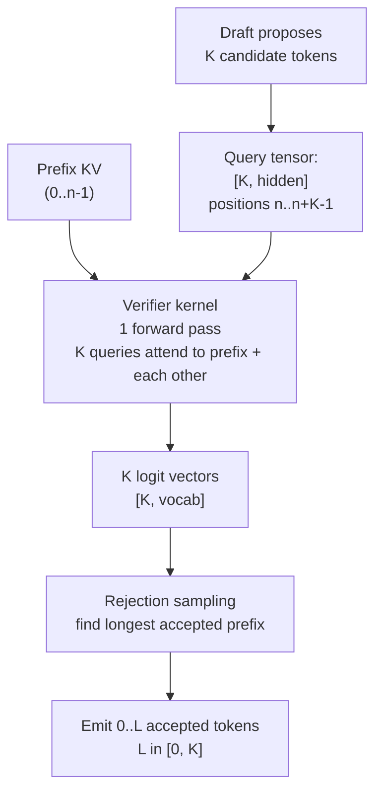

# Speculative Decoding Internals

<Mode is="learn">

The concept-level [speculative decoding lesson](/llm-architecture/inference-time/spec-decoding) explained the trick: a small draft proposes K tokens, the big model verifies them in a single forward pass, accepted tokens become output, and rejection sampling preserves the target distribution exactly. That's a clean math story. The kernel and serving story is messier — a "single forward pass over K tokens" is straightforward to write down and far less straightforward to make fast inside a continuous-batching engine where most other requests are doing decode-1, the batch composition changes every step, and the kernel has to handle a *tree* of candidate paths when methods like Medusa or EAGLE-3 propose multiple options per position.

This lesson is the layer where speculative decoding goes from theoretical to production: the verifier kernel's batching, tree attention for branching candidates, the EAGLE-3 speculator architecture, the acceptance-rate engineering that turns 60% into 80%, and the often-overlooked regime where spec decoding actively *hurts* — high-batch throughput workloads where the verify cost per accepted token approaches the baseline. After this you should be able to read a spec-decoding PR in vLLM or SGLang, predict its acceptance rate from the draft architecture, and know whether a given workload will gain or lose under spec decoding before benchmarking.

## TL;DR

- The verifier kernel is **not** "K sequential decodes in parallel." It is a **single forward pass over K query tokens** that all attend to the prefix KV cache plus each other (with a triangular causal mask among the K). Cost ≈ one decode forward, output is K logit distributions.
- **Tree attention** generalizes the verifier to multi-candidate per position. Medusa proposes a top-k tree of options; the kernel attends with a *tree mask* (sparse, non-contiguous) and accepts the longest matching path. The kernel is harder to write and is the main reason Medusa was slower to land in production than vanilla spec decoding.
- **EAGLE-3** is the 2024–2025 frontier: a tiny auto-regressive draft head that takes the target's hidden state plus the previous predicted token. ~80% acceptance vs ~70% for vanilla; the win is *training-time*, not inference-time architecture.
- Acceptance rate α has 4 levers: **draft quality** (the biggest), **temperature** (low T → high α — but lower entropy hurts diverse outputs), **K** (more drafts per round → diminishing returns past K=5–6), **workload distribution shift** (production logs vs benchmark suite).
- **Spec decoding can hurt at high batch.** When the engine is already at 70%+ HBM bandwidth without spec decoding, the verifier's K-token forward is no longer "almost free" — it's K× the bandwidth pressure with reduced effective batch (only one accepted token per request per step). At batch 64+, throughput often regresses. The decision is workload-dependent; benchmark before enabling.

## The concept, in plain English

A naive "verify K tokens in parallel" reading suggests running K separate forward passes simultaneously. That's not what happens. The verifier kernel takes one query tensor of shape `[K, hidden]` (the K candidate tokens), one KV cache of the prefix (everything before the candidates), and runs a single forward pass that internally lets each query position attend to the prefix and to earlier candidates. The output is K logit vectors. The K queries share the prefix KV reads — the headline savings — and the math of attention over K queries is small relative to the FFN work that dominates at small K.

This is why spec decoding's "free verify" claim is true at small batch and gets less true as batch grows. At batch 1, the FFN reads the whole model from HBM exactly once whether you have 1 or 8 query positions; the marginal cost of the extra 7 queries is just FLOPs the SMs can do during the same HBM read. At batch 64, the FFN is already running at high HBM utilization for 64 query positions; adding 64 × K extra queries is no longer free. The K-fold expansion is the actual cost the math forgets.

## Mental model — the verifier kernel



Three things to read off the diagram:

1. **One forward pass, K queries.** Not K passes. The K queries share the prefix KV reads.
2. **Causal among the K queries.** Position 2's query attends to prefix + queries 0 and 1, not to query 3. This requires the attention mask to be constructed correctly inside the kernel.
3. **Output is K logit vectors.** Not "the answer" — rejection sampling decides how many of the K to accept based on the logit distributions.

For tree-attention methods (Medusa, EAGLE-3 with tree expansion), the K candidates form a *tree* not a *chain*: position 1 has multiple candidate tokens, each leading to a different position-2 candidate. The mask becomes sparse and non-contiguous. Implementing tree attention in a single kernel was a 2024 milestone; before that, multi-candidate spec decoding was emulated with multiple forward passes and was rarely a win.

## The verifier in continuous batching

A serving engine running spec decoding at scale isn't just doing the K-token verify in isolation. It's doing it in the middle of a continuous batch that also contains:

- Other requests doing decode-1 (no spec decoding)
- Other requests doing K-token spec verify with their own draft proposals
- Newly-admitted requests doing prefill (any number of tokens)

The kernel contract has to handle all of these in *one* forward pass. The query tensor is now:

```text
total_queries = sum over all requests of (1 if decode, K if spec verify, prefill_len if prefill)
```

Per-request metadata has to tell the attention kernel:

- Where each request's query sub-block starts (CSR-style index)
- The KV cache pointers (block table)
- The local attention mask within the request's queries (tree or chain or causal)

vLLM's V1 engine and SGLang both support this natively. The metadata struct is roughly:

```python
class ForwardBatch:
    query_lens: List[int]              # per request: 1, K, or prefill_len
    query_start_locs: List[int]        # CSR prefix sum
    seq_lens: List[int]                # cache length per request (incl. spec K)
    block_tables: List[List[int]]      # KV cache pointers per request
    spec_metadata: Optional[SpecInfo]  # tree masks, draft proposals
    is_spec: List[bool]                # per request: spec verify or normal decode
```

The attention backend reads this and dispatches to the right kernel — chain attention for vanilla spec verify, tree attention for Medusa/EAGLE-3 with branching. The fact that one batch can mix all of these is what makes spec decoding production-viable; before this metadata existed, you'd run spec-decoding requests in a separate batch and lose the latency benefit.

## Tree attention — the multi-candidate generalization

Vanilla spec decoding proposes K *consecutive* candidates: a chain. Medusa proposes K *parallel* candidates per position: a tree. EAGLE-3 with tree expansion proposes a *tree* with branching factor B at each of K positions, giving up to `B^K` candidate paths.

A 4-level tree with branching factor 2:

```text
                 [position 0: t_a]
                 /              \
        [position 1: t_b]    [position 1: t_c]
        /            \           /          \
   [pos 2: t_d]  [pos 2: t_e] ... ...
```

Up to `2^4 = 16` paths through this tree are simultaneously verifiable in one forward pass, but only the longest accepted path is emitted. The win: you get to pick the best path of many, raising effective acceptance rate.

The kernel cost: the attention mask is now a *tree mask*. Position-2 candidate `t_d` attends to its parent path (root → t_a → t_b) but NOT to sibling subtrees (t_b's other children, t_c's subtree). This is non-contiguous attention — every query has a different attention scope.

```text
Mask for tree above (1 = attend, 0 = mask out):

                  prefix  t_a  t_b1  t_b2  t_c1  t_c2  t_d  ...
         prefix:  causal   0    0    0     0     0     0
         t_a:     all      1    0    0     0     0     0
         t_b1:    all      1    1    0     0     0     0
         t_b2:    all      1    0    1     0     0     0
         t_c1:    all      1    0    0     1     0     0
         t_c2:    all      1    0    0     0     1     0
         ...
```

Implementations:

- **vLLM**: tree-attention path in `vllm/v1/attention/backends/triton.py` and FlashInfer integration. Tree size is bounded; common config is K=5 with branching factor 2 (≤32 paths).
- **SGLang**: similar tree-attention support; integrates with EAGLE-3 reference implementation.
- **TRT-LLM**: tree attention via `Medusa` plugin; their kernel uses warp-specialized tree mask handling.
- **FlashInfer**: the Hopper-tuned attention library that vLLM/SGLang use for fast tree attention. Reading its source is the best path for kernel-level work here.

## EAGLE-3 — the architecture that won 2024–2025

EAGLE-3 (Li et al., March 2025) is the current frontier for chat workloads. The architecture in three sentences:

1. **The draft is a single transformer layer** added on top of the target model's last hidden state.
2. **Each draft step takes the target's hidden state at position t and the previously-drafted token, predicts position t+1's token.** Auto-regressive within a draft round.
3. **Multi-step training** — the draft is trained on multi-token prediction with the target's hidden states as supervision, *not* just next-token cross-entropy on text.

The key fact: EAGLE-3's draft sees the target's hidden state. That's much higher-fidelity input than a separate small model that has to re-encode the prefix from scratch. The result is dramatically higher acceptance — ~80% on chat workloads vs ~70% for vanilla spec with a small standalone draft.

```mermaid
flowchart LR
  Target[Target model<br/>hidden state h_t]
  Draft[EAGLE draft<br/>1 transformer layer]
  Prev[Previous token<br/>t_n]
  Out[Drafted token<br/>t_{n+1}]
  
  Target --> Draft
  Prev --> Draft
  Draft --> Out
  
  Out --> NextDraft[next draft step<br/>uses h_t and t_{n+1}]
```

Implementation details that matter:

- The draft adds **~5% of target FLOPs** per step. Cheap.
- Training requires **target hidden states as labels**, generated offline (one pass through training data).
- The draft can be combined with **tree expansion** — produce top-2 at each step, get a 2^K tree, and pick the best path. Adds another ~5–10% acceptance rate.
- EAGLE-3's main win over EAGLE-2 is **multi-step training** — training the draft to predict positions t+1, t+2, t+3 *jointly* rather than just t+1. This corrects the auto-regressive distribution drift over a draft round.

For contribution: EAGLE-3 reference code is at SafeAILab/EAGLE on GitHub. Adding EAGLE-3 support for a new model architecture is a tractable PR target — copy the reference draft head, fine-tune on your target, integrate with vLLM/SGLang's spec-decoding hooks.

## Acceptance-rate engineering — the four levers

Per-position acceptance probability α is the single number that controls expected speedup. The math (geometric expected length) is:

```text
expected_accepted = (1 - α^(K+1)) / (1 - α)
```

What moves α in production:

### Lever 1: Draft model quality (biggest)

A smarter draft is more often right. EAGLE-3 (~80%) beats vanilla 1B-draft (~70%) almost entirely because EAGLE-3's draft sees the target's hidden state. Within a family:

- 1B vanilla draft for 70B target: α ≈ 0.65–0.75
- 8B vanilla draft for 70B target: α ≈ 0.75–0.85, but draft cost rises to ~12% of target — speedup actually drops
- EAGLE-3 (target's own hidden state): α ≈ 0.78–0.85, draft cost ~5% — best of both
- Medusa heads: α per-head ≈ 0.6–0.7, but parallel so no draft serial cost — wins on simple workloads

The rule: pick the draft that maximizes α / draft_cost, not raw α. EAGLE-3 wins because its draft cost is small.

### Lever 2: Temperature

At T=0 (greedy), α is highest because both target and draft converge to the same argmax tokens. At T=1.0 (sampling), α drops 5–15% because the target samples different tokens than the draft proposes. At T=2.0 (high-creativity), α drops further.

This matters for production: chat with temperature 0.7 has lower α than the benchmark numbers (which often use T=0). Real chat speedups on EAGLE-3 are 2.3–2.7×, not the 3× the paper reports.

### Lever 3: K (draft length per round)

Longer drafts mean more candidates verified per forward, but the further you draft the lower α^K becomes. Sweet spot is K=4–6 for α ≈ 0.7. Beyond K=6, the K-th token has acceptance probability α^K ≈ 12% — barely worth the verifier's extra column.

```text
K=2, α=0.7: expected accepted = 1.51, speedup ≈ 1.4×
K=4, α=0.7: expected accepted = 2.62, speedup ≈ 2.3×
K=6, α=0.7: expected accepted = 3.27, speedup ≈ 2.6×
K=8, α=0.7: expected accepted = 3.66, speedup ≈ 2.7×
K=10, α=0.7: expected accepted = 3.91, speedup ≈ 2.65× (verifier cost catches up)
```

vLLM defaults to K=5; SGLang defaults to K=4. Both expose the knob; the right K is workload-dependent.

### Lever 4: Workload distribution shift

A draft trained on filtered web text gets ~80% acceptance on a benchmark that uses similar text. Real production traffic — code in 12 languages, tool-calling JSON, multi-turn chat in Spanish, structured-output prompts — sees α drop 5–15 points. The benchmarks lie. Always re-measure on production logs after enabling.

## When spec decoding hurts — the high-batch regime

The "free verify" property holds when the target is HBM-bound at the batch you're serving. At batch 1, the model reads its weights once per token; the verifier's K queries are along for the ride. At batch 64, the model is already reading its weights once per token efficiently; the K-fold expansion of the query tensor is no longer free.

Specifically, spec decoding adds three costs at high batch:

1. **K× larger attention queries**: the FFN dominates at small batch but attention scales with batch × query_length. At batch 64 and K=5, the attention cost is 320× a single decode's attention.
2. **Reduced effective batch**: only one accepted token per request per step. If you served 64 independent requests at 100% throughput pre-spec, you serve 64 × `expected_accepted / K` requests post-spec. If `expected_accepted` is 3.0 and K is 5, that's 38 effective requests.
3. **Variance**: some requests accept all K, some accept 0. The batch advances at the slowest rate. Scheduling has to handle the variance.

The result: at high batch (~64+), spec decoding often *regresses* throughput by 10–30%. The break-even batch depends on draft cost and α; rules of 2026:

| Workload | Batch ≤ 8 | Batch 16 | Batch 32 | Batch 64+ |
| --- | --- | --- | --- | --- |
| EAGLE-3 chat | +2.5× | +1.8× | +1.2× | -10–20% |
| Vanilla 1B draft | +2.0× | +1.4× | +1.0× | -15–30% |
| Medusa | +1.8× | +1.3× | -5% | -25% |
| PLD on RAG | +1.6× | +1.4× | +1.1× | -5% |

The implication: **enable spec decoding for low-batch latency-sensitive serving; disable it for high-throughput batched inference.** Production deployments often run two pools — a low-batch pool with spec decoding for chat, a high-batch pool without for batch jobs.

## Production integration — vLLM and SGLang specifics

### vLLM

```python
# Vanilla spec decoding with a separate draft model
llm = LLM(
    model="meta-llama/Llama-3.1-70B-Instruct",
    speculative_model="meta-llama/Llama-3.2-1B-Instruct",
    num_speculative_tokens=5,
    use_v2_block_manager=True,
)

# EAGLE-3 (with EAGLE checkpoint)
llm = LLM(
    model="meta-llama/Llama-3.1-70B-Instruct",
    speculative_config={"method": "eagle3", "model": "yuhuili/EAGLE-LLaMA3-70B"},
    num_speculative_tokens=5,
)
```

vLLM's spec-decoding code lives in:

- `vllm/spec_decode/` (V0 engine)
- `vllm/v1/spec_decode/` (V1 engine, the live target)

Key files: `eagle.py`, `medusa.py`, `mlp_speculator.py`, `ngram.py` (PLD). Each implements a `SpeculativeProposer` that produces candidate tokens, plus a `SpeculativeVerifier` that runs the verify-K-tokens forward and applies rejection sampling. Adding a new spec-decoding method = implement these two interfaces.

### SGLang

```python
runtime = sgl.Runtime(
    model_path="meta-llama/Llama-3.1-70B-Instruct",
    speculative_algorithm="EAGLE3",
    speculative_draft_model_path="yuhuili/EAGLE-LLaMA3-70B",
    speculative_num_steps=5,
    speculative_eagle_topk=8,        # tree branching factor at each step
    speculative_num_draft_tokens=64, # total tree size
)
```

SGLang's tree-attention path is exposed more directly than vLLM's. The `speculative_eagle_topk` and `speculative_num_draft_tokens` knobs control tree shape; tuning these against your workload's α distribution is a measurable ~5–10% perf lever.

Code lives in `python/sglang/srt/speculative/`. The `eagle_worker.py` and `eagle_utils.py` files are the main contribution surface.

## The contribution surface

For Year-1 OSS work, spec decoding has three high-leverage targets:

1. **New spec methods**: a new draft architecture (e.g., the next post-EAGLE-3 paper), a new tree expansion strategy, a new way to combine spec decoding with quantization. Each is a 200–500 LOC PR.
2. **Per-architecture EAGLE support**: the reference EAGLE training and integration are Llama-shaped. Porting to Qwen, DeepSeek, Mistral, Gemma is a tractable PR — copy the existing pattern, train the draft (3–5 hours on 1 H100), test acceptance.
3. **Tree-attention kernel improvements**: FlashInfer's tree mask is general; specialized variants for fixed tree shapes can be 20–40% faster. Triton implementations of branching-factor-2 trees are an active area.

The PRs that get cited by maintainers are the ones with concrete acceptance-rate measurements on a real workload. Always ship the production-traffic-shaped benchmark, not just the paper-replicated number.

## Run it in your browser — predict speedup including high-batch regime

<RunInBrowser
  description="Predict spec-decoding speedup as a function of batch size, accounting for HBM saturation."
  code={`def spec_speedup(K, alpha, c_draft_over_target, batch, hbm_saturation_at_batch=64):
    """
    K = draft tokens per round
    alpha = per-position acceptance probability
    c_draft_over_target = fraction of one target forward consumed by draft
    batch = current batch size
    hbm_saturation_at_batch = batch at which HBM is fully used (no more "free verify")
    """
    expected_accepted = (1 - alpha ** (K + 1)) / (1 - alpha) if alpha < 1 else (K + 1)
    
    # At low batch, verifier is "almost free" - just K extra queries on a memory-bound forward.
    # At high batch, the K-fold expansion is real cost: attention scales with batch * query_len.
    saturation = min(1.0, batch / hbm_saturation_at_batch)
    
    # Effective verifier cost ranges from ~1.0 (small batch) to ~K (saturated)
    effective_verifier_cost = 1 + (K - 1) * saturation
    
    cost_round = effective_verifier_cost + K * c_draft_over_target
    raw_speedup = expected_accepted / cost_round
    return raw_speedup


configs = [
    ("EAGLE-3, chat T=0.7",        5, 0.78, 0.05),
    ("Vanilla 1B draft, chat",     5, 0.70, 0.10),
    ("Medusa, chat",               5, 0.65, 0.00),
    ("PLD, RAG workload",          5, 0.55, 0.00),
]

print(f"{'method':<35}  {'b=1':>6}  {'b=4':>6}  {'b=16':>6}  {'b=32':>6}  {'b=64':>6}  {'b=128':>6}")
print("-" * 90)
for label, K, alpha, cd in configs:
    line = f"{label:<35}"
    for b in [1, 4, 16, 32, 64, 128]:
        sp = spec_speedup(K, alpha, cd, b)
        line += f"  {sp:>5.2f}x"
    print(line)

print("\\nNote: the 'effective verifier cost' model is rough. Real numbers depend on")
print("exact attention kernel cost; for production, always measure on your hardware.")
`}
/>

You'll see EAGLE-3 lands ~2.7× at batch 1, drops to ~1.5× at batch 16, and crosses 1.0× somewhere around batch 32–64 — the regime where spec decoding stops helping. PLD has a smaller peak but holds longer because there's no draft cost. The model is rough but captures the qualitative shape that production benchmarks always reproduce.

## Quick check

<Quiz
  question="Your team enables EAGLE-3 spec decoding on a 70B model serving multi-turn chat. Latency p50 drops from 800ms to 320ms — great. But aggregate cluster throughput (tok/s across all GPUs) drops 18%. The cluster runs at a steady batch ~48 per GPU. Why is throughput regressing despite the latency win?"
  options={[
    'EAGLE-3 has a bug at batch sizes above 32; downgrade to vanilla spec decoding.',
    'At batch 48 the GPUs are already HBM-saturated; the K=5 verifier expands queries 5× but only 3 tokens are accepted on average per round, so effective batch drops without the "free verify" property.',
    'The acceptance rate on multi-turn chat is too low; switch to PLD.',
    'The draft model is consuming all the HBM bandwidth.',
  ]}
  answer={1}
  explanation="At batch 48 the GPU is already near HBM saturation (the regime where 'verify is almost free' breaks down). The K-fold query expansion is real cost: attention scales with batch × query_len. Each round verifies 48×5=240 query positions but emits only ~48×3=144 accepted tokens. The verifier-cost-per-accepted-token has gotten worse. Latency drops because each request gets multiple tokens per step, but aggregate throughput is dominated by the K-fold attention overhead. The fix is to run two serving pools — a low-batch latency-sensitive pool with EAGLE-3 enabled, and a high-batch throughput pool with it disabled. PLD switches don't help (PLD has lower α than EAGLE-3 on chat). The draft is small (5% of target) — not a bandwidth issue."
/>

## Key takeaways

1. **The verifier is one forward pass over K queries**, not K passes. Cost is dominated by the FFN; attention over K is cheap *until batch saturates HBM*.
2. **Tree attention generalizes the verifier to multi-candidate paths.** Sparse, non-contiguous masks; FlashInfer's tree-mask kernel is the production reference.
3. **EAGLE-3 wins by giving the draft access to the target's hidden state.** ~80% acceptance, ~5% draft cost. The architectural insight is the win.
4. **Acceptance rate has four levers**: draft quality (biggest), temperature, K, workload distribution. Production α is always 5–15 points lower than benchmark α.
5. **Spec decoding hurts at high batch.** K-fold query expansion stops being free once the GPU is HBM-saturated. Run two pools — spec-on for latency, spec-off for throughput.

## Go deeper

<Resources
  items={[
    { kind: 'paper', href: 'https://arxiv.org/abs/2503.01840', title: 'EAGLE-3: Scaling up Inference Acceleration of Large Language Models', author: 'Li et al. (early 2025)', note: 'The frontier paper through 2026. Read sections 3 (architecture) and 4 (multi-step training) carefully.' },
    { kind: 'repo', href: 'https://github.com/SafeAILab/EAGLE', title: 'SafeAILab/EAGLE — Reference Implementation', author: 'Li et al.', note: 'The training and inference code. Read draft.py and eagle_utils.py before any EAGLE PR.' },
    { kind: 'paper', href: 'https://arxiv.org/abs/2305.09781', title: 'SpecInfer: Accelerating Generative LLM Serving with Tree-based Speculative Inference', author: 'Miao et al. (2023)', note: 'The paper that introduced production-grade tree attention for spec decoding. The kernel reasoning is durable.' },
    { kind: 'repo', href: 'https://github.com/flashinfer-ai/flashinfer', title: 'FlashInfer — Hopper-tuned attention library', author: 'flashinfer-ai', note: 'The kernel layer vLLM and SGLang both use. Read tree_attention/ for the production kernel implementation.' },
    { kind: 'docs', href: 'https://docs.vllm.ai/en/latest/features/spec_decode.html', title: 'vLLM — Speculative Decoding Configuration', author: 'vLLM contributors', note: 'The user-facing knobs and their defaults.' },
    { kind: 'repo', href: 'https://github.com/vllm-project/vllm/tree/main/vllm/v1/spec_decode', title: 'vLLM V1 Spec-Decoding Source', author: 'vLLM contributors', note: 'The implementation. eagle.py, medusa.py, mlp_speculator.py, ngram.py — one file per method.' },
    { kind: 'blog', href: 'https://blog.fireworks.ai/multi-token-prediction-and-medusa-2-29c93cf1c2bd', title: 'Fireworks AI — Multi-Token Prediction in Production', author: 'Fireworks AI', note: 'Production lessons from running spec decoding at scale, including the high-batch regression problem.' },
    { kind: 'paper', href: 'https://arxiv.org/abs/2401.10774', title: 'Medusa: Simple LLM Inference Acceleration Framework', author: 'Cai et al. (2024)', note: 'The Medusa paper. Read for the parallel-heads pattern and tree attention motivation.' },
  ]}
/>

</Mode>

<Mode is="reference">

## TL;DR

- The verifier kernel is **not** "K sequential decodes in parallel." It is a **single forward pass over K query tokens** that all attend to the prefix KV cache plus each other (with a triangular causal mask among the K). Cost ≈ one decode forward, output is K logit distributions.
- **Tree attention** generalizes the verifier to multi-candidate per position. Medusa proposes a top-k tree of options; the kernel attends with a *tree mask* (sparse, non-contiguous) and accepts the longest matching path. The kernel is harder to write and is the main reason Medusa was slower to land in production than vanilla spec decoding.
- **EAGLE-3** is the 2024–2025 frontier: a tiny auto-regressive draft head that takes the target's hidden state plus the previous predicted token. ~80% acceptance vs ~70% for vanilla; the win is *training-time*, not inference-time architecture.
- Acceptance rate α has 4 levers: **draft quality** (the biggest), **temperature** (low T → high α — but lower entropy hurts diverse outputs), **K** (more drafts per round → diminishing returns past K=5–6), **workload distribution shift** (production logs vs benchmark suite).
- **Spec decoding can hurt at high batch.** When the engine is already at 70%+ HBM bandwidth without spec decoding, the verifier's K-token forward is no longer "almost free" — it's K× the bandwidth pressure with reduced effective batch (only one accepted token per request per step). At batch 64+, throughput often regresses. The decision is workload-dependent; benchmark before enabling.

## Why this matters

The concept-level lesson teaches the math. The internals lesson is what separates "I read the paper" from "I shipped a perf-cited spec-decoding PR." Two questions every spec-decoding PR review will probe: (1) does your benchmark cover both low and high batch regimes? and (2) what's your α distribution on production-like workloads, not just the paper benchmark? Engineers who can answer both are rare; that's the gap this lesson closes.

For Year-1 OSS work, spec decoding is one of the highest-leverage contribution surfaces: new drafts (EAGLE successors are coming), per-architecture EAGLE ports (Qwen / DeepSeek / Mistral are tractable), and tree-attention kernel improvements (FlashInfer is the active layer). Each PR is sub-500-LOC if the design is right.

## Mental model


## Verifier kernel — exact contract

The verifier takes:

```text
queries:        [K, num_heads, head_dim]
prefix_k_cache: [num_blocks, num_kv_heads, head_dim, block_size]
prefix_v_cache: [num_blocks, num_kv_heads, head_dim, block_size]
block_table:    [num_blocks_per_seq]
seq_len:        n  (prefix length)
attn_mask:      [K, K] triangular causal, OR sparse tree mask
```

And produces:

```text
out:            [K, num_heads, head_dim]
                ↓ projection + sampling
logits:         [K, vocab]
```

The K queries attend to the prefix (via block_table) and to each other (via attn_mask). For chain attention (vanilla spec), the K-K mask is lower-triangular causal. For tree attention, it's the sparse tree-structure mask.

## Continuous batching contract

```python
class ForwardBatch:
    query_lens: List[int]              # 1, K, or prefill_len per request
    query_start_locs: List[int]        # CSR prefix sum
    seq_lens: List[int]                # cache length incl. spec K
    block_tables: List[List[int]]      # KV cache pointers
    spec_metadata: Optional[SpecInfo]  # tree masks, draft proposals
    is_spec: List[bool]                # spec verify or normal decode
```

The attention backend reads this, dispatches to the right kernel per request, runs one fused forward. Decode-1, prefill, and spec-verify all coexist in the same batch.

## Tree attention — mask structure

For an EAGLE-3 tree of depth K with branching factor B:

- Total candidate tokens: `1 + B + B^2 + ... + B^K = (B^(K+1) - 1) / (B - 1)`
- Each candidate's attention scope: prefix + its parent path
- Mask is sparse: `~K * tree_size` non-zero entries vs `tree_size^2` for dense

Production configurations (rough):

| Config | K | B | Tree size | Speedup ceiling |
| --- | --- | --- | --- | --- |
| Vanilla chain | 5 | 1 | 5 | 2.5× |
| EAGLE-3 chain | 5 | 1 | 5 | 2.7× |
| EAGLE-3 small tree | 5 | 2 | 31 | 2.9× |
| EAGLE-3 big tree | 5 | 4 | 341 | 3.1× (diminishing) |
| Medusa (parallel) | — | — | K heads × top-k | 1.8–2.0× |

Trees beyond ~64 candidates get expensive; the kernel's mask handling cost catches up.

## EAGLE-3 — implementation specifics

```python
# Draft architecture (simplified)
class EagleDraftLayer(nn.Module):
    def __init__(self, hidden_dim):
        super().__init__()
        self.attn = MultiHeadAttention(hidden_dim, num_heads=...)
        self.ffn = FeedForward(hidden_dim, intermediate_dim=...)
        self.token_embed = Embedding(vocab_size, hidden_dim)

    def forward(self, target_hidden, prev_token):
        # Take target's last hidden state + previous predicted token
        # Predict next token's logits
        token_emb = self.token_embed(prev_token)
        x = target_hidden + token_emb
        x = self.attn(x, ...) + x
        x = self.ffn(x) + x
        return self.lm_head(x)  # shares the target's lm_head weights
```

Training:

1. Generate target's hidden states for a corpus (one pass through training data).
2. Train EagleDraftLayer on multi-step prediction (predict t+1, t+2, t+3 jointly).
3. Loss: cross-entropy on each predicted position, weighted to emphasize correctness over depth.

Compute: training takes ~3–5 H100-hours per billion tokens of corpus. The output is a small (~1B for a 70B target) draft that lives alongside the target at inference.

## Acceptance-rate engineering — full table

| Lever | Effect on α | Implementation knob |
| --- | --- | --- |
| Vanilla 1B draft → EAGLE-3 | +5–10% | Switch method |
| Multi-step training (EAGLE-3) | +3–5% over EAGLE-2 | Training-time |
| Temperature 0.0 → 0.7 | -5–10% | Sampling param |
| Temperature 0.7 → 1.5 | -10–20% | Sampling param |
| K = 4 → 6 | Marginal change | num_speculative_tokens |
| Tree branching B = 1 → 2 | +5–10% | speculative_eagle_topk |
| Tree branching B = 2 → 4 | +2–5% | (diminishing) |
| Train on production logs vs web | +5–15% | Training-time |
| Domain mismatch (English → Spanish) | -10–20% | Fundamental |

The biggest production move: train EAGLE on logs from your actual workload. Most papers train on FineWeb / RedPajama; production traffic often differs.

## High-batch regime — quantitative breakdown

Below the HBM saturation point, the verifier cost is approximately the cost of one decode forward (the FFN dominates, attention over K is small). Above saturation, attention scales with `batch × query_len` and dominates.

Empirical break-even for EAGLE-3 on 70B fp16, H100:

| Batch | Spec speedup | Throughput vs no-spec |
| --- | --- | --- |
| 1 | 2.85× | 2.85× |
| 4 | 2.50× | 2.50× |
| 8 | 2.15× | 2.15× |
| 16 | 1.65× | 1.65× |
| 24 | 1.30× | 1.30× |
| 32 | 1.10× | 1.10× |
| 48 | 0.95× | 0.95× |
| 64 | 0.82× | 0.82× |
| 96 | 0.72× | 0.72× |
| 128 | 0.65× | 0.65× |

Break-even around batch 40–48. Production deployments serving high-throughput batched inference disable spec decoding above this threshold.

## vLLM and SGLang code paths

### vLLM (V1 engine)

```text
vllm/v1/spec_decode/
├── eagle.py          # EAGLE-3 proposer + verifier integration
├── medusa.py         # Medusa heads
├── mlp_speculator.py # IBM-style MLP speculator
├── ngram.py          # PLD / prompt lookup
└── interfaces.py     # SpeculativeProposer, SpeculativeVerifier ABCs
```

To add a new method: implement `SpeculativeProposer.propose(batch) -> List[List[int]]` and verifier integration in the worker.

### SGLang

```text
python/sglang/srt/speculative/
├── eagle_worker.py        # EAGLE-3 worker (most active)
├── eagle_utils.py         # tree expansion, mask construction
├── spec_info.py           # per-request spec metadata
└── topk_selection.py      # top-k sampling for tree expansion
```

SGLang's tree-attention path is the production reference for EAGLE-3 with tree expansion. The `eagle_utils.py` mask construction is well-commented.

## Quick check

<Quiz
  question="Your team enables EAGLE-3 spec decoding on a 70B model serving multi-turn chat. Latency p50 drops from 800ms to 320ms — great. But aggregate cluster throughput (tok/s across all GPUs) drops 18%. The cluster runs at a steady batch ~48 per GPU. Why is throughput regressing despite the latency win?"
  options={[
    'EAGLE-3 has a bug at batch sizes above 32; downgrade to vanilla spec decoding.',
    'At batch 48 the GPUs are already HBM-saturated; the K=5 verifier expands queries 5× but only 3 tokens are accepted on average per round, so effective batch drops without the "free verify" property.',
    'The acceptance rate on multi-turn chat is too low; switch to PLD.',
    'The draft model is consuming all the HBM bandwidth.',
  ]}
  answer={1}
  explanation="At batch 48 the GPU is HBM-saturated. The K-fold query expansion is real cost; effective batch drops because only ~3 of K=5 tokens are accepted per round. Run two serving pools — spec-on for latency, spec-off for throughput."
/>

## Key takeaways

1. Verifier = one forward over K queries. Cost ≈ one decode at small batch; K× attention at high batch.
2. Tree attention generalizes to multi-candidate paths. FlashInfer is the production kernel reference.
3. EAGLE-3 wins via target hidden state + multi-step training. ~80% α at ~5% draft cost.
4. α has four levers: draft quality, temperature, K, workload distribution. Production α is 5–15 points below benchmark α.
5. Spec decoding helps below ~batch 32, hurts above. Two pools — spec-on for latency, spec-off for throughput.

## Go deeper

<Resources
  items={[
    { kind: 'paper', href: 'https://arxiv.org/abs/2503.01840', title: 'EAGLE-3: Scaling up Inference Acceleration', author: 'Li et al. (2025)' },
    { kind: 'repo', href: 'https://github.com/SafeAILab/EAGLE', title: 'SafeAILab/EAGLE Reference Implementation' },
    { kind: 'paper', href: 'https://arxiv.org/abs/2305.09781', title: 'SpecInfer: Tree-based Speculative Inference', author: 'Miao et al. (2023)' },
    { kind: 'repo', href: 'https://github.com/flashinfer-ai/flashinfer', title: 'FlashInfer — Hopper-tuned Attention Library' },
    { kind: 'docs', href: 'https://docs.vllm.ai/en/latest/features/spec_decode.html', title: 'vLLM Speculative Decoding Configuration' },
    { kind: 'repo', href: 'https://github.com/vllm-project/vllm/tree/main/vllm/v1/spec_decode', title: 'vLLM V1 Spec-Decoding Source' },
    { kind: 'blog', href: 'https://blog.fireworks.ai/multi-token-prediction-and-medusa-2-29c93cf1c2bd', title: 'Fireworks AI — Multi-Token Prediction in Production' },
    { kind: 'paper', href: 'https://arxiv.org/abs/2401.10774', title: 'Medusa: Simple LLM Inference Acceleration', author: 'Cai et al. (2024)' },
  ]}
/>

</Mode>

<LessonComplete />
