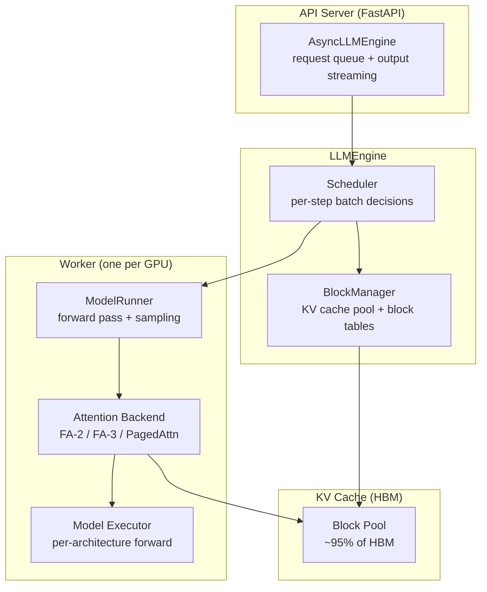

# vLLM Internals

<Mode is="learn">

In a managed-runtime language, when you call a function the runtime hides the threading model from you. Inference engines like vLLM operate at the opposite extreme: every layer of the system is something you can see, override, or contribute to. The reason vLLM is the canonical reference for serving systems isn't that it's the fastest engine on every benchmark — it's that the *architectural ideas* it ships (PagedAttention, continuous batching, prefix caching) define how every other production engine works. Read its source for two days and you'll understand the whole field.

This lesson is the contributor's view, not the user's. It walks the codebase one layer at a time — the scheduler that decides which requests run this step, the PagedAttention data structure that makes that scheduling cheap, the V1 engine rewrite that's currently rewriting most of the answer, and the extension points where new contributors actually land PRs. After this you should be able to read a vLLM PR and understand which subsystem changed, propose a design comment that signals you read the code, and identify the kind of issue that will accept your first contribution.

## TL;DR

- **vLLM is a continuous-batching inference engine** built around three ideas: a scheduler that re-evaluates the batch every step, a paged KV cache (PagedAttention) that makes admit/evict cheap, and a worker process that runs one forward pass per scheduling tick.
- **PagedAttention** stores the KV cache in fixed-size **blocks** (typically 16 tokens). Each request has a **block table** that maps logical positions to physical blocks. Sharing prefixes is "share the block pointer," not "memcpy the cache." This is the data structure that makes prefix caching, swapping, and copy-on-write trivial.
- **The scheduler runs the SJF-with-priority pattern**: at each step, pick prefill requests with budget remaining, then admit decode for all running requests, mix into one forward pass. Preemption (swap to CPU or recompute) kicks in when KV cache is full.
- **vLLM is mid-rewrite — the V1 engine.** V0 was the original 2023 architecture; V1 is the 2024–2025 rewrite (async scheduler, persistent worker, structured I/O). Most active contribution work targets V1; check `vllm/v1/` for the live code.
- **The four extension points contributors actually use**: model architectures (`vllm/model_executor/models/`), attention backends (`vllm/attention/backends/`), schedulers/policies (`vllm/core/scheduler.py` or `vllm/v1/core/`), and quantization kernels (Marlin, INT4, FP8 — under `vllm/model_executor/layers/quantization/`).

## The concept, in plain English

A naive batch inference server runs requests one at a time, or in fixed-size batches that wait for the slowest member to finish. Both waste GPU. vLLM runs them all together, *every single forward pass step*. At each step, the scheduler walks the queue: which requests have KV cache space, which can the GPU afford to prefill, which are decoding their next token. A batch is assembled, one forward pass runs, the output tokens are returned to whoever asked, and the loop repeats. Because the batch composition changes every step, the engine can fold a brand-new request into the live batch the moment its prefill is admitted.

Making that work requires a KV cache that supports cheap admit, evict, and prefix-share. PagedAttention is the answer: rather than storing each request's KV cache in a contiguous slab, store it as a list of fixed-size blocks. A request's "cache" is a block table — an array of pointers to physical blocks in a global pool. Sharing a system-prompt prefix between two conversations is identical block pointers in both block tables. Evicting a request to make room is dropping the block-table entries and returning the blocks to the pool. The whole architecture is downstream of this single data-structure choice.

## Mental model — the four-layer engine



Four layers, each with a clear job:

1. **API server** — accepts HTTP requests, queues them, streams tokens back. Async; many requests in flight.
2. **Engine** — owns the scheduler and block manager. Per-step decisions about which requests to advance. Single Python process.
3. **Worker** — owns the GPU. Runs one forward pass per scheduling tick. Multi-GPU = multiple workers (one per rank).
4. **Attention backend + model executor** — the kernels and the per-architecture forward function. The hot path.

A contribution targets exactly one of these. New model = layer 4. New attention kernel = layer 4. Scheduler change = layer 2. New API endpoint = layer 1.

## The scheduler — what it actually does

The scheduler is the part that distinguishes vLLM from a naive serving stack. Every forward pass starts with a scheduling tick:

```python
# Simplified vllm/core/scheduler.py
def schedule(self) -> SchedulerOutput:
    running = self.running        # currently decoding
    waiting = self.waiting        # admitted, awaiting prefill
    swapped = self.swapped        # paged out

    # 1. Try to readmit any swapped requests
    can_readmit = self.block_manager.can_readmit(swapped)
    self._swap_in(can_readmit)

    # 2. Admit new prefill within the batch budget
    while waiting and self.has_budget_for_prefill(waiting[0]):
        req = waiting.popleft()
        self._allocate_blocks_for_prefill(req)
        running.append(req)

    # 3. If KV cache is full, preempt
    while not self.block_manager.can_advance_decode(running):
        victim = self.pick_preemption_victim(running)
        self._preempt(victim)  # swap to CPU OR recompute later

    # 4. Build the batch — mix prefill (newly admitted) and decode
    return SchedulerOutput(
        prefill_seqs=[r for r in running if r.is_prefill],
        decode_seqs=[r for r in running if r.is_decode],
        swap_in=[...],
        swap_out=[...],
        preempt=[...],
    )
```

The actual code in `vllm/core/scheduler.py` (V0) is ~1500 lines; the V1 equivalent in `vllm/v1/core/sched/scheduler.py` is reorganized but the core decision tree is the same. Five things to internalize:

1. **Mixed prefill+decode in one step** is the headline win. Naive batching can't do this; vLLM's batched attention kernel handles variable per-sequence query lengths in one call.
2. **Prefill budget** is configurable (`max_num_batched_tokens`). Prefilling 4096 tokens of a fresh request takes much longer than a batch of 32 decode tokens — limit it so decoding doesn't stall.
3. **Preemption picks losers**. Default is "newest first" (lifo); production uses priority or fairness. The `pick_preemption_victim` method is a common place to land scheduling-policy PRs.
4. **Recompute vs swap** is an option per request. Swap moves KV blocks to CPU (cheap memory, expensive PCIe transfer); recompute drops them and re-runs prefill on resume. Modern vLLM uses recompute by default below a length threshold.
5. **Chunked prefill** lets a long prefill be split across multiple steps, mixed with decode work. Off by default in V0; on by default in V1. This is one of the largest perf-impact features of recent vLLM versions.

## PagedAttention — the data structure

The KV cache is stored as a global pool of fixed-size **blocks**. Each block holds the keys and values for `block_size` tokens (default 16) at one layer:

```text
block_size = 16, num_layers = 32, head_dim = 128, num_kv_heads = 8, dtype = fp16

bytes_per_block = 2 (k+v) * 16 (tokens) * 32 (layers) * 8 (heads) * 128 (dim) * 2 (fp16)
               = 2,097,152 bytes  ≈ 2 MB per block
```

The HBM block pool fills 95% of the GPU memory left after the model weights are loaded. On an 80 GB H100 running a 70B model in fp16 (~140 GB sharded across 2 GPUs), each GPU has ~10 GB free → ~5,000 blocks → 80,000 token slots. With 16-token blocks that's a lot of in-flight requests.

Each request maintains a **block table**:

```text
block_table for request 17 (current length = 47 tokens):
  logical_block_0 -> physical_block_82
  logical_block_1 -> physical_block_91
  logical_block_2 -> physical_block_44   (16 + 16 + 15 = 47 tokens; partial last block)
```

Three operations are now O(1) instead of O(N tokens):

- **Admit a new request**: allocate prefill blocks, fill block table.
- **Evict (swap out)**: drop the block-table entries and return blocks to the pool.
- **Prefix share** (e.g., common system prompt): two requests' block tables point to the same physical block for the shared prefix.

The attention kernel takes the block table as an extra argument and gathers KVs through it. PagedAttention's kernel is the key innovation — naive attention reads K and V from a contiguous tensor; PagedAttention reads K and V through the block-table indirection without slowing down.

```cpp
// Conceptual PagedAttention kernel sketch
__global__ void paged_attention_kernel(
    half *out,              // [num_seqs, num_heads, head_size]
    half *q,                // [num_seqs, num_heads, head_size]
    half *k_cache,          // [num_blocks, num_kv_heads, head_size, block_size]
    half *v_cache,          // [num_blocks, num_kv_heads, head_size, block_size]
    int *block_tables,      // [num_seqs, max_num_blocks_per_seq]
    int *seq_lens,          // [num_seqs]
    ...
) {
    // For each query, gather the keys/values via block_tables
    // and compute attention with a fused softmax.
}
```

The 2023 paper introduced this. Production engines (vLLM, SGLang, TensorRT-LLM) all converged on the same idea.

## Continuous batching — what one forward pass actually looks like

Take three requests:

- **Request A**: in mid-decode, generated 47 tokens so far, asks for token 48.
- **Request B**: in mid-decode, generated 12 tokens so far, asks for token 13.
- **Request C**: just admitted, prefill of 1024 tokens.

A naive batch can't run these together — A and B have query length 1, C has query length 1024. vLLM's batched attention kernel takes per-sequence query lengths and **concatenates queries along the sequence axis**. The forward pass:

```text
queries:    [1024 (C prefill) | 1 (A decode) | 1 (B decode)]   shape: [1026, hidden]
positions:  [0..1023            | 47           | 12]
seq_lens:   for each token, which request it belongs to (CSR-style indices)
```

One forward pass through the model produces 1026 output positions. The sampler emits one new token for each request that's at the end of its sequence (so position 1024 of C, the new C-decode position; position 48 of A; position 13 of B). The next iteration's batch reads the new positions.

This is why prefill-and-decode mixing is a structural property of vLLM, not a feature flag. The kernel was designed for it from the start.

## The V1 engine rewrite — what changed

vLLM started in 2023 with what's now called the V0 engine: synchronous scheduler in the engine process, blocking I/O on requests, single-threaded request handling. V1 (rolled out 2024–2025) is a structural rewrite:

| Aspect | V0 | V1 |
| --- | --- | --- |
| Scheduler | Synchronous, in main process | Asynchronous, lightweight tick |
| Worker | One forward pass per scheduler call | Persistent worker with its own queue |
| Request input | Re-tokenized per request | Pre-processed in the API layer |
| Multi-modal | Bolted on | Native (image/audio inputs as tokens) |
| KV cache layout | Channel-last by default | Channel-last with layout flexibility for new kernels |
| Prefix caching | Optional (--enable-prefix-caching) | Always on |
| Chunked prefill | Optional flag | Default behaviour |
| Code path | `vllm/engine/`, `vllm/core/` | `vllm/v1/engine/`, `vllm/v1/core/` |

The contributor implication is direct: **most new feature work happens in `vllm/v1/`**. If your design touches scheduling, attention dispatch, or sampling, target V1. V0 is in maintenance — bug fixes accepted, structural changes not. Reading both is useful (V0 is simpler to follow first), but landing PRs against V0 is harder.

## The four extension points — where contributors land

These are the directories where most cited PRs come from:

### 1. Model architectures — `vllm/model_executor/models/`

Each supported architecture (Llama, Qwen, DeepSeek, Mistral, Gemma, etc.) is one file. Adding a new architecture is a high-leverage first PR — you copy a similar architecture's file, edit for the new shapes, register it, add a test, and ship.

```python
# vllm/model_executor/models/<your_model>.py
class YourModelForCausalLM(nn.Module):
    def __init__(self, config: YourConfig, ...): ...
    def forward(self, input_ids, positions, kv_caches, ...): ...
    def load_weights(self, weights): ...
```

The class follows a fixed protocol; the `forward` method receives positions and kv_caches the engine prepared. New-model PRs typically merge in 1–3 weeks.

### 2. Attention backends — `vllm/attention/backends/`

The attention backend is what the engine calls per layer. Existing backends: `flash_attn` (FA-2), `flash_attn3`, `paged_attention_v1`, `paged_attention_v2`, `xformers`, `triton`. Adding a new backend (or improving an existing one) is the highest-leverage perf work.

```python
class YourAttentionBackend(AttentionBackend):
    @staticmethod
    def get_name() -> str: return "your_backend"
    @staticmethod
    def make_metadata(...): ...
    @staticmethod
    def get_impl_cls(): return YourAttentionImpl

class YourAttentionImpl(AttentionImpl):
    def forward(self, query, key, value, kv_cache, attn_metadata, ...): ...
```

This is the layer where Marlin INT4, FlashAttention-3 warp-specialization, and FP8 KV cache all live. It's also where you'd land a custom kernel for a specific hardware target (AMD ROCm, Intel Habana).

### 3. Scheduler / policy — `vllm/core/scheduler.py` (V0) or `vllm/v1/core/sched/`

Scheduling-policy PRs are common and have measurable perf impact. Examples that landed:

- Chunked prefill (split long prefill across steps, mix with decode)
- Disaggregated serving (separate prefill workers from decode workers)
- Priority/fairness scheduling (don't starve long-running requests)
- Speculative decoding integration (verifier kernel + acceptance handling)

Scheduling PRs need careful benchmarking — show throughput AND latency tradeoffs, not just one. Chunked prefill landed because the author showed it improved p99 decode latency at high QPS without hurting prefill throughput.

### 4. Quantization kernels — `vllm/model_executor/layers/quantization/`

INT4 (Marlin, AWQ, GPTQ), FP8 (E4M3, E5M2), FP4 (NVFP4, MXFP4), and KV-cache quantization. This is bedrock-meets-tooling territory and the PRs that get the most "cited in release notes" attention. The Marlin kernel, originally external, was upstreamed by Frantar/Castro and is now the default INT4 path.

```python
class YourQuantConfig(QuantizationConfig):
    @classmethod
    def get_supported_act_dtypes(cls): return [torch.float16]
    def get_quant_method(self, layer, prefix): ...
```

The Triton + Roofline lessons in Mosaic prepare you for kernel-level work here.

## Reading the source — the entry points

For a first read, walk these files in order. About 4 hours total for the V1 path:

| File | What to learn |
| --- | --- |
| `vllm/v1/engine/core.py` | The engine main loop. The persistent worker model. |
| `vllm/v1/core/sched/scheduler.py` | Scheduling decisions, request state machine. |
| `vllm/v1/core/kv_cache_manager.py` | Block manager, prefix cache trie. |
| `vllm/v1/worker/gpu_worker.py` | Worker forward pass, sampler, log-prob handling. |
| `vllm/v1/attention/backends/flash_attn.py` | The attention backend interface. |
| `vllm/model_executor/models/llama.py` | A canonical model architecture file (how forward is structured). |
| `vllm/model_executor/layers/quantization/marlin.py` | The INT4 kernel integration. |

Print these out (literally — paper helps). Mark every function call that crosses a layer boundary. After this, the rest of the codebase is variations on the same patterns.

## Concrete walkthrough — an example PR's anatomy

A real recent PR (paraphrased): "Add chunked prefill support for Granite model architecture." 87 lines changed, merged in 5 days.

The change had three parts:

1. **Model file** (`vllm/model_executor/models/granite.py`): one-line change to handle the per-token-position case where prefill chunks don't start at position 0.
2. **Attention backend** (`vllm/attention/backends/flash_attn.py`): add a check that the query length is variable (already supported, just needed a flag).
3. **Test** (`tests/models/test_granite.py`): assert chunked prefill produces identical outputs to unchunked.

The PR description had 4 paragraphs: motivation (Granite users wanted chunked prefill for long context), implementation summary, before/after benchmark (5% throughput improvement on a 32K context Granite workload), and a reproducer command. The maintainer thread had two rounds of review (rename a variable, add a docstring), then merged.

This is the texture of typical high-quality PRs: small surface area, clear motivation, real benchmark, easy to review. PRs over 500 LOC almost never land within a month; PRs under 200 LOC often merge in a week if the design comment was filed first.

## Run it in your browser — predict KV cache utilization

<RunInBrowser
  description="Plug in your hardware + model + workload; predict block pool size and max in-flight tokens."
  code={`def vllm_kv_cache_capacity(
    gpu_hbm_gb=80,             # H100 HBM
    model_weight_gb=14,        # Llama 8B fp16
    overhead_gb=2,             # framework overhead
    block_size=16,             # vLLM default
    num_layers=32,             # Llama 8B
    head_dim=128,
    num_kv_heads=8,            # GQA: 8 KV heads
    dtype_bytes=2,             # fp16
    target_kv_fraction=0.95,
):
    available_gb = (gpu_hbm_gb - model_weight_gb - overhead_gb) * target_kv_fraction
    bytes_per_block = (
        2                       # K + V
        * block_size            # tokens per block
        * num_layers
        * num_kv_heads
        * head_dim
        * dtype_bytes
    )
    num_blocks = int(available_gb * 1e9 / bytes_per_block)
    total_token_slots = num_blocks * block_size
    return num_blocks, total_token_slots, bytes_per_block / 1e6


# Single H100 running Llama 8B
nb, slots, mb_per_block = vllm_kv_cache_capacity(80, 14)
print(f"Llama 8B on 80 GB H100:")
print(f"  block size: {mb_per_block:.2f} MB")
print(f"  total blocks: {nb:,}")
print(f"  total token slots: {slots:,}")
print(f"  --> if avg request = 2k tokens: max ~{slots // 2048:,} concurrent requests")
print()

# 2x H100 with TP for Llama 70B
nb, slots, mb_per_block = vllm_kv_cache_capacity(
    gpu_hbm_gb=80,
    model_weight_gb=70,           # 70B fp16 sharded by 2 = 70 GB per GPU
    num_layers=80,
    num_kv_heads=4,               # GQA: 8 KV heads / 2 TP shards
)
print(f"Llama 70B fp16, 2x H100 TP=2:")
print(f"  block size: {mb_per_block:.2f} MB")
print(f"  total blocks: {nb:,}")
print(f"  total token slots: {slots:,}")
print(f"  --> if avg request = 8k tokens: max ~{slots // 8192:,} concurrent requests")
`}
/>

You will see Llama 8B on a single H100 holds tens of thousands of token slots — easy to serve 30+ concurrent requests at moderate context. Llama 70B sharded across 2× H100 holds far fewer (the model dominates HBM); the lever to add capacity is INT4 weight quantization (which cuts model_weight_gb by 4×) or FP8 KV cache (which cuts dtype_bytes from 2 to 1).

## Quick check

<Quiz
  question="A vLLM deployment serving Llama 70B at 32k context shows the scheduler frequently swapping decode requests in and out, with throughput well below expected. The block pool is 95% full at all times. What's the most likely first lever?"
  options={[
    'Increase max_num_batched_tokens — let more prefill happen per step.',
    'Switch the attention backend from FA-2 to FA-3 — better tensor-core utilization.',
    'Enable INT4 weight quantization (or FP8 KV cache) to free HBM and grow the block pool.',
    'Disable prefix caching — it is competing for blocks with active decode requests.',
  ]}
  answer={2}
  explanation="The signal is the block pool at 95% with frequent swapping — the engine is running out of KV cache capacity, which forces preemption (swap or recompute). Increasing batch token budget pushes more prefill in but doesn't free space. Switching attention backend changes compute speed but not memory. Disabling prefix caching usually hurts (you lose reuse) and frees blocks only marginally. The right lever is to free HBM directly: INT4 weights cut model size 4×, growing the block pool by the same factor; FP8 KV cache halves per-token cost. Either lifts the binding constraint."
/>

## Key takeaways

1. **vLLM is a continuous-batching engine** with a scheduler, paged KV cache, and worker. Read these three layers in order to understand the codebase.
2. **PagedAttention's block table** makes admit, evict, and prefix-share O(1). The data structure is the architecture.
3. **The scheduler runs every step** — mixing prefill and decode into one forward pass is the headline win. Chunked prefill is the recent enhancement that improved p99 latency under high load.
4. **V1 is the live target.** New feature work goes in `vllm/v1/`. V0 is in maintenance.
5. **Four extension points**: models, attention backends, scheduler/policy, quantization kernels. PRs under 200 LOC with a clear before/after benchmark and a prior design comment merge in 1–3 weeks. The first PR teaches you the codebase; subsequent PRs land 3× faster.

## Go deeper

<Resources
  items={[
    { kind: 'paper', href: 'https://arxiv.org/abs/2309.06180', title: 'Efficient Memory Management for Large Language Model Serving with PagedAttention', author: 'Kwon et al. (UCB Sky Lab, 2023)', note: 'The original vLLM paper. The block-allocator concept is durable; everything since is engineering on top.' },
    { kind: 'docs', href: 'https://docs.vllm.ai/en/latest/design/v1/index.html', title: 'vLLM V1 Engine Design Documentation', author: 'vLLM contributors', note: 'The architectural rewrite explained. Read this before any V1 contribution.' },
    { kind: 'repo', href: 'https://github.com/vllm-project/vllm', title: 'vLLM Source Repository', author: 'vLLM contributors', note: 'Walk vllm/v1/engine/, vllm/v1/core/, vllm/worker/, vllm/attention/ in that order.' },
    { kind: 'blog', href: 'https://blog.vllm.ai/', title: 'vLLM Blog', author: 'vLLM contributors', note: 'Where major perf wins (chunked prefill, disaggregated serving, FP8) are introduced with benchmarks. Subscribe.' },
    { kind: 'docs', href: 'https://docs.vllm.ai/en/latest/contributing/overview.html', title: 'vLLM Contributing Guide', author: 'vLLM contributors', note: 'The official contributor onboarding. Includes the test harness, benchmark suite, and PR template.' },
    { kind: 'paper', href: 'https://arxiv.org/abs/2401.09670', title: 'DistServe: Disaggregating Prefill and Decoding for Goodput-optimized LLM Serving', author: 'Zhong et al. (Peking U / UCB, 2024)', note: 'The paper behind disaggregated serving — the architecture vLLM is increasingly moving toward.' },
    { kind: 'video', href: 'https://www.youtube.com/watch?v=9ih0EmcXRHE', title: 'vLLM Office Hours — Architecture Overview', author: 'vLLM team', note: 'A 60-minute walkthrough by core maintainers. Watch before reading the source.' },
    { kind: 'paper', href: 'https://arxiv.org/abs/2403.02310', title: 'Sarathi-Serve: Taming Throughput-Latency Tradeoff in LLM Inference with Chunked-Prefill', author: 'Agrawal et al. (Microsoft, 2024)', note: 'The paper that motivated chunked prefill. Useful for understanding why the V1 default changed.' },
  ]}
/>

</Mode>

<Mode is="reference">

## TL;DR

- **vLLM is a continuous-batching inference engine** built around three ideas: a scheduler that re-evaluates the batch every step, a paged KV cache (PagedAttention) that makes admit/evict cheap, and a worker process that runs one forward pass per scheduling tick.
- **PagedAttention** stores the KV cache in fixed-size **blocks** (typically 16 tokens). Each request has a **block table** that maps logical positions to physical blocks. Sharing prefixes is "share the block pointer," not "memcpy the cache." This is the data structure that makes prefix caching, swapping, and copy-on-write trivial.
- **The scheduler runs the SJF-with-priority pattern**: at each step, pick prefill requests with budget remaining, then admit decode for all running requests, mix into one forward pass. Preemption (swap to CPU or recompute) kicks in when KV cache is full.
- **vLLM is mid-rewrite — the V1 engine.** V0 was the original 2023 architecture; V1 is the 2024–2025 rewrite (async scheduler, persistent worker, structured I/O). Most active contribution work targets V1; check `vllm/v1/` for the live code.
- **The four extension points contributors actually use**: model architectures (`vllm/model_executor/models/`), attention backends (`vllm/attention/backends/`), schedulers/policies (`vllm/core/scheduler.py` or `vllm/v1/core/`), and quantization kernels (Marlin, INT4, FP8 — under `vllm/model_executor/layers/quantization/`).

## Why this matters

For Year-1 OSS contribution, vLLM is the highest-leverage target. It's the single inference engine that frontier labs (Anthropic, OpenAI, Together, Modal, Fireworks) most-cite when discussing serving — a merged perf-cited PR there is portfolio gold. The barrier is not Python skill or GPU knowledge; it is *codebase fluency*. Maintainers see hundreds of cold PRs a year; the ones that land first are from contributors who clearly read the source and aligned with someone who owns the subsystem.

This lesson cuts the time to that fluency from "weeks of poking" to "two focused days." After it you should be able to read a vLLM PR title and predict which file changed; read a maintainer's review comment and understand why; pick a candidate issue and immediately know which subsystem to scope it in.

## Mental model


## The scheduler — exact decision flow

```python
def schedule(self) -> SchedulerOutput:
    running = self.running        # decoding now
    waiting = self.waiting        # admitted, awaiting prefill
    swapped = self.swapped        # paged out

    # 1. Readmit swapped requests if KV space available
    can_readmit = self.block_manager.can_readmit(swapped)
    self._swap_in(can_readmit)

    # 2. Admit prefill within budget
    while waiting and self.has_budget_for_prefill(waiting[0]):
        req = waiting.popleft()
        self._allocate_blocks_for_prefill(req)
        running.append(req)

    # 3. Preempt if KV cache full
    while not self.block_manager.can_advance_decode(running):
        victim = self.pick_preemption_victim(running)
        self._preempt(victim)

    return SchedulerOutput(
        prefill_seqs=[r for r in running if r.is_prefill],
        decode_seqs=[r for r in running if r.is_decode],
        swap_in=[...], swap_out=[...], preempt=[...],
    )
```

Five facts:

1. Mixed prefill+decode in one forward pass; the kernel handles variable per-sequence query lengths.
2. Prefill budget = `max_num_batched_tokens`; default 2048–4096 depending on hardware.
3. Preemption victim selection is a documented extension point (default: lifo).
4. Recompute vs swap is per-request; modern vLLM defaults to recompute below a length threshold.
5. Chunked prefill (V1 default) splits long prefill across steps, mixed with decode, to keep p99 decode latency bounded.

## PagedAttention — block layout

```text
Block size B = 16 tokens
KV cache layout per layer per block:
  [B tokens] x [num_kv_heads] x [head_dim] x [k or v] x [dtype]

Example: Llama 70B fp16, head_dim=128, num_kv_heads=8 (GQA), 32 layers
  Per block per layer = 16 * 8 * 128 * 2 (k+v) * 2 (fp16) = 65,536 bytes
  Per block all layers = 65,536 * 80 (layers) = 5.2 MB

Block table per request: array of int32 pointers, len = ceil(seq_len / 16)
```

The block manager owns:

- A free-block pool (linked list or similar).
- Per-request block tables.
- A prefix cache trie (in V1) that hashes prefix-block contents and dedupes.

Three operations are O(1) per block:

- **Admit**: pop from free list, append to block table.
- **Evict**: clear block-table entries, push to free list.
- **Prefix share**: lookup prefix hash in trie; if hit, share pointer with refcount.

## Continuous batching — the kernel contract

The forward pass sees one tensor per layer:

```text
q:        [total_query_tokens, num_heads, head_dim]
k_cache:  [num_blocks, num_kv_heads, head_dim, block_size]   # global pool
v_cache:  [num_blocks, num_kv_heads, head_dim, block_size]
block_tables:    [num_seqs, max_blocks_per_seq]
seq_lens:        [num_seqs]
query_start_locs: [num_seqs + 1]   # CSR-style index into total_query_tokens
```

A 3-request batch with one prefill (1024 tokens) and two decodes (1 token each) has `total_query_tokens = 1026`, `num_seqs = 3`, `query_start_locs = [0, 1024, 1025, 1026]`. The kernel reads K and V via `block_tables` and computes attention with online softmax. FA-2/3 + PagedAttention is the usual stack.

## V1 vs V0 — full table

| Aspect | V0 | V1 |
| --- | --- | --- |
| Scheduler | Synchronous | Async tick |
| Worker | Per-call | Persistent |
| Request input | Per-request tokenize | Pre-processed in API |
| Multi-modal | Bolted on | Native |
| KV cache layout | Channel-last | Channel-last + flexibility |
| Prefix caching | `--enable-prefix-caching` | Always on |
| Chunked prefill | `--enable-chunked-prefill` | Default |
| Async scheduling | No | Yes |
| Code path | `vllm/engine/`, `vllm/core/` | `vllm/v1/engine/`, `vllm/v1/core/` |

V1 contributions are the live target. V0 is maintenance.

## The four extension points — directories and protocols

### Model architectures — `vllm/model_executor/models/`

```python
class YourModelForCausalLM(nn.Module):
    def __init__(self, config: YourConfig, ...): ...
    def forward(self, input_ids, positions, kv_caches, ...): ...
    def load_weights(self, weights): ...
```

Register in `vllm/model_executor/models/registry.py`. New-model PRs typically merge in 1–3 weeks if the architecture is similar to an existing one.

### Attention backends — `vllm/attention/backends/`

```python
class YourAttentionBackend(AttentionBackend):
    @staticmethod
    def get_name() -> str: return "your_backend"
    @staticmethod
    def make_metadata(...): ...
    @staticmethod
    def get_impl_cls(): return YourAttentionImpl

class YourAttentionImpl(AttentionImpl):
    def forward(self, query, key, value, kv_cache, attn_metadata, ...): ...
```

This is where Marlin, FA-3, FP8 KV cache, and any custom kernel target lands. Highest-leverage perf surface.

### Scheduler / policy — `vllm/core/scheduler.py` (V0) or `vllm/v1/core/sched/`

Examples of landed scheduling PRs: chunked prefill, disaggregated serving (separate prefill workers), priority/fairness scheduling, speculative decoding integration. Show throughput AND latency tradeoffs in the benchmark.

### Quantization kernels — `vllm/model_executor/layers/quantization/`

Marlin (INT4), AWQ, GPTQ, FP8 (E4M3, E5M2), NVFP4, MXFP4, KV-cache quantization. Highest "cited in release notes" hit rate. Pair with kernel-level work (Triton + Roofline lessons).

## Reading the source — V1 path entry points

| File | Role |
| --- | --- |
| `vllm/v1/engine/core.py` | Engine main loop, persistent worker model |
| `vllm/v1/core/sched/scheduler.py` | Scheduling decisions, request state machine |
| `vllm/v1/core/kv_cache_manager.py` | Block manager, prefix cache trie |
| `vllm/v1/worker/gpu_worker.py` | Worker forward pass, sampler |
| `vllm/v1/attention/backends/flash_attn.py` | Attention backend interface |
| `vllm/model_executor/models/llama.py` | Canonical model architecture |
| `vllm/model_executor/layers/quantization/marlin.py` | INT4 kernel integration |

About 4 hours total to walk in order. Print on paper; mark cross-layer calls.

## Concrete walkthrough — a minimal scheduler-policy PR

The "Add priority-based preemption" pattern, in 4 changes:

1. **Add a priority field to the request** (`vllm/v1/request.py`):
   ```python
   class Request:
       priority: int = 0  # higher = more important
   ```

2. **Override `pick_preemption_victim`** (`vllm/v1/core/sched/scheduler.py`):
   ```python
   def pick_preemption_victim(self, running):
       # Default: lifo. Replace with: lowest priority first, then lifo.
       return min(running, key=lambda r: (r.priority, -r.arrival_time))
   ```

3. **Plumb the API field** (`vllm/v1/engine/core.py`):
   - Accept `priority` in the request body.
   - Pass through to the engine.

4. **Test** (`tests/v1/core/test_scheduler.py`):
   - Two requests, low and high priority.
   - Force preemption; assert the low-priority one is the victim.

PR description: motivation (multi-tenant deployments need to protect VIP requests), implementation summary, test plan, no perf delta (this is a feature, not a perf PR; throughput is unchanged within noise). Lands in 1 week with a maintainer review thread.

## Real numbers — typical vLLM deployments

| Workload | Engine | Throughput (tok/s) | KV cache util | Notes |
| --- | --- | --- | --- | --- |
| Llama 8B fp16, 1x H100, batch ~30 | V1 | 12,000 | 60% | Comfortable; many requests in flight |
| Llama 70B fp16, 2x H100 TP=2, batch ~10 | V1 | 4,500 | 90% | Tight; quantization helps |
| Llama 70B INT4 (Marlin), 1x H100, batch ~20 | V1 | 7,800 | 70% | The reason INT4 ships in production |
| Llama 8B + 32K context, 1x H100, batch ~5 | V1 | 8,000 | 95% | Long-context dominates KV pool |
| Mixtral 8x7B INT4, 2x H100, batch ~25 | V1 | 9,000 | 75% | MoE adds AllToAll cost |
| DeepSeek-V3 fp8, 8x H100 EP, batch ~50 | V1 | 18,000 | 80% | Frontier deployment |

Read this when sizing capacity or sanity-checking a benchmark.

## Quick check

<Quiz
  question="A vLLM deployment serving Llama 70B at 32k context shows the scheduler frequently swapping decode requests in and out, with throughput well below expected. The block pool is 95% full at all times. What's the most likely first lever?"
  options={[
    'Increase max_num_batched_tokens — let more prefill happen per step.',
    'Switch the attention backend from FA-2 to FA-3 — better tensor-core utilization.',
    'Enable INT4 weight quantization (or FP8 KV cache) to free HBM and grow the block pool.',
    'Disable prefix caching — it is competing for blocks with active decode requests.',
  ]}
  answer={2}
  explanation="Block pool at 95% with frequent swapping = KV cache capacity-bound. Free HBM directly: INT4 weights cut model size 4×; FP8 KV halves per-token cost. Either lifts the binding constraint."
/>

## Key takeaways

1. vLLM = scheduler + paged KV cache + worker. Read these three layers in order.
2. PagedAttention's block table makes admit/evict/prefix-share O(1).
3. Scheduler runs every step; mixed prefill+decode is structural, not a flag.
4. V1 is the live target. V0 is maintenance.
5. Four extension points: models, attention backends, scheduler/policy, quantization kernels. Sub-200-LOC PRs with prior design comment + before/after benchmark land in 1–3 weeks.

## Go deeper

<Resources
  items={[
    { kind: 'paper', href: 'https://arxiv.org/abs/2309.06180', title: 'Efficient Memory Management for LLM Serving with PagedAttention', author: 'Kwon et al. (2023)' },
    { kind: 'docs', href: 'https://docs.vllm.ai/en/latest/design/v1/index.html', title: 'vLLM V1 Engine Design Documentation', author: 'vLLM contributors' },
    { kind: 'repo', href: 'https://github.com/vllm-project/vllm', title: 'vLLM Source Repository' },
    { kind: 'blog', href: 'https://blog.vllm.ai/', title: 'vLLM Blog', author: 'vLLM contributors' },
    { kind: 'docs', href: 'https://docs.vllm.ai/en/latest/contributing/overview.html', title: 'vLLM Contributing Guide' },
    { kind: 'paper', href: 'https://arxiv.org/abs/2401.09670', title: 'DistServe: Disaggregated Prefill and Decoding', author: 'Zhong et al. (2024)' },
    { kind: 'video', href: 'https://www.youtube.com/watch?v=9ih0EmcXRHE', title: 'vLLM Office Hours — Architecture Overview', author: 'vLLM team' },
    { kind: 'paper', href: 'https://arxiv.org/abs/2403.02310', title: 'Sarathi-Serve: Chunked-Prefill', author: 'Agrawal et al. (2024)' },
  ]}
/>

</Mode>

<LessonComplete />
