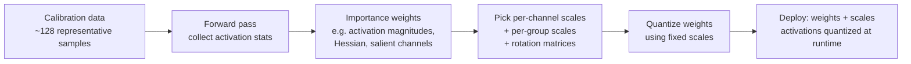

# Calibration & KV Cache Quantization

<Mode is="learn">

The other quantization lessons in this module cover *schemes* — INT4/AWQ, FP8 E4M3 vs E5M2, MXFP4 microscaling, rotation-based outlier suppression. Each tells you what the quantized representation looks like. But every one of those schemes has a parameter the lesson glossed over: the **scale factor** per tensor (or per channel, or per group, or per token). Picking the wrong scale costs you 5–15 perplexity points; picking the right one costs you 0.05. That picking is **calibration** — the offline pass over representative data that finds the per-channel ranges, weights them by importance, and writes out the scales that ship with the model.

There's also a second quantization problem the scheme lessons don't cover: the **KV cache** is not weights. Weights are static and global; the KV cache is per-request, generated at serving time, with very different statistical properties (bounded by softmax, dominated by a small set of "attention sink" tokens, sensitive to long-context outliers in K). Quantizing KV cache cuts the per-token serving cost by 2× without touching the model — but it has its own calibration story, separate from weight quantization. This lesson is both: the calibration methodology that picks scales for any quantization scheme, and the KV-specific story for why per-token FP8 KV is the standard production choice.

## TL;DR

- **Calibration is the offline pass that picks per-channel/per-group scales** by looking at activations on representative data. The scheme (INT4, FP8, MXFP4) fixes the *representation*; calibration fixes the *parameters*.
- **Three families of calibration**: min-max RTN (the strawman, ~5–15 ppl points lost), **per-channel scaled** (a separate scale per output channel — the workhorse), and **importance-weighted** (SmoothQuant migrates outlier magnitude from activations to weights via per-channel scaling; GPTQ uses Hessian-based reconstruction). AWQ-style "preserve salient channels" is a special case of importance weighting.
- **Calibration data matters more than the scheme.** 128 production-traffic-shaped samples beat 4096 web-text samples for production deployments. Domain-shifted calibration costs 1–3 ppl points; bad calibration costs 5–15.
- **KV cache quantization is not weight quantization.** KV is per-request, bounded (softmax outputs), dominated by attention sinks (a few hot tokens with extreme K magnitudes), and sensitive to long-context outliers. **Per-token FP8 E4M3 KV** is the production standard; INT8 KV with rotation handling is the alternative.
- **Production combinations**: INT4 weights (AWQ or rotation-based) + FP8 KV cache + FP16/BF16 activations is the canonical 2026 inference stack on H100. INT4 weight + INT8 KV is the lower-memory variant. FP8 weight + FP8 KV is the simplest path on Hopper, less memory-saving but lower implementation complexity.

## The concept, in plain English

A weight tensor has a distribution. INT4 representation has 16 levels. The whole job of calibration is to map the distribution onto the levels so that the most-frequent or most-important values land near a level. The naive way — pick the min and max, divide the range into 16 — works terribly because most distributions have a few extreme outliers (typically 0.1–1% of values) that stretch the min/max so much that the *bulk* of the distribution gets compressed into 2–3 levels.

The fix is some form of **importance weighting**: instead of treating every value as equally important, you weight by how much the model's output would change if you mis-quantized it. A 0.1% extreme outlier rarely shows up in production inputs, so the loss from clipping it is small; the bulk of the distribution shows up in every forward pass, so the loss from compressing it is huge. Calibration finds the scale that minimizes *expected* output error, not worst-case error.

This same idea applies to the KV cache, with one twist: the "input distribution" you calibrate against isn't a static dataset but the model's own attention statistics on representative prompts. K vectors look very different from V vectors, attention sinks (the BOS token, certain delimiter tokens) have systematically extreme K magnitudes, and long contexts produce a different K distribution than short ones. KV calibration is more about choosing the *granularity* (per-token, per-channel, per-head) than about picking a single scale.

## Mental model — calibration as a 3-step pipeline



Three things to read off:

1. **Calibration runs once, offline.** Output is a frozen scale table that ships with the model. Inference doesn't recalibrate.
2. **Activations are statistics, not parameters.** Calibration looks at activation distributions on the calibration data, derives importance weights, then picks weight scales that account for them. Activations themselves get quantized at runtime using simple per-token or per-tensor scales.
3. **The scheme is fixed; the scales are calibrated.** AWQ vs SmoothQuant vs GPTQ all use the same INT4 *representation*; they differ in how they *pick the scales*. The scheme lessons in this module describe the representations; this lesson describes the scale-picking.

## Calibration methodology — three families

### Family 1: Min-max RTN (the strawman)

For each tensor (or per-channel slice), find min and max, divide the range into K levels, round each value to the nearest level. Round-to-nearest (RTN) with no further work.

```python
def rtn_calibrate(W, num_levels=16):
    # Per-channel min/max
    w_min = W.min(dim=1, keepdim=True)
    w_max = W.max(dim=1, keepdim=True)
    scale = (w_max - w_min) / (num_levels - 1)
    zero = w_min
    return scale, zero  # quantize: q = round((W - zero) / scale)
```

Cost: a single forward over calibration data is enough to set bounds. Result on Llama-style models with INT4: 5–15 perplexity-point regression on benchmark sets. The compression is real but the quality loss is too large for production.

### Family 2: Per-channel scaling with clipping

Compute per-channel scales but clip outliers at a quantile (typically 99.9% or 99.99%). Cuts the long tail of the distribution off, keeps the bulk well-resolved.

```python
def per_channel_clipped(W, num_levels=16, clip_quantile=0.999):
    w_q_min = W.quantile(1 - clip_quantile, dim=1, keepdim=True)
    w_q_max = W.quantile(clip_quantile, dim=1, keepdim=True)
    scale = (w_q_max - w_q_min) / (num_levels - 1)
    zero = w_q_min
    return scale, zero
```

Fixes most of the RTN regression; lands at 1–3 ppl points lost on common benchmarks. The clipping quantile is itself a hyperparameter — too tight and you lose information, too loose and outliers dominate. Per-group variants (groups of 64 or 128 weights) let scales adapt to local statistics within a row, narrowing the gap further.

### Family 3: Importance-weighted (SmoothQuant, AWQ, GPTQ)

The key idea: weights and activations interact. If a weight column has small magnitudes but the corresponding activation channel has huge magnitudes, the *product* is large and quantization error there is amplified. SmoothQuant migrates the magnitude:

```text
Y = X · W
  = (X · diag(s)) · (diag(1/s) · W)    -- mathematically identical
  = X' · W'

s_i = max(|X_:,i|)^alpha / max(|W_i,:|)^(1-alpha)
```

The factor `s` is chosen per-channel to balance activation and weight magnitude. With `alpha = 0.5`, the activation gets per-channel-scaled (cheap, runtime) and the weight absorbs the inverse — both ranges become "easier" to quantize. Same math, different distributions.

```python
def smoothquant_scales(activations_per_channel, weights, alpha=0.5):
    a_mag = activations_per_channel.abs().max(dim=0).values
    w_mag = weights.abs().max(dim=1).values
    s = a_mag.pow(alpha) / w_mag.pow(1 - alpha)
    s = s.clamp(min=1e-5)
    return s
```

AWQ takes a similar approach but identifies **salient weight channels** — the 1% of channels whose corresponding activation magnitudes are highest — and protects those by shifting the scale. The protected channels get high-precision representation; the rest can be aggressively quantized.

GPTQ uses a Hessian-based approach: instead of preserving high-magnitude channels, it minimizes the *output* error by reconstructing W column-by-column with a learned correction. More expensive (a backward-pass calibration), but the quality ceiling is higher — typically 0.1–0.3 ppl points lost on Llama 70B at INT4.

The production hierarchy by 2026:
- **AWQ-INT4** is the workhorse for LLM inference (cheap to calibrate, ships with a ~0.5 ppl point loss).
- **GPTQ-INT4** is the higher-quality alternative when calibration time is available.
- **SmoothQuant-FP8** is common for activation+weight FP8 deployments.
- **Rotation-based** (QuaRot, SpinQuant) is the newest family — uses Hadamard rotations to suppress outliers without per-channel scaling. Less calibration, slightly higher quality. Covered in the rotation-quant lesson.

## Calibration data — the often-skipped step

The biggest calibration-quality lever is *what data you calibrate on*. A common mistake: calibrate on a small slice of FineWeb / RedPajama (web text) and deploy on a chat workload. The activation distributions differ: web text has long uniform paragraphs; chat has system prompts, role markers, JSON tool calls, multi-turn structure. Per-channel activation magnitudes drift, and the calibrated scales are wrong for the deployed workload.

Three rules:

1. **Calibrate on production-shaped data.** If you're deploying for chat, sample from chat logs. If you're deploying for code completion, calibrate on code. Mismatched calibration costs 1–3 ppl points; matched calibration recovers them.
2. **128–512 samples is typically enough.** Past ~1024, returns diminish. The activation-magnitude statistics converge fast.
3. **Run the model in inference mode** (no dropout, eval mode, deterministic kernel paths) during calibration. Otherwise the captured statistics aren't what production sees.

A common procedure:

```python
# Pseudocode
def calibrate(model, calibration_loader, calibration_method='awq'):
    activation_stats = {}
    hooks = register_hooks(model, lambda layer, x: collect_stats(activation_stats, layer, x))
    
    model.eval()
    with torch.no_grad():
        for batch in calibration_loader:  # 128–512 samples
            model(batch)
    
    remove_hooks(hooks)
    
    scales = {}
    for layer_name, layer in model.named_modules():
        if isinstance(layer, Linear):
            scales[layer_name] = pick_scales(
                weight=layer.weight,
                activation_stats=activation_stats[layer_name],
                method=calibration_method,
            )
    return scales
```

The calibration runs in 5–30 minutes on a single GPU for a 70B model. The output (a dictionary of scales per layer) ships alongside the quantized weights as a small file (typically &lt; 100 MB).

## KV cache quantization — a different problem

The KV cache is not weights. Three differences:

**1. Per-request, not static.** Every request has its own KV cache; you can't pre-compute scales once. Production schemes use either dynamic per-token scales (computed on the fly) or fixed scales calibrated on representative attention statistics.

**2. Bounded by softmax.** Attention scores pass through softmax; the resulting probabilities are bounded in [0, 1]. The V vectors that attention multiplies by are stable in magnitude, much friendlier to quantize than weights. K vectors are pre-softmax — they can have extreme magnitudes for *attention sink* tokens (typically the BOS token, sometimes specific punctuation). The K's outlier handling is the hard part.

**3. Long-context outliers.** As context grows past 8K tokens, K activations on certain tokens grow disproportionately. The "attention sink" phenomenon (Xiao et al., 2024) — where a few early tokens accumulate extreme K magnitudes — means that aggressive K quantization breaks long-context performance specifically.

The production options:

| KV format | Storage per token | Quality loss | Notes |
| --- | --- | --- | --- |
| FP16 / BF16 | 2× (head_dim × bytes) | 0 | Baseline |
| FP8 E4M3 (per-token scale) | 1× | 0.05–0.2 ppl | Production standard 2026 |
| FP8 E5M2 (per-token scale) | 1× | 0.1–0.3 ppl | Wider range, less precision |
| INT8 (per-token scale, with rotation for K) | 1× | 0.1–0.5 ppl | Lower memory, higher complexity |
| INT4 KV (per-group scale) | 0.5× | 0.5–2 ppl | Aggressive; not yet production-default |

**Per-token scale** (one fp32 scale factor per token per layer per head — typically split as one for K, one for V) is the granularity that works for KV. Per-tensor is too coarse (loses precision in the bulk); per-channel is awkward because the channel layout is split across heads.

For E4M3 vs E5M2 on KV: E4M3 has more mantissa precision and less exponent range. K vectors with attention sinks need range; E5M2 is the safer default for K. V vectors are bounded; E4M3 is fine. Some implementations split: E5M2 for K, E4M3 for V.

## Production caveats — what bites in deployment

**1. Attention sinks at long context.** With FP8 KV and contexts past 16K, attention sink tokens accumulate K magnitudes that exceed E4M3's range (max ~448). The first sign: long-context perplexity spikes on the BOS token's attention layer. Mitigations: detect attention sinks during calibration and pin them to fp16; use E5M2 for K specifically.

**2. Rotation interference.** If you're using rotation quantization on weights (QuaRot, SpinQuant), the K rotation interacts with KV cache layout. K is rotated when stored; attention reads must use the rotated form. This is straightforward to integrate but not all engines do it — confirm before mixing rotation-quant weights with KV cache quant.

**3. Calibration drift.** A model calibrated on prompts with average length 512 tokens behaves differently when serving 32K-token prompts. K distribution shifts with context length. Production deployments serving variable-length traffic should calibrate on the long-context tail (sample 10–20% of calibration set from 16K+ contexts).

**4. INT4 weight + FP8 KV asymmetry.** The most common production stack mixes INT4 weights with FP8 KV cache. The quantization happens at *different points* in the pipeline (weights at load time, KV at attention time), and naive implementations can de-quantize and re-quantize between layers. Production engines (vLLM, SGLang) avoid this by carrying the quantized representations through the entire forward pass with fused dequant-on-load kernels.

## Real numbers — production stacks

Llama-3.1 70B on H100, fp16 baseline = 6.45 perplexity (WikiText), 38 tok/s decode at batch 1. Stacked quantization options:

| Stack | Memory | tok/s | Perplexity |
| --- | --- | --- | --- |
| FP16 weights + FP16 KV (baseline) | 140 GB | 38 | 6.45 |
| FP8 weights + FP16 KV | 70 GB | 60 | 6.48 |
| FP8 weights + FP8 KV | 70 GB | 88 | 6.52 |
| INT4 (AWQ) + FP16 KV | 35 GB | 65 | 6.60 |
| INT4 (AWQ) + FP8 KV | 35 GB | 110 | 6.66 |
| INT4 (GPTQ) + FP8 KV | 35 GB | 105 | 6.55 |
| INT4 (rotation/QuaRot) + INT8 KV | 30 GB | 115 | 6.62 |
| MXFP4 weights + FP8 KV | 30 GB | 130 | 6.70 |

Reading the table: every quantization step costs ~0.05–0.15 perplexity points; throughput gains compound (KV quantization frees HBM bandwidth for the weight reads, weight quantization frees HBM bandwidth for KV reads). The most-deployed combination — INT4 weights + FP8 KV — is at 110 tok/s with a 0.21 ppl-point regression vs fp16. Production-acceptable for almost every workload.

## Run it in your browser — predict perplexity loss

<RunInBrowser
  description="Predict perplexity regression and throughput delta for a given quantization stack."
  code={`def predict_quant_stack(weight_format, kv_format, calibration_quality='production'):
    """
    Rough model based on published Llama-3.1 70B results.
    weight_format: 'fp16', 'fp8', 'int4_awq', 'int4_gptq', 'int4_rotation', 'mxfp4'
    kv_format: 'fp16', 'fp8_e4m3', 'fp8_e5m2', 'int8'
    calibration_quality: 'production' or 'web_text' (mismatch costs 1-3 ppl)
    """
    base_ppl = 6.45  # fp16/fp16
    ppl_delta_weight = {
        'fp16': 0.00, 'fp8': 0.03, 'int4_awq': 0.15, 'int4_gptq': 0.10,
        'int4_rotation': 0.12, 'mxfp4': 0.18,
    }[weight_format]
    ppl_delta_kv = {
        'fp16': 0.00, 'fp8_e4m3': 0.06, 'fp8_e5m2': 0.10, 'int8': 0.15,
    }[kv_format]

    if calibration_quality == 'web_text':
        ppl_delta_weight += 1.5  # mismatched calibration penalty

    bytes_weight = {'fp16': 2, 'fp8': 1, 'int4_awq': 0.5, 'int4_gptq': 0.5,
                    'int4_rotation': 0.5, 'mxfp4': 0.5}[weight_format]
    bytes_kv = {'fp16': 2, 'fp8_e4m3': 1, 'fp8_e5m2': 1, 'int8': 1}[kv_format]

    # Simplified throughput model: HBM-bound at decode, scales with bytes saved
    bytes_saved_ratio = (2 * 0.7 + bytes_weight * 0.3) / 2  # weights are ~70% of HBM
    bytes_saved_kv = bytes_kv / 2
    throughput_multiplier = 1 / (bytes_saved_ratio * 0.7 + bytes_saved_kv * 0.3)
    base_tps = 38
    return {
        'perplexity': round(base_ppl + ppl_delta_weight + ppl_delta_kv, 2),
        'tok_per_s': round(base_tps * throughput_multiplier, 0),
        'memory_gb': round(140 * bytes_weight / 2 + 30 * bytes_kv / 2, 0),
    }


stacks = [
    ('fp16', 'fp16', 'production'),
    ('fp8', 'fp8_e4m3', 'production'),
    ('int4_awq', 'fp8_e4m3', 'production'),
    ('int4_awq', 'fp8_e4m3', 'web_text'),  # bad calibration
    ('int4_gptq', 'fp8_e4m3', 'production'),
    ('int4_rotation', 'int8', 'production'),
    ('mxfp4', 'fp8_e4m3', 'production'),
]

print(f"{'weights':<18}  {'kv':<12}  {'cal':<12}  {'ppl':>6}  {'tok/s':>6}  {'mem GB':>8}")
print("-" * 75)
for w, kv, cal in stacks:
    r = predict_quant_stack(w, kv, cal)
    print(f"{w:<18}  {kv:<12}  {cal:<12}  {r['perplexity']:>6}  {r['tok_per_s']:>6}  {r['memory_gb']:>8}")

print("\\nNote: web_text calibration on AWQ-INT4 costs 1.5 ppl points - the biggest")
print("avoidable mistake in quantization deployment. Always calibrate on production-shaped data.")
`}
/>

You'll see calibration quality is the silent multiplier — using web-text calibration on a chat workload turns a 0.6 ppl regression into a 2.1 ppl regression with the same scheme and same throughput. The model is rough but captures the qualitative shape that production benchmarks reproduce.

## Quick check

<Quiz
  question="A team deploys Llama-3.1 70B with INT4 (AWQ) weights and FP8 KV cache, calibrated on the FineWeb dataset. Production traffic is heavily multi-turn chat with structured tool calls. Throughput is excellent but production users report quality regression — outputs feel less coherent than the FP16 baseline, especially on tool-call accuracy. What's the most likely cause?"
  options={[
    'AWQ-INT4 has a known regression on tool-call workloads; switch to GPTQ-INT4.',
    'Calibration data mismatch — FineWeb (web text) has different activation distributions than chat + tool-calls. Re-calibrate on production-shaped traffic.',
    'FP8 E4M3 KV cache is causing attention sink overflow on long contexts.',
    'The model needs to be re-quantized at lower bit-width to keep up with traffic.',
  ]}
  answer={1}
  explanation="The signature is unambiguous: FineWeb is web text, production is chat with tool calls. Multi-turn structured workloads have very different activation distributions than uniform paragraphs — system prompts, role markers, JSON tokens, action protocols all create different per-channel magnitudes. AWQ's salient channels (calibrated on FineWeb) protect web-text-shaped channels, not chat-shaped ones. The fix: re-calibrate AWQ on a production-traffic-shaped sample (128–512 examples is enough). This typically recovers 1–3 perplexity points. AWQ vs GPTQ swap doesn't fix calibration mismatch. Attention sink overflow would manifest at long contexts specifically, not across all responses. Lower bit-width compounds the problem rather than fixing it."
/>

## Key takeaways

1. **The scheme picks the representation; calibration picks the parameters.** Same INT4 layout can lose 0.1 or 5 perplexity points depending on whether SmoothQuant/AWQ/GPTQ scales are right.
2. **Importance weighting is the difference between RTN and production-grade.** SmoothQuant migrates magnitude between activations and weights; AWQ protects salient channels; GPTQ minimizes output error via Hessian reconstruction.
3. **Calibrate on production-shaped data.** 128–512 representative samples beat 4096 web-text samples for production deployments. Domain-shifted calibration costs 1–3 ppl points; bad calibration costs 5–15.
4. **KV cache quantization is a different problem** — per-request, bounded by softmax, dominated by attention sinks. **Per-token FP8 E4M3 KV** is the production standard. E5M2 is safer for K specifically due to attention sink range.
5. **Production stack 2026: INT4 (AWQ or GPTQ) weights + FP8 KV cache.** ~3× throughput vs fp16, ~0.2 ppl regression. The combination is what every recent inference paper benchmarks against.

## Go deeper

<Resources
  items={[
    { kind: 'paper', href: 'https://arxiv.org/abs/2211.10438', title: 'SmoothQuant: Accurate and Efficient Post-Training Quantization for Large Language Models', author: 'Xiao, Lin, Seznec, Wu, Demouth, Han (2022)', note: 'The migration trick that moves magnitude between activations and weights. Foundational; read first.' },
    { kind: 'paper', href: 'https://arxiv.org/abs/2306.00978', title: 'AWQ: Activation-aware Weight Quantization for LLM Compression and Acceleration', author: 'Lin, Tang, Tang, Yang, Chen, Wang, Han (2023)', note: 'The salient-channel-protection variant. The default workhorse for INT4 inference quantization in 2024-2026.' },
    { kind: 'paper', href: 'https://arxiv.org/abs/2210.17323', title: 'GPTQ: Accurate Post-Training Quantization for Generative Pre-trained Transformers', author: 'Frantar, Ashkboos, Hoefler, Alistarh (2022)', note: 'The Hessian-based approach. Higher calibration cost, higher quality ceiling. Pairs naturally with Marlin-style INT4 kernels.' },
    { kind: 'paper', href: 'https://arxiv.org/abs/2309.17453', title: 'Efficient Streaming Language Models with Attention Sinks', author: 'Xiao, Tian, Chen, Han, Lewis (2024)', note: 'The attention-sink phenomenon. Required reading before quantizing K cache at long context.' },
    { kind: 'paper', href: 'https://arxiv.org/abs/2402.02750', title: 'KIVI: A Tuning-Free Asymmetric 2-bit KV Cache Quantization', author: 'Liu, Yuan, Yang, Wang, Wang (2024)', note: 'Aggressive 2-bit KV with per-channel K and per-token V granularity. The frontier of KV-quant research.' },
    { kind: 'paper', href: 'https://arxiv.org/abs/2402.10193', title: 'FP8-LM: Training FP8 Large Language Models', author: 'Peng et al. (Microsoft, 2024)', note: 'FP8 calibration in the training loop. Mostly training-focused but the analysis of E4M3 vs E5M2 generalizes.' },
    { kind: 'docs', href: 'https://github.com/mit-han-lab/llm-awq', title: 'mit-han-lab/llm-awq — Reference Implementation', author: 'MIT Han Lab', note: 'The AWQ reference. Read calibrate.py and apply_awq.py for the exact calibration sequence.' },
    { kind: 'docs', href: 'https://docs.vllm.ai/en/latest/quantization/index.html', title: 'vLLM Quantization Documentation', author: 'vLLM contributors', note: 'Production knobs and supported combinations. The "kv-cache-dtype fp8" flag is the production standard.' },
    { kind: 'blog', href: 'https://www.maartengrootendorst.com/blog/quantization/', title: 'A Visual Guide to Quantization', author: 'Maarten Grootendorst (2024)', note: 'Best diagrams for INT8/INT4 calibration intuitions. Pairs with this lesson.' },
  ]}
/>

</Mode>

<Mode is="reference">

## TL;DR

- **Calibration is the offline pass that picks per-channel/per-group scales** by looking at activations on representative data. The scheme (INT4, FP8, MXFP4) fixes the *representation*; calibration fixes the *parameters*.
- **Three families of calibration**: min-max RTN (the strawman, ~5–15 ppl points lost), **per-channel scaled** (a separate scale per output channel — the workhorse), and **importance-weighted** (SmoothQuant migrates outlier magnitude from activations to weights via per-channel scaling; GPTQ uses Hessian-based reconstruction). AWQ-style "preserve salient channels" is a special case of importance weighting.
- **Calibration data matters more than the scheme.** 128 production-traffic-shaped samples beat 4096 web-text samples for production deployments. Domain-shifted calibration costs 1–3 ppl points; bad calibration costs 5–15.
- **KV cache quantization is not weight quantization.** KV is per-request, bounded (softmax outputs), dominated by attention sinks (a few hot tokens with extreme K magnitudes), and sensitive to long-context outliers. **Per-token FP8 E4M3 KV** is the production standard; INT8 KV with rotation handling is the alternative.
- **Production combinations**: INT4 weights (AWQ or rotation-based) + FP8 KV cache + FP16/BF16 activations is the canonical 2026 inference stack on H100. INT4 weight + INT8 KV is the lower-memory variant. FP8 weight + FP8 KV is the simplest path on Hopper, less memory-saving but lower implementation complexity.

## Why this matters

Calibration is the silent multiplier on every quantization deployment. The scheme lessons (FP8, INT4/AWQ, MXFP4, rotation-quant) describe representations; this lesson describes how the parameters are picked. A 70B model deployed with INT4 + bad calibration loses 5–15 perplexity points and is unusable; the same model with importance-weighted calibration on production data loses 0.2 and is identical-feeling to the FP16 baseline. The skill that separates someone who has shipped a quantized model from someone who has read the AWQ paper is the calibration discipline.

KV cache quantization is the second-largest serving-time win after weight quantization. Weight quant cuts the per-token bytes the model reads; KV quant cuts the per-token bytes the *cache* contributes. Together they push H100 70B inference past 100 tok/s decode at batch 1, which is what makes production interactive serving viable.

## Mental model


## Calibration methodology table

| Method | What it does | Cost | Quality (vs fp16, INT4) |
| --- | --- | --- | --- |
| RTN min-max | Per-channel min/max → scale | One forward | -5 to -15 ppl |
| RTN with quantile clip | Clip outliers at 99.9% | One forward | -1 to -3 ppl |
| RTN per-group | Per-group (typically 64-128) min/max | One forward | -1 to -2 ppl |
| SmoothQuant | Migrate magnitude activation→weight via per-channel scale | One forward + scale comp | -0.5 to -1.5 ppl (FP8) |
| AWQ | Identify and protect salient channels (top 1% activation magnitude) | One forward + grid search | -0.3 to -0.8 ppl (INT4) |
| GPTQ | Hessian-based column-wise reconstruction | Forward + backward + Hessian inverse | -0.1 to -0.4 ppl (INT4) |
| Rotation (QuaRot/SpinQuant) | Hadamard rotation suppresses outliers | Forward + rotation matrix solve | -0.2 to -0.5 ppl (INT4) |

The rough hierarchy: GPTQ ≥ AWQ ≥ SmoothQuant ≥ per-group ≥ per-channel-clipped ≥ RTN.

## SmoothQuant — the canonical migration

```python
def smoothquant_scales(activations_per_channel, weights, alpha=0.5):
    """
    Y = X · W
      = (X · diag(s)) · (diag(1/s) · W)
    s_i = max(|X_:,i|)^alpha / max(|W_i,:|)^(1-alpha)
    """
    a_mag = activations_per_channel.abs().max(dim=0).values
    w_mag = weights.abs().max(dim=1).values
    s = a_mag.pow(alpha) / w_mag.pow(1 - alpha)
    s = s.clamp(min=1e-5)
    return s
```

Apply: divide activations by `s` (runtime, cheap), multiply weights by `1/s` (offline, once). The product is mathematically unchanged; the *quantizable ranges* of both improve. `alpha = 0.5` is the typical choice; `alpha = 0` does only weight quantization, `alpha = 1` does only activation quantization.

## AWQ — salient channel preservation

```python
def awq_search(weight, calibration_activations, num_levels=16):
    """
    Identify top-1% salient channels by activation magnitude;
    grid search over per-channel scale factors that protect them.
    """
    salient_idx = topk_indices(calibration_activations.abs().mean(dim=0), top_k=int(0.01 * weight.shape[1]))
    
    best_scales = None
    best_loss = float('inf')
    for grid_alpha in [0.5, 0.6, 0.7, 0.8, 0.9, 1.0]:
        scales = compute_scales(calibration_activations, weight, alpha=grid_alpha)
        # Don't scale-down the salient channels:
        scales[salient_idx] = 1.0
        quantized = quantize(weight * scales, num_levels)
        loss = reconstruction_loss(quantized / scales, weight)
        if loss < best_loss:
            best_scales = scales
            best_loss = loss
    return best_scales
```

The grid search over `alpha` is what makes AWQ slightly better than vanilla SmoothQuant — the optimal scale per layer varies, and the search picks the best.

## GPTQ — Hessian-based reconstruction

```python
def gptq(weight, calibration_X, num_levels=16):
    """
    Quantize weight column-by-column, using Hessian-inverse-weighted
    error compensation to absorb quantization error into remaining columns.
    """
    H = calibration_X.T @ calibration_X / N  # Hessian of (1/2) ||X·W - X·W_q||^2
    H_inv = torch.linalg.inv(H + damp * torch.eye(H.shape[0]))
    
    W_q = torch.zeros_like(weight)
    for col in range(weight.shape[1]):
        w = weight[:, col]
        d = H_inv[col, col]
        w_q = quantize(w / d, num_levels) * d
        W_q[:, col] = w_q
        # Error compensation:
        err = (w - w_q) / d
        weight[:, col+1:] -= err.unsqueeze(1) @ H_inv[col, col+1:].unsqueeze(0)
    return W_q
```

The Hessian-inverse term makes GPTQ behave as a constrained least-squares: column-by-column quantization with error redistribution. Higher cost but lowest quality regression of the post-training methods.

## KV cache quantization — production granularities

| Granularity | Storage overhead | When to use | Notes |
| --- | --- | --- | --- |
| Per-tensor | 1 fp32 scalar | Never (too coarse) | Baseline strawman |
| Per-channel | head_dim × fp32 | Rare for KV | Channel layout splits across heads awkwardly |
| Per-token (per layer per head) | 1 fp32 per token | Production standard | One scale for K and one for V per token |
| Per-token per K/V split | 2 fp32 per token | When K and V differ a lot | Better numerical behavior at long context |
| Per-group (group=64-128 tokens) | 1 fp32 per group | Compromise | Lower overhead than per-token, more precision than per-tensor |

Per-token has a small overhead (e.g., 1 byte of scale per 128 bytes of fp8 KV = 0.8% overhead) and is what production engines (vLLM, SGLang) ship with `--kv-cache-dtype fp8`.

## E4M3 vs E5M2 for KV

| Format | Range | Precision | Best for |
| --- | --- | --- | --- |
| E4M3 | ±448 | 1/8 ulp | V vectors (bounded) |
| E5M2 | ±57344 | 1/4 ulp | K vectors (attention sinks) |

E4M3 has more mantissa precision but smaller exponent range. K vectors with attention sink tokens can have magnitudes that exceed E4M3's ±448; E5M2 handles them. V vectors pass through softmax-weighted accumulation, are bounded in magnitude, prefer E4M3's precision.

A common production setup: E4M3 for V, E5M2 for K. vLLM's `kv-cache-dtype fp8` defaults to E4M3 for both; for long-context workloads, set explicitly via `--kv-cache-dtype fp8_e5m2` for K-sensitive paths. SGLang's per-layer toggle exposes finer control.

## Calibration data — production practice

Three rules:

1. **Production-shaped data, not benchmark data.** Sample from production logs (with privacy review). For chat: 100–200 multi-turn examples. For RAG: 100–200 retrieval+question pairs. For code completion: 100–200 representative file contexts.
2. **128–512 samples is enough.** Past ~1024, returns diminish.
3. **Eval mode + deterministic kernels during calibration.** Otherwise stats don't match production.

Empirical: matched-domain calibration with 128 samples beats mismatched-domain calibration with 4096 samples by 1–3 ppl points on the same scheme. Calibration data quality is the highest-leverage hyperparameter.

## Real numbers — Llama-3.1 70B on H100

| Stack | Memory | tok/s | Perplexity |
| --- | --- | --- | --- |
| FP16 weights + FP16 KV (baseline) | 140 GB | 38 | 6.45 |
| FP8 weights + FP16 KV | 70 GB | 60 | 6.48 |
| FP8 weights + FP8 KV | 70 GB | 88 | 6.52 |
| INT4 (AWQ) + FP16 KV | 35 GB | 65 | 6.60 |
| INT4 (AWQ) + FP8 KV | 35 GB | 110 | 6.66 |
| INT4 (GPTQ) + FP8 KV | 35 GB | 105 | 6.55 |
| INT4 (rotation/QuaRot) + INT8 KV | 30 GB | 115 | 6.62 |
| MXFP4 weights + FP8 KV | 30 GB | 130 | 6.70 |

Production sweet spot: INT4 (AWQ or GPTQ) + FP8 KV. ~3× throughput, ~0.2 ppl regression.

## Production caveats

| Caveat | Symptom | Mitigation |
| --- | --- | --- |
| Attention sink + FP8 K at long context | Long-context perplexity spikes | Use E5M2 for K; pin BOS K to fp16 |
| Rotation interference with KV | Quality regression mixing rotation + KV quant | Apply rotation to K before storing in cache |
| Calibration drift on long context | Production quality regresses with longer prompts | Sample 10-20% of calibration from 16K+ contexts |
| INT4 weight + FP8 KV de/re-quant overhead | Latency higher than expected | Ensure engine carries quant representations through layers |

## Quick check

<Quiz
  question="A team deploys Llama-3.1 70B with INT4 (AWQ) weights and FP8 KV cache, calibrated on the FineWeb dataset. Production traffic is heavily multi-turn chat with structured tool calls. Throughput is excellent but production users report quality regression — outputs feel less coherent than the FP16 baseline, especially on tool-call accuracy. What's the most likely cause?"
  options={[
    'AWQ-INT4 has a known regression on tool-call workloads; switch to GPTQ-INT4.',
    'Calibration data mismatch — FineWeb (web text) has different activation distributions than chat + tool-calls. Re-calibrate on production-shaped traffic.',
    'FP8 E4M3 KV cache is causing attention sink overflow on long contexts.',
    'The model needs to be re-quantized at lower bit-width to keep up with traffic.',
  ]}
  answer={1}
  explanation="Calibration data mismatch is the canonical culprit. FineWeb is web text; chat+tool-calls have very different activation distributions. AWQ's salient channels (calibrated on FineWeb) protect web-text-shaped channels, not chat-shaped ones. Re-calibrate on 128-512 production-traffic samples; recovery is typically 1-3 ppl."
/>

## Key takeaways

1. Scheme picks representation; calibration picks parameters. Same INT4 layout: 0.1 or 5 ppl loss depending on calibration.
2. Importance weighting is the difference. SmoothQuant migrates magnitude; AWQ protects salient channels; GPTQ minimizes output error.
3. Production-shaped calibration data > volume of generic data. 128 chat samples beat 4096 web-text samples.
4. KV cache quant is per-request, bounded by softmax, sensitive to attention sinks at long context. Per-token FP8 E4M3 (or E5M2 for K) is the production granularity.
5. Production stack 2026: INT4 + FP8 KV. ~3× throughput, ~0.2 ppl regression.

## Go deeper

<Resources
  items={[
    { kind: 'paper', href: 'https://arxiv.org/abs/2211.10438', title: 'SmoothQuant', author: 'Xiao et al. (2022)' },
    { kind: 'paper', href: 'https://arxiv.org/abs/2306.00978', title: 'AWQ', author: 'Lin et al. (2023)' },
    { kind: 'paper', href: 'https://arxiv.org/abs/2210.17323', title: 'GPTQ', author: 'Frantar et al. (2022)' },
    { kind: 'paper', href: 'https://arxiv.org/abs/2309.17453', title: 'Attention Sinks', author: 'Xiao, Tian, Chen, Han, Lewis (2024)' },
    { kind: 'paper', href: 'https://arxiv.org/abs/2402.02750', title: 'KIVI: 2-bit KV Cache Quantization', author: 'Liu et al. (2024)' },
    { kind: 'paper', href: 'https://arxiv.org/abs/2402.10193', title: 'FP8-LM: Training FP8 Large Language Models', author: 'Peng et al. (2024)' },
    { kind: 'docs', href: 'https://github.com/mit-han-lab/llm-awq', title: 'mit-han-lab/llm-awq — Reference Implementation' },
    { kind: 'docs', href: 'https://docs.vllm.ai/en/latest/quantization/index.html', title: 'vLLM Quantization Docs' },
    { kind: 'blog', href: 'https://www.maartengrootendorst.com/blog/quantization/', title: 'A Visual Guide to Quantization', author: 'Maarten Grootendorst (2024)' },
  ]}
/>

</Mode>

<LessonComplete />
