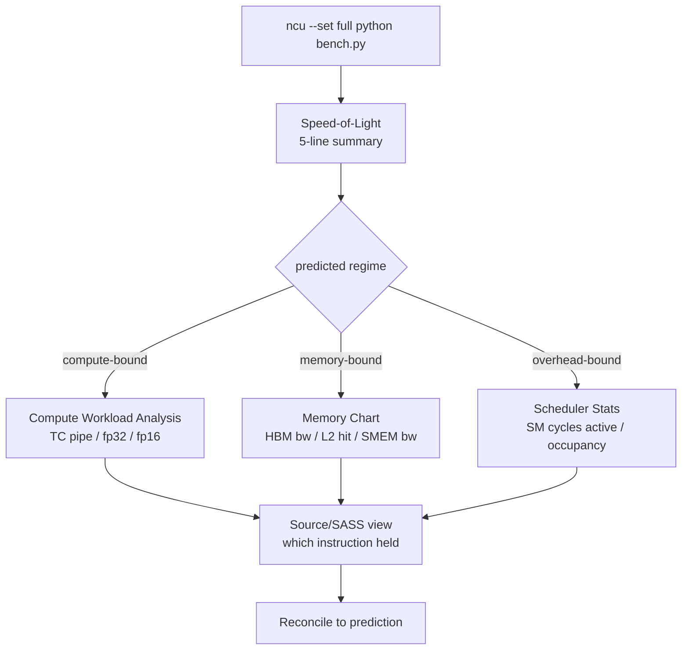

# Nsight Compute: The Metric Tree

<Mode is="learn">

In a managed-runtime language, when something is slow you reach for a sampling profiler — flame graphs, hot functions, percentages of wall time. GPUs are a different machine and demand a different tool. **Nsight Compute** (NCU) is not a sampler. It is a *hardware counter reader* that runs the kernel under controlled conditions, captures every counter on every SM, and returns a structured report. The mental shift is from "where did time go?" to "which resource was saturated, and which was idle?"

The catch is that NCU exposes around two thousand metrics, and a fresh user staring at `--set full` output will drown. The senior workflow is the opposite: you arrive with a *prediction* (the kernel should be HBM-bound at 71% of peak), and NCU is the instrument you use to confirm or refute it. This lesson is the curated subset — the eight metrics that almost every inference-team perf review actually reads, and the structured walk through an NCU report that answers the question you asked before opening it.

## TL;DR

- NCU is a **hardware counter reader**, not a sampling profiler. Run a kernel under `ncu --set full` and you get a structured report with the **Speed-of-Light** summary, memory chart, scheduler stats, and per-warp instruction mix.
- The **Speed-of-Light section** is the regime confirmation. Five percentages tell you whether you hit the ceiling you predicted: compute (fp32 / fp16 / TC pipes), memory (HBM, L2), or neither (overhead-bound).
- The **eight metrics that matter** for inference work: `sm__pipe_tensor_op_hmma_cycles_active`, `dram__bytes.sum.per_second`, `lts__t_bytes.sum.per_second`, `sm__warps_active.avg.pct_of_peak_sustained_active`, `sm__cycles_active.avg.pct_of_peak_sustained_elapsed`, `smsp__average_warps_issue_stalled_long_scoreboard`, `l1tex__data_bank_conflicts_pipe_lsu_mem_shared`, and `launch__registers_per_thread`.
- Workflow: predict → `ncu --set full` → read Speed-of-Light → confirm regime → drill into one section (memory chart, scheduler stalls, or instruction mix) → reconcile every gap. Production teams trim with `--metrics` once the predicate is set.
- The verification step is what makes the roofline a working tool, not a citation. NCU is to a kernel author what a debugger is to a backend engineer — non-optional.

## The concept, in plain English

A modern GPU has hundreds of independent counters: how many wgmma instructions executed, how many bytes left HBM, how many cycles each scheduler spent stalled, how many bank conflicts occurred per SMEM load. NCU stops the kernel between executions, reads every counter, and turns the raw numbers into a hierarchical metric tree. Each metric has a stable name like `sm__pipe_tensor_op_hmma_cycles_active.avg.pct_of_peak_sustained_active` — the prefix tells you which hardware unit (`sm__pipe_tensor_op` is the Tensor Core pipe), the middle tells you the counter (`cycles_active`), and the suffix tells you the aggregation (`pct_of_peak_sustained_active` is the % of theoretical peak while the unit was running).

The metric tree's job is to make every claim about kernel performance a *named, auditable* number. "The kernel is memory-bound" is a sentence; "kernel achieved 71% of HBM3 peak per `dram__bytes.sum.per_second`" is the same sentence with a citation that another engineer can reproduce.

## Mental model — the report's structure



Every NCU drill-down terminates in the source view, where you see which line of Triton or CUDA emitted which SASS instruction and what its stall reason was. That's where "the kernel is slow" turns into "this load on line 47 is stalled on long-scoreboard 38% of the time because the previous TMA hasn't completed."

## The Speed-of-Light section — your first read

When NCU's report opens, the first section is **Speed-of-Light** (SOL). It's the executive summary: five percentages that confirm or refute your regime prediction.

```text
GPU Speed Of Light Throughput
────────────────────────────────────────────────────────
Compute (SM)         %  of Peak  74.2
Memory               %  of Peak  18.4
DRAM Throughput      %  of Peak  16.1
L1/TEX Cache         %  of Peak  64.7
L2 Cache             %  of Peak  41.2

SM Active Cycles                 89.3   % of elapsed
Tensor Core Active               68.4   % of peak sustained
```

How to read this:

- **Compute % at 74, Memory % at 18** → kernel is compute-bound. The 74 is the ceiling that limits this kernel; the 18 means HBM has lots of headroom. Production GEMM at training scale lives here.
- **Compute % at 14, DRAM at 71** → kernel is HBM-bound. The 71% of HBM peak is exactly what well-tuned decode kernels (Marlin INT4 GEMV) achieve. Switching kernels to push compute will not help.
- **Both Compute and Memory low (e.g., 8% / 11%)** with **SM Active Cycles below 50%** → kernel is overhead-bound or starving for work. The fix is launch reduction (CUDA Graphs, fusion, larger batches), not kernel optimization.
- **Tensor Core Active at 68%** in a kernel you expected to use TCs → healthy. Below 30% means the kernel is not on wgmma; see the Tensor Core SHAPE Constraints lesson.

The first 30 seconds of every NCU read should be SOL alone. If SOL contradicts your prediction, that's the lesson — go back to the AI computation, find what you mis-modeled, and update your mental ceiling before drilling further.

## The eight metrics that matter

NCU exposes about two thousand metrics. These eight cover 90% of practical inference perf work:

| # | Metric | What it tells you | Healthy range |
| --- | --- | --- | --- |
| 1 | `sm__pipe_tensor_op_hmma_cycles_active.avg.pct_of_peak_sustained_active` | fp16/bf16 Tensor Core utilization | 60–85% (compute-bound) |
| 2 | `sm__pipe_tensor_op_imma_cycles_active.avg.pct_of_peak_sustained_active` | fp8/int8 Tensor Core utilization | 60–85% (fp8 kernels) |
| 3 | `dram__bytes.sum.per_second` | Achieved HBM bandwidth (bytes/s) | 65–85% of 3.35 TB/s |
| 4 | `lts__t_bytes.sum.per_second` | Achieved L2 cache bandwidth | varies; investigate when high |
| 5 | `sm__warps_active.avg.pct_of_peak_sustained_active` | Occupancy (active warps) | 50–100%; under 25% needs investigation |
| 6 | `sm__cycles_active.avg.pct_of_peak_sustained_elapsed` | SM activity ratio (idle indicator) | over 80%; under 50% means starving |
| 7 | `smsp__average_warps_issue_stalled_long_scoreboard_per_issue_active.ratio` | Memory-stall fraction per issue | under 0.3 healthy; over 0.6 means memory wait |
| 8 | `l1tex__data_bank_conflicts_pipe_lsu_mem_shared_op_ld.sum` | SMEM bank conflict count | should be 0 or near-zero |

Memorize the prefixes. `sm__pipe_*` is execution units. `dram__*` is HBM. `lts__*` is L2. `l1tex__*` is L1 / SMEM. `smsp__*` is per-sub-partition (the warp scheduler level). `launch__*` is per-launch metadata. With those five prefixes you can navigate the metric tree without a search.

## Concrete walkthrough — three kernels, three reads

### Kernel A: Triton matmul at training scale (4096³ fp16)

You predicted compute-bound at 78% of TC peak. NCU reports:

```text
GPU Speed Of Light Throughput
Compute (SM)            72.4   % of Peak
Tensor Core Active      71.8   % of peak sustained
DRAM Throughput          8.3   % of Peak
SM Active Cycles        93.1   % of elapsed
sm__warps_active        67     % of peak sustained
```

Reading: TC at 71.8% is a healthy production landing — slightly below your 78% prediction but inside the band. DRAM at 8.3% confirms compute-bound; HBM has headroom you can't use. SM Active 93% means no idle. Occupancy 67% suggests register pressure is moderate; check `launch__registers_per_thread` — if it's 248, you're against the per-thread cap and the autotuner picked a config that can't fit more warps. Possible 5–7-point gain by autotuning a smaller tile that lifts occupancy. Reconciliation: prediction within 7 points of measured, gap explained by occupancy.

### Kernel B: Marlin INT4 GEMV during decode (1 × 28672 × 8192)

You predicted HBM-bound at 70% of HBM peak. NCU reports:

```text
GPU Speed Of Light Throughput
Compute (SM)             4.2   % of Peak
Tensor Core Active       0.0   % of peak sustained
DRAM Throughput         71.6   % of Peak
L1/TEX Cache             8.4   % of Peak
SM Active Cycles        89.7   % of elapsed
```

Reading: TC at 0% is correct (Marlin uses CUDA-core ALUs for the INT4 dequant, not TC). DRAM at 71.6% lands exactly on prediction. Compute at 4% is correct for an HBM-bound kernel. The kernel is doing exactly what it should. The next perf lever is *not* kernel work — it is reading less (FP4 weights, KV-cache compression) or batching more (continuous batching). Reconciliation: perfect.

### Kernel C: Spec-decoding verifier (32-token batch)

You predicted overhead-bound. NCU reports:

```text
GPU Speed Of Light Throughput
Compute (SM)             6.8   % of Peak
DRAM Throughput          7.2   % of Peak
SM Active Cycles        38.4   % of elapsed
sm__warps_active        14     % of peak sustained
```

Reading: both Compute and DRAM low; SM Active at 38% confirms the GPU is *idle* most of the wall time. Occupancy at 14% is catastrophic. The kernel is running, but the chip is starving for work — kernel launches and host sync dominate. The fix is not optimizing the kernel body; it is **launching less often**. CUDA Graphs to capture the spec-decode loop, or fusing draft+verify into one larger kernel, or running multiple draft chains in parallel. Reconciliation: prediction confirmed, lever identified.

## The memory chart — the second read

If the kernel is memory-bound (DRAM % > Compute %), NCU's **Memory Workload Analysis** section breaks down where bandwidth went:

```text
Memory Throughput
────────────────────────────────────────────────────────
DRAM Bandwidth         71.6 %     2399 GB/s of 3350 GB/s
L2 Cache Hit Rate      52.4 %
L1/TEX Hit Rate        48.7 %
Shared Memory BW       64.8 %     of peak per SM
SMEM Bank Conflicts        12 events / kernel
```

Diagnostic moves:

- **Low L2 hit rate (under 30%)** with high DRAM → access pattern doesn't reuse cache lines. Common cause: tile shape doesn't match L2 line size; transposed inputs without coalesce.
- **High L1/TEX hit + high SMEM BW** → kernel is using shared memory well; bank conflicts under 50/kernel are usually fine.
- **Bank conflicts above 1000** → SMEM swizzle pattern is wrong. The kernel is serializing accesses that should be parallel. Fix is the SMEM layout pragma in CUTLASS or the tile alignment in Triton.
- **DRAM bandwidth well below SOL but stalls high** → the kernel is waiting on HBM but not saturating it. Often a TMA pipeline depth issue (`num_stages` in Triton too low; should be 3–4 for Hopper).

The memory chart is the canonical lookup for "why is HBM only at 40% when the workload should saturate it."

## The scheduler stats — when neither ceiling is high

When SOL shows both Compute and Memory low but SM Active is high, look at scheduler stats:

```text
Warp Scheduler Stats
────────────────────────────────────────────────────────
Active warps per scheduler            4.8   (max 8)
Eligible warps per cycle              0.6
Issue rate                            38.4 %

Stall reasons (% of stalled cycles)
  Long Scoreboard                     42.1 %
  Short Scoreboard                    18.2 %
  Wait                                14.7 %
  Branch Resolving                     6.8 %
  No Instruction                       4.2 %
  Other                               14.0 %
```

Reading the stalls:

- **Long Scoreboard (memory wait)** dominates → the kernel is waiting for HBM/L2 returns. If DRAM SOL is low too, the issue is *latency hiding*, not bandwidth. The fix is more pipeline stages or higher occupancy.
- **Short Scoreboard (math wait)** dominates → consumer warps waiting on producer warps; usually warp-specialization pipeline issue.
- **Wait** dominates → explicit `__syncthreads()` or mbarrier waits. Often means the producer/consumer balance is off; one warp group is doing more work than the other.
- **No Instruction** dominates → instruction cache miss or branch divergence. Rare in modern kernels.
- **Branch Resolving** dominates → unpredictable branches. Fix with predication or removing the branch.

Stall reasons are the second deepest read in NCU. They turn "this kernel is slow" into "scheduler `s0` was stalled on long-scoreboard 42% of the time, here is the line." That's the level a kernel author needs.

## Run it in your browser — diagnose from a synthetic NCU summary

<RunInBrowser
  description="Given Speed-of-Light numbers, identify the regime and the next move."
  code={`def diagnose(sol):
    """
    sol: dict with keys 'compute_pct', 'dram_pct', 'tc_pct',
                       'sm_active_pct', 'occupancy_pct'
    """
    c, m, tc = sol['compute_pct'], sol['dram_pct'], sol['tc_pct']
    sm_active, occ = sol['sm_active_pct'], sol['occupancy_pct']

    if sm_active < 50:
        return ("OVERHEAD-BOUND",
                "GPU idle most of wall time. Launch CUDA Graphs, fuse, batch more.")

    if max(c, tc) > m + 20:
        if tc < 30 and c > 30:
            return ("COMPUTE-BOUND on CUDA cores (NOT Tensor Core)",
                    "Tile shape misses wgmma. Check per-warpgroup m=64 invariant.")
        return (f"COMPUTE-BOUND ({tc}% TC peak)",
                "Lever: tile autotune for higher TC%; check register pressure.")

    if m > c + 20:
        return (f"HBM-BOUND ({m}% of HBM peak)",
                "Lever: read less (quantization, fusion, KV cache).")

    if occ < 25:
        return ("LOW-OCCUPANCY",
                "Register pressure too high; smaller tile or num_warps reduction.")

    return ("MIXED — drill into stall reasons next",
            "Look at scheduler stats: long-scoreboard / short-scoreboard / wait.")


cases = [
    ("Triton GEMM 4096^3 fp16",
        dict(compute_pct=72, dram_pct=8, tc_pct=72, sm_active_pct=93, occupancy_pct=67)),
    ("Marlin INT4 decode",
        dict(compute_pct=4, dram_pct=72, tc_pct=0, sm_active_pct=90, occupancy_pct=88)),
    ("Spec-decode verifier 32 tok",
        dict(compute_pct=7, dram_pct=7, tc_pct=4, sm_active_pct=38, occupancy_pct=14)),
    ("Triton matmul BLOCK_M=32 trap",
        dict(compute_pct=44, dram_pct=11, tc_pct=22, sm_active_pct=88, occupancy_pct=72)),
    ("Naive PyTorch attention",
        dict(compute_pct=10, dram_pct=22, tc_pct=8, sm_active_pct=83, occupancy_pct=51)),
]
for name, sol in cases:
    regime, lever = diagnose(sol)
    print(f"{name:<35}\\n  {regime}\\n  Next: {lever}\\n")
`}
/>

You will see the BLOCK_M=32 trap show up as "COMPUTE-BOUND on CUDA cores" — Compute % at 44 with TC % only at 22 means the kernel is busy on the wrong pipe. The naive attention case lands in MIXED — neither bound saturated, drill into stall reasons next. Practical: print SOL, run it through this kind of decision tree, then open the section the tree pointed to.

## The production workflow

For a one-shot review, `--set full` is fine. For a perf sweep across many configurations, narrow:

```bash
# One-shot deep dive
ncu --set full --kernel-name fused_rmsnorm_mm python bench.py

# Production sweep — trim to the metrics that matter
ncu --metrics sm__pipe_tensor_op_hmma_cycles_active.avg.pct_of_peak_sustained_active,\\
              dram__bytes.sum.per_second,\\
              lts__t_bytes.sum.per_second,\\
              sm__warps_active.avg.pct_of_peak_sustained_active,\\
              sm__cycles_active.avg.pct_of_peak_sustained_elapsed,\\
              smsp__average_warps_issue_stalled_long_scoreboard_per_issue_active.ratio,\\
              l1tex__data_bank_conflicts_pipe_lsu_mem_shared_op_ld.sum,\\
              launch__registers_per_thread \\
    --kernel-name fused_rmsnorm_mm \\
    --csv -o ncu_sweep \\
    python bench_sweep.py
```

The CSV output drops into a pandas DataFrame; you sort by TC % to pick the winning autotune config and verify there were no regressions. This is the loop that lands a perf-cited PR in vLLM or SGLang: bench → ncu → CSV → table → claim with citation.

## Quick check

<Quiz
  question="An NCU report on a Triton attention kernel shows: Compute SOL 28%, DRAM SOL 19%, Tensor Core Active 22%, SM Active Cycles 91%, occupancy 64%, scheduler stall on long-scoreboard 51%. Which diagnosis is most likely?"
  options={[
    'Kernel is HBM-bound — the 19% DRAM SOL is the ceiling.',
    'Kernel is compute-bound on CUDA cores — TC missed and the kernel ran on fp32 ALUs.',
    'Kernel is hiding HBM latency poorly — long-scoreboard stalls dominate, but DRAM SOL is low. Increase pipeline stages or occupancy.',
    'Kernel is overhead-bound — SM Active is 91% so it cannot be running a real workload.',
  ]}
  answer={2}
  explanation="SM Active at 91% rules out overhead-bound (the GPU is busy). Both Compute and DRAM are below 30% — neither ceiling is saturated. The 51% long-scoreboard stalls plus low DRAM SOL means warps are waiting for memory returns but not saturating the pipe — a classic latency-hiding gap, not a bandwidth gap. The fix is more pipeline stages (Triton num_stages 3 or 4 on Hopper) or higher occupancy to give the scheduler more in-flight work. Compute-bound on CUDA cores would show high fp32 pipe activity which isn't here."
/>

## Key takeaways

1. **NCU is a counter reader, not a sampler.** Run a kernel under controlled conditions; NCU returns the structured hardware truth.
2. **Speed-of-Light is your first read.** Five percentages confirm or refute your regime prediction in 30 seconds. If SOL contradicts the prediction, fix the prediction before drilling.
3. **Eight metrics cover 90% of inference perf work.** Memorize the prefixes: `sm__pipe_*`, `dram__*`, `lts__*`, `l1tex__*`, `smsp__*`, `launch__*`.
4. **Each regime has its drill-down section.** Compute → Compute Workload Analysis. Memory → Memory Chart. Mixed/idle → Scheduler Stats with stall reasons.
5. **The output of NCU is a citation, not a vibe.** Every claim about a kernel's performance ends in a named metric and a number. That citation is what makes a perf PR credible to maintainers.

## Go deeper

<Resources
  items={[
    { kind: 'docs', href: 'https://docs.nvidia.com/nsight-compute/ProfilingGuide/index.html', title: 'Nsight Compute Profiling Guide', author: 'NVIDIA', note: 'The complete reference. Read the Speed-of-Light, Memory Workload Analysis, and Warp State sections in full once.' },
    { kind: 'docs', href: 'https://docs.nvidia.com/nsight-compute/CustomizationGuide/index.html#metric-decoder', title: 'NCU Metric Decoder', author: 'NVIDIA', note: 'How to parse a metric name. Bookmark this; you will reference it for the rest of your career.' },
    { kind: 'docs', href: 'https://docs.nvidia.com/cuda/hopper-tuning-guide/', title: 'Hopper Tuning Guide', author: 'NVIDIA', note: 'Section 4 maps Hopper-specific tuning recommendations to NCU metrics. The bridge from "what to look for" to "what to do."' },
    { kind: 'blog', href: 'https://horace.io/brrr_intro.html', title: 'Making Deep Learning Go Brrrr From First Principles', author: 'Horace He', note: 'The roofline lens that NCU verifies. Re-read alongside this lesson.' },
    { kind: 'paper', href: 'https://arxiv.org/abs/2402.13499', title: 'Outperforming cuBLAS on H100 — Worked Example', author: 'Shankhdhar et al. (Hazy Research, 2024)', note: 'A real Hopper kernel walked through with NCU metrics in the appendix. The verification half done well.' },
    { kind: 'video', href: 'https://www.youtube.com/watch?v=Q-OeZ0CxnyU', title: 'GPU MODE — Profiling Talk', author: 'GPU MODE community (2024)', note: 'A working demonstration of NCU on real kernels. The closest thing to over-the-shoulder coaching for the tool.' },
    { kind: 'docs', href: 'https://docs.nvidia.com/nsight-compute/CustomizationGuide/index.html#nvtx-rules', title: 'NCU NVTX Rules', author: 'NVIDIA', note: 'For long pipelines (FlashAttention, fused MoE) you need NVTX ranges to scope NCU at sub-kernel granularity.' },
  ]}
/>

</Mode>

<Mode is="reference">

## TL;DR

- NCU is a **hardware counter reader**, not a sampling profiler. Run a kernel under `ncu --set full` and you get a structured report with the **Speed-of-Light** summary, memory chart, scheduler stats, and per-warp instruction mix.
- The **Speed-of-Light section** is the regime confirmation. Five percentages tell you whether you hit the ceiling you predicted: compute (fp32 / fp16 / TC pipes), memory (HBM, L2), or neither (overhead-bound).
- The **eight metrics that matter** for inference work: `sm__pipe_tensor_op_hmma_cycles_active`, `dram__bytes.sum.per_second`, `lts__t_bytes.sum.per_second`, `sm__warps_active.avg.pct_of_peak_sustained_active`, `sm__cycles_active.avg.pct_of_peak_sustained_elapsed`, `smsp__average_warps_issue_stalled_long_scoreboard`, `l1tex__data_bank_conflicts_pipe_lsu_mem_shared`, and `launch__registers_per_thread`.
- Workflow: predict → `ncu --set full` → read Speed-of-Light → confirm regime → drill into one section (memory chart, scheduler stalls, or instruction mix) → reconcile every gap. Production teams trim with `--metrics` once the predicate is set.
- The verification step is what makes the roofline a working tool, not a citation. NCU is to a kernel author what a debugger is to a backend engineer — non-optional.

## Why this matters

Every perf claim about a GPU kernel ends in an NCU metric or it does not exist. "This kernel got 30% faster" without a citation is rejected by serious code reviewers; "this kernel raised `sm__pipe_tensor_op_hmma_cycles_active.avg.pct_of_peak_sustained_active` from 22 to 71" is the level of evidence vLLM, SGLang, and TensorRT-LLM maintainers expect on perf PRs. NCU is the auditing layer that turns kernel optimization from craft into engineering.

A kernel author who cannot run NCU and read its output is unable to *prove* a perf improvement, which means they cannot ship one — and that is the gap between "I wrote a kernel" and "I shipped a kernel that landed in production."

## Mental model


## The metric tree namespace

Every NCU metric has a stable hierarchical name. Five prefixes cover most inference work:

| Prefix | Hardware unit | Common metrics |
| --- | --- | --- |
| `sm__pipe_*` | Execution pipes (TC, fp32, fp16, FMA, ALU, LSU) | `sm__pipe_tensor_op_hmma_cycles_active`, `sm__inst_executed_pipe_fma` |
| `sm__cycles_*` | SM-level activity over time | `sm__cycles_active.avg.pct_of_peak_sustained_elapsed` |
| `sm__warps_*` | Warp-level scheduling | `sm__warps_active.avg.pct_of_peak_sustained_active` (occupancy) |
| `smsp__*` | Per-sub-partition (warp scheduler) | `smsp__average_warps_issue_stalled_long_scoreboard_per_issue_active` |
| `dram__*` | HBM | `dram__bytes.sum.per_second` (achieved bandwidth) |
| `lts__*` | L2 cache | `lts__t_bytes.sum.per_second`, `lts__t_sectors_lookup_hit.sum` |
| `l1tex__*` | L1 / SMEM / texture cache | `l1tex__data_bank_conflicts_pipe_lsu_mem_shared_op_ld.sum` |
| `launch__*` | Per-launch metadata | `launch__registers_per_thread`, `launch__block_size` |

Aggregation suffixes:

- `.sum` — total over the kernel
- `.avg` — average across SMs
- `.max`, `.min` — extremes (useful for load imbalance)
- `.per_second` — rate
- `.pct_of_peak_sustained_active` — % of theoretical peak while the unit was active
- `.pct_of_peak_sustained_elapsed` — % of peak over total elapsed time
- `.ratio` — fraction of another counter

## Speed-of-Light reads — diagnostic table

| Compute % | DRAM % | TC % | SM Active % | Diagnosis | Lever |
| --- | --- | --- | --- | --- | --- |
| > 60 | < 20 | > 60 | > 80 | Compute-bound on TC | Optimize for higher TC% (tile shape, autotune) |
| > 60 | < 20 | < 30 | > 80 | Compute-bound on CUDA cores | TILE shape misses wgmma; see Tensor Core SHAPE Constraints |
| < 20 | > 60 | < 5 | > 80 | HBM-bound | Read less (quant, fusion, prefix cache) |
| < 30 | < 30 | < 30 | > 80 | Latency-hiding gap | More pipeline stages or higher occupancy |
| < 20 | < 20 | < 20 | < 50 | Overhead-bound | CUDA Graphs, fuse, batch more |
| > 80 | > 60 | varied | > 80 | Mixed (rare) | Both ceilings approached; profile per-shape |

This table is the senior 30-second read. Memorize it; it covers most reviews.

## The eight curated metrics

| # | Metric | Aggregation | Health threshold |
| --- | --- | --- | --- |
| 1 | `sm__pipe_tensor_op_hmma_cycles_active` | `.avg.pct_of_peak_sustained_active` | over 60% (compute-bound fp16/bf16) |
| 2 | `sm__pipe_tensor_op_imma_cycles_active` | `.avg.pct_of_peak_sustained_active` | over 60% (compute-bound fp8/int8) |
| 3 | `dram__bytes` | `.sum.per_second` | over 65% × 3.35 TB/s (HBM-bound) |
| 4 | `lts__t_bytes` | `.sum.per_second` | varies; investigate when much higher than DRAM |
| 5 | `sm__warps_active` | `.avg.pct_of_peak_sustained_active` | over 50%; under 25% needs investigation |
| 6 | `sm__cycles_active` | `.avg.pct_of_peak_sustained_elapsed` | over 80%; under 50% means starving |
| 7 | `smsp__average_warps_issue_stalled_long_scoreboard_per_issue_active` | `.ratio` | under 0.3 healthy; over 0.6 means memory wait |
| 8 | `l1tex__data_bank_conflicts_pipe_lsu_mem_shared_op_ld` | `.sum` | should be 0 or near-zero |

For fp4 (Blackwell), add `sm__pipe_tensor_op_qmma_cycles_active.avg.pct_of_peak_sustained_active`. For sparse GEMM, use the `_sparse` variants.

## Stall reason taxonomy

Per-cycle stall reasons (when warps cannot issue):

| Stall | Meaning | Common cause |
| --- | --- | --- |
| Long Scoreboard | Memory load not yet returned | HBM/L2 latency; need more pipeline stages or occupancy |
| Short Scoreboard | Math op result not yet ready | Producer/consumer pipeline imbalance |
| Wait | Explicit `__syncthreads()` / mbarrier | Warp groups out of phase |
| No Instruction | I-cache miss or branch wait | Rare; large kernel or unpredictable branches |
| Branch Resolving | Unpredictable conditional | Use predication, remove branches |
| Selected | Warp issued this cycle (success) | (not a stall) |
| Allocation | Register / SMEM allocation | Shouldn't be high; if so, occupancy issue |

The stall reason is the deepest read for a non-saturated kernel. Combined with SOL: high-stall + low-bandwidth means latency-hiding gap; high-stall + high-bandwidth means kernel has hit the right ceiling (no more headroom).

## Concrete walkthrough — narrowing from `--set full` to a custom metric set

The first NCU run is `--set full` to see everything. Once the regime is confirmed, narrow with `--metrics` to keep the report fast and the CSV manageable:

```bash
ncu --metrics \\
    sm__pipe_tensor_op_hmma_cycles_active.avg.pct_of_peak_sustained_active,\\
    dram__bytes.sum.per_second,\\
    lts__t_bytes.sum.per_second,\\
    sm__warps_active.avg.pct_of_peak_sustained_active,\\
    sm__cycles_active.avg.pct_of_peak_sustained_elapsed,\\
    smsp__average_warps_issue_stalled_long_scoreboard_per_issue_active.ratio,\\
    l1tex__data_bank_conflicts_pipe_lsu_mem_shared_op_ld.sum,\\
    launch__registers_per_thread \\
    --kernel-name fused_rmsnorm_mm \\
    --csv -o ncu_sweep \\
    python bench_sweep.py
```

The output is a CSV with one row per autotune config × shape combination. Sort by TC % or DRAM bandwidth to find the winning config; check `launch__registers_per_thread` to confirm the winner isn't constrained by spills.

## Real numbers — production NCU landings

For reference when reading your own reports:

| Kernel | TC % | DRAM % | SM Active % | Bank Conflicts | Notes |
| --- | --- | --- | --- | --- | --- |
| cuBLAS GEMM 4096³ fp16 | 78 | 9 | 94 | 0 | Default eager path |
| CUTLASS hand-tuned (same) | 84 | 10 | 96 | 0 | The 2024 paper |
| Triton autotuned matmul | 71 | 8 | 91 | under 50 | Default tutorial |
| Triton BLOCK_M=32 trap | 22 | 11 | 88 | 0 | Silent miss |
| Marlin INT4 GEMV decode | 0 | 71 | 90 | 0 | INT4 dequant on CUDA cores |
| FlashAttention-3 (head=128) | 89 | 12 | 95 | under 50 | Async + warp spec |
| Naive PyTorch attention | 8 | 22 | 83 | 1200+ | Unfused softmax |
| Spec-decode 32-tok verify | 4 | 7 | 38 | 0 | Overhead-bound |

Read this table whenever a value in your report seems anomalous. "Is 71% TC good?" depends on whether you're at the cuBLAS line (yes) or the FA-3 line (no, behind by 18 points).

## Quick check

<Quiz
  question="An NCU report on a Triton attention kernel shows: Compute SOL 28%, DRAM SOL 19%, Tensor Core Active 22%, SM Active Cycles 91%, occupancy 64%, scheduler stall on long-scoreboard 51%. Which diagnosis is most likely?"
  options={[
    'Kernel is HBM-bound — the 19% DRAM SOL is the ceiling.',
    'Kernel is compute-bound on CUDA cores — TC missed and the kernel ran on fp32 ALUs.',
    'Kernel is hiding HBM latency poorly — long-scoreboard stalls dominate, but DRAM SOL is low. Increase pipeline stages or occupancy.',
    'Kernel is overhead-bound — SM Active is 91% so it cannot be running a real workload.',
  ]}
  answer={2}
  explanation="SM Active at 91% rules out overhead-bound. Both Compute and DRAM under 30% — no ceiling saturated. The 51% long-scoreboard plus low DRAM SOL is a latency-hiding gap, not a bandwidth gap. Fix is more pipeline stages or higher occupancy."
/>

## Key takeaways

1. NCU = hardware counter reader. Reports are structured: SOL, Compute, Memory, Scheduler, Source.
2. Speed-of-Light is the first read. Confirms or refutes regime prediction in 30 seconds.
3. Eight metrics, five prefixes (`sm__pipe_*`, `dram__*`, `lts__*`, `l1tex__*`, `smsp__*`, `launch__*`) cover 90% of inference perf work.
4. Stall reasons are the deepest read. Long Scoreboard = HBM wait, Short Scoreboard = math wait, Wait = sync, etc.
5. Every perf claim ends in a named metric and a number. That citation is what makes a PR shippable.

## Go deeper

<Resources
  items={[
    { kind: 'docs', href: 'https://docs.nvidia.com/nsight-compute/ProfilingGuide/index.html', title: 'NCU Profiling Guide', author: 'NVIDIA' },
    { kind: 'docs', href: 'https://docs.nvidia.com/nsight-compute/CustomizationGuide/index.html#metric-decoder', title: 'NCU Metric Decoder', author: 'NVIDIA' },
    { kind: 'docs', href: 'https://docs.nvidia.com/cuda/hopper-tuning-guide/', title: 'Hopper Tuning Guide', author: 'NVIDIA' },
    { kind: 'blog', href: 'https://horace.io/brrr_intro.html', title: 'Making Deep Learning Go Brrrr', author: 'Horace He' },
    { kind: 'paper', href: 'https://arxiv.org/abs/2402.13499', title: 'Outperforming cuBLAS on H100 — Worked Example', author: 'Shankhdhar et al. (2024)' },
    { kind: 'video', href: 'https://www.youtube.com/watch?v=Q-OeZ0CxnyU', title: 'GPU MODE — Profiling Talk', author: 'GPU MODE community' },
  ]}
/>

</Mode>

<LessonComplete />
