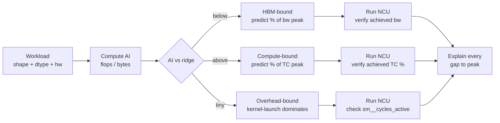

# Roofline as a Predictive Tool

<Mode is="learn">

In a managed-runtime language, you write code and the JIT decides what runs on the CPU; you rarely have to reason about what's fast and why. Writing GPU kernels flips that contract: every kernel sits somewhere on a two-line graph called the roofline, and where it sits is mostly decided before you write a single instruction — by the *shape* of the work, the *dtype*, and the *hardware*. The job of the roofline is not to make a pretty plot. The job is to let you predict, in your head, where a kernel will bind, before you ever open a profiler.

That predictive use is where most engineers stop and where senior inference engineers start. Anyone can quote "compute-bound vs memory-bound." Few can look at a (M, N, K) GEMM and say "AI is 295 — I expect 78% of HBM peak, ridge point will saturate at batch 32, decode at batch 1 will hit 70% of the 3.35 TB/s ceiling." That's the skill. This lesson is how to build it.

## TL;DR

- The roofline is a **two-line graph**: peak compute (FLOPs/s) and peak memory bandwidth (bytes/s). A kernel's *arithmetic intensity* (AI = flops / bytes moved) places it on the x-axis. Where the kernel meets the lower of the two ceilings is its theoretical max.
- The **ridge point** is where the two lines cross: AI = peak_FLOPs / peak_bandwidth. On H100 fp16: AI ≈ **295 FLOPs/byte**. Below it, you're HBM-bound. Above it, you're compute-bound.
- A useful roofline has a **third regime**: kernel-launch + dispatcher overhead. Below ~8 µs, the host-side cost dominates and the GPU is starved. Common in batch-1 decode and tiny attention.
- The discipline: **predict regime + % of peak BEFORE profiling**. Then NCU verifies. Where prediction is wrong, you learn something specific (tile size, occupancy floor, SMEM thrash, scheduler stall).
- Production kernels land at **65–85% of the predicted ceiling**, not 100%. Anything below 50% means a bug; anything claiming above 90% should be re-measured.

## The concept, in plain English

Hardware has two bottlenecks: how fast the chip can compute, and how fast it can move data from HBM. Every kernel is doing some ratio of compute to data movement. If the ratio is high (lots of arithmetic per byte loaded), compute is your ceiling. If the ratio is low (you're shuffling lots of memory for little arithmetic), bandwidth is your ceiling. The roofline graph is just the two ceilings drawn on the same axes, with kernels plotted by their AI.

What makes the roofline a *tool* — not a plot — is that you can compute AI from the kernel's mathematical definition, without running anything. A GEMM of shape (M, N, K) does 2·M·N·K flops and moves (M·K + K·N + M·N) · dtype_bytes of memory. The ratio is the AI, and the ratio tells you which ceiling matters. The whole game is then: *did I land within striking distance of that ceiling, and if not, why?*

## Mental model — the predict-then-verify loop



The loop is: predict → measure → reconcile. Every kernel optimization session starts at the left and walks to the right. The interview-grade skill is doing the left half in your head.

## H100 numbers you should memorize

These are the constants behind every prediction. Marketing peaks (the doubled-for-sparsity numbers) are *not* what you use — you use sustained, dense, achievable peaks.

| Resource | H100 SXM (achievable) | Where you read it from |
| --- | --- | --- |
| HBM3 bandwidth | **3.35 TB/s** | Whitepaper; NCU `dram__bytes.sum.per_second` |
| L2 cache | 50 MB | Whitepaper |
| SMEM per SM | 228 KB | Whitepaper |
| Registers per SM | 65,536 | Whitepaper |
| SMs per chip | 132 (SXM) | `nvidia-smi -q` |
| Peak fp16/bf16 TC | **989 TFLOPs/s** | Whitepaper (dense, no sparsity) |
| Peak fp8 TC | 1979 TFLOPs/s | Whitepaper (dense) |
| Peak fp32 (no TC) | 67 TFLOPs/s | Whitepaper |
| **Ridge point fp16** | **AI ≈ 295 flops/byte** | 989e12 / 3.35e12 |
| **Ridge point fp8** | AI ≈ 590 flops/byte | 1979e12 / 3.35e12 |

The ridge point is the punchline. **An fp16 kernel needs at least 295 FLOPs of compute per byte of HBM traffic to be compute-bound.** Below that, no kernel optimization on Earth will push you past the HBM ceiling — you have to read less (quantize, fuse, use prefix cache), not compute faster.

## Worked predictions — three shapes, three regimes

Take three real shapes and predict each one before measuring. This is the actual exercise.

### Shape 1: GEMM at training scale (compute-bound)

Llama FFN forward pass during pretraining: **M = 8192, N = 28672, K = 8192, fp16** (2 bytes/element, fp32 accumulator).

```text
flops  = 2 × 8192 × 28672 × 8192          ≈ 3.85 × 10¹² flops
bytes  = (M·K + K·N + M·N) × 2            ≈ 1.41 × 10⁹ bytes
       = (67M + 235M + 235M) × 2
AI     = flops / bytes                    ≈ 2,725 flops/byte
```

AI is **9× the ridge point** → comfortably compute-bound. Predicted: hit the fp16 TC peak. Production kernels (cuBLAS, CUTLASS at this shape) land **80–85% of 989 TFLOPs**, so expect ~800 TFLOPs sustained. Time = 3.85e12 / 8e14 ≈ **4.8 ms**.

### Shape 2: Attention QK at moderate context (compute-bound, lower headroom)

Attention QKᵀ at 4K seq, head_dim=128, 32 heads, batch 1: **M = 4096, N = 4096, K = 128, fp16.**

```text
flops  = 2 × 4096 × 4096 × 128            ≈ 4.3 × 10⁹ flops
bytes  = (4096·128 + 128·4096 + 4096·4096) × 2 ≈ 35.6 × 10⁶ bytes
AI     ≈ 121 flops/byte
```

AI is **40% of the ridge point** → memory-bound, but close to the corner. Predicted: hit ~50–60% of the *bandwidth* ceiling, since the kernel is small and SMEM tiling can mostly hide HBM latency. Time = 35.6e6 / (3.35e12 × 0.55) ≈ **19 µs**. FlashAttention's whole pitch is fusing the softmax to remove one of these traffic legs.

### Shape 3: Decode GEMV (HBM-bound, hard ceiling)

Llama 70B FFN during decode at batch 1: **M = 1, N = 28672, K = 8192, fp16 weights.**

```text
flops  = 2 × 1 × 28672 × 8192             ≈ 4.7 × 10⁸ flops
bytes  ≈ K·N × 2 (weight matrix dominates) ≈ 470 × 10⁶ bytes
AI     ≈ 1.0 flop/byte
```

AI is **0.3% of the ridge point** → pure HBM-bound. The compute peak is *irrelevant*. Predicted ceiling = 470e6 / 3.35e12 ≈ **140 µs** at 100% of HBM peak; production kernels (Marlin INT4) hit ~70% of HBM, so expect ~200 µs per token, **~5,000 tokens/s** weight throughput at the kernel level — and the model has dozens of these per layer per token.

This is the regime where INT4 weight quantization is a 4× speedup almost mechanically: AI stays at ~1.0, but bytes moved drops 4×. The roofline doesn't care that you have a fancy kernel; it cares about the bytes.

## The third regime — overhead-bound

The textbook roofline has two regimes. Real GPU code has three. When the kernel is small enough that **host-side launch + kernel-launch + dispatcher cost** exceeds the kernel's actual execution time, the GPU is starved waiting for the next launch. The kernel runs at well below either ceiling because it spends most wall-clock idle.

Symptoms: **achieved bandwidth and achieved TC% are both low.** NCU's `sm__cycles_active` is far below `sm__cycles_elapsed`. The fix is not kernel optimization — it's CUDA Graphs, kernel fusion, larger batches, or persistent kernels. Spec decoding's verifier kernel is the canonical case: a 32-token verify is too small to amortize launch.

Rough cutoff on H100: kernels under ~8 µs of GPU work spend more time being launched than being run. Plan around it.

## Concrete walkthrough — Triton autotuned matmul prediction

Take the Triton matmul tutorial and predict its perf at three shapes before running. This is the workflow Capstone 1 requires you to internalize.

```python
# H100 SXM, fp16 inputs, fp32 accumulator
def predict_matmul(M, N, K, dtype_bytes=2,
                   peak_tflops=989, hbm_tbps=3.35,
                   realistic_eff=0.78):
    flops = 2 * M * N * K
    bytes_traffic = (M*K + K*N + M*N) * dtype_bytes
    ai = flops / bytes_traffic
    ridge = peak_tflops * 1e12 / (hbm_tbps * 1e12)  # ≈ 295
    bound = "compute" if ai > ridge else "HBM"
    if bound == "compute":
        sustained_tflops = peak_tflops * realistic_eff
        time_us = flops / (sustained_tflops * 1e12) * 1e6
    else:
        sustained_bw = hbm_tbps * 1e12 * realistic_eff
        time_us = bytes_traffic / sustained_bw * 1e6
    return ai, bound, round(time_us, 1)

print(predict_matmul(8192, 28672, 8192))   # (2725, 'compute', 4858 µs)
print(predict_matmul(4096, 4096, 128))     # (121,  'HBM',     14 µs)
print(predict_matmul(1, 28672, 8192))      # (1.0,  'HBM',     180 µs)
```

Then run the actual kernel and compare. If your kernel hits 78% of the predicted ceiling, you're in the band where production kernels live and the win is pursuing the next bottleneck. If it hits 30%, the kernel is broken — wrong tile shape, wrong dtype path, missing TC, occupancy floor — and NCU will tell you which.

## Run it in your browser — predict, then read the gap

<RunInBrowser
  description="Compute AI and the regime for any (M, N, K). Use this to plan before you write a kernel."
  code={`def roofline(M, N, K, dtype_bytes=2,
             peak_tflops=989, hbm_tbps=3.35,
             realistic_eff=0.78):
    flops = 2 * M * N * K
    bytes_traffic = (M*K + K*N + M*N) * dtype_bytes
    ai = flops / bytes_traffic
    ridge = peak_tflops / hbm_tbps
    bound = "compute-bound" if ai > ridge else "HBM-bound"
    if "compute" in bound:
        sus = peak_tflops * realistic_eff
        time_us = flops / (sus * 1e12) * 1e6
    else:
        sus_bw = hbm_tbps * 1e12 * realistic_eff
        time_us = bytes_traffic / sus_bw * 1e6
    overhead_floor_us = 8.0
    if time_us < overhead_floor_us:
        regime = "overhead-bound (kernel too small)"
    else:
        regime = bound
    return ai, regime, round(time_us, 2)

shapes = [
    ("training FFN",              8192, 28672, 8192),
    ("attention QK at 4K",        4096, 4096, 128),
    ("decode GEMV (70B FFN)",     1, 28672, 8192),
    ("tiny softmax slice",        16, 64, 64),
]
print(f"H100 fp16 ridge point AI = {989/3.35:.0f} flops/byte\\n")
print(f"{'shape':<32} {'AI':>8} {'regime':<28} {'µs':>8}")
for name, m, n, k in shapes:
    ai, regime, t = roofline(m, n, k)
    print(f"{name:<32} {ai:>8.1f} {regime:<28} {t:>8.2f}")
`}
/>

What you should see: the training FFN has AI ≈ 2725, comfortably compute-bound. Attention QK is HBM-bound at 4K seq (FlashAttention exists for a reason). The decode GEMV is *ten thousand times* below the ridge — quantization is the only lever. The tiny softmax slice trips the overhead floor — fuse it into the kernel before, not after.

## Quick check

<Quiz
  question="A custom Triton fused kernel for RMSNorm + Matmul at (B=32, H=4096, O=4096) fp16 reports 71% achieved HBM bandwidth in NCU. The arithmetic intensity is 121. What does this mean?"
  options={[
    'The kernel is broken — 71% of bandwidth is far below the compute ceiling.',
    'AI is below the ridge so the kernel is HBM-bound; 71% of HBM is in the 65–85% production band — this is a healthy result.',
    'The kernel should switch to fp32 to push toward the compute ceiling.',
    'Tensor Core utilization is the right metric to verify here, not bandwidth.',
  ]}
  answer={1}
  explanation="AI = 121 is well below the H100 fp16 ridge point of 295 flops/byte, so the kernel is HBM-bound by definition. The compute ceiling is irrelevant in this regime. 71% of the HBM peak is exactly where well-tuned production kernels land — between 65% (Triton autotuned) and 85% (hand-tuned CUTLASS). Switching to fp32 would reduce bandwidth efficiency further (per-element cost doubles). TC utilization is meaningful only when the kernel is compute-bound."
/>

## Key takeaways

1. **The roofline is a predictive tool, not a plot.** The interview-grade skill is computing AI from a workload definition and predicting regime + % of peak before any code runs.
2. **Memorize H100 numbers.** Ridge point fp16 ≈ 295 flops/byte. HBM3 ≈ 3.35 TB/s. Peak TC fp16 ≈ 989 TFLOPs/s. Without these, you can't predict; with them, predictions take 30 seconds.
3. **Three regimes, not two.** Compute-bound, HBM-bound, overhead-bound. Sub-8-µs kernels live in the third regime; the fix is fusion or graphs, not kernel optimization.
4. **Production lands at 65–85% of the predicted ceiling.** Below 50% means a bug. Above 90% means you re-measure (or the kernel is hitting cache, not HBM).
5. **The discipline: seal predictions before profiling.** Capstone 1 commits `predictions.md` with a timestamp before opening NCU. Every measured value gets reconciled against its prediction; every gap is a learnable fact.

## Go deeper

<Resources
  items={[
    { kind: 'blog', href: 'https://horace.io/brrr_intro.html', title: 'Making Deep Learning Go Brrrr From First Principles', author: 'Horace He (2022)', note: 'The canonical essay on the three regimes (compute / memory / overhead). Re-read once a year.' },
    { kind: 'paper', href: 'https://people.eecs.berkeley.edu/~kubitron/cs252/handouts/papers/RooflineVyNoYellow.pdf', title: 'Roofline: An Insightful Visual Performance Model', author: 'Williams, Waterman, Patterson (UC Berkeley, 2009)', note: 'The original roofline paper. Pre-dates GPU dominance but the math is identical.' },
    { kind: 'docs', href: 'https://docs.nvidia.com/nsight-compute/ProfilingGuide/index.html#roofline-charts', title: 'NCU — Roofline Charts', note: 'How NCU plots achieved AI and bandwidth on the roofline directly. The verification half of predict-then-verify.' },
    { kind: 'paper', href: 'https://resources.nvidia.com/en-us-tensor-core/nvidia-tensor-core-gpu-datasheet', title: 'Hopper Architecture Whitepaper', author: 'NVIDIA (2022)', note: 'The source of every H100 number you should memorize. Read sections on HBM3, TC peak, and SM resources.' },
    { kind: 'blog', href: 'https://www.thonking.ai/p/strangely-matrix-multiplications', title: 'Strangely, Matrix Multiplications on GPUs Run Faster When Given "Predictable" Data', author: 'Horace He (2024)', note: 'Real-world example of where the simple roofline misses — clock throttling under sustained load.' },
    { kind: 'paper', href: 'https://arxiv.org/abs/2402.13499', title: 'Outperforming cuBLAS on H100 — Worked Example with FP16', author: 'Hazy Research / Pranjal Shankhdhar (2024)', note: 'A real kernel that lands at 80%+ of TC peak with the gap explained metric-by-metric. The verification half done well.' },
    { kind: 'video', href: 'https://www.youtube.com/watch?v=DdTsX6DQk24', title: 'Tri Dao — Hardware/Software Co-Design for AI', author: 'Tri Dao (Hazy Research)', note: 'How FlashAttention\'s author thinks about the roofline when designing kernels.' },
  ]}
/>

</Mode>

<Mode is="reference">

## TL;DR

- The roofline is a **two-line graph**: peak compute (FLOPs/s) and peak memory bandwidth (bytes/s). A kernel's *arithmetic intensity* (AI = flops / bytes moved) places it on the x-axis. Where the kernel meets the lower of the two ceilings is its theoretical max.
- The **ridge point** is where the two lines cross: AI = peak_FLOPs / peak_bandwidth. On H100 fp16: AI ≈ **295 FLOPs/byte**. Below it, you're HBM-bound. Above it, you're compute-bound.
- A useful roofline has a **third regime**: kernel-launch + dispatcher overhead. Below ~8 µs, the host-side cost dominates and the GPU is starved. Common in batch-1 decode and tiny attention.
- The discipline: **predict regime + % of peak BEFORE profiling**. Then NCU verifies. Where prediction is wrong, you learn something specific (tile size, occupancy floor, SMEM thrash, scheduler stall).
- Production kernels land at **65–85% of the predicted ceiling**, not 100%. Anything below 50% means a bug; anything claiming above 90% should be re-measured.

## Why this matters

Every kernel optimization decision starts with one question: *which resource is this kernel actually waiting on?* Compute, HBM, SMEM, registers, scheduler, host launch — pick wrong and the entire optimization session is wasted. The roofline answers that question before any code runs, by reducing the workload to a single number (arithmetic intensity) and comparing it to a hardware constant (ridge point).

The reason this matters specifically in 2026 is that LLM inference is dominated by HBM-bound regimes. Decode at batch 1 has AI near 1.0; attention at long context is HBM-bound until FlashAttention fuses the softmax leg. If you cannot derive that from a roofline argument in 30 seconds, every PR you propose to vLLM or SGLang will be reviewed by someone who can.

## Mental model


## H100 numbers — the achievable peaks

| Resource | H100 SXM (achievable) | NCU metric |
| --- | --- | --- |
| HBM3 bandwidth | 3.35 TB/s | `dram__bytes.sum.per_second` |
| L2 cache | 50 MB | `lts__t_bytes.sum.per_second` |
| SMEM per SM | 228 KB | `smsp__inst_executed_pipe_lsu.avg.per_cycle` |
| Registers per SM | 65,536 | `launch__registers_per_thread` |
| SMs per chip | 132 (SXM) | `nvidia-smi -q` |
| Peak fp16/bf16 TC | 989 TFLOPs/s | `sm__pipe_tensor_op_hmma_cycles_active.avg.pct_of_peak_sustained_active` |
| Peak fp8 TC | 1979 TFLOPs/s | `sm__pipe_tensor_op_imma_cycles_active.avg.pct_of_peak_sustained_active` |
| Ridge point fp16 | AI ≈ 295 flops/byte | derived |
| Ridge point fp8 | AI ≈ 590 flops/byte | derived |

Marketing peaks (fp16: 1979 TFLOPs) include 2:4 sparsity. Production kernels dense — use 989. PCIe variant peaks ~25% lower across the board.

## Three predictive regimes

### Compute-bound: AI ≫ ridge

Training-scale GEMM (M, N, K all large) lands here. AI for an (M, N, K) GEMM is approximately `(M·N·K) / (M·K + K·N + M·N) ≈ min(M, N, K) / 2` when all dimensions are large. For Llama FFN at training: AI ≈ 2725. Predicted execution time ≈ flops / (peak × η) where η ∈ [0.65, 0.85] for production kernels.

### HBM-bound: AI < ridge

Decode at batch 1 dominates here. The matrix-vector product reads the full weight matrix once per token; AI ≈ 1.0. Predicted execution time ≈ bytes / (HBM × η). The compute ceiling is irrelevant — quantization (INT4, FP8) cuts bytes proportionally.

### Overhead-bound: kernel < ~8 µs

Below ~8 µs of GPU-side work, host launch + dispatcher dominate. Symptoms: NCU shows both `dram__bytes/sec` and `sm__pipe_tensor_op_*` low; `sm__cycles_active.avg.pct_of_peak` < 50%. Fix with CUDA Graphs, op fusion, larger batches, persistent kernels.

## Computing AI for the operations that matter

| Op | AI formula (large dims) | Typical regime |
| --- | --- | --- |
| GEMM (M, N, K) | `≈ min(M, N, K) / 2` | compute when all > 256, else HBM |
| GEMV (1, N, K) | `≈ 1` | HBM-bound (decode) |
| Elementwise unary | `≈ 0.5` | HBM-bound |
| Elementwise binary | `≈ 0.33` | HBM-bound |
| Softmax (per row) | `≈ 1` | HBM-bound (often fused) |
| RMSNorm (per row) | `≈ 1` | HBM-bound (fuse into next matmul) |
| Attention QK + softmax + V (unfused) | `≈ 4–8` | HBM-bound |
| FlashAttention (fused) | `≈ d_head / 2` | compute when d_head ≥ 128 |

The "fuse into next matmul" pattern is the workshop tool: an HBM-bound elementwise op fused into a downstream compute-bound matmul costs nothing on the matmul side and removes the elementwise's HBM round-trip entirely. This is *exactly* what the Capstone 1 fused RMSNorm+Matmul does.

## Worked predictions — three shapes

```python
def predict(M, N, K, dtype_bytes=2,
            peak_tflops=989, hbm_tbps=3.35,
            realistic_eff=0.78):
    flops = 2 * M * N * K
    bytes_traffic = (M*K + K*N + M*N) * dtype_bytes
    ai = flops / bytes_traffic
    ridge = peak_tflops / hbm_tbps  # ≈ 295
    if ai > ridge:
        time_us = flops / (peak_tflops * realistic_eff * 1e12) * 1e6
        regime = "compute"
    else:
        time_us = bytes_traffic / (hbm_tbps * realistic_eff * 1e12) * 1e6
        regime = "HBM"
    if time_us < 8: regime = "overhead"
    return ai, regime, time_us

predict(8192, 28672, 8192)   # AI=2725, compute, ~4860 µs
predict(4096, 4096, 128)     # AI=121,  HBM,     ~14 µs
predict(1, 28672, 8192)      # AI=1.0,  HBM,     ~180 µs
```

## Concrete walkthrough — verifying with NCU

After predicting, the verification step in NCU has a fixed shape:

1. **Launch with `ncu --set full --kernel-name my_kernel python bench.py`.** `--set full` captures everything; trim later with `--metrics` for production sweeps.
2. **Read the regime confirmation first.** For a predicted HBM-bound kernel, look at `dram__bytes.sum.per_second` and convert to a fraction of HBM peak. For compute-bound, `sm__pipe_tensor_op_hmma_cycles_active.avg.pct_of_peak_sustained_active`.
3. **Compute achieved fraction-of-prediction.** If predicted 78% of HBM and achieved 71%, gap is 7 percentage points — explainable by SMEM bank conflicts, occupancy floor below 100%, or partial L2 reuse.
4. **For overhead-bound, look at `sm__cycles_active.avg.pct_of_peak_sustained_elapsed`.** Below 50% means the GPU is idle waiting for launches; the next move is fusion or CUDA Graphs, not kernel work.

The output of this loop is not "the kernel is fast." It's "the kernel is fast *because* X, and the gap to peak is *because* Y." Y is the next kernel session.

## Real numbers — production rooflines

Where production kernels land on H100 fp16:

| Kernel | AI | Regime | Achieved % of ceiling | Notes |
| --- | --- | --- | --- | --- |
| cuBLAS GEMM (M=N=K=8192) | 4096 | compute | 78% TC | Default eager PyTorch |
| CUTLASS hand-tuned (same) | 4096 | compute | 84% TC | The 2024 Hopper paper |
| Triton autotuned matmul | 4096 | compute | 71% TC | Easier to write; smaller win |
| Marlin INT4 GEMV (decode) | 1.1 | HBM | 70% HBM | INT4 weights, fp16 acts |
| FlashAttention-3 (head=128) | 64 | mixed | 90% TC | Async pipeline + warp spec |
| Naive PyTorch attention | 4 | HBM | 22% HBM | Unfused softmax; the worst case |

The right reading: when an inference team interviews you, "I'd expect 78% of TC peak for cuBLAS-style GEMM and ~70% of HBM for INT4 decode" is a senior answer. "It depends" is not.

## Quick check

<Quiz
  question="A custom Triton fused kernel for RMSNorm + Matmul at (B=32, H=4096, O=4096) fp16 reports 71% achieved HBM bandwidth in NCU. The arithmetic intensity is 121. What does this mean?"
  options={[
    'The kernel is broken — 71% of bandwidth is far below the compute ceiling.',
    'AI is below the ridge so the kernel is HBM-bound; 71% of HBM is in the 65–85% production band — this is a healthy result.',
    'The kernel should switch to fp32 to push toward the compute ceiling.',
    'Tensor Core utilization is the right metric to verify here, not bandwidth.',
  ]}
  answer={1}
  explanation="AI = 121 is well below the H100 fp16 ridge point of 295 flops/byte, so the kernel is HBM-bound by definition. The compute ceiling is irrelevant in this regime. 71% of the HBM peak is exactly where well-tuned production kernels land. Switching to fp32 would double per-element cost. TC utilization is meaningful only when the kernel is compute-bound."
/>

## Key takeaways

1. The roofline is a **predictive tool**, not a plot. Senior inference engineers compute AI in their head and predict regime + % of peak before profiling.
2. **H100 fp16 ridge point ≈ 295 flops/byte.** Below: HBM-bound. Above: compute-bound. Below ~8 µs of work: overhead-bound.
3. **Production lands at 65–85% of the relevant ceiling.** Use 78% as a default for "well-tuned" predictions; tighten with measurement.
4. **HBM-bound regimes don't reward kernel work.** They reward reading less — quantization, fusion, prefix cache.
5. **Predict-then-verify is the discipline.** Seal `predictions.md` before opening NCU. Reconcile every gap; that reconciliation *is* the senior signal.

## Go deeper

<Resources
  items={[
    { kind: 'blog', href: 'https://horace.io/brrr_intro.html', title: 'Making Deep Learning Go Brrrr From First Principles', author: 'Horace He (2022)', note: 'The canonical three-regime essay.' },
    { kind: 'paper', href: 'https://people.eecs.berkeley.edu/~kubitron/cs252/handouts/papers/RooflineVyNoYellow.pdf', title: 'Roofline: An Insightful Visual Performance Model', author: 'Williams, Waterman, Patterson (2009)' },
    { kind: 'docs', href: 'https://docs.nvidia.com/nsight-compute/ProfilingGuide/index.html#roofline-charts', title: 'NCU — Roofline Charts' },
    { kind: 'paper', href: 'https://resources.nvidia.com/en-us-tensor-core/nvidia-tensor-core-gpu-datasheet', title: 'Hopper Architecture Whitepaper', author: 'NVIDIA (2022)' },
    { kind: 'paper', href: 'https://arxiv.org/abs/2402.13499', title: 'Outperforming cuBLAS on H100 — Worked Example FP16', author: 'Shankhdhar et al. (Hazy Research, 2024)' },
    { kind: 'blog', href: 'https://www.thonking.ai/p/strangely-matrix-multiplications', title: 'Matrix Multiplications Run Faster on Predictable Data', author: 'Horace He (2024)' },
    { kind: 'video', href: 'https://www.youtube.com/watch?v=DdTsX6DQk24', title: 'Tri Dao — Hardware/Software Co-Design for AI', author: 'Tri Dao' },
  ]}
/>

</Mode>

<LessonComplete />
