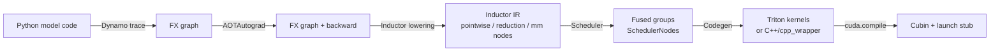

# Inductor Fusion Heuristics

<Mode is="learn">

In a managed-runtime language, the JIT mostly hides what gets compiled and what runs interpreted. PyTorch is similar: under eager mode, every op is its own kernel, and every kernel is its own HBM round-trip. `torch.compile` flips that. It traces the graph, schedules ops, and where it can it **fuses** several ops into a single kernel — saving the round-trip, sometimes 5–10× on memory-bound prose. The catch is that fusion is a *heuristic*, not a guarantee. A natural-looking program will sometimes get one kernel and sometimes get four, with no warning, and the difference shows up only in NCU.

This lesson is about why Inductor's fusion decisions go the way they do, how to *make* them go the way you want, and how to read the generated Triton when they don't. After this you should be able to look at a forward pass and predict — before compiling — whether you'll get one kernel or several, and what to change to collapse them.

## TL;DR

- `torch.compile` lowers your graph through three layers: **Dynamo** (Python-level capture) → **AOTAutograd** (forward + backward graphs) → **Inductor** (the codegen). Fusion happens in Inductor's scheduler.
- Inductor's **default fusion** is *vertical* (consumer/producer chains of pointwise ops) and *horizontal* (sibling ops sharing inputs). Reductions fuse with their pointwise prologue/epilogue. **GEMM does NOT fuse with following pointwise** by default — Inductor falls back to an unfused `mm` followed by a separate kernel for the activation.
- The escape hatch is **`max-autotune`** (`torch.compile(mode="max-autotune")`) — it enables Triton-templated GEMM with epilogue fusion and CUDA Graphs. You buy compile time; you get production-grade kernels.
- The tool that makes fusion observable is **`TORCH_LOGS=output_code`**. It prints the generated Triton (or C++) for every fused kernel. Read it; the fusion graph is right there.
- Fusion fails on three big classes: **dynamic shapes** that prevent codegen specialization, **graph breaks** (calls to NumPy, custom Python, debug prints), and **mixed-device ops**. Each has a workaround; each is visible in `TORCH_LOGS=graph_breaks`.

## The concept, in plain English

A naive forward pass is a sequence of kernel launches: matmul, then add bias, then GELU, then layer-norm, then matmul again. Each step writes its output to HBM and the next reads it back — six HBM round-trips for what could be one. Inductor's job is to *fold* sequential pointwise ops into a single kernel that reads input once, does all the math in registers, and writes output once. When it succeeds, the kernel goes from HBM-bound on six round-trips to HBM-bound on one — a 6× memory traffic reduction with no extra arithmetic.

The reason Inductor is a heuristic instead of a perfect solver is that fusion has costs (register pressure, kernel size, compile time) and the optimal partitioning is shape-, dtype-, and hardware-dependent. Inductor makes its calls based on op categories (pointwise, reduction, mm) and a few simple rules; it gets most of them right, occasionally wrong, and `max-autotune` is the lever that turns it from "good defaults" to "production-grade."

## Mental model — the lowering pipeline



Two important truths in this pipeline:

1. **The Scheduler is where fusion happens.** Lowering produces individual nodes; the Scheduler groups them into `FusedSchedulerNode`s based on rules. That grouping is what the next stage emits as one Triton kernel vs many.
2. **Codegen is mechanical.** Once the Scheduler decides "fuse these four pointwise ops," the Triton kernel writes itself. The interesting decisions are upstream of codegen.

If you want to influence fusion, the levers are at Dynamo (avoid graph breaks) and at the Scheduler (mode flags, custom decompositions). The Triton output is the receipt.

## Inductor's default fusion rules

Inductor categorizes every op as one of:

- **Pointwise** — `add`, `mul`, `gelu`, `relu`, `silu`, `mul_scalar`, etc. Operate elementwise; trivially fusible into a chain.
- **Reduction** — `sum`, `mean`, `var`, `max`, `softmax_inner`, `layer_norm_inner`. Read many → write one; can fuse with a pointwise *prologue* (before the reduction) and *epilogue* (after).
- **Template** — `mm`, `addmm`, `bmm`, `conv`. Use a hand-written kernel template; **do not fuse with surrounding pointwise by default** unless `max-autotune` is on.
- **Foreign** — `embedding`, custom ops. Each is its own kernel.

The default fusion rules:

| Pattern | Fuses? | Notes |
| --- | --- | --- |
| Pointwise → Pointwise | yes | `(x + b).relu()` is one kernel |
| Pointwise → Reduction | yes | `(x.float() ** 2).mean()` is one kernel (RMSNorm prologue) |
| Reduction → Pointwise | yes | layer-norm followed by `.gelu()` is one kernel (epilogue) |
| MM → Pointwise | **no** by default | `linear(x).gelu()` is two kernels |
| MM → Pointwise (max-autotune) | yes (epilogue fused into Triton matmul template) | `linear(x).gelu()` is one kernel |
| Reduction → Reduction | only if shapes align | back-to-back reductions usually emit separate kernels |
| Pointwise → MM | yes (prologue, max-autotune) | bias add into matmul activation |

The headline result: **stock `torch.compile` does not fuse activation functions into matmul.** That's the single biggest reason a Triton hand-rolled fused kernel can beat torch.compile by 30–50% on a fused linear-activation pattern. The Capstone 1 fused RMSNorm+Matmul kernel is *exactly* the workload where `max-autotune` is required to get torch.compile to a fair comparison.

## Reading the generated code — TORCH_LOGS=output_code

The most important debugging tool isn't NCU — it's the environment variable that prints what Inductor actually generated:

```bash
TORCH_LOGS=output_code python my_model.py
```

For a small graph, the output looks like this (paraphrased):

```text
@triton.jit
def triton_poi_fused_add_relu_0(in_ptr0, in_ptr1, out_ptr0, xnumel, XBLOCK):
    xindex = ...
    tmp0 = tl.load(in_ptr0 + xindex)
    tmp1 = tl.load(in_ptr1 + xindex)
    tmp2 = tmp0 + tmp1
    tmp3 = tl.where(tmp2 > 0, tmp2, 0)  # relu
    tl.store(out_ptr0 + xindex, tmp3)
```

Three names tell you what fused into what:

- `triton_poi_fused_add_relu_0` — `poi` is pointwise, `_fused_add_relu` lists the ops that got combined, `_0` is the kernel index in the graph.
- `triton_red_fused_layer_norm_0` — `red` is reduction; the layer-norm and its prologue/epilogue all in one kernel.
- `triton_tem_fused_mm_relu_0` — `tem` is template; matmul with relu epilogue (only emitted with `max-autotune`).

If you expected a fusion and see two separate kernels (`triton_poi_fused_*_0` and `triton_poi_fused_*_1`), that's the signal — Inductor's scheduler decided not to fuse. The next move is finding out why.

## When fusion fails — the three big classes

### Class 1: Dynamic shapes

`torch.compile` defaults to **dynamic shapes** in 2025+ — it generates one kernel that handles a range of input sizes. The cost is that some optimizations (constant-folded loop bounds, perfect tile shapes) require known shapes. When dynamic shapes prevent fusion, you can force specialization:

```python
model = torch.compile(model, dynamic=False)  # full specialization
# OR
torch._dynamo.mark_dynamic(x, dim=0)  # mark one dim dynamic; rest specialized
```

Specialization recompiles per shape — fast inference, slow first-token latency. The tradeoff is what production inference servers (vLLM, SGLang) tune carefully.

### Class 2: Graph breaks

A graph break happens when Dynamo encounters something it cannot trace: a call to NumPy, a `print()`, an `if` on a tensor's `.item()`, a custom Python class. The graph splits in two and Inductor compiles each half separately — fusion can only happen within a half.

```bash
TORCH_LOGS=graph_breaks python my_model.py
```

Output points at the line. Common culprits:

- `print(loss.item())` → mid-training breaks
- `if x.shape[0] > 0:` (tensor `.item()` calls) → control-flow breaks
- `np.where(x.cpu().numpy())` → Python interop breaks
- Custom layers calling un-decorated user code → trace failure

The fix is usually obvious once you see the line: comment out the print, replace `.item()` with `torch.where`, or wrap the custom code with `@torch.compiler.allow_in_graph`.

### Class 3: Mixed-device or dtype boundaries

A kernel cannot fuse across CUDA / CPU boundaries; nor across fp32 → fp16 promotions that require explicit casts. If your model has `.cpu()` mid-forward, fusion stops there. Same for explicit `.to(dtype=...)` calls — Inductor emits a separate kernel for the cast.

The fix is keeping the forward pass on one device and using `autocast` instead of explicit `.to()` calls.

## The max-autotune escape hatch

When the workload is GEMM-heavy and you're willing to pay compile time, `mode="max-autotune"` is the lever:

```python
model = torch.compile(model, mode="max-autotune")
# OR
@torch.compile(mode="max-autotune-no-cudagraphs")
def forward(...): ...
```

What it changes:

- **Triton matmul templates** with autotuned tile shapes and num_stages — replaces cuBLAS for many shapes.
- **Epilogue fusion** — pointwise ops after a matmul fuse into the matmul Triton kernel.
- **CUDA Graphs** — the entire compiled forward becomes a single graph launch, eliminating per-kernel overhead. (Use `max-autotune-no-cudagraphs` if you need dynamic input handling.)
- **Compile time goes from seconds to minutes.** First inference is slow; subsequent are fast.

For the Capstone 1 baseline, run the bench under `max-autotune` to make the comparison fair: a hand-rolled fused RMSNorm+Matmul Triton kernel competing against the best torch.compile can do. If your kernel still wins, that's the artifact.

## Concrete walkthrough — comparing fusion levels

A simple feed-forward block in PyTorch:

```python
class FFN(torch.nn.Module):
    def __init__(self, d_model, d_ff):
        super().__init__()
        self.norm = torch.nn.LayerNorm(d_model)
        self.up = torch.nn.Linear(d_model, d_ff)
        self.gate = torch.nn.Linear(d_model, d_ff)
        self.down = torch.nn.Linear(d_ff, d_model)

    def forward(self, x):
        h = self.norm(x)
        return self.down(torch.nn.functional.silu(self.gate(h)) * self.up(h))
```

Eager mode: **8 kernels** — layer-norm, gate matmul, up matmul, silu, mul, down matmul, plus 2 binding ops.

Default `torch.compile`: **5 kernels** — layer-norm fused into one, two matmuls (unfused), silu+mul fused, down matmul. Still 4 separate matmul launches and 2 separate elementwise.

`torch.compile(mode="max-autotune")`: **3 kernels** — layer-norm fused (with epilogue into the gate/up matmul prologue if shapes align), up+gate matmul + silu + mul fused into one Triton template, down matmul (potentially fused with the next layer's norm prologue). On a real Llama FFN this gives ~30% throughput uplift over default mode at large hidden.

Hand-rolled Triton: **2 kernels** — fused layer-norm + gate matmul + silu + mul + up matmul, then down matmul. The LayerNorm eats the prologue, the SiLU and the multiply eat the epilogue. This is what an inference team's custom kernel does for hot paths.

The progression — 8 → 5 → 3 → 2 kernels — is the same workload at four levels of fusion. NCU on each shows the bytes-moved-per-token dropping monotonically.

## Run it in your browser — predict fusion outcomes

<RunInBrowser
  description="Given an op sequence, predict how Inductor's default scheduler fuses it."
  code={`def predict_fusion(ops, max_autotune=False):
    """
    ops: list of ('pointwise', 'reduction', 'mm', 'foreign') with names
    Returns the predicted kernel partition.
    """
    kernels = []
    cur = []
    cur_kind = None

    for kind, name in ops:
        if kind == 'foreign':
            if cur:
                kernels.append((cur_kind, list(cur)))
                cur, cur_kind = [], None
            kernels.append(('foreign', [name]))
            continue

        if kind == 'mm':
            if cur:
                kernels.append((cur_kind, list(cur)))
                cur, cur_kind = [], None
            cur = [name]
            cur_kind = 'mm-template'
            if not max_autotune:
                # close the mm kernel; pointwise won't fuse
                kernels.append((cur_kind, list(cur)))
                cur, cur_kind = [], None
            continue

        if kind == 'pointwise':
            if cur_kind in ('pointwise', 'reduction', 'mm-template'):
                cur.append(name)
            else:
                if cur: kernels.append((cur_kind, list(cur)))
                cur, cur_kind = [name], 'pointwise'
            continue

        if kind == 'reduction':
            # reduction fuses with prior pointwise prologue
            if cur_kind == 'pointwise':
                cur.append(name)
                cur_kind = 'reduction'
            else:
                if cur: kernels.append((cur_kind, list(cur)))
                cur, cur_kind = [name], 'reduction'

    if cur: kernels.append((cur_kind, list(cur)))
    return kernels


# A typical FFN block: norm -> up_proj -> silu -> mul -> down_proj
ffn = [
    ('pointwise', 'square'),         # part of layer-norm prologue
    ('reduction', 'mean'),
    ('pointwise', 'rsqrt_scale'),    # layer-norm epilogue
    ('mm',        'gate_proj'),
    ('pointwise', 'silu'),
    ('mm',        'up_proj'),
    ('pointwise', 'mul_gate_up'),
    ('mm',        'down_proj'),
]

print("DEFAULT torch.compile:")
for k in predict_fusion(ffn, max_autotune=False):
    print(f"  {k[0]:<14} {' + '.join(k[1])}")

print("\\nmax-autotune:")
for k in predict_fusion(ffn, max_autotune=True):
    print(f"  {k[0]:<14} {' + '.join(k[1])}")
`}
/>

You'll see the default mode emit roughly 5 separate kernels (the matmuls each isolated), and `max-autotune` collapse the post-matmul pointwise into the matmul template (the canonical perf win).

## Quick check

<Quiz
  question="A fused linear-then-activation block in PyTorch is compiled with `torch.compile(...)` and TORCH_LOGS=output_code shows two kernels: `triton_tem_fused_mm_0` and `triton_poi_fused_silu_1`. Which statement is correct?"
  options={[
    'The compile worked correctly — Inductor never fuses activations with matmul.',
    'The compile is in default mode; switching to mode="max-autotune" should fuse silu into the matmul epilogue, collapsing to one kernel.',
    'There is a graph break between the linear and the silu.',
    'The kernel is HBM-bound — fusion will not help.',
  ]}
  answer={1}
  explanation="Stock `torch.compile` does not fuse pointwise ops into matmul templates by default — that is exactly the gap that `mode='max-autotune'` exists to close. The two-kernel output (`triton_tem_*` for the matmul template, `triton_poi_*` for the silu) is the canonical signal. There is no graph break (you'd see a separate compile log entry, not two fused kernels). The HBM-bound argument is wrong: collapsing two kernels removes one HBM round-trip, which is exactly what helps an HBM-bound regime."
/>

## Key takeaways

1. **Inductor fuses pointwise chains aggressively but matmul stays isolated by default.** Switching to `mode="max-autotune"` enables Triton matmul templates with epilogue fusion.
2. **`TORCH_LOGS=output_code` is the tool.** It prints the generated Triton; kernel names (`poi`, `red`, `tem`) tell you what fused with what.
3. **Three big fusion failures**: dynamic shapes (use `dynamic=False` or `mark_dynamic`), graph breaks (find with `TORCH_LOGS=graph_breaks`), mixed-device/dtype boundaries.
4. **Fusion is the lever for HBM-bound regimes.** Each fused kernel removes one HBM round-trip; on a memory-bound forward pass the kernel-count delta translates almost 1:1 into throughput.
5. **Hand-rolled Triton beats `max-autotune` only when the kernel does something Inductor's templates don't.** RMSNorm+matmul prologue, fused MoE routing, FlashAttention's online softmax — the patterns that justify writing the kernel by hand.

## Go deeper

<Resources
  items={[
    { kind: 'docs', href: 'https://pytorch.org/docs/stable/torch.compiler.html', title: 'torch.compile — Official Documentation', author: 'PyTorch', note: 'The user-facing API. Skim the Modes section for mode flags and CUDA Graphs.' },
    { kind: 'blog', href: 'https://pytorch.org/blog/inductor-an-overview/', title: 'Inductor: An Overview', author: 'PyTorch (2023)', note: 'How the scheduler categorizes ops and decides on fusion. The single best architectural overview.' },
    { kind: 'docs', href: 'https://pytorch.org/docs/stable/logging.html', title: 'PyTorch Logging — TORCH_LOGS reference', author: 'PyTorch', note: 'All the TORCH_LOGS options. `output_code`, `graph_breaks`, `recompiles`, `aot_graphs` are the most useful.' },
    { kind: 'video', href: 'https://www.youtube.com/watch?v=4Y9Lez0R3Bw', title: 'PyTorch 2.0: How torch.compile works under the hood', author: 'PyTorch Dev Podcast', note: 'Edward Yang walks through Dynamo + AOTAutograd + Inductor. The inside view from the lead.' },
    { kind: 'blog', href: 'https://www.thonking.ai/p/short-introduction-torch-compile', title: 'A Short Introduction to torch.compile', author: 'Horace He (2024)', note: 'Practical-first guide with real benchmarks. Pairs with this lesson.' },
    { kind: 'repo', href: 'https://github.com/pytorch/pytorch/tree/main/torch/_inductor', title: 'Inductor Source — torch/_inductor', author: 'PyTorch', note: 'Read `scheduler.py` and `lowering.py` to see the actual fusion rules. The `_decomp` directory has all the op decompositions.' },
    { kind: 'paper', href: 'https://arxiv.org/abs/2306.04550', title: 'PyTorch 2: Faster Machine Learning Through Dynamic Python Bytecode Transformation and Graph Compilation', author: 'Ansel et al. (2023)', note: 'The PyTorch 2 paper — the formal account of Dynamo + AOTAutograd + Inductor.' },
  ]}
/>

</Mode>

<Mode is="reference">

## TL;DR

- `torch.compile` lowers your graph through three layers: **Dynamo** (Python-level capture) → **AOTAutograd** (forward + backward graphs) → **Inductor** (the codegen). Fusion happens in Inductor's scheduler.
- Inductor's **default fusion** is *vertical* (consumer/producer chains of pointwise ops) and *horizontal* (sibling ops sharing inputs). Reductions fuse with their pointwise prologue/epilogue. **GEMM does NOT fuse with following pointwise** by default — Inductor falls back to an unfused `mm` followed by a separate kernel for the activation.
- The escape hatch is **`max-autotune`** (`torch.compile(mode="max-autotune")`) — it enables Triton-templated GEMM with epilogue fusion and CUDA Graphs. You buy compile time; you get production-grade kernels.
- The tool that makes fusion observable is **`TORCH_LOGS=output_code`**. It prints the generated Triton (or C++) for every fused kernel. Read it; the fusion graph is right there.
- Fusion fails on three big classes: **dynamic shapes** that prevent codegen specialization, **graph breaks** (calls to NumPy, custom Python, debug prints), and **mixed-device ops**. Each has a workaround; each is visible in `TORCH_LOGS=graph_breaks`.

## Why this matters

Most "torch.compile didn't help" stories are fusion stories. The user expected a 2× speedup; got 1.05×; gave up. The cause is almost always (a) `max-autotune` was off, (b) graph breaks splitting the forward pass, or (c) dynamic shapes preventing specialization. Each is fixable in one line of code if you know the symptom.

For inference work specifically, fusion is the ceiling on what `torch.compile` can do for a memory-bound workload. Every fused kernel removes one HBM round-trip; a 6-kernel forward fusing into 3 cuts memory traffic in half. The Capstone 1 fused RMSNorm+Matmul exists precisely because the default Inductor cannot do this fusion (matmul template stays isolated unless `max-autotune`); a hand-rolled Triton kernel ships the fusion that the framework leaves on the table.

## Mental model


## Op categories and fusion rules

Op categories:

- **Pointwise** (`add`, `mul`, `gelu`, `relu`, `silu`, casts) — fully fusible into chains.
- **Reduction** (`sum`, `mean`, `var`, `max`, `softmax_inner`) — fuses with pointwise prologue/epilogue.
- **Template** (`mm`, `addmm`, `bmm`, `conv`) — hand-rolled kernel; default isolated, `max-autotune` enables prologue + epilogue fusion.
- **Foreign** (`embedding`, custom ops) — each its own kernel.

Default fusion table:

| Pattern | Fuses (default) | Fuses (max-autotune) |
| --- | --- | --- |
| Pointwise → Pointwise | yes | yes |
| Pointwise → Reduction | yes (prologue) | yes |
| Reduction → Pointwise | yes (epilogue) | yes |
| MM → Pointwise | no | yes (epilogue) |
| Pointwise → MM | no | yes (prologue) |
| MM → MM | no | no (templates can't compose) |
| Reduction → Reduction | only on shape match | only on shape match |
| Foreign → anything | no | no |

The headline gap: stock mode does not collapse `linear(x).silu()` into one kernel.

## TORCH_LOGS taxonomy

| Flag | Output | When to read |
| --- | --- | --- |
| `output_code` | Generated Triton / C++ source per kernel | Always — the receipt of fusion |
| `graph_breaks` | Where Dynamo split the trace | When fewer kernels expected than measured |
| `recompiles` | Why a kernel recompiled | Slow first-call time per shape |
| `aot_graphs` | Forward + backward FX graphs | Backward fusion analysis |
| `inductor` | Scheduler decisions, lowering log | Deep debugging |
| `dynamo` | Trace events | Graph capture issues |

Set with `TORCH_LOGS=output_code,graph_breaks` (comma-separated). For a one-shot deep dive: `TORCH_LOGS=+inductor,+aot_graphs,+output_code`.

## Generated kernel naming convention

Inductor names kernels predictably. Decoding the name tells you what fused:

```text
triton_<kind>_fused_<ops>_<index>
```

| Kind prefix | Meaning |
| --- | --- |
| `poi` | Pointwise — fused chain |
| `red` | Reduction — with optional prologue/epilogue |
| `per` | Persistent reduction (entire reduction in one block) |
| `tem` | Template — matmul / conv |
| `for` | Foreign — fallback to library kernel |

Examples:

- `triton_poi_fused_add_relu_silu_0` — three pointwise ops fused
- `triton_red_fused_mean_var_layer_norm_0` — layer-norm with its reductions
- `triton_tem_fused_mm_relu_silu_0` — max-autotune matmul with epilogue
- `triton_per_fused_softmax_0` — full-tile softmax reduction

If the kernel name shows fewer ops than your code, look for `_index` jumps (`_0` then `_2` skipping `_1` means another kernel ran between them).

## Three failure classes — full table

### Dynamic shapes

```python
# Problem: dynamic batch causes specialization to skip
y = torch.compile(model)(x_varying_batch)

# Fix A: full specialization (recompiles per shape)
y = torch.compile(model, dynamic=False)(x)

# Fix B: mark only specific dims dynamic
torch._dynamo.mark_dynamic(x, dim=0)
y = torch.compile(model)(x)

# Fix C: assume_static_by_default (the actual production knob)
import torch._dynamo
torch._dynamo.config.assume_static_by_default = True
```

Symptom: kernels named `triton_*_dynamic_*` instead of shape-specialized; lower throughput than expected; `TORCH_LOGS=recompiles` shows multiple compiles per shape.

### Graph breaks

| Symptom | Cause | Fix |
| --- | --- | --- |
| `TORCH_LOGS=graph_breaks` shows lines | `print()`, `.item()`, NumPy interop | Remove or replace |
| Custom Python class in forward | Dynamo can't trace it | `@torch.compiler.allow_in_graph` or rewrite without |
| Tensor-conditional control flow | `if x.sum() > 0:` | Use `torch.where` or `torch.cond` |
| Calling `.cpu()` mid-forward | Device boundary | Keep on one device; use autocast |
| `tensor.numpy()` mid-forward | NumPy boundary | Stay in PyTorch |

### Mixed-device / dtype boundaries

Explicit `.to(dtype=...)` calls emit cast kernels that block fusion. Explicit `.cpu()` / `.cuda()` calls split graphs. The fix is autocast for dtype, and unified-device design for device.

## max-autotune — what it actually changes

```python
# All three real flags:
torch.compile(model, mode="max-autotune")              # Triton templates + CUDA Graphs
torch.compile(model, mode="max-autotune-no-cudagraphs") # Triton templates, no graphs
torch.compile(model, mode="reduce-overhead")           # CUDA Graphs only, no template autotuning
```

Behavioral diffs:

| Feature | Default | reduce-overhead | max-autotune |
| --- | --- | --- | --- |
| CUDA Graphs | no | yes | yes |
| Triton matmul templates | no | no | yes |
| Epilogue fusion (mm + pointwise) | no | no | yes |
| Prologue fusion (pointwise + mm) | no | no | yes |
| Compile time | seconds | seconds | minutes |
| First-call latency | low | high | very high |

For inference servers (vLLM, SGLang), `max-autotune` is on for hot paths; `reduce-overhead` for paths with shape variance; default for the long tail.

## Reading the generated code — what to look for

```text
# Healthy fused FFN
@triton.jit
def triton_poi_fused_add_mul_silu_0(in_ptr0, in_ptr1, out_ptr0, ...):
    tmp0 = tl.load(in_ptr0)
    tmp1 = tl.load(in_ptr1)
    tmp2 = tmp0 * tl.sigmoid(tmp0)   # silu
    tmp3 = tmp2 * tmp1                # gating
    tl.store(out_ptr0, tmp3)
```

Two ops in the math (`silu`, `mul`), three names in the kernel name (`add`, `mul`, `silu`) — the `add` is the bias from the prior matmul that fused as a prologue under max-autotune.

When you see two kernels where you expected one:

```text
# Default mode FFN — matmul stays isolated
def triton_tem_fused_mm_0(...): ...     # the matmul template
def triton_poi_fused_silu_1(...): ...   # the silu, now in its own kernel
```

The fix: switch to `max-autotune` and re-read; `triton_tem_fused_mm_silu_0` should appear.

## Concrete walkthrough — fusion levels on Llama FFN

Llama-style FFN: `down_proj(silu(gate_proj(x)) * up_proj(x))`.

| Stack | Kernels | HBM round-trips for activations | Throughput (bf16, batch 32, hidden 4096) |
| --- | --- | --- | --- |
| Eager | 8 | 6 | baseline |
| `torch.compile` default | 5 | 4 | +20% |
| `torch.compile` max-autotune | 3 | 2 | +55% |
| Hand-rolled Triton (norm + gate/up + silu/mul fused, plus down) | 2 | 1 | +75% |
| Production (TensorRT-LLM, fused MoE) | 1 | 0 (re-uses register state) | +90% |

Each row removes an HBM round-trip; on a memory-bound forward the throughput delta tracks bytes-saved nearly linearly.

## Quick check

<Quiz
  question="A fused linear-then-activation block in PyTorch is compiled with `torch.compile(...)` and TORCH_LOGS=output_code shows two kernels: `triton_tem_fused_mm_0` and `triton_poi_fused_silu_1`. Which statement is correct?"
  options={[
    'The compile worked correctly — Inductor never fuses activations with matmul.',
    'The compile is in default mode; switching to mode="max-autotune" should fuse silu into the matmul epilogue, collapsing to one kernel.',
    'There is a graph break between the linear and the silu.',
    'The kernel is HBM-bound — fusion will not help.',
  ]}
  answer={1}
  explanation="Stock torch.compile does not fuse pointwise into matmul templates. max-autotune does. The `tem` + `poi` pair is the canonical default-mode signal."
/>

## Key takeaways

1. Default mode does not fuse pointwise into matmul. max-autotune does, at compile-time cost.
2. `TORCH_LOGS=output_code` is the receipt; kernel names (`poi`, `red`, `tem`) decode the fusion.
3. Three failure classes: dynamic shapes, graph breaks, mixed-device. Each has a one-line workaround.
4. Each fused kernel removes one HBM round-trip; on memory-bound forwards, kernel-count delta ≈ throughput delta.
5. Hand-rolled Triton beats max-autotune only on patterns Inductor's templates don't cover (RMSNorm+mm prologue, FA online softmax, fused MoE).

## Go deeper

<Resources
  items={[
    { kind: 'docs', href: 'https://pytorch.org/docs/stable/torch.compiler.html', title: 'torch.compile — Official Documentation', author: 'PyTorch' },
    { kind: 'blog', href: 'https://pytorch.org/blog/inductor-an-overview/', title: 'Inductor: An Overview', author: 'PyTorch (2023)' },
    { kind: 'docs', href: 'https://pytorch.org/docs/stable/logging.html', title: 'PyTorch Logging — TORCH_LOGS reference', author: 'PyTorch' },
    { kind: 'video', href: 'https://www.youtube.com/watch?v=4Y9Lez0R3Bw', title: 'PyTorch 2.0: How torch.compile works', author: 'PyTorch Dev Podcast' },
    { kind: 'blog', href: 'https://www.thonking.ai/p/short-introduction-torch-compile', title: 'A Short Introduction to torch.compile', author: 'Horace He (2024)' },
    { kind: 'repo', href: 'https://github.com/pytorch/pytorch/tree/main/torch/_inductor', title: 'Inductor Source — torch/_inductor', author: 'PyTorch' },
    { kind: 'paper', href: 'https://arxiv.org/abs/2306.04550', title: 'PyTorch 2: Faster ML Through Dynamic Python Bytecode Transformation', author: 'Ansel et al. (2023)' },
  ]}
/>

</Mode>

<LessonComplete />
