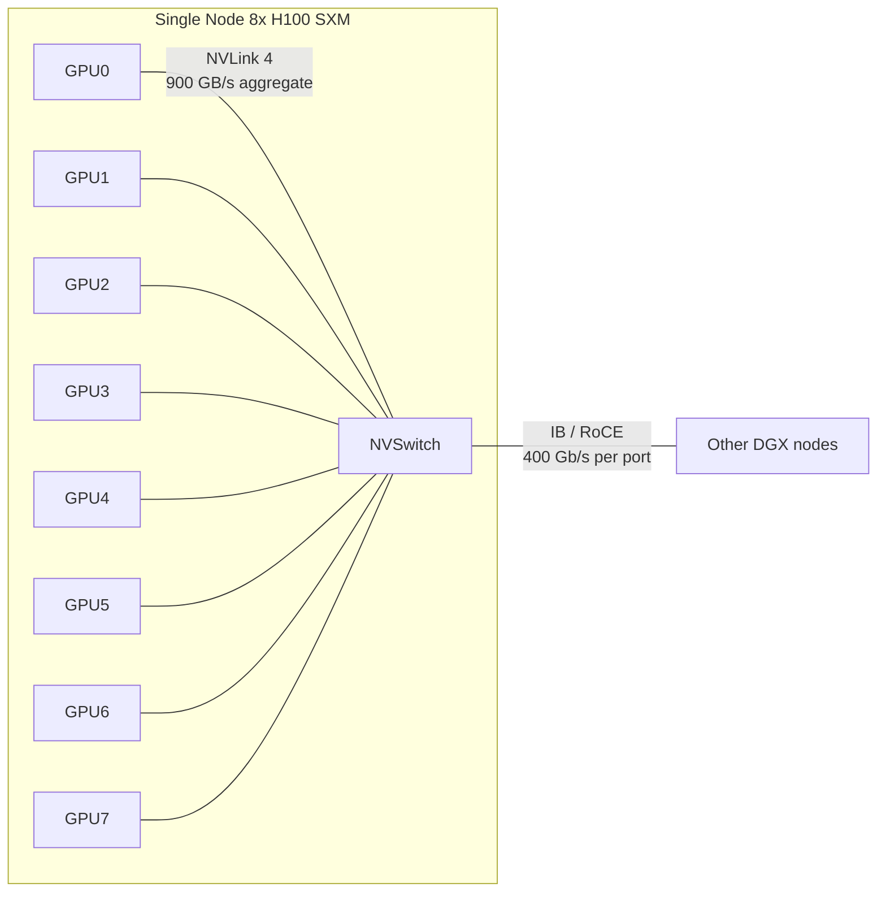

# NCCL & AllReduce Internals

<Mode is="learn">

In a managed-runtime language, when you make a function call across processes, an RPC framework hides the wire. Distributed training is the opposite contract: every step in your forward pass is a synchronous all-to-all phone call with seven other GPUs, the wire matters, and when one party is silent the entire job freezes. **NCCL** (NVIDIA Collective Communication Library) is what runs that phone call. Most engineers learn its API through PyTorch's `dist.all_reduce(...)` and never look underneath. The first time you debug a hang at 3 a.m. is the day you wish you had.

This lesson is the layer that distributed training actually runs on: the six primitives, the ring vs tree algorithms, the NVLink/IB topology that decides which one wins, and — most importantly — the debugging playbook for when the job stalls. After this you should be able to read `NCCL_DEBUG=INFO` output, identify the ring topology, predict bandwidth from message size, and walk a hang back to its root cause without panicking.

## TL;DR

- **NCCL is the wire layer of distributed training.** Six primitives: AllReduce, AllGather, ReduceScatter, Broadcast, Reduce, AllToAll. Every parallelism strategy (DP, TP, PP, FSDP, EP) decomposes into one or more of these.
- **Ring AllReduce is bandwidth-optimal**: each link carries `2(N-1)/N × buffer_size` bytes total. **Tree is latency-optimal**: `log(N)` round-trips. NCCL picks per-message-size with a tunable threshold (`NCCL_ALGO=Ring|Tree|CollNet|NVLS`).
- **Topology decides everything.** On 8×H100 SXM (DGX), every GPU has 18 NVLink-4 links to NVSwitch at 900 GB/s aggregate. Across nodes, you cross InfiniBand or RoCE at 400 Gb/s per port. **NCCL builds different rings for different topologies and the ring it picks is in `NCCL_DEBUG=INFO`.**
- **Hangs have three classes**: shape/dtype mismatch (one rank issues a different collective), silent rank loss (cgroup OOM, segfault, network partition), and timeline drift (one rank delayed past the timeout). Each leaves a different fingerprint in the NCCL log.
- **The five environment variables every distributed engineer sets**: `NCCL_DEBUG=INFO`, `NCCL_DEBUG_SUBSYS=COLL,P2P,NET`, `NCCL_ASYNC_ERROR_HANDLING=1`, `NCCL_TIMEOUT_MS=600000`, and a sane `NCCL_SOCKET_IFNAME` if you have multiple NICs. Without these, debugging is guesswork.

## The concept, in plain English

Eight GPUs, each holding a slice of the same gradient tensor, need to end up holding the *sum* of all eight slices, then divide by 8 to get the average. That is one AllReduce operation, and the same primitive runs once or twice per training step on every parameter. Ring AllReduce solves this by having each GPU hold one shard at a time — pass to the next GPU around the ring, accumulate, repeat 2(N-1) times, and at the end every GPU has the full sum. Tree AllReduce solves it differently — combine pairwise up a tree, broadcast back down — but uses log(N) sequential steps where ring uses a constant per-step but more total cycles.

The choice between them is one of the most-cited distributed-systems facts: **ring is bandwidth-optimal because every link is used in every cycle**; **tree is latency-optimal because the depth is log(N) instead of 2(N-1)**. For large messages, ring wins because bandwidth dominates wall time. For small messages, tree wins because latency dominates. NCCL has a built-in threshold and uses the right one automatically — but on a topology it doesn't recognize, it can pick wrong, and reading the log is how you find out.

## Mental model — the topology decides



Three layers, three bandwidths:

1. **Intra-node, NVLink/NVSwitch** — 900 GB/s aggregate per H100 SXM, full bisection on DGX H100. This is where ring AllReduce inside a node spends most of its time and where 95% of the bandwidth lives.
2. **Inter-node, InfiniBand or RoCE** — 400 Gb/s per port on modern frontier deployments (4× 100 Gb/s links bonded). Two orders of magnitude slower than NVLink.
3. **PCIe fallback** — when GPUs don't share an NVLink domain (HGX 4×H100 with PCIe between pairs, or older DGX-1 with NVLink-1 limitations) — about 64 GB/s per direction. Three orders of magnitude slower than NVLink-4.

NCCL builds a ring that minimizes traversals of the slowest tier. On 8×H100 with full NVSwitch, the ring is one hop per step over NVLink. On 16×H100 across two nodes, the ring is 14 NVLink hops + 2 IB hops. PXN (PCIe Cross-Node) is the fallback when the rail topology has no clean ring.

## The six collective primitives

| Primitive | Semantics | Used by |
| --- | --- | --- |
| **AllReduce** | Every rank ends with the sum (or max, etc.) of all ranks' inputs | Data-parallel gradient sync; tensor-parallel forward result |
| **AllGather** | Every rank ends with the concatenation of all ranks' inputs | FSDP parameter gather; tensor-parallel column-parallel forward |
| **ReduceScatter** | Inverse of AllGather: every rank ends with one shard of the sum | FSDP gradient sharding; tensor-parallel row-parallel forward |
| **Broadcast** | Rank `r` sends to all others | Pipeline-parallel handoff; init-time weight broadcast |
| **Reduce** | Every rank's input is summed into rank `r` | Rare; pipeline-parallel loss reduction |
| **AllToAll** | Each rank sends a different shard to every other rank | Expert-parallel (MoE); sequence-parallel gather |

The decomposition of training strategies:

- **Data-parallel**: one AllReduce per parameter per step (or AllReduce-overlapped-with-bucketing for efficiency).
- **Tensor-parallel** (Megatron-style): two AllReduces per transformer block (one in attention, one in FFN), or AllGather + ReduceScatter for sequence parallelism.
- **FSDP / ZeRO-3**: AllGather to materialize parameters before forward, ReduceScatter to shard gradients in backward.
- **Pipeline-parallel**: Send/Recv for activations between stages (point-to-point, not collective).
- **Expert-parallel**: AllToAll to route tokens to experts, AllToAll to return.

Knowing which primitive a strategy uses is half of debugging — when the hang fingerprint says "stalled in `ncclAllReduce` on call number 47," you immediately know the layer.

## Ring AllReduce — the bandwidth-optimal math

Ring AllReduce on N ranks works in two phases, **2(N−1) steps total**:

1. **Reduce-scatter phase** (N−1 steps): each rank sends one shard to its right neighbour and receives one shard from its left, accumulating. After N−1 steps, each rank holds *one shard* containing the sum of that shard from all ranks.
2. **All-gather phase** (N−1 steps): each rank passes its summed shard around the ring. After N−1 more steps, every rank has every summed shard.

Each step transfers `buffer_size / N` bytes per link. Total bytes per link across all 2(N−1) steps:

```text
total_bytes_per_link = 2 * (N-1) * (buffer / N)
                     ≈ 2 * buffer * (N-1)/N
                     ≈ 2 * buffer  (as N grows large)
```

The key result: **as N grows, total bandwidth used per link approaches 2× buffer_size, independent of N.** Ring AllReduce scales perfectly because every link is busy every cycle.

For a 1 GB tensor on a node with 8 H100 SXM (900 GB/s NVLink aggregate, ~600 GB/s sustained per link in practice):

```text
ring_time ≈ 2 * 1 GB / 600 GB/s ≈ 3.3 ms
```

Tree AllReduce on the same payload would take `log2(8) = 3` round-trips of message + small overhead — wins for small messages (latency-bound), loses for big ones (bandwidth-bound). NCCL's default crossover is around 1 MB; below that it picks tree, above that it picks ring.

## NCCL's debug log — what to read

Set `NCCL_DEBUG=INFO` before you launch and you get the topology built at init. The first 50 lines look like:

```text
NCCL INFO Bootstrap : Using eth0:10.0.0.1<0>
NCCL INFO Topology detection : 8 GPUs, 1 NUMA, 0 CPU
NCCL INFO Channel 00 :  0[0] -> 1[0] [send] via NET/IB/0
NCCL INFO Channel 00 :  1[0] -> 2[0] [send] via P2P/CUMEM
NCCL INFO Channel 00 :  2[0] -> 3[0] [send] via P2P/CUMEM
...
NCCL INFO Connected all rings, comm 0x7f02..., ringTotal 4
NCCL INFO  Ring 00 :    0  1  2  3  4  5  6  7
NCCL INFO  Tree 00 :  Tree(parent 0, children [-1, 1, 2, 3, ... ])
NCCL INFO Algo: Ring (default), Buffer size: 4194304 bytes
```

What to extract:

- **`Ring 00 : 0 1 2 3 4 5 6 7`** — the ring traversal order. On 8×H100 SXM with NVSwitch, this should be a clean linear pass; on PCIe systems it may zigzag through P2P-capable pairs.
- **`Channel 00`** — NCCL builds multiple parallel channels (rings) for higher throughput; 4–16 channels is typical on modern hardware.
- **`P2P/CUMEM`** vs **`NET/IB`** — the transport. P2P is intra-node NVLink; NET/IB is InfiniBand for inter-node hops.
- **`PXN`** — appears in the log when NCCL falls back to PCIe Cross-Node mode. Means you're paying PCIe latency for some part of the ring; usually a misconfigured rail-aligned setup.
- **`Algo: Ring`** — the algorithm picked for this comm. NCCL re-evaluates per call based on size; reading the log per-call requires `NCCL_DEBUG_SUBSYS=COLL`.

A healthy log on 8×H100 SXM has linear rings, all P2P/CUMEM transports, no PXN, 4+ channels, and ring algorithm above 1 MB. If you see a zigzag ring or PXN, your topology is mis-detected and you're leaving bandwidth on the floor.

## The three hang classes — fingerprints

### Class 1: Shape or dtype mismatch

One rank calls `dist.all_reduce(tensor_fp16)` and another calls `dist.all_reduce(tensor_bf16)`. NCCL's per-rank state machines diverge; the ring stalls partway through.

**Fingerprint**: NCCL log shows the collective started on all ranks but never completed; `NCCL_DEBUG_SUBSYS=COLL` reveals the size or dtype field differs between ranks at the start of the hung op.

**Common causes**: `dtype=` mismatch from autocast scope differences, batch-size mismatch when one rank gets fewer samples (uneven DataLoader), tensor-shape mismatch when one rank has a different sequence length.

**Fix**: assert dtype + shape consistency at every collective entry. PyTorch's `dist.barrier()` before the suspect op + an `assert tensor.shape == expected_shape` on every rank narrows it instantly.

### Class 2: Silent rank loss

One rank crashes mid-step (cgroup OOM-kill, CUDA error, segfault). The other ranks issue the next collective and wait forever for the dead rank's contribution.

**Fingerprint**: `nvidia-smi` on the node shows the GPU process gone for one rank; `dmesg` shows the OOM-kill or segfault; the surviving ranks' NCCL log shows them stuck on a collective just after the rank disappeared.

**Common causes**: cgroup memory limit hit on one container (container OOM), CUDA OOM with `expandable_segments` not configured, NIC reset, network partition, NaN-induced abort.

**Fix**: enable `NCCL_ASYNC_ERROR_HANDLING=1` so a NCCL timeout raises an exception instead of hanging forever. Set a sane `NCCL_TIMEOUT_MS` (default is 30 minutes; for debug, drop to 5 minutes). Always run with `torchrun --max-restarts=0` during debug so the dead rank doesn't get silently restarted.

### Class 3: Timeline drift

All ranks alive, all running the right code, but one rank is consistently slower (slow GPU, throttled NVLink, busy NIC). It eventually exceeds the NCCL timeout and the job aborts.

**Fingerprint**: throughput slowly degrades over training steps; one rank's NCCL log shows it consistently completing collectives 200–500 ms after the others; eventually `NCCL_TIMEOUT_MS` triggers.

**Common causes**: ECC errors throttling one GPU's clock, thermal throttling, NIC contention with another job on the same fabric, broken cable on one IB port.

**Fix**: log per-rank step time. If one rank is consistently slow, swap it out (rented hardware) or check `nvidia-smi -q | grep -i throttle`. ECC-throttled GPUs need replacement.

## The debugging workflow

When a hang happens, the disciplined sequence is:

1. **Don't kill the job yet.** A live hang is more debuggable than a dead one.
2. **Check `nvidia-smi` on every node.** If a GPU is missing, you have Class 2 (silent rank loss) — go to dmesg for the cause.
3. **Run `py-spy dump --pid <each_rank_pid>`** in a parallel terminal. Stack trace per rank tells you which collective they're stuck on. If they're not all on the same line, that's the divergence point.
4. **Diff the NCCL_DEBUG=INFO logs across ranks** (`diff rank0.log rank3.log`). The last common timestamp is the divergence. Anything after is the failure mode.
5. **`NCCL_DEBUG_SUBSYS=COLL` on the next reproduction** to see per-collective size/dtype on each rank. Mismatches show up as different bytes-counts at the hang point.
6. **Now kill the job.** Apply the fix, restart with the same env vars, confirm the timeline matches across ranks.

This is the playbook. Once you've done it three times, you stop fearing hangs.

## Concrete walkthrough — predicting AllReduce time

You have an 8×H100 SXM node (NVSwitch, 900 GB/s NVLink-4 aggregate per GPU, ~600 GB/s sustained per ring link in practice). You call AllReduce on a tensor whose size is the gradient of one Llama 70B layer (about 800 MB in fp16). What's the expected time?

```python
def predict_allreduce_us(buffer_bytes, N, link_bw_gbps_sustained):
    # Ring AllReduce: 2(N-1)/N * buffer per link, and links run in parallel
    bytes_per_link = 2 * (N - 1) / N * buffer_bytes
    time_s = bytes_per_link / (link_bw_gbps_sustained * 1e9)
    return time_s * 1e6  # us

predict_allreduce_us(800e6, 8, 600)
# ≈ 2333 us = 2.3 ms
```

If your measured AllReduce takes 4 ms instead of 2.3 ms, the gap is real and worth investigating. Common causes: (a) bucket-size too small (NCCL hasn't merged enough buffers to amortize launch overhead), (b) channel count too low, (c) the ring isn't using NVLink — check the log.

If your measured AllReduce takes 30 ms, something is catastrophic — likely PXN engaged, or you're running over PCIe instead of NVLink. The NCCL log will tell you in the channel/transport lines.

## Run it in your browser — predict ring AllReduce time

<RunInBrowser
  description="Plug in your topology and message size; get the predicted AllReduce time."
  code={`def ring_allreduce_us(buffer_bytes, N, link_bw_gbps_sustained):
    """Ring AllReduce on N ranks with sustained per-link bandwidth."""
    bytes_per_link = 2 * (N - 1) / N * buffer_bytes
    time_us = bytes_per_link / (link_bw_gbps_sustained * 1e9) * 1e6
    return time_us


def tree_allreduce_us(buffer_bytes, N, link_bw_gbps_sustained, latency_us=10):
    """Tree AllReduce: log2(N) round-trips + send the buffer log2(N) times."""
    import math
    depth = math.ceil(math.log2(N))
    time_us = 2 * depth * buffer_bytes / (link_bw_gbps_sustained * 1e9) * 1e6
    time_us += depth * latency_us  # per-hop launch + serialization
    return time_us


# Topologies to compare
configs = [
    ("8xH100 SXM NVSwitch (intra-node)",  8, 600),
    ("16xH100 across 2 nodes (NVL+IB)",   16,  50),  # IB bottleneck
    ("32xH100 across 4 nodes",            32,  50),
    ("8xA100 PCIe (no NVLink-4)",          8,  60),  # PCIe bottleneck
]

print(f"{'topology':<38}  {'msg':>8}  {'ring (us)':>12}  {'tree (us)':>12}  {'winner':>8}")
print("-" * 90)
for label, N, bw in configs:
    for msg_bytes, msg_label in [(8e6, '8 MB'), (80e6, '80 MB'), (800e6, '800 MB')]:
        ring = ring_allreduce_us(msg_bytes, N, bw)
        tree = tree_allreduce_us(msg_bytes, N, bw)
        winner = "ring" if ring < tree else "tree"
        print(f"{label:<38}  {msg_label:>8}  {ring:>12.1f}  {tree:>12.1f}  {winner:>8}")
`}
/>

You'll see ring win for big messages (the bandwidth-bound regime), tree win for small messages (the latency-bound regime), and the crossover shift based on N and link bandwidth. NCCL chooses automatically; reading the log tells you whether it picked right.

## Quick check

<Quiz
  question="An 8-rank FSDP job hangs after 200 training steps. py-spy on each rank shows: ranks 0, 1, 2, 4, 5, 6, 7 all stuck on the same line in `_dist.all_gather_into_tensor`, but rank 3 is in `_call_internal_callback` (a Python error handler). nvidia-smi on rank 3's GPU shows the process is gone. Which class of hang is this?"
  options={[
    'Class 1 — shape/dtype mismatch in AllGather.',
    'Class 2 — silent rank loss; rank 3 died and the others are waiting forever for it.',
    'Class 3 — timeline drift; rank 3 is just slow.',
    'NCCL bug requiring a library upgrade.',
  ]}
  answer={1}
  explanation="The fingerprint is unambiguous: rank 3's process is gone (nvidia-smi confirms), it died in a Python callback (likely from a CUDA error or segfault), and the other 7 ranks are stalled on AllGather waiting for its contribution. The fix path is to find why rank 3 died (dmesg for OOM-kill, CUDA error logs, NaN abort) and to enable NCCL_ASYNC_ERROR_HANDLING=1 so the next time the job raises an exception instead of hanging forever. Class 1 (mismatch) would show all ranks alive but stuck. Class 3 (drift) would show all ranks alive with one slow but eventually completing. NCCL bugs are rare and almost never the answer for a first-time multi-rank issue."
/>

## Key takeaways

1. **NCCL is the wire layer.** Six primitives, two algorithms (ring / tree), one library — every distributed strategy decomposes into these.
2. **Ring is bandwidth-optimal, tree is latency-optimal.** NCCL picks per call based on size; threshold is roughly 1 MB. Read `NCCL_DEBUG=INFO` to confirm.
3. **Topology decides bandwidth.** Intra-node NVLink-4 ≈ 900 GB/s aggregate; inter-node IB/RoCE ≈ 400 Gb/s per port; PCIe fallback ≈ 64 GB/s. The NCCL log shows the transport per channel.
4. **Three hang classes**: shape/dtype mismatch, silent rank loss, timeline drift. Each leaves a different fingerprint in py-spy + NCCL log.
5. **Five env vars**: `NCCL_DEBUG=INFO`, `NCCL_DEBUG_SUBSYS=COLL,P2P,NET`, `NCCL_ASYNC_ERROR_HANDLING=1`, `NCCL_TIMEOUT_MS=600000`, `NCCL_SOCKET_IFNAME` (when multiple NICs). Always set them before launch.

## Go deeper

<Resources
  items={[
    { kind: 'docs', href: 'https://docs.nvidia.com/deeplearning/nccl/user-guide/docs/index.html', title: 'NCCL User Guide', author: 'NVIDIA', note: 'The reference. Read the Environment Variables and Troubleshooting sections in full once.' },
    { kind: 'paper', href: 'http://research.baidu.com/bringing-hpc-techniques-deep-learning/', title: 'Bringing HPC Techniques to Deep Learning — Ring AllReduce', author: 'Baidu Research (2017)', note: 'The original ring AllReduce explanation. The bandwidth-optimality derivation.' },
    { kind: 'docs', href: 'https://github.com/NVIDIA/nccl/blob/master/README.md', title: 'NCCL Source Repository', author: 'NVIDIA', note: 'For deep dives, read `src/transport/` for the topology code and `src/collectives/` for the algorithm implementations.' },
    { kind: 'blog', href: 'https://www.uber.com/blog/horovod/', title: 'Horovod: Uber\'s Open Source Distributed Deep Learning', author: 'Uber Engineering (2017)', note: 'The first widely-adopted ring-AllReduce wrapper. Historical context for why this primitive matters.' },
    { kind: 'paper', href: 'https://arxiv.org/abs/2306.04687', title: 'PyTorch FSDP: Experiences on Scaling Fully Sharded Data Parallel', author: 'Meta AI (2023)', note: 'Section 5 covers the AllGather + ReduceScatter pattern that drives FSDP communication, with NCCL tuning notes.' },
    { kind: 'docs', href: 'https://docs.nvidia.com/deeplearning/nccl/user-guide/docs/env.html', title: 'NCCL Environment Variables Reference', author: 'NVIDIA', note: 'The complete env var list. Bookmark this; you will reference it any time something is off.' },
    { kind: 'video', href: 'https://www.youtube.com/watch?v=8sJpxIcZP_o', title: 'GTC 2024 — Distributed Training at Scale', author: 'NVIDIA / multiple', note: 'A practical walkthrough of multi-node FSDP debugging including NCCL log reading.' },
    { kind: 'blog', href: 'https://github.com/stas00/ml-engineering', title: 'Stas Bekman — ML Engineering Open Book', author: 'Stas Bekman', note: 'The hard-won lessons of someone who has actually debugged hundreds of distributed training failures. The "Network Debug" chapter is required reading.' },
  ]}
/>

</Mode>

<Mode is="reference">

## TL;DR

- **NCCL is the wire layer of distributed training.** Six primitives: AllReduce, AllGather, ReduceScatter, Broadcast, Reduce, AllToAll. Every parallelism strategy (DP, TP, PP, FSDP, EP) decomposes into one or more of these.
- **Ring AllReduce is bandwidth-optimal**: each link carries `2(N-1)/N × buffer_size` bytes total. **Tree is latency-optimal**: `log(N)` round-trips. NCCL picks per-message-size with a tunable threshold (`NCCL_ALGO=Ring|Tree|CollNet|NVLS`).
- **Topology decides everything.** On 8×H100 SXM (DGX), every GPU has 18 NVLink-4 links to NVSwitch at 900 GB/s aggregate. Across nodes, you cross InfiniBand or RoCE at 400 Gb/s per port. NCCL builds different rings for different topologies and the ring it picks is in `NCCL_DEBUG=INFO`.
- **Hangs have three classes**: shape/dtype mismatch (one rank issues a different collective), silent rank loss (cgroup OOM, segfault, network partition), and timeline drift (one rank delayed past the timeout). Each leaves a different fingerprint in the NCCL log.
- **The five environment variables every distributed engineer sets**: `NCCL_DEBUG=INFO`, `NCCL_DEBUG_SUBSYS=COLL,P2P,NET`, `NCCL_ASYNC_ERROR_HANDLING=1`, `NCCL_TIMEOUT_MS=600000`, and a sane `NCCL_SOCKET_IFNAME` if you have multiple NICs. Without these, debugging is guesswork.

## Why this matters

Atlas Year 1 has a literal task: "have you ever debugged an NCCL hang? Answer with a yes." Every distributed-training role at frontier labs (Anthropic, OpenAI, Meta, DeepMind, NVIDIA, Together) probes this in interviews — usually with a transcript of NCCL_DEBUG=INFO output and the question "what went wrong?" Engineers who've never read that log freeze; engineers who have walk through it in 60 seconds. The gap is not knowledge of FSDP semantics; it is fluency with the wire layer underneath.

The deeper reason is that distributed training is the only place in the AI stack where bandwidth is the binding constraint and latency is non-trivial. Kernel work cares about HBM bandwidth (3.35 TB/s); distributed work cares about NVLink (900 GB/s) and IB (400 Gb/s). The math, the diagnostic tools, and the failure modes are all different. NCCL is the boundary.

## Mental model


## The six primitives — full mapping

| Primitive | Semantics | Strategy uses | Typical message size |
| --- | --- | --- | --- |
| AllReduce | Sum/max/etc all → all | DP gradient sync | 100 MB – 1 GB per layer |
| AllGather | All → concatenated all | FSDP param gather; TP column-parallel forward | 1 MB – 100 MB |
| ReduceScatter | Sum + shard back | FSDP grad shard; TP row-parallel forward | 1 MB – 100 MB |
| Broadcast | One → all | PP handoff; init weight broadcast | 100 MB – 10 GB |
| Reduce | All → one (sum) | PP loss reduction | 100 KB – 10 MB |
| AllToAll | Personalized all → all | EP / MoE token routing; SP gather | 1 KB – 100 MB |

Each has its own NCCL routine: `ncclAllReduce`, `ncclAllGather`, `ncclReduceScatter`, `ncclBroadcast`, `ncclReduce`, `ncclAllToAll`. PyTorch wraps them as `dist.all_reduce()`, etc. The Python and the C ABI map 1:1.

## Ring AllReduce — formal derivation

Total bytes traversing each link in a ring AllReduce of buffer size `B` across `N` ranks:

```text
Phase 1 — reduce-scatter (N-1 steps):
  per step, per link, each rank sends B/N bytes
  total per link = (N-1) * B/N

Phase 2 — all-gather (N-1 steps):
  per step, per link, each rank sends B/N bytes
  total per link = (N-1) * B/N

Total per link = 2(N-1)/N * B
              ≈ 2B  as N → ∞
```

This is bandwidth-optimal: any AllReduce algorithm must transmit at least `2B(N-1)/N` per link (lower bound from the reduce-broadcast structure). Ring achieves this bound exactly.

Tree AllReduce on the same payload uses `2 * log2(N) * B / N_tree_branches` bytes per link in the worst case but only `O(log N)` sequential steps. For small messages where launch latency dominates, tree wins; for large messages where bandwidth dominates, ring wins. NCCL crossover threshold is around 1 MB on H100.

## Bandwidth math — concrete

Sustained per-link bandwidth on common topologies (real, not theoretical peak):

| Hardware | Per-link sustained | Aggregate per GPU | Notes |
| --- | --- | --- | --- |
| H100 SXM NVLink-4 | 600 GB/s | 900 GB/s (aggregate) | DGX H100 with NVSwitch full bisection |
| A100 SXM NVLink-3 | 250 GB/s | 600 GB/s | DGX A100 |
| H200 NVLink-4 | 600 GB/s | 900 GB/s | Same NVLink as H100 |
| B200 NVLink-5 | 1800 GB/s | 1800 GB/s | First-gen NVLink-5; 2× over H100 |
| InfiniBand HDR-200 | 25 GB/s | 100 GB/s (4-port) | Per-rail bonding |
| InfiniBand NDR-400 | 50 GB/s | 200 GB/s (4-port) | Frontier-era IB |
| Ethernet RoCE 400G | 50 GB/s | 200 GB/s | Cheaper alternative to IB |
| PCIe Gen5 x16 | 64 GB/s | per-direction | Fallback when no NVLink |

For an 8×H100 SXM AllReduce of a 1 GB tensor:

```text
ring_time ≈ 2 * 1 GB * 7/8 / 600 GB/s ≈ 2.9 ms
```

For a 16×H100 (two-node) AllReduce of the same tensor where the IB hop is 200 GB/s aggregate:

```text
intra_node_part ≈ 2.9 ms (same as before)
inter_node_part ≈ 2 * 1 GB / 200 GB/s ≈ 10 ms
total ≈ ~13 ms (the IB hop dominates)
```

This is why frontier training runs care so much about minimizing inter-node traffic — every bit that crosses IB is roughly 4× more expensive than the intra-node baseline.

## NCCL_DEBUG=INFO — full reference

Sample output anatomy:

```text
NCCL INFO Bootstrap : Using eth0:10.0.0.1<0>
NCCL INFO NCCL version 2.20.5+cuda12.4
NCCL INFO Topology detection : 8 GPUs, 1 NUMA, 0 CPU
NCCL INFO Nvml : NVML 12.4 detected
NCCL INFO P2P/IB Symmetric : true (IB nodes 1, GPUs 8)
NCCL INFO Setting affinity for GPU 0 to ff,fffff
NCCL INFO Channel 00 :  0[0] -> 1[0] [send] via P2P/CUMEM/0
NCCL INFO Channel 01 :  0[0] -> 1[0] [send] via P2P/CUMEM/1
...
NCCL INFO  Ring 00 :    0  1  2  3  4  5  6  7
NCCL INFO  Ring 01 :    0  2  4  6  1  3  5  7  (alternate ring)
NCCL INFO  Tree 00 :  Tree(parent=-1, children=[1, 4])
NCCL INFO Connected all rings, comm 0x7f02..., ringTotal 4, treeTotal 2
NCCL INFO Algo: Ring (default for >1 MB), Buffer size: 4194304 bytes
NCCL INFO Initialized comm 0x7f02... with 4 rings, 2 trees
```

What to extract:

- **Bootstrap interface**: which NIC NCCL used for rendezvous. If wrong, `NCCL_SOCKET_IFNAME` overrides.
- **Topology detection**: GPU count, NUMA domains, CPU sockets. Confirm matches your hardware.
- **P2P/CUMEM**: NVLink P2P. **NET/IB**: InfiniBand. **NET/Socket**: TCP fallback (slow). **PXN**: PCIe Cross-Node fallback.
- **Ring N : ...**: ring traversal order. Multiple rings (channels) are healthy; 4–16 is typical.
- **Algo: Ring vs Tree**: which algorithm NCCL picks by default. Override with `NCCL_ALGO`.

For per-collective tracing add `NCCL_DEBUG_SUBSYS=COLL` — every AllReduce/AllGather logs its size, type, dtype, and timing.

## Hang fingerprints — diagnostic table

| Symptom | py-spy on ranks | nvidia-smi | NCCL log | Class |
| --- | --- | --- | --- | --- |
| All ranks alive, stuck on same line | All same line | All processes present | Last common collective then silence | Class 1 (mismatch) |
| All but one rank stuck on same line | One rank in error handler | One rank's process gone | One rank's log ends; others stall | Class 2 (rank loss) |
| All ranks alive, throughput degrading | Different lines, varying | All present, one throttled | One rank consistently late | Class 3 (drift) |
| All ranks alive, NCCL log silent | Stuck in init | All present | Bootstrap step but no rings | Network setup issue |

Apply this table top-to-bottom; first match is usually right.

## The five debug env vars

```bash
# Always set these before any multi-rank launch
export NCCL_DEBUG=INFO
export NCCL_DEBUG_SUBSYS=COLL,P2P,NET     # what to log; INIT also useful
export NCCL_ASYNC_ERROR_HANDLING=1        # raise on timeout instead of hanging
export NCCL_TIMEOUT_MS=600000             # 10 min; lower for active debug
export NCCL_SOCKET_IFNAME=eth0            # if multiple NICs
```

For deeper investigation:

```bash
export NCCL_DEBUG=TRACE                    # very verbose; use sparingly
export NCCL_DEBUG_FILE=/tmp/nccl.%h.%p.log # one log file per host/pid
export NCCL_ALGO=Ring                      # force ring (debug topology)
export NCCL_PROTO=LL                       # force LL (low-latency) protocol
export NCCL_P2P_DISABLE=1                  # disable NVLink (debug NET path)
export NCCL_IB_DISABLE=1                   # disable IB (force socket fallback)
```

For tuning:

```bash
export NCCL_BUFFSIZE=8388608               # 8 MB (default 4 MB); larger reduces overhead
export NCCL_NTHREADS=512                   # CTA-level thread count for collectives
export NCCL_MIN_NCHANNELS=4                # force minimum channels (higher BW, more overhead)
```

## Concrete walkthrough — diagnosing Class 1 (shape mismatch)

Job stalls at step 87. py-spy on all 8 ranks shows the same line:

```
File "/.../torch/distributed/c10d_logger.py", line 75, in wrapper
  return func(*args, **kwargs)
File "/.../torch/distributed/distributed_c10d.py", line 2348, in all_gather_into_tensor
  work = group.allgather_into_tensor(output_tensor, input_tensor, opts)
```

All on the same line: rules out Class 2. nvidia-smi: all 8 GPUs running. Rules out rank loss. NCCL log shows AllGather call 87 started on all 8 ranks but did not complete. Re-run with `NCCL_DEBUG_SUBSYS=COLL`:

```text
[rank 0] NCCL INFO Coll allgather count=2097152 dtype=fp16 ...
[rank 1] NCCL INFO Coll allgather count=2097152 dtype=fp16 ...
...
[rank 6] NCCL INFO Coll allgather count=2097152 dtype=fp16 ...
[rank 7] NCCL INFO Coll allgather count=2097664 dtype=fp16 ...   ← differs
```

Rank 7's input has 2,097,664 elements vs the others' 2,097,152. That's exactly 512 elements more — likely a dropped padding token on one rank's input batch. Fix: assert `input.shape == expected_shape` at every collective entry, or add explicit padding so all ranks always send the same shape.

## Quick check

<Quiz
  question="An 8-rank FSDP job hangs after 200 training steps. py-spy on each rank shows: ranks 0, 1, 2, 4, 5, 6, 7 all stuck on the same line in `_dist.all_gather_into_tensor`, but rank 3 is in `_call_internal_callback` (a Python error handler). nvidia-smi on rank 3's GPU shows the process is gone. Which class of hang is this?"
  options={[
    'Class 1 — shape/dtype mismatch in AllGather.',
    'Class 2 — silent rank loss; rank 3 died and the others are waiting forever for it.',
    'Class 3 — timeline drift; rank 3 is just slow.',
    'NCCL bug requiring a library upgrade.',
  ]}
  answer={1}
  explanation="Rank 3's process is gone (nvidia-smi confirms) and it died in a Python callback. The other 7 ranks are stalled on AllGather waiting for its contribution. Find the cause of rank 3's death (dmesg for OOM-kill, CUDA error logs, NaN abort) and enable NCCL_ASYNC_ERROR_HANDLING=1 so the job raises an exception next time."
/>

## Key takeaways

1. NCCL is the wire layer. Six primitives, two algorithms, one library.
2. Ring is bandwidth-optimal (`2(N-1)/N × B` per link), tree is latency-optimal (`log N` rounds). NCCL chooses per-call.
3. Topology decides bandwidth: NVLink-4 = 600 GB/s sustained, IB-400G = 50 GB/s, PCIe = 64 GB/s.
4. Three hang classes: mismatch, rank loss, drift. Diagnose with py-spy + NCCL log diff.
5. Five env vars: `NCCL_DEBUG=INFO`, `NCCL_DEBUG_SUBSYS=COLL,P2P,NET`, `NCCL_ASYNC_ERROR_HANDLING=1`, `NCCL_TIMEOUT_MS`, `NCCL_SOCKET_IFNAME`.

## Go deeper

<Resources
  items={[
    { kind: 'docs', href: 'https://docs.nvidia.com/deeplearning/nccl/user-guide/docs/index.html', title: 'NCCL User Guide', author: 'NVIDIA' },
    { kind: 'paper', href: 'http://research.baidu.com/bringing-hpc-techniques-deep-learning/', title: 'Bringing HPC Techniques to Deep Learning — Ring AllReduce', author: 'Baidu Research (2017)' },
    { kind: 'docs', href: 'https://github.com/NVIDIA/nccl/blob/master/README.md', title: 'NCCL Source', author: 'NVIDIA' },
    { kind: 'paper', href: 'https://arxiv.org/abs/2306.04687', title: 'PyTorch FSDP: Experiences on Scaling Fully Sharded Data Parallel', author: 'Meta AI (2023)' },
    { kind: 'docs', href: 'https://docs.nvidia.com/deeplearning/nccl/user-guide/docs/env.html', title: 'NCCL Environment Variables Reference', author: 'NVIDIA' },
    { kind: 'video', href: 'https://www.youtube.com/watch?v=8sJpxIcZP_o', title: 'GTC 2024 — Distributed Training at Scale' },
    { kind: 'blog', href: 'https://github.com/stas00/ml-engineering', title: 'Stas Bekman — ML Engineering Open Book', author: 'Stas Bekman', note: 'The "Network Debug" chapter is required reading.' },
  ]}
/>

</Mode>

<LessonComplete />
