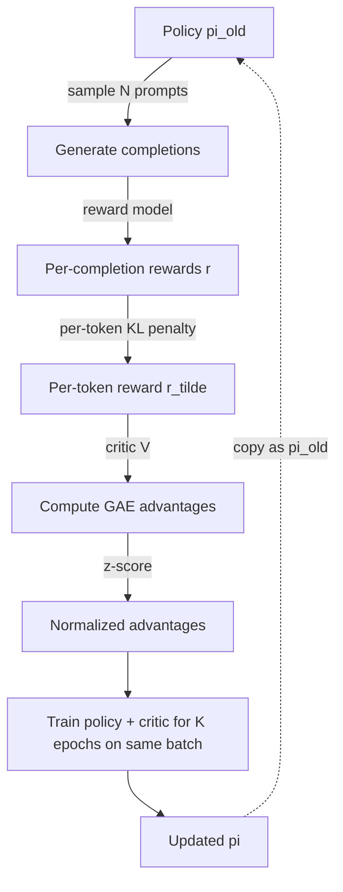

# PPO Deep Dive

<Mode is="learn">

PPO is the workhorse algorithm of LLM post-training. It's also notorious for being subtly broken in 9 out of 10 implementations. The math is on a postcard (you saw it in the trust-region lesson). The *engineering* is a 37-item bug list. This lesson is the algorithm-as-actually-deployed — with the advantage normalization, dual KL terms, value clipping, and reward scaling that make the difference between training that converges in 6 hours and training that diverges silently for 6 weeks.

## TL;DR

- **PPO loss for LLM RL** has 4 terms: clipped policy loss, value loss (often clipped too), entropy bonus (often zero for LLMs), KL anchor to reference.
- **GAE for advantage** with $\gamma = 1.0$, $\lambda \approx 0.95$ is standard.
- **Advantage normalization is mandatory** — batch-normalize advantages to mean 0 var 1 before applying. Without it, learning is brittle.
- **Reward shaping**: subtract per-token KL from per-token reward, OR add KL as a loss term. Both work; per-token KL gives smoother gradients.
- **K epochs of PPO over the same rollouts** (usually 2-4) — the importance ratio keeps the off-policy gradient correct within the trust region.
- **The 37 details** (Huang et al.) decide whether PPO works. Read the blog post before debugging *anything*.

## Why this matters

PPO is still the production algorithm at most frontier labs in 2026, even with GRPO/DPO popular in papers. Anthropic, OpenAI, Meta all run PPO variants for safety-critical post-training because of its long track record. If you join an RL Engineering team, you're going to be looking at PPO code on day one.

## The concept

The full PPO loss in LLM RL — every term spelled out:

$$
\mathcal{L} = \underbrace{-\mathbb{E}_t[\min(\rho_t \hat{A}_t, \text{clip}(\rho_t, 1-\epsilon, 1+\epsilon)\hat{A}_t)]}_{\text{policy loss}} + \underbrace{c_v \cdot \mathbb{E}_t[(V_\phi(s_t) - V_t^{target})^2]}_{\text{value loss}} - \underbrace{c_e \cdot \mathbb{E}_t[\mathcal{H}(\pi_\theta(\cdot|s_t))]}_{\text{entropy bonus}} + \underbrace{\beta \cdot KL(\pi_\theta \| \pi_{ref})}_{\text{KL anchor}}
$$

**Why each term exists:**

- **Policy loss (clip)**: the actor objective; the clip is the trust-region surrogate.
- **Value loss**: trains the critic; without it, advantage estimates degrade.
- **Entropy bonus**: encourages exploration. Almost always 0 in LLM RL — the base model already has plenty of entropy.
- **KL anchor**: stops the policy from drifting into reward-hacking gibberish. The single biggest knob.

**Reward shaping (the per-token KL trick):**

Many implementations subtract the per-token KL from the per-token reward *before* computing advantages:

$$
\tilde{r}_t = r_t - \beta \log \frac{\pi_\theta(a_t|s_t)}{\pi_{ref}(a_t|s_t)}
$$

This is equivalent in expectation to the explicit KL loss term but gives cleaner per-token gradients. Most modern code uses this.

## The 9 implementation details that matter most

From Huang et al.'s "37 implementation details" — the subset that bites everyone:

1. **Advantage normalization.** Per-batch z-score the advantages before computing the loss. Without this, learning is fragile.
2. **Value function clipping.** Clip $V_\phi$ updates to limit step size: $V^{new} = V^{old} + \text{clip}(V_\phi - V^{old}, -\epsilon, \epsilon)$.
3. **Gradient clipping.** Clip the gradient L2 norm to ~0.5-1.0. Without this, a single bad batch can blow up training.
4. **Learning rate annealing.** Linear decay from $1\text{e-}6$ to $1\text{e-}7$ over training. LLM RL is much more sensitive to LR than supervised.
5. **Use separate optimizers** for actor and critic if they're separate networks. (If sharing a backbone, one optimizer is fine.)
6. **K3 KL estimator** (not naive `mean(logp - ref_logp)`). Schulman's `exp(x) - x - 1`.
7. **Generate completions with the *current* policy each PPO iteration**, not a stale one. The off-policy gap matters.
8. **EOS handling**: mask out padding tokens in all losses; truncated rollouts are a common silent bug.
9. **Reward whitening (optional, recipe-dependent)**: running-mean-and-std normalize rewards before computing advantages. Helps with reward-magnitude shifts.

## Mental model — one PPO iteration



One PPO iteration is: rollout, compute reward+KL, compute GAE, normalize advantage, K epochs of gradient updates with importance ratio + clip.

## Memory budget (for a 7B policy)

| Component | Memory |
| --- | --- |
| Policy + Adam optimizer | ~42 GB |
| Reference (frozen, ideally INT8) | ~7 GB |
| Reward model (frozen, ideally INT8) | ~7 GB |
| Critic (separate or shared head) | 0-14 GB |
| Rollout activations + completions | 10-30 GB |
| **Total (single-GPU goal)** | **80-100 GB** |

7B PPO on a single H100 is *just barely* possible with INT8 ref+RM and a value-head critic. Anything larger requires FSDP/ZeRO.

## Key takeaways

1. **PPO is 4 loss terms**: clip + value + entropy + KL anchor. Memorize the formula.
2. **The 9 implementation details** (advantage norm, value clip, gradient clip, LR anneal, k3 KL, fresh rollouts, EOS masking, reward whitening) decide success.
3. **GAE($\lambda \approx 0.95$, $\gamma = 1.0$)** for the advantage estimator.
4. **K epochs of training per rollout batch** (typically 2-4) — importance ratio + clip keep this correct.
5. **The 37-details blog and Engstrom's "Implementation Matters" paper** should be your two go-to references whenever PPO misbehaves.

## Go deeper

<Resources
  items={[
    { kind: 'paper', href: 'https://arxiv.org/abs/1707.06347', title: 'Schulman et al. — Proximal Policy Optimization', author: 'Schulman et al. (2017)', note: 'The original PPO paper. 6 pages, required.' },
    { kind: 'blog', href: 'https://iclr-blog-track.github.io/2022/03/25/ppo-implementation-details/', title: 'Huang et al. — The 37 Implementation Details of PPO', note: 'The canonical "what your PPO is doing wrong" reference. Bookmark.' },
    { kind: 'paper', href: 'https://arxiv.org/abs/2009.10897', title: 'Engstrom et al. — Implementation Matters in Deep Policy Gradients', note: 'Empirical paper showing PPO performance is mostly implementation tricks. Sobering.' },
    { kind: 'paper', href: 'https://arxiv.org/abs/2403.17031', title: 'Hou et al. — Does PPO\'s Optimization Trick Matter?', note: 'Recent empirical revisit of which PPO tricks actually matter in LLM RL.' },
    { kind: 'repo', href: 'https://github.com/huggingface/trl/blob/main/trl/trainer/ppo_trainer.py', title: 'HF TRL — ppo_trainer.py', note: 'Reference PPO implementation for LLMs. Read it line by line.' },
    { kind: 'repo', href: 'https://github.com/OpenRLHF/OpenRLHF', title: 'OpenRLHF', note: 'Production-grade PPO trainer using Ray. Larger scale than TRL.' },
    { kind: 'paper', href: 'https://arxiv.org/abs/2310.10505', title: 'Zheng et al. — Secrets of RLHF in LLMs (Part I)', note: 'Empirical study of PPO\'s LLM-specific failure modes.' },
    { kind: 'paper', href: 'https://arxiv.org/abs/2401.06080', title: 'Zheng et al. — Secrets of RLHF (Part II): Reward Modeling', note: 'Same series, RM-focused. Pair with the PPO part.' },
    { kind: 'blog', href: 'https://www.interconnects.ai/p/ppo-and-its-modifications-for-llms', title: 'Nathan Lambert — PPO and its modifications for LLMs', note: 'The clearest survey of PPO variants in 2024-2025.' },
  ]}
/>

</Mode>

<Mode is="reference">

## TL;DR

- Full loss: clip + value + entropy + KL anchor (β).
- GAE λ=0.95, γ=1.0.
- 9 critical impl details: adv norm, value clip, grad clip, LR anneal, k3 KL, fresh rollouts, EOS mask, reward whitening, separate optimizers (if separate nets).
- K=2-4 PPO epochs per rollout batch.
- ~100 GB for 7B PPO; needs FSDP for anything bigger.

## Why this matters

Still the production default at frontier labs. Pure GRPO/DPO is what papers show; PPO variants are what ship.

## Concrete walkthrough

**Full loss (per-token):**

$$
\mathcal{L} = -\min(\rho_t \hat{A}_t, \text{clip}(\rho_t, 1-\epsilon, 1+\epsilon)\hat{A}_t) + c_v (V_\phi(s_t) - V^{target}_t)^2 + \beta (\exp(x_t) - x_t - 1)
$$

where $x_t = \log \pi_{ref}(a_t|s_t) - \log \pi_\theta(a_t|s_t)$ (Schulman k3).

**Per-token reward shaping (alternative to explicit KL loss):**

$$
\tilde{r}_t = r_t - \beta (\log \pi_\theta(a_t|s_t) - \log \pi_{ref}(a_t|s_t))
$$

Then compute GAE on $\tilde{r}_t$. Equivalent in expectation; cleaner per-token signal.

**Pseudo-code (one iteration):**

```python
# 1. Rollout
prompts = sample_prompts(N)
old_logp, completions = pi.generate(prompts)
rewards = reward_model(prompts, completions)

# 2. Per-token KL & shaped reward
ref_logp = ref.log_prob(completions, prompts)
kl_per_tok = old_logp - ref_logp
shaped_reward_per_tok = sparse_reward + (-beta * kl_per_tok)

# 3. GAE
values = critic(completions, prompts)
advantages, value_targets = gae(shaped_reward_per_tok, values, gamma=1.0, lam=0.95)
advantages = (advantages - advantages.mean()) / (advantages.std() + 1e-8)  # CRITICAL

# 4. K epochs of PPO
for epoch in range(K):  # K = 2 to 4
    new_logp = pi.log_prob(completions, prompts)
    ratio    = (new_logp - old_logp).exp()
    pg_loss  = -torch.min(ratio * advantages,
                          ratio.clamp(1-eps, 1+eps) * advantages).mean()
    v_loss   = 0.5 * (critic(...) - value_targets).pow(2).mean()
    loss     = pg_loss + c_v * v_loss
    loss.backward()
    torch.nn.utils.clip_grad_norm_(params, 1.0)  # CRITICAL
    optimizer.step()
```

## Key takeaways

1. 4 loss terms; PPO clip + value + entropy + KL.
2. Advantage normalization is non-optional.
3. K=2-4 epochs; importance ratio + clip handle off-policy.
4. Read the 37-details blog post.

## Go deeper

<Resources
  items={[
    { kind: 'paper', href: 'https://arxiv.org/abs/1707.06347', title: 'PPO', note: 'Original.' },
    { kind: 'blog', href: 'https://iclr-blog-track.github.io/2022/03/25/ppo-implementation-details/', title: 'The 37 details', note: 'Bug list.' },
    { kind: 'repo', href: 'https://github.com/OpenRLHF/OpenRLHF', title: 'OpenRLHF', note: 'Production trainer.' },
  ]}
/>

</Mode>

<LessonComplete />
