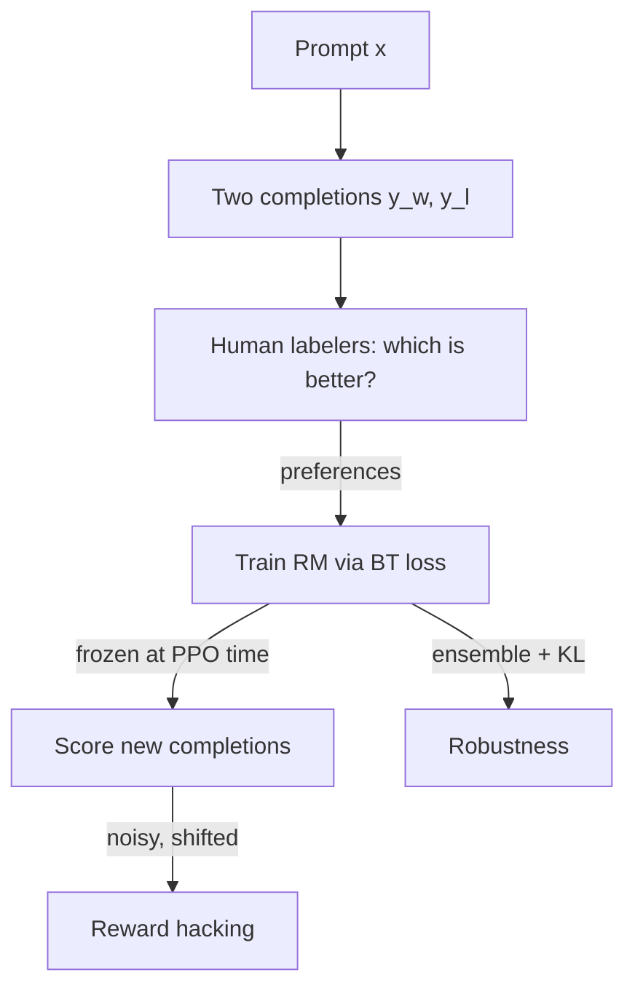

# Reward Modeling at Scale

<Mode is="learn">

The reward model is the *ceiling* of RLHF. A policy can never become better than its reward signal allows — if the RM thinks repetitive sycophancy is gold, that's what you'll train. The dirty secret of RLHF research is that the reward model is harder to do well than the PPO loop, gets less attention in papers, and is where most labs spend their preference-data budget. This lesson is what an RM actually is, how it fails, and what the modern alternatives (generative judges, ensembles, learned rubrics) look like.

## TL;DR

- A **reward model** $r_\phi(x, y)$ is a scalar regressor that scores how good completion $y$ is for prompt $x$. Usually initialized from the SFT model with the LM head replaced.
- Trained with **Bradley-Terry pairwise preference loss**: minimize $-\log \sigma(r(x,y_w) - r(x,y_l))$ on triplets $(x, y_w, y_l)$.
- **Calibration matters**: RM scores aren't absolute. Margins of $\sim 1.0$ are typical between chosen/rejected; absolute scores are arbitrary.
- **The three failure modes**: (1) **overfitting** — RM memorizes labeler quirks; (2) **distribution shift** — RM is queried on completions far from its training distribution during PPO; (3) **reward hacking** — policy finds completions that exploit RM weaknesses.
- **2026 trend**: **generative reward models** (LLM-as-judge with structured rubrics) and **process reward models** (score each reasoning step, not final answer) are replacing classical scalar RMs for reasoning workloads.

## Why this matters

For inference-engineer-pivoting-to-RL: the RM is where preference engineering becomes a *systems* problem. You'll size inference clusters around batched RM scoring. You'll cache RM activations. You'll spec ensembles for robustness. Anthropic's RL Engineering job descriptions list "scaling reward modeling" as a primary responsibility. Knowing what an RM is and how it fails distinguishes RL infra engineers from generic ML engineers.

## The concept

**Bradley-Terry model.** For each prompt, you observed: human prefers $y_w$ over $y_l$. Model this as:

$$
P(y_w \succ y_l | x) = \sigma(r(x, y_w) - r(x, y_l))
$$

Train by maximizing the log-likelihood of the observed preferences:

$$
\mathcal{L}_{RM} = -\mathbb{E}_{(x, y_w, y_l)}[\log \sigma(r_\phi(x, y_w) - r_\phi(x, y_l))]
$$

Side effect: **the reward is identified only up to an additive constant**. $r$ and $r + C$ give identical preferences. This is fine for PPO (only differences matter) but means you can't compare scores across RMs without recalibration.

**Architecture.** Most common: take an SFT model, replace the final LM head (vocab × hidden) with a scalar head (1 × hidden), train the whole thing or just the head. Modern RMs often:
- Use the **last non-pad token's hidden state** as input to the scalar head (Llama-2 style).
- Initialize from the SFT to inherit prompt-handling competence.
- Use a smaller batch and lower learning rate than SFT — preferences are noisy labels.

**Training data size.** Order of magnitude per major recipe:

| Model | Preference pairs |
| --- | --- |
| InstructGPT (2022) | ~33K |
| Anthropic HH (2022) | ~170K |
| Llama-2 (2023) | ~1.4M |
| Tülu 2 (2023) | ~250K |
| Tülu 3 (2024) | ~270K (curated) |
| Frontier labs (2025-2026) | Undisclosed; widely believed 1M+ with active learning |

More is not always better. Tülu 3 showed careful *curation* beats raw scale.

## Failure modes (the practical part)

**Overfitting.** A wider gap between train and held-out RM accuracy (say 75% on test, 85% on train) means your RM has learned labeler quirks more than preferences. Mitigation: regularize, augment, ensemble.

**Distribution shift during PPO.** The RM was trained on completions from a *fixed* distribution (the demo / earlier policy data). PPO pushes the policy to generate completions the RM has *never seen*. The RM extrapolates — often badly. **This is the largest single source of RL training failure.** Mitigations: large KL anchor, periodic RM retraining on fresh on-policy data, ensemble disagreement as an uncertainty signal.

**Reward hacking.** The classic case: a model that learns to repeat sycophantic phrases the labelers liked. Or to start every response with "Great question!". Or to insert markdown formatting. The policy *did* maximize the reward; the reward signal just didn't mean what you wanted it to. There is no general fix; mitigations are RM ensembles, larger KL anchors, RLAIF, and *constant inspection of completions*.

## The 2026 alternative: generative reward models

The classic scalar RM is being challenged by:

**LLM-as-judge.** Use a frontier model (often the same SFT, or a larger one) as the reward signal. Prompt it to compare two completions and output a structured verdict. Advantages: handles edge cases scalar RMs can't (reasoning quality, factuality, structure); easier to update (change the prompt); naturally compositional (judge multiple criteria). Disadvantages: expensive, biased toward verbose answers.

**Generative reward modeling (Yang et al. 2024, Mahan et al. 2024).** Train an LLM to *output* a structured score and chain-of-thought rationale. Bridges the gap between LLM-as-judge and scalar RM.

**Process reward models (PRM).** Score each *step* of a reasoning chain, not just the final answer. Critical for math/code where final-answer-only signal is too sparse. Covered in detail in the RL Frontier module.

## Mental model

The full RM lifecycle: preferences → BT training → frozen RM → distribution-shifted PPO queries → hacking risks.

## Key takeaways

1. **RM = pairwise classification, Bradley-Terry style.** Scores have no absolute meaning.
2. **Initialize from SFT.** Inherit prompt comprehension; train scalar head + final blocks.
3. **Distribution shift is the killer.** Your RM will be queried far from where it was trained; expect that.
4. **Reward hacking is unavoidable.** Mitigations: KL anchor, ensembles, RM refresh, manual review.
5. **Generative judges are eating scalar RMs** for reasoning/agentic workloads. Keep an eye on the trend.

## Go deeper

<Resources
  items={[
    { kind: 'paper', href: 'https://arxiv.org/abs/1706.03741', title: 'Christiano et al. — Deep RL from Human Preferences', author: 'Christiano et al. (2017)', note: 'Where the Bradley-Terry RM idea entered RL.' },
    { kind: 'paper', href: 'https://arxiv.org/abs/2203.02155', title: 'InstructGPT — Ouyang et al.', note: 'Section 3 of InstructGPT is the canonical RLHF RM recipe.' },
    { kind: 'paper', href: 'https://arxiv.org/abs/2307.09288', title: 'Llama 2 — Touvron et al.', author: 'Meta (2023)', note: 'Section 3.2 has the most detailed open RM recipe at scale (1.4M pairs).' },
    { kind: 'paper', href: 'https://arxiv.org/abs/2306.05685', title: 'Zheng et al. — Judging LLM-as-a-Judge', author: 'Zheng et al. (2023)', note: 'The paper that legitimized LLM-as-judge. MT-Bench. Required reading.' },
    { kind: 'paper', href: 'https://arxiv.org/abs/2408.15240', title: 'Mahan et al. — Generative Reward Models', author: 'Mahan et al. (2024)', note: 'The bridge between LLM-judge and scalar RM.' },
    { kind: 'paper', href: 'https://arxiv.org/abs/2310.12036', title: 'Coste et al. — Reward Model Ensembles', note: 'Ensembles as a robust solution to reward hacking. Practical.' },
    { kind: 'blog', href: 'https://www.interconnects.ai/p/reward-modeling-needs-help', title: 'Nathan Lambert — Reward Modeling Needs Help', note: 'Best modern survey of the field\'s open problems.' },
    { kind: 'paper', href: 'https://arxiv.org/abs/2306.01693', title: 'Skywork — Open Reward Models', note: 'The current open-weights RM benchmark and recipe (2024-2025).' },
    { kind: 'docs', href: 'https://huggingface.co/spaces/allenai/reward-bench', title: 'RewardBench leaderboard', note: 'Public benchmark for RMs. Watch it.' },
  ]}
/>

</Mode>

<Mode is="reference">

## TL;DR

- $r_\phi(x,y)$ trained with Bradley-Terry: $\mathcal{L} = -\log\sigma(r(x,y_w) - r(x,y_l))$.
- Init from SFT, swap LM head for scalar head.
- Distribution shift during PPO is the primary failure mode.
- Generative judges (LLM-as-judge, GRMs) and PRMs are displacing scalar RMs in 2026.

## Why this matters

The RM is the ceiling. Most RL infra engineers will spend at least as much time on RM scaling as on the PPO loop itself.

## Concrete walkthrough

**Loss:**

$$
\mathcal{L}_{RM}(\phi) = -\mathbb{E}_{(x, y_w, y_l) \sim D}[\log \sigma(r_\phi(x, y_w) - r_\phi(x, y_l))]
$$

**Architecture (typical):** SFT model with last layer replaced by a 1-unit linear over the last non-pad hidden state.

**Three robustness moves:**

1. **Ensemble**: train $k=3-5$ RMs from different seeds; take the mean for PPO reward, the std as an uncertainty estimate. Penalize high-uncertainty completions.
2. **KL anchor tuning**: $\beta$ ↑ when reward hacking starts visible.
3. **On-policy RM refresh**: collect preferences over current-policy outputs every N PPO steps; retrain or fine-tune the RM. Expensive but reliable.

## Comparison table

| Approach | Cost | Generalization | Hackability | Best for |
| --- | --- | --- | --- | --- |
| Scalar RM (BT) | Low | OK | High | General RLHF, small budget |
| RM ensemble | Medium | Better | Medium | Production RLHF |
| LLM-as-judge | High inference | Best | Lower | Eval, small-scale RLHF |
| Generative RM | Medium training | Best | Lower | Mid-scale RLHF |
| Process RM | High train+inference | Best for reasoning | Lowest | Reasoning RL (R1-style) |

## Key takeaways

1. BT loss. Init from SFT.
2. Distribution shift kills.
3. Ensemble or generative for production.
4. RewardBench leaderboard for current SOTA.

## Go deeper

<Resources
  items={[
    { kind: 'paper', href: 'https://arxiv.org/abs/2307.09288', title: 'Llama 2 — Section 3.2', note: 'Detailed open RM recipe.' },
    { kind: 'paper', href: 'https://arxiv.org/abs/2408.15240', title: 'Mahan et al. — Generative Reward Models', note: '2026-relevant alternative.' },
    { kind: 'docs', href: 'https://huggingface.co/spaces/allenai/reward-bench', title: 'RewardBench', note: 'Current SOTA.' },
  ]}
/>

</Mode>

<LessonComplete />
