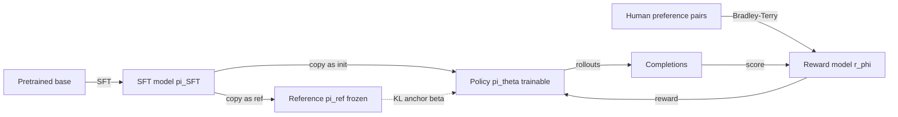

# The Full RLHF Pipeline

<Mode is="learn">

RLHF — Reinforcement Learning from Human Feedback — is the recipe that took GPT-3 (interesting but unusable) and produced ChatGPT (a product). It's three models in a trench coat: an SFT'd policy, a learned reward model, and a PPO loop that tunes the policy against the reward model with a KL anchor against the SFT. The story of post-training from 2022 to 2025 is essentially "what can we replace each of these three components with?" DPO killed the explicit reward model. GRPO killed the value head. Verifiable rewards killed the human labels. But the *shape* of the pipeline is still the reference architecture, and you'll see it in every paper.

## TL;DR

- **Three stages**: (1) Supervised fine-tuning on high-quality demos; (2) train a **reward model** from pairwise human preferences; (3) PPO-fine-tune the SFT model against the RM with a KL anchor to the SFT.
- **The reward model** is a separate network (often the same architecture, last-token classification head): outputs a scalar score $r(x,y)$. Trained with the Bradley-Terry pairwise-preference loss.
- **The PPO loop** treats the SFT model as the *reference* (KL anchor) and as the *initialization*. The RM stays frozen during PPO.
- **Why three stages**: SFT alone teaches the model the *kind* of response shape we want; RM alone scores responses; PPO is how the model *generalizes* the RM's preferences to new prompts the RM was never trained on.
- **Cost**: brutal. ~3× a single training run because you're holding ≥3 models in memory: policy, reference, reward model (and a value head). This is why DPO and GRPO matter.

## Why this matters

If you understand the InstructGPT recipe you understand the *architecture* of every preference-tuned model. DPO is "RLHF without explicit RL". GRPO is "RLHF without a reward model". Constitutional AI is "RLHF where AI writes the preferences". Knowing the original lets you read the simplifications as what they are.

## The concept

**Stage 1: SFT.** Take a pretrained base model. Fine-tune on $(prompt, demonstration)$ pairs. Cross-entropy loss. Result: a model that responds to prompts in roughly the right *form* — chatty, follows instructions superficially. ChatGPT-1 quality if you stop here. Demo dataset is small (~10K-100K) and high-quality (paid contractors writing model responses).

**Stage 2: Reward model (RM).**
- Collect pairwise preferences from human labelers: given a prompt and two completions, which is better?
- Train a model $r_\phi(x, y)$ that scores any completion under the **Bradley-Terry** loss:
$$
\mathcal{L}_{RM} = -\log \sigma(r_\phi(x, y_w) - r_\phi(x, y_l))
$$
where $y_w$ is the preferred completion. Margin is what's trained, not absolute score.
- The RM is usually initialized from the SFT model with the LM head swapped for a regression head.
- Critical: the RM is the *bottleneck* on RLHF quality. Garbage labels → garbage RM → garbage PPO.

**Stage 3: PPO.**
- Initialize policy from SFT. Hold a frozen copy as the **reference policy** $\pi_{ref}$.
- For each prompt: sample completion from policy, score with RM, compute advantage.
- PPO loss with KL anchor:
$$
\mathcal{L} = -\mathbb{E}[\text{PPO clip term}] + \beta \cdot KL(\pi_\theta \| \pi_{ref})
$$
- $\beta$ is the *anchor strength* — high $\beta$ keeps the policy near SFT, low $\beta$ lets it roam.

## Memory footprint (the engineering nightmare)

For a 7B policy, at full precision in standard implementations:

| Component | Approximate memory |
| --- | --- |
| Policy $\pi_\theta$ | 14 GB (BF16) + optimizer (28 GB Adam) |
| Reference $\pi_{ref}$ (frozen) | 14 GB |
| Reward model $r_\phi$ (frozen) | 14 GB (same size as policy, usually) |
| Critic / value head | ~14 GB (if separate model) |
| Activations during rollout | Variable, can dominate |

That's ~85 GB on a 7B; doesn't fit on a single H100 (80 GB) without ZeRO or quantization. *This* is why DPO eliminating the RM and GRPO eliminating the critic are huge engineering wins, not just paper aesthetics.

## Mental model

Two frozen models (ref + RM) anchor the training; one trainable model (policy) moves; the loss is "do well on the RM while staying close to the reference."

## Key takeaways

1. **InstructGPT (2022) is the reference architecture.** Every newer method is a delta from this.
2. **The RM is the bottleneck.** Label quality determines ceiling.
3. **Memory cost is brutal** — 3-4 models held simultaneously. The next decade of post-training research is largely about removing models from this stack.
4. **KL anchor $\beta$ matters more than any other PPO hyperparameter.** Too high → no learning. Too low → reward hacking.
5. **Reward hacking is real.** Models find ways to game the RM that bypass the spirit of the preferences. Mitigations: better RMs, larger KL, ensemble RMs, RLAIF.

## Go deeper

<Resources
  items={[
    { kind: 'paper', href: 'https://arxiv.org/abs/2203.02155', title: 'Ouyang et al. — Training language models to follow instructions with human feedback (InstructGPT)', author: 'Ouyang et al. (2022, OpenAI)', note: 'The canonical paper. Read sections 3-4 for the full pipeline.' },
    { kind: 'paper', href: 'https://arxiv.org/abs/1706.03741', title: 'Christiano et al. — Deep RL from Human Preferences', author: 'Christiano et al. (2017)', note: 'Where the pairwise-preference + RL idea originated, pre-LLM. Foundational.' },
    { kind: 'paper', href: 'https://arxiv.org/abs/2204.05862', title: 'Bai et al. — Training a Helpful and Harmless Assistant with RLHF (Anthropic)', author: 'Anthropic (2022)', note: 'The Anthropic recipe. Cleaner discussion of practical issues than InstructGPT.' },
    { kind: 'blog', href: 'https://huggingface.co/blog/rlhf', title: 'Hugging Face — Illustrated RLHF', note: 'Best visual intro to the three-stage pipeline.' },
    { kind: 'repo', href: 'https://github.com/huggingface/trl', title: 'HuggingFace TRL', note: 'Reference implementation. Read trl/trainer/ppo_trainer.py for the full PPO loop with KL anchor.' },
    { kind: 'paper', href: 'https://arxiv.org/abs/2310.13639', title: 'Tülu 2 — Wang et al. (Allen AI)', author: 'Allen AI (2023)', note: 'Fully open RLHF recipe with all hyperparameters. Reproducible.' },
    { kind: 'paper', href: 'https://arxiv.org/abs/2411.15124', title: 'Tülu 3 — Allen AI', author: 'Allen AI (2024)', note: 'Updated, modern recipe. Comparison with DPO/GRPO variants. Use as your reference recipe in 2026.' },
    { kind: 'video', href: 'https://www.youtube.com/watch?v=2MBJOuVq380', title: 'Nathan Lambert — RLHF deep dive', author: 'Nathan Lambert', note: 'Best practical lecture on RLHF tradeoffs.' },
  ]}
/>

</Mode>

<Mode is="reference">

## TL;DR

- 3 stages: SFT → RM (Bradley-Terry) → PPO with KL anchor to SFT.
- Holds 3-4 models simultaneously (policy, ref, RM, optional critic).
- RM quality is the ceiling; KL $\beta$ is the biggest knob.
- Foundation for every preference-tuned model post-2022.

## Why this matters

Reference architecture. Read every newer method as a delta from RLHF.

## Concrete walkthrough

**Stage 2 — RM loss:**

$$
\mathcal{L}_{RM} = -\log \sigma(r_\phi(x, y_w) - r_\phi(x, y_l))
$$

**Stage 3 — full PPO loss:**

$$
\mathcal{L}_{PPO} = \mathcal{L}^{CLIP} + c_v \mathcal{L}_{critic} + \beta \cdot KL(\pi_\theta \| \pi_{ref})
$$

with reward signal: $\tilde{r}_t = r_\phi(x, y) - \beta \log(\pi_\theta(y) / \pi_{ref}(y))$.

The KL appears in *two* places in many implementations — as a reward-shaping term (per-token KL added to RM score) and as an explicit loss term. They're equivalent in expectation but the per-token version gives cleaner gradients.

## Memory budget for 7B (BF16)

| Component | GB |
| --- | --- |
| Policy + Adam | ~42 |
| Reference (frozen) | ~14 |
| Reward model (frozen) | ~14 |
| Critic head | ~14 |
| Activations (peak) | 20-40 |
| **Total** | **~100-120 GB** |

**Engineering implications:** ZeRO-3 or FSDP-2 for the policy; quantize ref + RM to INT8 (saves ~14 GB each); offload critic to CPU during rollouts (it's only used during update step).

## Key takeaways

1. SFT → RM → PPO.
2. RM = Bradley-Terry on pairwise prefs.
3. KL anchor against frozen SFT is the load-bearing regularizer.
4. ~100 GB for a 7B at full precision — the reason DPO/GRPO exist.

## Go deeper

<Resources
  items={[
    { kind: 'paper', href: 'https://arxiv.org/abs/2203.02155', title: 'InstructGPT', note: 'Reference paper.' },
    { kind: 'paper', href: 'https://arxiv.org/abs/2411.15124', title: 'Tülu 3 — fully open recipe', note: 'Modern reference.' },
    { kind: 'repo', href: 'https://github.com/huggingface/trl', title: 'TRL', note: 'Reference code.' },
    { kind: 'blog', href: 'https://huggingface.co/blog/rlhf', title: 'HF — Illustrated RLHF', note: 'Visual.' },
  ]}
/>

</Mode>

<LessonComplete />
