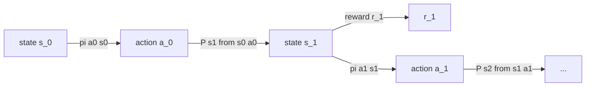

# MDPs & Bellman Equations

<Mode is="learn">

Before you can train a model with RL, you have to agree on what "the model" and "the environment" even mean. The answer is a Markov Decision Process — five symbols on a postcard that describe every RL setting from CartPole to GPT-4 post-training. Almost every "advanced" RL idea (advantage, GAE, TD-learning, PPO's clip) is just a clever way to estimate or stabilize a *Bellman equation*. Get this lesson cold and the rest of the track stops being magic.

## TL;DR

- A **Markov Decision Process** is the 5-tuple $(\mathcal{S}, \mathcal{A}, P, R, \gamma)$ — states, actions, transition probabilities, reward function, discount factor.
- The **Markov property**: the future depends only on the current state. In LLM RL, "state" = the full token history so far; this is technically Markov because nothing else exists.
- The **return** $G_t = \sum_{k=0}^{\infty} \gamma^k r_{t+k+1}$ is what we want to maximize. $\gamma \in [0,1)$ keeps it finite.
- **Value functions**: $V^\pi(s)$ = expected return from $s$ following $\pi$; $Q^\pi(s,a)$ = same but you take action $a$ first.
- **Bellman equation**: $V^\pi(s) = \mathbb{E}_\pi[r + \gamma V^\pi(s')]$ — value of a state is its immediate reward plus the discounted value of the next state. Every RL algorithm bootstraps off this.

## Why this matters

LLM post-training is a degenerate MDP: a single step per episode (in the simplest framing — the prompt is $s_0$, the completion is the action, the verifier emits the reward, episode ends). But the formalism still gives you the vocabulary — *advantage*, *value baseline*, *return* — that PPO/GRPO/DPO papers assume you already know. Multi-turn agentic RL (the 2026 frontier) drops the degenerate framing entirely and becomes a real sequential MDP. If you don't have MDPs at your fingertips, the agentic RL papers read like noise.

## The concept

An MDP is the mathematical model of an agent acting in a world:

- At each timestep $t$ the agent is in state $s_t \in \mathcal{S}$.
- It picks an action $a_t \in \mathcal{A}$ from its policy $\pi(a|s)$.
- The environment moves it to state $s_{t+1} \sim P(\cdot | s_t, a_t)$ and gives it reward $r_{t+1} = R(s_t, a_t, s_{t+1})$.
- The agent's job is to find $\pi$ that maximizes expected discounted return $\mathbb{E}[G_0]$.

The **Bellman expectation equation** is the most important equation in RL:

$$
V^\pi(s) = \sum_a \pi(a|s) \sum_{s'} P(s'|s,a) \big[ R(s,a,s') + \gamma V^\pi(s') \big]
$$

It says: the value of a state under policy $\pi$ equals the average over all actions $\pi$ might take, of the immediate reward plus the discounted value of where you land. Every value-based method (Q-learning, DQN, SARSA, TD($\lambda$)) is some way of *estimating* $V$ or $Q$ from samples. Every policy-gradient method uses a value estimate as a *baseline* (next lesson). And the KL-constrained methods (PPO, TRPO) constrain *changes* to $\pi$ in a way that preserves the Bellman structure.

## Mental model

Translating to LLM RL: $s_0$ is the prompt, $a_t$ is the next token, $P$ is deterministic concatenation, $R$ is 0 for every token except the last (where the verifier or reward model emits a score). The episode is a sequence of tokens; the return is the terminal reward.

## Key takeaways

1. **Memorize the 5-tuple.** $(\mathcal{S}, \mathcal{A}, P, R, \gamma)$. You'll see it in every paper.
2. **State = full history** in LLM RL. The Markov property is satisfied trivially.
3. **The Bellman equation is the foundation.** Value functions, advantage, TD-learning, GAE — all are bootstraps off it.
4. **Discount factor isn't a hyperparameter, it's a modeling choice.** In LLM RL with a terminal reward, $\gamma = 1$ is the natural setting; in any infinite-horizon problem, $\gamma < 1$ is the only way returns stay finite.
5. **MDPs assume stationarity**. In RLHF with a moving policy and a frozen reward model, this is *almost* but not quite true; importance sampling fixes it.

## Go deeper

<Resources
  items={[
    { kind: 'book', href: 'http://incompleteideas.net/book/the-book-2nd.html', title: 'Sutton & Barto — Reinforcement Learning: An Introduction (2nd ed)', author: 'Sutton & Barto (2018)', note: 'Chapters 3 and 4 are the canonical reference. Free PDF. If you read only one book on RL, this is it.' },
    { kind: 'video', href: 'https://www.davidsilver.uk/teaching/', title: 'David Silver — UCL RL Course', author: 'David Silver (DeepMind)', note: 'Lectures 2 and 3 are the cleanest video explanation of MDPs and the Bellman equation. Watch on 1.25×.' },
    { kind: 'docs', href: 'https://spinningup.openai.com/en/latest/spinningup/rl_intro.html', title: 'OpenAI Spinning Up — Intro to RL', note: 'The terse, engineer-friendly version of Sutton & Barto Ch 3. Best 90-minute orientation.' },
    { kind: 'blog', href: 'https://lilianweng.github.io/posts/2018-04-08-policy-gradient/', title: 'Lilian Weng — Policy Gradient Algorithms', note: 'The MDP setup at the top of this post is the cleanest one-page summary anywhere online.' },
    { kind: 'video', href: 'https://www.youtube.com/playlist?list=PL_iWQOsE6TfX7MaC6C3HcdOf1g337dlC9', title: 'Berkeley CS285 — Sergey Levine', author: 'Sergey Levine', note: 'Lecture 2 covers MDPs at the rigor level you actually need for research. Heavier than Silver.' },
  ]}
/>

</Mode>

<Mode is="reference">

## TL;DR

- MDP = $(\mathcal{S}, \mathcal{A}, P, R, \gamma)$.
- Bellman: $V^\pi(s) = \mathbb{E}_\pi[r + \gamma V^\pi(s')]$ and $Q^\pi(s,a) = \mathbb{E}[r + \gamma V^\pi(s')]$.
- LLM RL is a (usually) terminal-reward MDP — prompt is $s_0$, tokens are actions.
- Every value-based method estimates $V$ or $Q$; every policy-gradient method uses one as a baseline.

## Why this matters

Vocabulary load-bearing for the rest of the track. Papers will *not* re-derive this.

## Concrete walkthrough

| Symbol | LLM RL meaning |
| --- | --- |
| $\mathcal{S}$ | All possible token-history prefixes |
| $\mathcal{A}$ | Vocabulary (~128K tokens for modern models) |
| $P(s'|s,a)$ | Deterministic concatenation: $s' = s \oplus a$ |
| $R(s,a,s')$ | Usually 0 until terminal; verifier/RM emits final score |
| $\gamma$ | Typically 1.0 (terminal reward) or 0.99 (per-token shaping) |
| $V^\pi(s)$ | Expected final reward from token-prefix $s$ under policy $\pi$ |
| $Q^\pi(s,a)$ | Expected final reward if next token is $a$ |
| Advantage $A^\pi(s,a)$ | $Q^\pi(s,a) - V^\pi(s)$ — how much better $a$ is than average |

**Bellman expectation:**

$$
V^\pi(s) = \sum_a \pi(a|s) \big[ R(s,a) + \gamma \sum_{s'} P(s'|s,a) V^\pi(s') \big]
$$

**Bellman optimality:**

$$
V^*(s) = \max_a \big[ R(s,a) + \gamma \sum_{s'} P(s'|s,a) V^*(s') \big]
$$

The optimal policy: $\pi^*(s) = \arg\max_a Q^*(s,a)$.

## Key takeaways

1. MDP 5-tuple is non-negotiable vocabulary.
2. Bellman expectation is the recursion behind every value method.
3. In LLM RL, $\gamma=1$ and terminal reward are the standard simplification.
4. State = full token history (trivially Markov).
5. Advantage $A = Q - V$ is the *causal* quantity policy gradient should care about.

## Go deeper

<Resources
  items={[
    { kind: 'book', href: 'http://incompleteideas.net/book/the-book-2nd.html', title: 'Sutton & Barto — RL: An Introduction (Ch 3-4)', author: 'Sutton & Barto', note: 'The reference.' },
    { kind: 'docs', href: 'https://spinningup.openai.com/en/latest/spinningup/rl_intro.html', title: 'OpenAI Spinning Up — Intro to RL', note: 'Best terse engineer-friendly summary.' },
    { kind: 'video', href: 'https://www.davidsilver.uk/teaching/', title: 'David Silver — UCL RL Course (Lec 2-3)', author: 'David Silver', note: 'Cleanest video explanation.' },
  ]}
/>

</Mode>

<LessonComplete />
