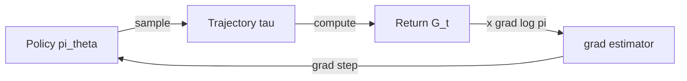

# Policy Gradient & REINFORCE

<Mode is="learn">

The first time someone explains policy gradient you nod along. The second time you realize you have no idea why it works. The third time the log-derivative trick clicks and the rest of RL falls into place. This lesson is that third time. You will leave it able to derive $\nabla_\theta J(\theta) = \mathbb{E}[\nabla_\theta \log \pi_\theta(a|s) \cdot R]$ from scratch — and able to explain why every modern LLM RL algorithm is "REINFORCE with three improvements".

## TL;DR

- **The goal**: maximize $J(\theta) = \mathbb{E}_{\tau \sim \pi_\theta}[R(\tau)]$ where $\tau$ is a sampled trajectory and $\theta$ is the policy parameters.
- **Problem**: the trajectory itself depends on $\theta$ (because $\pi_\theta$ generated it), so the gradient looks intractable.
- **Solution**: the **log-derivative trick**. $\nabla_\theta J = \mathbb{E}_\tau[\nabla_\theta \log p_\theta(\tau) \cdot R(\tau)]$. The gradient lives entirely in $\log \pi_\theta$.
- **REINFORCE**: sample trajectories, compute $\sum_t \nabla_\theta \log \pi_\theta(a_t|s_t) \cdot G_t$, take a gradient step. ~10 lines of code.
- **The problem with vanilla REINFORCE**: variance is enormous. Subtracting a baseline $b(s)$ (the next lesson) is what makes it practical. PPO, GRPO, and every modern method are baseline + clipping variants.

## Why this matters

Every RL algorithm trained on LLMs in 2025–2026 — PPO, GRPO, RLOO, Reinforce++ — is structurally REINFORCE with (a) a baseline for variance reduction, (b) some form of importance correction to allow off-policy data, and (c) a KL penalty to stop the policy from drifting too far. If you understand REINFORCE, you understand 80% of the rest of the track.

## The concept

Start with what you want: maximize expected return. The expectation is over trajectories sampled from your policy:

$$
J(\theta) = \mathbb{E}_{\tau \sim \pi_\theta}[R(\tau)] = \sum_\tau p_\theta(\tau) R(\tau)
$$

Differentiating:

$$
\nabla_\theta J(\theta) = \sum_\tau \nabla_\theta p_\theta(\tau) R(\tau)
$$

Here's the trick. Multiply and divide by $p_\theta(\tau)$:

$$
= \sum_\tau p_\theta(\tau) \frac{\nabla_\theta p_\theta(\tau)}{p_\theta(\tau)} R(\tau)
= \sum_\tau p_\theta(\tau) \nabla_\theta \log p_\theta(\tau) \cdot R(\tau)
= \mathbb{E}_\tau[\nabla_\theta \log p_\theta(\tau) \cdot R(\tau)]
$$

Now we can estimate the gradient from samples — collect trajectories, average $\nabla_\theta \log p_\theta(\tau) \cdot R(\tau)$ across them, that's our estimator.

Because $p_\theta(\tau) = p(s_0) \prod_t \pi_\theta(a_t|s_t) P(s_{t+1}|s_t,a_t)$ and only the policy depends on $\theta$:

$$
\nabla_\theta \log p_\theta(\tau) = \sum_t \nabla_\theta \log \pi_\theta(a_t|s_t)
$$

So the **REINFORCE estimator** is:

$$
\hat{g} = \frac{1}{N} \sum_{i=1}^N \sum_t \nabla_\theta \log \pi_\theta(a_{t,i}|s_{t,i}) \cdot G_{t,i}
$$

where $G_{t,i}$ is the (possibly discounted) return from timestep $t$ in trajectory $i$.

## The variance problem

REINFORCE works but is *brutally* high-variance. Two improvements close 90% of the gap:

1. **Subtract a baseline.** $\hat{g} = \mathbb{E}[\nabla \log \pi \cdot (R - b(s))]$. The estimator stays unbiased if $b$ doesn't depend on the action. Best choice: $b(s) = V^\pi(s)$, the value function. Then $R - b = $ the **advantage** (next lesson).
2. **Use return-to-go, not full return.** Actions can't influence past rewards, so the past doesn't belong in the gradient signal. $\hat{g}_t \propto \nabla \log \pi \cdot G_t$ where $G_t = \sum_{k=t}^T r_k$ only.

With both improvements, REINFORCE becomes **REINFORCE-with-baseline**, which is structurally identical to actor-critic and to the policy-gradient inner loop of PPO.

## Mental model



Sample → score → backprop through the log-prob → repeat. That's the whole loop.

## Key takeaways

1. **The log-derivative trick** turns an intractable gradient through a sampler into a Monte Carlo expectation. This is *the* enabling move in RL.
2. **REINFORCE is the parent algorithm** for PPO, GRPO, A2C, and every LLM RL method. The improvements are about variance and stability, not the basic structure.
3. **Variance is the practical bottleneck.** Baselines + return-to-go + clipping + KL constraints are all variance/stability tools.
4. **It works for any sampler.** You don't need a differentiable environment — the environment can be a black box. This is *why* RL is the natural fit for LLMs with verifiers.
5. **One line of code, one big idea.** `loss = -(logprob * advantage).mean()`. Everything downstream is a refinement of this.

## Go deeper

<Resources
  items={[
    { kind: 'paper', href: 'https://www.cs.cmu.edu/~ggordon/williams92simple.pdf', title: 'Williams (1992) — Simple Statistical Gradient-Following Algorithms (REINFORCE)', author: 'Williams (1992)', note: 'The original paper. Surprisingly readable; introduces the log-derivative trick.' },
    { kind: 'blog', href: 'https://lilianweng.github.io/posts/2018-04-08-policy-gradient/', title: 'Lilian Weng — Policy Gradient Algorithms', note: 'Best single survey. Read sections 1-2 for foundations, then come back to skim the rest.' },
    { kind: 'docs', href: 'https://spinningup.openai.com/en/latest/spinningup/rl_intro2.html', title: 'OpenAI Spinning Up — Part 2: Kinds of RL Algorithms', note: 'Engineer-friendly walkthrough of policy gradient. Includes runnable code.' },
    { kind: 'video', href: 'https://www.youtube.com/watch?v=KjWF8VIMGiY', title: 'Andrej Karpathy — Deep Reinforcement Learning: Pong from Pixels', author: 'Karpathy', note: 'The classic blog/talk that made REINFORCE click for a generation of engineers. 130 lines of NumPy.' },
    { kind: 'blog', href: 'http://karpathy.github.io/2016/05/31/rl/', title: 'Karpathy — Deep Reinforcement Learning: Pong from Pixels (blog post)', author: 'Karpathy (2016)', note: 'The reading companion to the talk. Save and re-read.' },
    { kind: 'video', href: 'https://www.youtube.com/watch?v=Llg6yj9eLvg', title: 'Karpathy — Deep Dive on RL Training (2025)', author: 'Karpathy', note: 'Modern walkthrough including LLM-specific framing. ~90 minutes.' },
  ]}
/>

</Mode>

<Mode is="reference">

## TL;DR

- Goal: $\max_\theta J(\theta) = \mathbb{E}_{\tau \sim \pi_\theta}[R(\tau)]$.
- Log-derivative trick: $\nabla J = \mathbb{E}[\nabla \log p_\theta(\tau) \cdot R]$.
- REINFORCE estimator: $\hat{g} = \sum_t \nabla \log \pi_\theta(a_t|s_t) \cdot G_t$.
- Variance reduction: subtract baseline $b(s) \approx V^\pi(s)$; use return-to-go.

## Why this matters

REINFORCE is the parent of every LLM RL algorithm. PPO, GRPO, RLOO — all are baselined + clipped + KL-constrained REINFORCE.

## Concrete walkthrough

**Derivation (memorize this):**

$$
\nabla_\theta \mathbb{E}_\tau[R] = \mathbb{E}_\tau\big[\nabla_\theta \log p_\theta(\tau) \cdot R\big] = \mathbb{E}_\tau\Big[\sum_t \nabla_\theta \log \pi_\theta(a_t|s_t) \cdot R\Big]
$$

**With baseline + return-to-go:**

$$
\hat{g} = \sum_t \nabla_\theta \log \pi_\theta(a_t|s_t) \cdot (G_t - b(s_t))
$$

**Python (the whole algorithm):**

```python
# trajectory: list of (s, a, r); policy: pi_theta(a|s)
logprobs = [pi.log_prob(a, s) for s, a, _ in trajectory]
returns  = [sum(r for _, _, r in trajectory[t:]) for t in range(len(trajectory))]
loss     = -(torch.stack(logprobs) * torch.tensor(returns)).mean()
loss.backward(); opt.step()
```

That's the entire algorithm. Every improvement (baseline, GAE, PPO clip, GRPO advantage) is a substitution into `returns`.

## Key takeaways

1. Log-derivative trick is *the* enabling move.
2. `loss = -(logprob * advantage).mean()` is the whole shape.
3. Variance reduction matters more than the algorithm name.
4. Trajectories are samples — RL doesn't need a differentiable environment.

## Go deeper

<Resources
  items={[
    { kind: 'paper', href: 'https://www.cs.cmu.edu/~ggordon/williams92simple.pdf', title: 'Williams (1992) — REINFORCE', note: 'Original paper.' },
    { kind: 'blog', href: 'https://lilianweng.github.io/posts/2018-04-08-policy-gradient/', title: 'Lilian Weng — Policy Gradient Algorithms', note: 'Survey of the family.' },
    { kind: 'docs', href: 'https://spinningup.openai.com/en/latest/spinningup/rl_intro2.html', title: 'OpenAI Spinning Up — Part 2', note: 'Runnable code reference.' },
  ]}
/>

</Mode>

<LessonComplete />
