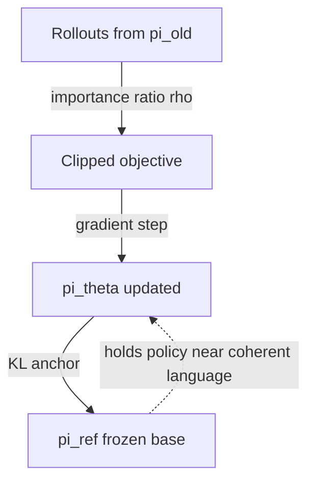

# Trust Regions, KL & Importance Sampling

<Mode is="learn">

You sampled some trajectories, you have your advantage estimates, you take a big SGD step on the policy. Disaster: the policy is now meaningfully different, your sampled data is *off-policy*, and your gradient estimator was lying. This lesson is the three corrections that make modern policy-gradient methods work: importance sampling (a mathematical correction for "the data was generated by a different policy"), KL constraints (a *limit* on how different the policy is allowed to become), and clipping (a cheap approximation of the KL constraint). Together they make PPO and GRPO numerically stable.

## TL;DR

- **Off-policy correction**: if data was sampled from $\pi_{old}$ but you want to estimate a gradient under $\pi$, multiply by the **importance ratio** $\rho = \pi(a|s) / \pi_{old}(a|s)$.
- **Trust region** (TRPO): explicitly constrain $\mathbb{E}[KL(\pi_{old} \| \pi)] \leq \delta$. Theoretically clean but expensive (conjugate gradient + line search per step).
- **Clipping** (PPO): replace the constraint with a *clipped objective*: $\min(\rho \hat{A},\, \text{clip}(\rho, 1-\epsilon, 1+\epsilon) \hat{A})$. Cheap, empirically robust. $\epsilon \approx 0.2$ standard.
- **KL penalty against a reference**: in LLM RL, add $-\beta \cdot KL(\pi \| \pi_{ref})$ where $\pi_{ref}$ is the *frozen base model*. Stops the policy from drifting away from coherent language.
- **Two KL terms exist in modern recipes**: (a) the *trust-region* KL between old/new policy within an update; (b) the *anchor* KL against a frozen reference base. Don't confuse them.

## Why this matters

Without these corrections, RL on LLMs collapses in minutes. The model finds a way to satisfy the reward that wrecks language modeling (mode collapse, repetition, gibberish that game the reward). The KL-against-reference is the single most important regularizer in LLM RL — bigger lever than learning rate, batch size, or advantage normalization.

## The concept

**Importance sampling.** You want $\mathbb{E}_{a \sim \pi}[f(a)]$ but you only have samples from $\pi_{old}$. The math:

$$
\mathbb{E}_{a \sim \pi}[f(a)] = \mathbb{E}_{a \sim \pi_{old}}\Big[\frac{\pi(a)}{\pi_{old}(a)} f(a)\Big]
$$

For policy gradient, this lets you take *multiple gradient steps* on the same batch of rollouts — each new step corrects the off-policy bias with the ratio. This is what makes PPO an *epochs > 1* algorithm.

**Trust regions.** Importance sampling only works when $\pi$ and $\pi_{old}$ are close. If the ratio gets huge, variance explodes and the estimator collapses. TRPO enforces this by solving:

$$
\max_\theta \mathbb{E}\big[\rho \hat{A}\big] \quad \text{s.t.} \quad \mathbb{E}[KL(\pi_{old} \| \pi)] \leq \delta
$$

Beautiful but expensive — requires natural gradients and a line search.

**PPO clipping** replaces the constraint with a clipped objective:

$$
\mathcal{L}^{CLIP} = \mathbb{E}\Big[\min\big(\rho_t \hat{A}_t,\, \text{clip}(\rho_t, 1-\epsilon, 1+\epsilon) \hat{A}_t\big)\Big]
$$

Interpretation: if the new policy wants to push action probability *up* on a positive-advantage action, fine — but only by a factor of $1+\epsilon$. Beyond that, the clip kicks in and the gradient is zero (no more improvement reward). Symmetrically on the downside. **You can't get reward for moving too far from $\pi_{old}$**.

**KL anchor to reference policy.** In LLM RL, add a separate term penalizing divergence from a *frozen base*:

$$
\mathcal{L} = \mathcal{L}^{CLIP} - \beta \cdot KL(\pi_\theta \| \pi_{ref})
$$

$\pi_{ref}$ is the SFT'd base model. $\beta$ is the tightness. **This is what stops the model from descending into reward-gaming gibberish.** Set $\beta$ too high → policy can't move; too low → mode collapse. Typical $\beta \in [0.01, 0.5]$, often tuned per-task.

## Mental model



Two forces: the *clip* keeps within-update steps small; the *anchor KL* keeps the policy near the original SFT model.

## The actual KL math

Two estimators show up in code:

**Direct (forward) KL:**

$$
KL(\pi_\theta \| \pi_{ref}) = \mathbb{E}_{a \sim \pi_\theta}\Big[\log \pi_\theta(a) - \log \pi_{ref}(a)\Big]
$$

In LLM RL we approximate per-token: for each rollout token, take `logprob_theta - logprob_ref`. Sum across the rollout for the per-rollout KL.

**John Schulman's unbiased k3 estimator** (used in TRL and verl):

```
kl_k3 = (logprob_ref - logprob_theta).exp() - (logprob_ref - logprob_theta) - 1
```

Always non-negative, unbiased estimator of $KL(\pi_\theta \| \pi_{ref})$. **Use this. Naive estimators bias the gradient.**

## Key takeaways

1. **Importance ratio enables off-policy gradient steps** within a PPO epoch. Without it, you'd need fresh rollouts every step.
2. **Clipping is a cheap approximation of a trust region** — works empirically better than TRPO's exact constraint.
3. **The KL-anchor is the single most important LLM-RL knob.** Tuning $\beta$ matters more than tuning learning rate.
4. **Two KLs exist; don't conflate them.** Old↔New (trust region) vs Policy↔Ref (anchor against drift).
5. **Use Schulman's k3 estimator** for the KL term in code. The naive `mean(log(pi) - log(ref))` formula is biased and unstable.

## Go deeper

<Resources
  items={[
    { kind: 'paper', href: 'https://arxiv.org/abs/1502.05477', title: 'Schulman et al. — Trust Region Policy Optimization (TRPO)', author: 'Schulman et al. (2015)', note: 'The trust-region origin paper. Read sections 1-3 for the why; skim the proofs.' },
    { kind: 'paper', href: 'https://arxiv.org/abs/1707.06347', title: 'Schulman et al. — Proximal Policy Optimization (PPO)', author: 'Schulman et al. (2017)', note: 'The clipping objective. Required reading. 6 pages.' },
    { kind: 'blog', href: 'http://joschu.net/blog/kl-approx.html', title: 'John Schulman — Approximating KL Divergence', author: 'Schulman', note: 'The k3 estimator post. Two paragraphs that fix half the bugs in custom RL trainers.' },
    { kind: 'paper', href: 'https://arxiv.org/abs/2009.10897', title: 'Engstrom et al. — Implementation Matters in Deep Policy Gradients', author: 'Engstrom et al. (2020)', note: 'Devastating empirical paper showing PPO performance is mostly *implementation tricks* (advantage norm, value clipping, etc.), not the clip objective. Read once and your code will improve.' },
    { kind: 'blog', href: 'https://iclr-blog-track.github.io/2022/03/25/ppo-implementation-details/', title: 'Huang et al. — The 37 Implementation Details of PPO', note: 'The canonical "what your PPO implementation is doing wrong" reference. Bookmark it.' },
    { kind: 'paper', href: 'https://arxiv.org/abs/1611.01224', title: 'Schulman — Trust Region Methods (PhD thesis sections)', author: 'Schulman', note: 'For when you want the full mathematical machinery.' },
  ]}
/>

</Mode>

<Mode is="reference">

## TL;DR

- Importance ratio $\rho = \pi/\pi_{old}$ corrects off-policy gradient estimates.
- PPO clipping: $\min(\rho \hat{A}, \text{clip}(\rho, 1\pm\epsilon) \hat{A})$. $\epsilon \approx 0.2$.
- Add $-\beta KL(\pi \| \pi_{ref})$ to prevent drift from base model. $\beta \in [0.01, 0.5]$.
- Use Schulman k3 estimator: `exp(x) - x - 1` where `x = logp_ref - logp_theta`.

## Why this matters

Without these three corrections, LLM RL collapses. KL anchor is the single biggest stability lever.

## Concrete walkthrough

**Full PPO loss for LLM RL:**

$$
\mathcal{L} = -\mathbb{E}\Big[\min(\rho_t \hat{A}_t,\, \text{clip}(\rho_t, 1-\epsilon, 1+\epsilon)\hat{A}_t)\Big] + c_v \mathcal{L}_{critic} - c_e \mathcal{H}(\pi) + \beta \, \text{KL}(\pi \| \pi_{ref})
$$

**Code idiom (per-token):**

```python
ratio    = (new_logp - old_logp).exp()
clipped  = ratio.clamp(1 - eps, 1 + eps) * adv
unclip   = ratio * adv
pg_loss  = -torch.min(unclip, clipped).mean()

# KL anchor (Schulman k3, unbiased)
x        = ref_logp - new_logp
kl       = (x.exp() - x - 1).mean()
loss     = pg_loss + c_v * v_loss + beta * kl
```

**The 5 hyperparameters that actually matter:**

| Knob | Typical range | Notes |
| --- | --- | --- |
| clip $\epsilon$ | 0.1 – 0.3 | 0.2 standard. Higher = bigger steps. |
| KL anchor $\beta$ | 0.01 – 0.5 | The big lever. Tune by inspection of completions. |
| Critic coef $c_v$ | 0.1 – 1.0 | 0.5 standard. |
| Entropy coef $c_e$ | 0.0 – 0.01 | Often 0 in LLM RL; the base model has enough entropy. |
| PPO epochs | 1 – 4 | More epochs = more drift; clipping bounds this. |

## Key takeaways

1. PPO clip ≠ KL anchor. Both matter; they regularize different things.
2. k3 estimator for KL. Always.
3. Tune $\beta$ first.
4. Read the 37-details blog before debugging anything.

## Go deeper

<Resources
  items={[
    { kind: 'paper', href: 'https://arxiv.org/abs/1707.06347', title: 'Schulman et al. — PPO', note: 'The clip objective.' },
    { kind: 'blog', href: 'http://joschu.net/blog/kl-approx.html', title: 'Schulman — KL Approximation', note: 'k3 estimator.' },
    { kind: 'blog', href: 'https://iclr-blog-track.github.io/2022/03/25/ppo-implementation-details/', title: 'The 37 PPO Details', note: 'Canonical bug list.' },
  ]}
/>

</Mode>

<LessonComplete />
