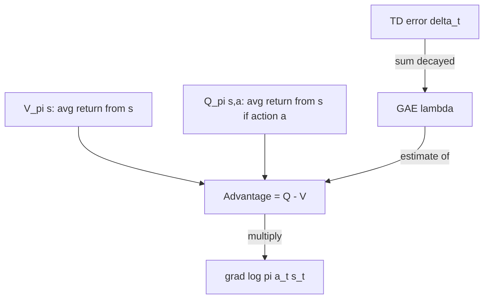

# Value Functions, Advantage & GAE

<Mode is="learn">

If REINFORCE is "scale gradient by reward", the rest of policy-gradient RL is "scale gradient by *advantage*, which we estimate as cleverly as we can". This lesson is the three quantities that show up in every paper — $V^\pi(s)$, $Q^\pi(s,a)$, $A^\pi(s,a)$ — and the GAE trick that turns "advantage" from a noun into a tunable estimator with one knob ($\lambda$) controlling bias vs variance.

## TL;DR

- **Value $V^\pi(s)$**: expected return from $s$ under policy $\pi$. The baseline you should subtract.
- **Q-value $Q^\pi(s,a)$**: expected return if you take action $a$ first, then follow $\pi$.
- **Advantage $A^\pi(s,a) = Q^\pi(s,a) - V^\pi(s)$**: how much better action $a$ is than average at $s$. Mean-zero. *This is what policy gradient should multiply $\nabla \log \pi$ by.*
- **TD error $\delta_t = r_t + \gamma V(s_{t+1}) - V(s_t)$**: a 1-step, low-variance, biased estimate of advantage.
- **GAE($\lambda$)**: $A^{GAE}_t = \sum_{k=0}^\infty (\gamma\lambda)^k \delta_{t+k}$. Single knob between $\lambda{=}0$ (low variance, high bias TD) and $\lambda{=}1$ (high variance, unbiased Monte Carlo). Default $\lambda \approx 0.95$.

## Why this matters

Three reasons this lesson pays for itself ten times over:

1. **PPO is REINFORCE with GAE.** If you don't understand GAE, the PPO paper reads like ritual.
2. **GRPO replaces GAE with group-relative normalization.** Knowing what GAE *does* makes the GRPO simplification obvious.
3. **Reward sparsity** (one reward at trajectory end) is *the* common case in LLM RL. Value functions are how you propagate sparse final reward back through the trajectory.

## The concept

Define:

- $V^\pi(s) = \mathbb{E}_\pi[G_t | s_t = s]$
- $Q^\pi(s,a) = \mathbb{E}_\pi[G_t | s_t = s, a_t = a]$
- $A^\pi(s,a) = Q^\pi(s,a) - V^\pi(s)$

Substituting advantage into REINFORCE gives the **actor-critic** estimator:

$$
\hat{g} = \mathbb{E}\Big[\sum_t \nabla_\theta \log \pi_\theta(a_t|s_t) \cdot \hat{A}_t\Big]
$$

The estimator is still unbiased (because $\mathbb{E}_a[A] = 0$ — that's the whole point of subtracting the baseline) but with *much* lower variance than raw return.

Now how do we estimate $A$? Two extremes:

- **Monte Carlo**: $\hat{A}_t = G_t - V(s_t)$. Unbiased but high variance (you're propagating noise from every future timestep).
- **TD(0)**: $\hat{A}_t = \delta_t = r_t + \gamma V(s_{t+1}) - V(s_t)$. Low variance but biased (you're trusting the imperfect $V$).

**Generalized Advantage Estimation (GAE)** smoothly interpolates:

$$
\hat{A}^{GAE(\gamma,\lambda)}_t = \sum_{k=0}^\infty (\gamma\lambda)^k \delta_{t+k}
$$

At $\lambda = 0$ this collapses to TD(0). At $\lambda = 1$ it collapses to Monte Carlo. In practice $\lambda \in [0.9, 0.97]$ is standard. **Bias-variance dial with a single knob**.

## Mental model

Advantage = how much better than average. GAE = how to compute it cheaply from samples + a learned value function.

## The critic

Where does $V$ come from? You learn it. Run a second network (or a second head on the same backbone) that takes $s$ and predicts the return; train it to regress on the actually-observed returns:

$$
\mathcal{L}_{critic}(\phi) = \mathbb{E}\Big[(V_\phi(s_t) - G_t)^2\Big]
$$

This is the **actor-critic** architecture: the *actor* is $\pi_\theta$, the *critic* is $V_\phi$. Standard PPO has both. GRPO famously *removes* the critic (the next lesson on group-relative methods).

In LLM RL, the critic is usually a value head bolted to the LM trunk — adds ~size-of-LM-head parameters and roughly doubles forward-pass FLOPs. The "doubled memory + instability" complaint about PPO is mostly about this critic.

## Key takeaways

1. **Advantage is the right thing** to multiply $\nabla \log \pi$ by — unbiased estimator, low variance.
2. **Three ways to estimate advantage**: Monte Carlo (unbiased, noisy), TD(0) (biased, smooth), GAE (dial between them with $\lambda$).
3. **GAE($\lambda \approx 0.95$, $\gamma = 1.0$)** is the standard PPO config for LLM RL.
4. **The critic is a learned $V$.** Costs memory and adds an instability source — which is exactly what GRPO removes.
5. **In sparse-reward LLM settings**, the critic does the work of propagating final reward to earlier tokens.

## Go deeper

<Resources
  items={[
    { kind: 'paper', href: 'https://arxiv.org/abs/1506.02438', title: 'Schulman et al. — High-Dimensional Continuous Control with GAE', author: 'Schulman et al. (2016)', note: 'The GAE paper. Section 3 is the derivation; read it once. Same Schulman as PPO.' },
    { kind: 'paper', href: 'https://proceedings.neurips.cc/paper/1999/file/464d828b85b0bed98e80ade0a5c43b0f-Paper.pdf', title: 'Sutton et al. — Policy Gradient Methods for RL with Function Approximation', author: 'Sutton et al. (1999)', note: 'Original actor-critic. Theorem 1 is the policy gradient theorem you keep seeing cited.' },
    { kind: 'book', href: 'http://incompleteideas.net/book/the-book-2nd.html', title: 'Sutton & Barto — RL: An Introduction (Ch 6, 12, 13)', author: 'Sutton & Barto', note: 'Ch 6 (TD learning), 12 (eligibility traces — TD($\\lambda$), which is the family GAE belongs to), 13 (policy gradient).' },
    { kind: 'blog', href: 'https://danieltakeshi.github.io/2017/04/02/notes-on-the-generalized-advantage-estimation-paper/', title: 'Daniel Seita — Notes on the GAE paper', note: 'Excellent annotated walkthrough of the derivation.' },
    { kind: 'docs', href: 'https://spinningup.openai.com/en/latest/algorithms/vpg.html', title: 'OpenAI Spinning Up — Vanilla Policy Gradient', note: 'The pseudo-code section shows exactly how GAE plugs into a PG loop.' },
  ]}
/>

</Mode>

<Mode is="reference">

## TL;DR

- $V^\pi(s)$, $Q^\pi(s,a)$, $A^\pi(s,a) = Q - V$.
- Policy gradient should use advantage as the scaling factor.
- GAE($\lambda$): $\hat{A}_t = \sum_k (\gamma\lambda)^k \delta_{t+k}$, $\delta_t = r_t + \gamma V(s_{t+1}) - V(s_t)$.
- Standard config: $\gamma = 1.0$, $\lambda \approx 0.95$.

## Why this matters

GAE is the PPO default. GRPO removes it. Knowing what it does is prerequisite to knowing why each is preferred.

## Concrete walkthrough

**Three advantage estimators, increasing bias / decreasing variance:**

| Estimator | Formula | Bias | Variance |
| --- | --- | --- | --- |
| Monte Carlo | $G_t - V(s_t)$ | Unbiased | High |
| TD(0) | $r_t + \gamma V(s_{t+1}) - V(s_t)$ | Biased by $V$ error | Low |
| GAE($\lambda$) | $\sum_k (\gamma\lambda)^k \delta_{t+k}$ | Interpolates | Interpolates |

**Critic loss:**

$$
\mathcal{L}_{critic} = (V_\phi(s_t) - G_t)^2 \quad \text{or} \quad (V_\phi(s_t) - (V_\phi(s_t)^{old} + \hat{A}_t))^2
$$

**Combined actor-critic loss:**

$$
\mathcal{L} = -\log \pi_\theta(a|s) \cdot \hat{A}_t + c_v \mathcal{L}_{critic} - c_e \mathcal{H}(\pi)
$$

with $c_v \approx 0.5$, $c_e \approx 0.01$ (entropy bonus).

## Key takeaways

1. Advantage = Q - V. Mean-zero. Use this in PG.
2. GAE($\lambda$) interpolates Monte Carlo and TD(0).
3. $\lambda \approx 0.95$ is the PPO default.
4. Critic cost is the reason GRPO is popular.

## Go deeper

<Resources
  items={[
    { kind: 'paper', href: 'https://arxiv.org/abs/1506.02438', title: 'Schulman et al. — GAE', note: 'Section 3.' },
    { kind: 'docs', href: 'https://spinningup.openai.com/en/latest/algorithms/vpg.html', title: 'Spinning Up — VPG', note: 'Code structure.' },
  ]}
/>

</Mode>

<LessonComplete />
