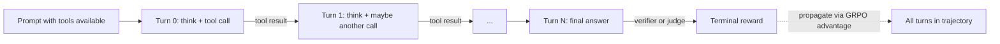

# Agentic RL & Tool-Use Training

<Mode is="learn">

The 2026 frontier of RL training: instead of reasoning in a single text generation, the model takes *multiple* turns — call a tool, see the result, decide what to do next, call another tool, eventually produce an answer. The capability is dramatic (agents that run code, search the web, debug systems). The training is *much* harder than single-turn RL: credit assignment is now multi-step, the environment is stochastic (tool results vary), and the trajectories are 10-100× longer. This lesson is the state of agentic RL — the algorithms, the infrastructure, and the open problems.

## TL;DR

- **Agentic RL** = RL where the model alternates between *thinking*, *tool-calling*, and *acting*. Each tool call returns a result; the model conditions on it.
- **The reward is at the end** of a multi-step trajectory. Could be 10-50 turns.
- **The credit assignment problem**: which turn caused success? Without intermediate signal, the gradient is diluted across many turns.
- **Two main approaches** (early 2026): (a) **trajectory-level RL** — score the whole rollout, use GRPO; (b) **step-level RL** — use a PRM to credit specific turns.
- **The infrastructure** is genuinely new: rollout engines now need to support multi-turn generation with tool execution between turns. Sandboxes scale. Replay buffers grow.
- **Hot 2025-2026 papers**: ReACT-RL, AgentR, Multi-Turn GRPO, ToolRL, Skywork-o1, Devin's training stack (closed but described).

## Why this matters

Agentic models are the inferred direction for the next 18 months of frontier work. Anthropic Claude code, OpenAI Operator, DeepSeek-V3 agent variants — every lab is building these. The RL infrastructure for multi-turn trajectories is *a different system* than single-turn GRPO. If you can build it, you're hireable into the most active sub-area of post-training.

## The setup

A single agentic trajectory:

```
turn 0: thinking + tool call (e.g., "I'll calculate this", call(calculator, "2+2"))
turn 1: tool result observed ("4"), thinking + maybe another tool call
turn 2: ...
...
turn N: final answer
verifier: scores the final answer; reward = 1 or 0
```

The model produces $L = \sum_t |a_t|$ total tokens — typically 5-50K for one trajectory.

The RL update needs to figure out *which* of the model's decisions led to the final outcome. This is the **temporal credit assignment problem**, central to multi-step RL.

## Two approaches to credit assignment

**Approach 1: Trajectory-level GRPO.** Treat the whole trajectory as one rollout. Score with the verifier. Apply GRPO over a group of $G$ trajectories. The gradient flows through every action in the trajectory uniformly.

Pros: extremely simple. Reuses existing infrastructure (just need a multi-turn rollout engine).

Cons: signal is *diffuse*. If 49 of 50 turns were random and only turn 50 mattered, the gradient signal at turns 1-49 is noise.

**Approach 2: Step-level rewards (PRM-style or shaped).** Score each turn — either with a PRM or with intrinsic signals (e.g., "did the tool call succeed?", "did the model's expressed plan match what it did?").

Pros: better credit assignment.

Cons: requires per-turn signals (PRM labeling), or risks reward hacking when intrinsic shapings are used.

**Current state (2026)**: trajectory-level GRPO is the simple, working default. Most open recipes use it. Step-level is an active research area.

## Multi-turn rollout infrastructure

This is where the engineering gets interesting. A single-turn rollout engine (vLLM/SGLang) generates one completion per prompt. A multi-turn rollout engine:

1. Generates a partial completion until the model emits a tool call (e.g., a function-call token).
2. Pauses generation. Parses the tool call. Executes it in a sandbox.
3. Appends the tool result to the context.
4. Resumes generation.
5. Repeats until the model emits a final answer or hits a turn budget.

verl, OpenRLHF, and (somewhat) TRL have begun adding multi-turn support in 2025. The patterns are still evolving.

**Sandbox scaling.** Each rollout might execute 5-50 tool calls. With $G = 8$ rollouts per prompt and $N = 256$ prompts in a batch, you're looking at 10K-100K tool executions per training iteration. At seconds per execution, that's hours of sandbox time. Real RL infra spends serious effort on sandbox throughput, isolation, and caching.

**Cache reuse across turns.** Each new turn's prefill includes everything from previous turns. vLLM/SGLang prefix caching helps here — RadixAttention is especially strong because the cache structure naturally extends turn-by-turn.

## Reward signal design for agents

The big open question: what's the *reward*?

**For verifiable agentic tasks** (math with calculator, code with debugger, web search with verifier): use the final-answer verifier, same as single-turn RLVR. Works but signal is sparse.

**For non-verifiable agentic tasks** (open-ended assistant work, multi-step planning): need preferences or generative judges. RLHF for agents is just starting.

**Intermediate rewards** that show up in 2025-2026 papers:
- Tool-call success/failure (did the API return cleanly?).
- Tool-call usefulness (did the model use the result?).
- Plan consistency (does action match stated intent?).
- Length efficiency (penalize trajectories with redundant tool calls).
- Calibration (does the model's confidence match its accuracy?).

Each of these is a recipe-specific hack. There's no universal answer yet.

## Mental model



Multi-turn trajectory; terminal reward; the credit-assignment question is how to attribute that reward to specific turns.

## What's hot in 2025-2026

- **ToolRL** (Wang et al. 2025): joint optimization of tool-use accuracy and efficiency with intermediate rewards.
- **Multi-Turn GRPO**: extension of GRPO to multi-turn trajectories with per-turn weighting.
- **Search-R1 / Open-Reasoner-Zero**: agentic-search RL on the web with verifier-style rewards.
- **Skywork-o1**: open agentic reasoning model with multi-turn RL.
- **Devin / Claude Code training** (closed): the infrastructure described in interviews suggests sandbox-heavy multi-turn RL with verifiable rewards on code completion.

## Key takeaways

1. **Agentic RL = RL on multi-turn tool-using trajectories.** The current frontier of post-training.
2. **Trajectory-level GRPO is the working default.** Simple, sparse-signal.
3. **Step-level credit assignment is the open research question.** PRMs and intrinsic rewards are candidate solutions.
4. **Multi-turn rollout infrastructure is a real engineering job.** Sandbox throughput at scale is the binding constraint.
5. **Reward design is recipe-specific.** Verifiable tasks (code, math-with-tools) are easy; open-ended agentic tasks are still hand-tuned.

## Go deeper

<Resources
  items={[
    { kind: 'paper', href: 'https://arxiv.org/abs/2503.09516', title: 'Wang et al. — ToolRL', author: 'Wang et al. (March 2025)', note: 'Joint tool-use accuracy and efficiency optimization. Most concrete recipe.' },
    { kind: 'paper', href: 'https://arxiv.org/abs/2503.05592', title: 'Search-R1', author: 'Various (March 2025)', note: 'Agentic-search RL on the web with verifier rewards. Strong open recipe.' },
    { kind: 'paper', href: 'https://arxiv.org/abs/2503.20783', title: 'Skywork-o1 open agentic reasoning', note: 'One of the cleanest open agentic-reasoning recipes.' },
    { kind: 'paper', href: 'https://arxiv.org/abs/2210.03629', title: 'Yao et al. — ReAct (foundational)', author: 'Yao et al. (2022)', note: 'The original interleaved reasoning + tool-use prompt structure. Pre-RL but foundational.' },
    { kind: 'paper', href: 'https://arxiv.org/abs/2502.12118', title: 'Aksitov et al. — ReST-MCTS for Agents', note: 'Tree search + RL on agent trajectories. Possibly the strongest current agentic-RL approach.' },
    { kind: 'paper', href: 'https://arxiv.org/abs/2402.10980', title: 'Schick et al. — Toolformer', note: 'Earlier work on tool-use training. Pre-modern but worth knowing.' },
    { kind: 'blog', href: 'https://www.interconnects.ai/p/agentic-rl', title: 'Nathan Lambert — The agentic RL landscape', note: 'Best running survey of the agentic-RL paper firehose.' },
    { kind: 'repo', href: 'https://github.com/volcengine/verl/blob/main/docs/algo/multi-turn.md', title: 'verl — Multi-turn RL docs', note: 'How verl is wiring up agentic RL in 2025-2026.' },
    { kind: 'docs', href: 'https://modal.com/docs/guide/sandbox', title: 'Modal Sandbox', note: 'One reference for high-throughput tool execution at training scale.' },
  ]}
/>

</Mode>

<Mode is="reference">

## TL;DR

- Agentic RL = RL over multi-turn tool-using trajectories.
- Trajectory-level GRPO is the default; step-level is open research.
- Sandbox-at-scale is the binding infra constraint.
- Hot papers (2025-2026): ToolRL, Search-R1, ReST-MCTS, Skywork-o1.

## Why this matters

The next 18 months of frontier RL work. Active hiring.

## Concrete walkthrough

**Trajectory-level GRPO for agents:**

```python
# Sample G trajectories per prompt
trajectories = []
for _ in range(G):
    state = prompt
    for turn in range(max_turns):
        action = policy.generate(state, stop_at=tool_token)
        if tool_called(action):
            result = sandbox.execute(action)
            state += action + result
        else:
            state += action
            break
    trajectories.append(state)

# Score each
rewards = [verifier(t) for t in trajectories]

# Group-relative advantage (same as single-turn GRPO)
adv = (rewards - rewards.mean()) / rewards.std()

# Gradient flows through every token in every trajectory, weighted by the trajectory's advantage
loss = -(logprob_of_tokens * adv).mean()
```

The gradient flows through *every* model-generated token (not the tool results), weighted by the trajectory advantage.

## Scaling math

| Quantity | Single-turn | Agentic (10 turns) |
| --- | --- | --- |
| Tokens/rollout | 2K-10K | 20K-100K |
| Rollouts/batch (G=8, N=256) | 2K | 2K |
| Total tokens/iter | 4M-20M | 40M-200M |
| Tool executions/iter | 0 | 20K-100K |
| Sandbox throughput need | None | High (a real distributed system) |

## Key takeaways

1. Trajectory-level GRPO works; step-level is open research.
2. Multi-turn rollout infra needed in 2026.
3. Sandbox is a major infra component.
4. Reward design is task-specific.

## Go deeper

<Resources
  items={[
    { kind: 'paper', href: 'https://arxiv.org/abs/2503.09516', title: 'ToolRL' },
    { kind: 'paper', href: 'https://arxiv.org/abs/2503.05592', title: 'Search-R1' },
    { kind: 'paper', href: 'https://arxiv.org/abs/2502.12118', title: 'ReST-MCTS for Agents' },
  ]}
/>

</Mode>

<LessonComplete />
