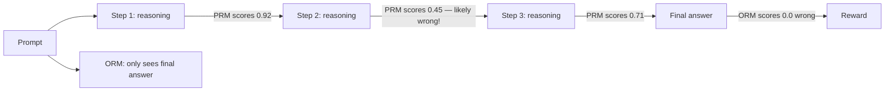

# Process Reward Models (PRM)

<Mode is="learn">

The intuition is appealing: instead of telling the model only "your final answer was wrong", tell it "step 3 was wrong, the rest was fine." This is a **process reward model** (PRM) — a model that scores each reasoning *step*, not just the terminal output. The OpenAI "Let's Verify Step by Step" paper (2023) gave PRMs early hype. But by 2025-2026 the picture got more complicated: outcome-only reward (ORM) plus enough compute often matches PRM. This lesson is what PRMs are, when they help, and the live debate about whether they're worth the cost.

## TL;DR

- **PRM** (Process Reward Model): scores each reasoning step. Trained on per-step labels — "this step is correct" or "this step is wrong".
- **ORM** (Outcome Reward Model): scores only the final answer. Cheaper to train; what R1 used.
- **OpenAI 2023 "Let's Verify"**: PRMs beat ORMs on math at fixed inference budget. The paper that started the PRM hype.
- **2024-2025 follow-ups**: ORMs catch up with more training compute. The PRM advantage shrinks. Open question.
- **PRMs are still useful for**: (a) interpretability — you can see where the model goes wrong; (b) inference-time search (best-of-N with PRM scoring); (c) data filtering (rejection-sampling reasoning traces by step quality).
- **Cost**: PRMs need per-step labels (expensive). ORMs need only end-of-trajectory labels (cheap).

## Why this matters

PRM-style rewards are one of the candidate next-paradigm signals. If they work, they reshape RL training. If they don't, it's a 2-year detour the field will move past. Knowing the state of the debate distinguishes RL engineers who track the literature from those who only know what shipped 18 months ago.

## The concept

**Outcome Reward Model (ORM):**
- Trained: $(prompt, trajectory) \to r \in [0,1]$.
- Signal: final answer was right or wrong.
- Labels needed: one per trajectory.
- What R1 used: a math verifier is structurally an ORM.

**Process Reward Model (PRM):**
- Trained: $(prompt, partial\_trajectory, step) \to r_{step} \in [0,1]$.
- Signal: this step is correct given the prefix.
- Labels needed: one per step. Per-trajectory cost is much higher.
- The OpenAI "Let's Verify" paper trained PRMs on 800K *human-labeled steps* from math reasoning chains.

## The 2023 OpenAI result

Lightman et al. (2023) compared PRM vs ORM on MATH and showed:

- PRM outperformed ORM at fixed inference compute.
- The PRM was a better *re-ranker* of N sampled solutions than ORM.
- PRM-labeled training data improved an SFT model more than ORM-labeled data.

The takeaway at the time: process supervision is fundamentally better than outcome supervision.

## The 2024-2025 nuance

By 2024, two complications emerged:

**1. ORM scales further.** Wang et al. (2024) and others showed: as you add training compute (more RL steps), ORMs catch up to PRMs and sometimes surpass them. The PRM advantage was partly an artifact of limited compute in the original study.

**2. PRM labels are expensive.** Getting 800K per-step labels is brutal. "Math-Shepherd" (Wang et al. 2024) proposed automatically generating PRM labels via Monte Carlo rollouts: a step is "correct" if continuing from it produces a high outcome reward. This is cheaper but loses some of PRM's mechanistic purity.

**3. R1 used pure ORM and worked great.** DeepSeek-R1's RLVR signal is structurally outcome-only. Empirically, it produced strong reasoning. This is the single biggest argument against "PRMs are necessary".

**Net status in 2026**: PRMs are *useful* but not *necessary*. They help most when:
- Compute is limited (PRM extracts more signal per sample).
- Inference-time best-of-N reranking matters (PRMs are great rerankers).
- Interpretability matters (PRMs localize where the model errs).

They help least when:
- You have enough training compute that ORMs catch up.
- Per-step labels would require massive labeling investment.
- The task structure doesn't decompose cleanly into steps.

## PRM architecture

A PRM is structurally similar to an RM:
- Takes a prompt + partial trajectory as input.
- Outputs a scalar score for the *last step* (with a special step-end token).
- Trained on per-step preference or per-step classification.

Three label-generation approaches:

1. **Human labeling** (OpenAI 2023): a labeler reads each step and marks correct/incorrect. Expensive but high quality.
2. **Monte Carlo** (Math-Shepherd 2024): from each step, do K rollouts; the step's label is the fraction that reach a correct outcome. Automatic, scalable.
3. **LLM-as-judge** (various 2024-2025): a frontier model labels each step. Cheap but biased.

## Where PRMs actually win in production

Even if PRMs don't beat ORMs for RL gradient signal, they shine for:

**Best-of-N inference.** Sample N reasoning chains; use the PRM to score each chain step-by-step; pick the one with the highest minimum step score (or highest aggregated). 5-10% accuracy improvement at fixed inference budget for many math/code tasks.

**Beam search / tree search.** Use the PRM to prune low-scoring partial reasoning paths during generation. This is the "tree of thoughts" + PRM combo that some open recipes use.

**Data filtering.** Use a PRM to filter rejection-sampling-SFT data: keep only reasoning traces where every step scored above a threshold.

## Mental model

PRM gives you intermediate localization; ORM just gives terminal verdict.

## Key takeaways

1. **PRM = per-step reward; ORM = terminal reward.**
2. **The OpenAI 2023 result was a strong PRM hype point.** Subsequent work moderated it.
3. **R1 used pure ORM (verifier) and worked.** A real existence proof against "PRM is necessary".
4. **PRMs still win for inference-time reranking and data filtering**, even if their training-signal advantage is contested.
5. **Cost ratio is the key**: human-labeled PRM is expensive; Monte Carlo-generated PRM is cheaper but messier.

## Go deeper

<Resources
  items={[
    { kind: 'paper', href: 'https://arxiv.org/abs/2305.20050', title: 'Lightman et al. — Let\'s Verify Step by Step', author: 'OpenAI (May 2023)', note: 'The PRM paper. Required reading; sets the framing.' },
    { kind: 'paper', href: 'https://arxiv.org/abs/2312.08935', title: 'Math-Shepherd — Wang et al.', note: 'Automatic PRM label generation via Monte Carlo. The practical recipe.' },
    { kind: 'paper', href: 'https://arxiv.org/abs/2410.08146', title: 'Setlur et al. — Rewarding Progress (PRM critique)', note: 'Shows that naive PRM training can be worse than ORM. Sobering counterpoint.' },
    { kind: 'paper', href: 'https://arxiv.org/abs/2406.06592', title: 'Hosseini et al. — V-STaR (verifier-as-PRM)', note: 'Using a learned verifier as a PRM for self-improvement.' },
    { kind: 'paper', href: 'https://arxiv.org/abs/2501.12948', title: 'DeepSeek-R1 (ORM-only)', note: 'R1\'s public ORM-only approach. The strongest empirical case that PRMs aren\'t necessary.' },
    { kind: 'paper', href: 'https://arxiv.org/abs/2402.10000', title: 'Wang et al. — Math-Shepherd full paper', note: 'Extended details of automatic PRM construction.' },
    { kind: 'blog', href: 'https://www.interconnects.ai/p/the-prm-question', title: 'Nathan Lambert — The PRM Question', note: 'Best survey of the live debate.' },
    { kind: 'paper', href: 'https://arxiv.org/abs/2407.01476', title: 'Setlur et al. — Beyond Static Datasets for Reasoning', note: 'Step-level reward improvements with adaptive sampling.' },
  ]}
/>

</Mode>

<Mode is="reference">

## TL;DR

- PRM = per-step reward; ORM = terminal reward.
- 2023 OpenAI PRM result was hype-defining; 2024+ moderated it.
- R1 = pure ORM, worked at scale.
- PRMs still useful for inference reranking + data filtering.

## Why this matters

A candidate next-paradigm reward signal. Active research debate.

## Concrete walkthrough

**Training label generation comparison:**

| Method | Cost | Quality | Bias risk |
| --- | --- | --- | --- |
| Human labelers | $$$$$ | Highest | Labeler subjectivity |
| Monte Carlo (Math-Shepherd) | $$ | Medium | Outcome-bias (high steps in lucky paths) |
| LLM-as-judge | $ | Medium | Judge model bias |
| Tree-search verifier | $$$ | High | Limited to verifiable domains |

**PRM use cases (still strong even if RL-signal contested):**

- Best-of-N reranking at inference
- Step-aware rejection-sampling SFT
- Self-improvement loops (V-STaR-style)
- Interpretability of failures

## Key takeaways

1. PRM vs ORM = active debate.
2. Math-Shepherd-style automatic PRM is the practical compromise.
3. Inference reranking is PRMs' undisputed win.
4. ORM + scale beats PRM in many settings.

## Go deeper

<Resources
  items={[
    { kind: 'paper', href: 'https://arxiv.org/abs/2305.20050', title: 'Let\'s Verify Step by Step' },
    { kind: 'paper', href: 'https://arxiv.org/abs/2312.08935', title: 'Math-Shepherd' },
    { kind: 'paper', href: 'https://arxiv.org/abs/2410.08146', title: 'Rewarding Progress (PRM critique)' },
  ]}
/>

</Mode>

<LessonComplete />
