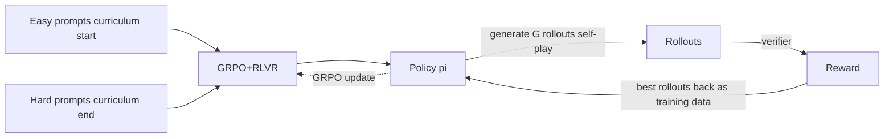

# Self-Play, Curriculum & RL for Code

<Mode is="learn">

Three threads that thread through modern RL: **self-play** (the model improves by playing against itself or earlier versions); **curriculum learning** (start easy, get harder, schedule the difficulty); **RL for code** (the cleanest applied success story — verifiable rewards via unit tests, used by Devin, Claude Code training, and every coding agent in 2026). This lesson is the three patterns and how they intersect.

## TL;DR

- **Self-play**: the policy generates rollouts; the *better* rollouts become training data for the next iteration. Iterative self-improvement. R1-Zero is essentially self-play with a verifier; AlphaZero-style games are the historical reference.
- **Curriculum**: schedule the difficulty of training prompts. Start with easy problems where signal is dense; ramp to hard ones where the policy is challenged. Empirically valuable; theoretically poorly understood.
- **RL for code**: the canonical RLVR application. Code is verifiable (unit tests), debuggable (interpreters give signal), and high-value (paying customer feedback loop). Devin, Claude Code, GitHub Copilot Workspace all train on this.
- **Common pattern**: cold-start SFT → curriculum-scheduled GRPO+RLVR with self-play sample generation. Three threads converging into one recipe.

## Why this matters

These three patterns recur in every active 2026 RL recipe. Self-play is how DeepSeek-R1 generated reasoning data without human writers. Curriculum is how compute-efficient training works in practice. RL for code is the most-shipped applied product of the entire RL-for-LLMs effort and is the simplest case study to learn from.

## Self-play

**Definition**: the policy generates training data; better-quality outputs become next iteration's targets. The model trains *against* (or *from*) its own outputs.

**Classical self-play** (AlphaZero, AlphaGo): two policies play against each other; the winner's moves train both. Capability climbs via internal competition.

**LLM self-play variants:**

1. **Rejection-sampling SFT**: for each prompt, sample G rollouts; keep the best (highest reward); SFT on those. Repeat. This is **R1's Phase 3**. Each iteration, the policy generates higher-quality training data because it's getting better.
2. **DPO self-play (SPIN)**: at each step, current policy generates rollouts; pairs with previous-checkpoint rollouts; DPO with current as "chosen", previous as "rejected". Drives capability upward by always trying to outperform yesterday.
3. **Multi-agent self-play**: two LLMs debate or play games; outcomes train both. Less common in production; active research.

**The empirical observation**: self-play with a *verifier* (RLVR-style) doesn't saturate the way classical RL does. R1-Zero's accuracy curves keep climbing for tens of thousands of RL steps. This is unusual — most RL plateaus.

## Curriculum learning

**Definition**: order training prompts from easy to hard so the policy gets dense signal early and challenging signal later.

**Why it matters in RL**: if every prompt is too hard (reward = 0 always) or too easy (reward = 1 always), the advantage signal is dead. Group-relative methods (GRPO) particularly need a mix — within a group, you want *some* successes and *some* failures.

**Common curriculum recipes:**

1. **Difficulty bucketing**: pre-rate problems by difficulty (e.g., AMC math levels, codeforces ratings). Train on easiest 30% for the first N steps, easiest 60% for the next N, etc.
2. **Adaptive curriculum**: track per-problem success rate during training. Up-weight problems where the policy is on the boundary (success rate near 0.5).
3. **Self-paced**: the model writes a difficulty rating for each problem; problems near the policy's frontier get oversampled.

**Tülu 3** documents a curriculum recipe. **OpenMathInstruct-2** uses difficulty bucketing. Most strong open recipes do *some* curriculum, often informally.

## RL for code (the cleanest case study)

Code is the *perfect* domain for RL on LLMs:

- **Verifiable**: unit tests give clean 0/1 reward.
- **Composable**: tasks decompose into subproblems naturally.
- **High commercial value**: paying users provide a feedback loop.
- **Multi-step natural**: agentic with debugger, REPL, file system.

The 2024-2026 wave of coding agents (Devin, Claude Code, Cursor agent, Codex, Aider) are all trained substantially with RL. The recipes are not fully public but share structure:

1. Cold-start SFT on human-written code (often from GitHub).
2. RLVR with unit-test rewards on competitive programming, LeetCode, real-world bugs.
3. Multi-turn agentic RL: model runs code, sees output, debugs, repeats.
4. Self-play on coding tasks: model generates problems, solves them, weaker solutions become training rejected-examples.

**Public open recipes worth reading:**

- **OpenCodeReasoning** (2025): full open recipe for code-RL.
- **DeepSeek-Coder** training paper.
- **AceCoder / Code-R1** papers.

**Engineering specifics**:
- Code sandbox is the binding throughput constraint. Modal, E2B, Firejail are the common production choices.
- Test isolation matters (your model can't reach the internet during evaluation).
- Time budgets per test are critical (timeouts dominate failure modes).
- Multi-turn context grows fast (terminal output, file contents) — RadixAttention helps.

## How the three patterns intersect

A 2026 production reasoning-and-code recipe (composite, simplified):

```
Step 1: Cold-start SFT on curated long-CoT code reasoning
  Curriculum: easy problems first, hard later
  
Step 2: GRPO + RLVR on math + code
  Curriculum: difficulty-bucketed
  Self-play: sample G rollouts per prompt, group-normalize
  Verifier: math parser + code sandbox

Step 3: Rejection-sampling SFT (self-play)
  Take best rollouts from Step 2 policy
  Fine-tune on these
  Mixed with safety + general data
  
Step 4: Final GRPO with blended rewards
  Same curriculum
  Self-play maintained via group rollouts
```

Self-play in rejection-sampling SFT, curriculum in problem ordering, RLVR via the verifier. Three patterns one recipe.

## Mental model



The three loops: curriculum supplies prompts; self-play generates rollouts; RLVR scores them; gradient improves the policy; better policy generates better rollouts.

## Key takeaways

1. **Self-play with a verifier doesn't saturate** — accuracy keeps climbing. The R1-Zero result.
2. **Curriculum keeps GRPO signal alive** — too-hard prompts give 0 advantage everywhere.
3. **RL for code is the cleanest applied success.** Verifiable, composable, commercially valuable.
4. **Modern recipes intersect all three**: curriculum-scheduled, self-play-generating, RLVR-trained.
5. **The 2026 coding-agent stack** (Devin, Claude Code, Cursor) is the canonical case study. Read OpenCodeReasoning for an open replication.

## Go deeper

<Resources
  items={[
    { kind: 'paper', href: 'https://arxiv.org/abs/1712.01815', title: 'Silver et al. — AlphaZero', author: 'DeepMind (2017)', note: 'Classical self-play. Foundation paper for the concept.' },
    { kind: 'paper', href: 'https://arxiv.org/abs/2401.01335', title: 'Chen et al. — SPIN: Self-Play Fine-Tuning', note: 'DPO-flavored self-play for LLMs. Clean recipe.' },
    { kind: 'paper', href: 'https://arxiv.org/abs/2501.12948', title: 'DeepSeek-R1 (rejection-sampling SFT)', note: 'Phase 3 of R1 is self-play via best-rollout SFT. Required.' },
    { kind: 'paper', href: 'https://arxiv.org/abs/2504.13941', title: 'OpenCodeReasoning', note: 'Open reasoning-code RL recipe with full data + hyperparameters. 2025 reference.' },
    { kind: 'paper', href: 'https://arxiv.org/abs/2401.14196', title: 'DeepSeek-Coder', note: 'DeepSeek\'s code-training recipe. Strong open reference.' },
    { kind: 'paper', href: 'https://arxiv.org/abs/2009.05214', title: 'Soviany et al. — Curriculum Learning: A Survey', note: 'Comprehensive curriculum survey. Pre-LLM but lessons apply.' },
    { kind: 'paper', href: 'https://arxiv.org/abs/2411.15124', title: 'Tülu 3 — curriculum + RLVR', note: 'Open recipe with curriculum scheduling.' },
    { kind: 'paper', href: 'https://arxiv.org/abs/2410.02089', title: 'AceCoder', note: 'Code-RL with execution feedback.' },
    { kind: 'paper', href: 'https://arxiv.org/abs/2503.01307', title: 'Code-R1', note: 'GRPO on code with verifier; one of the strongest open code-RL recipes in 2025.' },
    { kind: 'blog', href: 'https://www.cognition.ai/blog/introducing-devin', title: 'Cognition — Introducing Devin', note: 'The Devin announcement; less technical detail but architecture-suggestive.' },
  ]}
/>

</Mode>

<Mode is="reference">

## TL;DR

- Self-play with verifier doesn't saturate.
- Curriculum keeps GRPO advantage signal alive.
- Code is the cleanest RL-LLM domain (verifier, composability, commercial value).
- Modern recipes intersect all three.

## Why this matters

The dominant 2026 recipe structure. Code-agent training the named applied product.

## Concrete walkthrough

**Self-play loop (rejection-sampling SFT style):**

```python
policy = sft_base
for iteration in range(N_ITER):
    rollouts = []
    for prompt in dataset:
        G_completions = policy.sample(prompt, n=G)
        scores = [verifier(c) for c in G_completions]
        best = G_completions[argmax(scores)]
        rollouts.append((prompt, best))
    policy = sft(policy, rollouts)  # fine-tune on best rollouts
```

**Curriculum schedule (difficulty bucketing):**

```python
buckets = sort_by_difficulty(prompts)  # easiest first

def get_batch(step):
    bucket_cutoff = min(0.3 + step / 10000, 1.0)
    available = buckets[:int(len(buckets) * bucket_cutoff)]
    return sample(available, batch_size)
```

**Adaptive curriculum:**

```python
success_rate = {prompt_id: ema_succeses[prompt_id] for prompt_id in dataset}
boundary = {p: 1 - abs(0.5 - success_rate[p]) for p in dataset}  # peak at 0.5
batch = sample_weighted(dataset, weights=boundary)
```

## Code-RL specifics

| Concern | Solution |
| --- | --- |
| Sandbox throughput | Modal / E2B / Firejail pool |
| Test isolation | No network, no FS write outside /tmp |
| Time budget | 10-30s per test |
| Multi-turn context | RadixAttention prefix cache |
| Reward shaping | Test-pass count, partial credit possible |

## Key takeaways

1. Self-play + verifier = no saturation (R1-Zero).
2. Curriculum keeps signal alive in GRPO.
3. Code is the canonical RLVR domain.
4. Modern recipes combine all three.

## Go deeper

<Resources
  items={[
    { kind: 'paper', href: 'https://arxiv.org/abs/2501.12948', title: 'DeepSeek-R1' },
    { kind: 'paper', href: 'https://arxiv.org/abs/2504.13941', title: 'OpenCodeReasoning' },
    { kind: 'paper', href: 'https://arxiv.org/abs/2401.01335', title: 'SPIN' },
  ]}
/>

</Mode>

<LessonComplete />
