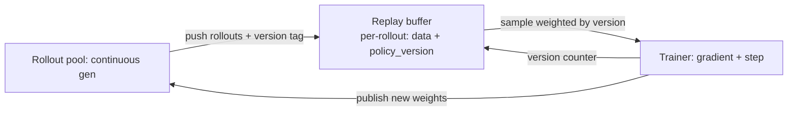

# Async RL & Off-Policy Staleness

<Mode is="learn">

In a synchronous RL loop, the trainer waits for rollouts; the rollout pool waits for the next weight update. On a typical 7B GRPO run, ~30-50% of total GPU time is *waiting*. Async RL — the 2024-2025 unlock that gave Laminar 3.34× and ROLL Flash 2.72× — overlaps the two stages. The math gets harder (you're training on data from K-step-old policies) but the wins are huge. This lesson is the architecture, the staleness math, and the practical recipes that make async RL work.

## TL;DR

- **Sync RL**: rollouts then training then weight sync, in lockstep. Easy to reason about. GPU utilization 50-70%.
- **Async RL**: trainer and rollout pool run concurrently. Trainer gets data generated by K-step-old weights. GPU utilization 80-95%.
- **Cost**: importance ratios get larger ($\rho = \pi/\pi_{old}$ where $\pi_{old}$ is K steps stale). PPO clip handles small K; large K breaks the estimator.
- **Mitigations**: smaller learning rate, tighter PPO clip ($\epsilon = 0.1$ instead of $0.2$), stricter KL anchor, periodic full sync.
- **The key papers**: Laminar (2024), ROLL Flash (2025), AReaL (2024). All converge on similar architectures: replay buffer + staleness-aware advantage.

## Why this matters

Frontier-lab compute budgets are measured in millions of GPU-hours. A 2× rollout efficiency gain saves $10M+ on a serious post-training run. Async-RL infrastructure is a *named* responsibility on multiple Anthropic / OpenAI / DeepSeek job descriptions. The math is approachable; the engineering is where the alpha is.

## The concept

**Synchronous pipeline (current PPO/GRPO default):**

```
t=0: rollout (all GPUs)
t=1: training step
t=2: weight sync
t=3: rollout
...
```

Pool is idle during the training step and weight sync. Trainer is idle during rollout. GPU utilization ~50-70%.

**Asynchronous pipeline:**

```
Rollout pool (continuous):    [R1 R2 R3 R4 R5 R6 ...]
Trainer (continuous):              [T1 T2 T3 T4 T5 ...]
                                  ↑    ↑    ↑
                       T1 consumes R1; R3 already running when T1 starts
```

The rollout pool generates continuously. The trainer pulls batches as they're ready. Weight syncs happen asynchronously (the rollout pool refreshes weights *while it's also still rolling out* — using vLLM's hot-swap mechanism).

The catch: by the time the trainer processes batch $R_i$, the rollout pool is using weights from $T_{i+K}$ for some K. The data is *off-policy by K steps*.

## Why staleness hurts

PPO/GRPO are *near-on-policy* algorithms. The importance ratio:

$$
\rho_t = \pi_{\theta_{current}}(a_t|s_t) / \pi_{\theta_{old}}(a_t|s_t)
$$

stays close to 1 when old is fresh. The PPO clip $\text{clip}(\rho, 1-\epsilon, 1+\epsilon)$ kicks in for $\rho \notin [0.8, 1.2]$. If K is too large, the gradient signal vanishes (everything is clipped) or worse, the unclipped contributions are tiny but high-variance.

Empirically:
- $K \leq 1$ (one step stale): essentially identical to sync. Easy win.
- $K = 2-5$: noticeable but manageable. Tighten $\epsilon$ to 0.1.
- $K = 6-20$: needs careful staleness correction (see below).
- $K > 20$: very hard; needs full off-policy machinery (replay buffer, V-trace, IMPALA-style).

## Staleness correction techniques

**1. Replay buffer with priority sampling.** Newer data is sampled more often than older. Old data is purged after K steps. Used in Laminar, AReaL.

**2. Truncated importance sampling.** Cap the importance ratio to prevent variance explosions:

$$
\hat{\rho}_t = \min(\rho_t, c)
$$

with $c$ typically 1.5-3.0. Equivalent to a one-sided clip.

**3. V-trace** (from IMPALA): a more general off-policy correction that adjusts the advantage estimate based on how off-policy each step is. Mathematically clean; rarely used in LLM RL because per-token V-trace is expensive.

**4. Periodic hard sync.** Every M steps, pause the rollout pool, force a full weight sync, drain the buffer. Bounds K at M. Used as a safety mechanism in production.

**5. Smaller learning rate.** Compensate for stale gradients by taking smaller steps. Practical and underrated.

## Architecture: the replay buffer pattern



Every rollout is tagged with the policy version that generated it. The trainer samples preferentially from recent versions. Old rollouts (e.g., K steps stale) are dropped.

## Production recipes

**Laminar** (2024): replay buffer + importance-corrected per-token loss. Achieved 3.34× over sync PPO.

**ROLL Flash** (Volcano Engine, 2025): async vLLM rollouts inside verl + continuous batching at the trainer side. 2.72× over verl-sync.

**AReaL** (Tsinghua, 2024): fully-async architecture with priority sampling. Strongest staleness-correction story among open frameworks.

The common pattern across all three:
1. Continuous rollouts with version tagging.
2. Replay buffer with version-weighted sampling.
3. Truncated importance sampling.
4. Tighter PPO clip ($\epsilon = 0.1$).
5. Periodic hard sync as safety.

## Key takeaways

1. **Async RL = 2-3× efficiency over sync RL.** Real and measurable.
2. **Staleness K matters.** K ≤ 1: easy. K = 5: tunable. K = 20: hard.
3. **The standard machinery**: replay buffer + version tagging + truncated importance sampling + tighter PPO clip + periodic hard sync.
4. **Laminar, ROLL Flash, AReaL** are the 2024-2025 papers to read.
5. **This is where RL infra engineers actually spend time.** Async-RL infrastructure work is the named line item on multiple frontier-lab postings.

## Go deeper

<Resources
  items={[
    { kind: 'paper', href: 'https://arxiv.org/abs/2409.19256', title: 'Laminar — Async RL with Decoupled Rollout', author: 'Various (2024)', note: '3.34× speedup over sync. Read for the staleness handling.' },
    { kind: 'paper', href: 'https://arxiv.org/abs/2502.01142', title: 'ROLL Flash — Volcano Engine', author: 'ByteDance (2025)', note: 'verl\'s async story. 2.72× speedup.' },
    { kind: 'paper', href: 'https://arxiv.org/abs/2502.06049', title: 'AReaL — Async RL for Large Reasoning Models', author: 'Tsinghua (2025)', note: 'Open async-first RL framework. Strongest staleness correction.' },
    { kind: 'paper', href: 'https://arxiv.org/abs/1802.01561', title: 'Espeholt et al. — IMPALA / V-trace', author: 'DeepMind (2018)', note: 'The original off-policy correction. V-trace is the mathematical foundation for async RL.' },
    { kind: 'paper', href: 'https://arxiv.org/abs/2310.10322', title: 'Andrychowicz et al. — What Matters In On-Policy Learning', note: 'Empirical study of sync vs async tradeoffs. Pre-LLM but the lessons apply.' },
    { kind: 'paper', href: 'https://arxiv.org/abs/1611.05397', title: 'Mnih et al. — A3C (Asynchronous Advantage Actor-Critic)', note: 'The original async RL paper. Historical foundation; the modern LLM versions are A3C\'s descendants.' },
    { kind: 'repo', href: 'https://github.com/inclusionAI/AReaL', title: 'AReaL repo', note: 'Reference async-RL code.' },
    { kind: 'blog', href: 'https://volcengine.github.io/verl/algo/async_rollout.html', title: 'verl — Async Rollout docs', note: 'How verl wires up ROLL Flash-style async.' },
  ]}
/>

</Mode>

<Mode is="reference">

## TL;DR

- Async RL overlaps rollout and training; 2-3× efficiency gain.
- Cost: K-step staleness in importance ratio.
- Mitigations: replay buffer + version tags + truncated IS + tighter clip + periodic hard sync.
- Key papers: Laminar, ROLL Flash, AReaL.

## Why this matters

Where production RL spends most engineering time. Named responsibility on frontier-lab postings.

## Concrete walkthrough

**Staleness budget table:**

| K (steps stale) | Risk level | Mitigation |
| --- | --- | --- |
| 0-1 | None | Standard PPO |
| 2-5 | Low | Tighten $\epsilon$ to 0.1 |
| 6-20 | Medium | Truncated IS + replay buffer + periodic sync |
| 20+ | High | V-trace or restart |

**Truncated importance sampling:**

$$
\hat{g} = \mathbb{E}\big[\min(\rho_t, c) \cdot \nabla \log \pi_\theta(a_t|s_t) \cdot \hat{A}_t\big]
$$

with $c \in [1.5, 3.0]$.

**Replay buffer sketch:**

```python
buffer = []  # list of (rollout_data, policy_version)

def add(rollout, version):
    buffer.append((rollout, version))
    # purge anything older than K steps
    current = trainer.current_version
    buffer[:] = [(r, v) for r, v in buffer if (current - v) <= K_MAX]

def sample(batch_size):
    # weight by recency
    weights = [decay ** (trainer.current_version - v) for _, v in buffer]
    return random.choices(buffer, weights=weights, k=batch_size)
```

## Key takeaways

1. Async = 2-3× efficiency.
2. Staleness ≤ 5 with tight clip + IS is the sweet spot.
3. Replay buffer + version tags is the standard pattern.
4. Laminar / ROLL Flash / AReaL = the papers.

## Go deeper

<Resources
  items={[
    { kind: 'paper', href: 'https://arxiv.org/abs/2409.19256', title: 'Laminar' },
    { kind: 'paper', href: 'https://arxiv.org/abs/2502.01142', title: 'ROLL Flash' },
    { kind: 'paper', href: 'https://arxiv.org/abs/2502.06049', title: 'AReaL' },
    { kind: 'paper', href: 'https://arxiv.org/abs/1802.01561', title: 'V-trace / IMPALA' },
  ]}
/>

</Mode>

<LessonComplete />
