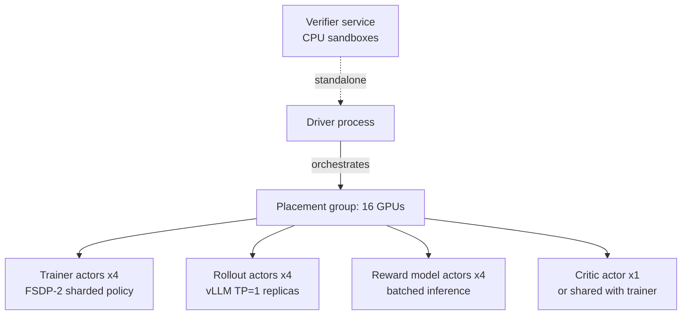

# Distributed RL & Ray Architectures

<Mode is="learn">

Standalone PyTorch isn't enough for RL at scale. You have a *trainer cluster* (FSDP-sharded), a *rollout cluster* (vLLM replicas), a *reward model cluster* (frozen, batched inference), maybe a *critic cluster*, and a *verifier service*. All of them produce and consume data on every iteration, on different cadences. Orchestrating this without a framework is a mess. Every major open RL stack — OpenRLHF, verl, NeMo-RL — settled on **Ray** as the orchestration layer. This lesson is why Ray, how the patterns work, and what the production architectures look like.

## TL;DR

- **Ray** is a Python-native distributed framework. Its key primitive — `@ray.remote` actors — is the right model for "a stateful GPU worker that does one thing".
- **Standard RL Ray architecture**: separate actors for trainer (FSDP), rollouts (vLLM replicas), reward model (batched inference), critic, optional verifier — all coordinated by a driver process.
- **Why Ray over alternatives**: handles heterogeneous resources (GPU types), fault tolerance, actor placement, and gradient/data exchange across actor types — all in Python.
- **The placement group** is Ray's killer feature for RL: declaratively reserve GPUs for each actor type, get failure isolation between pools.
- **Trade-offs**: Ray adds ~50-200ms of orchestration overhead per call vs raw PyTorch distributed. For RL where one step is 5-30s, this is invisible.

## Why this matters

Every open RL trainer you'd contribute to in 2026 — verl, OpenRLHF, NeMo-RL, AReaL — is built on Ray. Reading their code, debugging your own runs, building anything at frontier-lab scale: Ray is the substrate.

## The concept

Ray gives you three primitives that map cleanly to RL:

**`@ray.remote` task**: a stateless function call dispatched to the cluster. Used for one-off work: "compute reward for these completions", "verify this batch of math answers".

**`@ray.remote` actor**: a stateful class instance pinned to specific resources (e.g. a GPU). Used for the long-lived workers: the trainer, each vLLM replica, the reward model. Methods on the actor are RPC calls.

**`ray.PlacementGroup`**: a declarative resource reservation. "Give me 8 GPUs, 4 for trainers and 4 for rollouts, ideally on the same node." Used for the static topology of an RL job.

## A typical Ray RL architecture (OpenRLHF / verl)



Each iteration the driver:
1. `prompts = sample_prompts(N)`
2. `completions = ray.get([r.generate.remote(p) for r, p in zip(rollouts, prompt_batches)])`
3. `rewards = ray.get([rm.score.remote(c) for rm, c in zip(rm_actors, completion_batches)])` — or call the verifier service
4. `gradients = ray.get([t.compute_gradients.remote(...) for t in trainers])`
5. Trainers do their `optimizer.step()`
6. Trainers push new weights to rollouts via NCCL (using `update_weights_from_distributed`)
7. Goto 1

The orchestration code is ~200 lines. The actor implementations are ~500 lines each. The whole RL stack fits in 2-3K lines of Python.

## Why heterogeneous resources matter

A common production setup has *different GPU types* in the same cluster:

- Trainers on H100s (need the HBM and Tensor Cores for FSDP backward).
- Rollouts on A100s or even A6000s (inference doesn't need H100; cheaper).
- Reward models on A6000s (mid-size inference, batched).
- Verifier sandboxes on CPU machines.

Ray's placement group handles this cleanly:

```python
pg = ray.util.placement_group(
    bundles=[
        {"GPU": 1, "CPU": 8, "node:trainer": 1} for _ in range(4)
    ] + [
        {"GPU": 1, "CPU": 4, "node:rollout": 1} for _ in range(8)
    ],
    strategy="PACK"
)
```

You declare what you want; Ray finds matching machines.

## The actor pattern in code

```python
@ray.remote(num_gpus=1)
class RolloutWorker:
    def __init__(self, model_name):
        import vllm
        self.engine = vllm.LLM(model=model_name, gpu_memory_utilization=0.9)

    def generate(self, prompts, n=8, sampling_params=None):
        return self.engine.generate(prompts, n=n, sampling_params=sampling_params)

    def update_weights(self, weights_handle):
        # NCCL receive from trainers
        self.engine.collective_rpc("update_weights_from_distributed", args=(weights_handle,))

workers = [RolloutWorker.remote("Qwen/Qwen2.5-1B-Instruct") for _ in range(8)]
futures = [w.generate.remote(prompts_batch) for w in workers]
results = ray.get(futures)
```

That's the full pattern. Easy to read, easy to debug (each actor is a normal Python class), easy to scale (add more `.remote()` calls).

## Failure modes & fault tolerance

Ray gives you:
- **Actor restart** on hardware failure (you have to re-load weights though).
- **Automatic retry** on `ray.remote` task failures.
- **Object spilling** to disk when the object store is full — important when rollouts produce a lot of data.

Ray does *not* give you:
- Free-lunch fault tolerance for stateful trainers (you still need checkpoint).
- Magically fast networking (NCCL is still the protocol you want for weight sync).

## Key takeaways

1. **Ray = Python distributed primitives** built for stateful GPU actors and heterogeneous clusters.
2. **`@ray.remote` actor** is the right model for each RL worker type.
3. **PlacementGroup** declares topology — what GPUs go where.
4. **Every production RL framework uses Ray** in 2025-2026. Reading code = reading Ray.
5. **Ray overhead is invisible at RL step granularity** (~100ms vs ~10s per step).

## Go deeper

<Resources
  items={[
    { kind: 'docs', href: 'https://docs.ray.io/en/latest/ray-core/walkthrough.html', title: 'Ray Core Walkthrough', note: 'The official intro. Read through "Calling Actors".' },
    { kind: 'docs', href: 'https://docs.ray.io/en/latest/ray-core/scheduling/placement-group.html', title: 'Ray — Placement Groups', note: 'The pattern every RL framework uses for resource reservation.' },
    { kind: 'repo', href: 'https://github.com/OpenRLHF/OpenRLHF', title: 'OpenRLHF', note: 'Cleanest open Ray-based RL trainer. Read openrlhf/trainer/ray/ppo_actor.py.' },
    { kind: 'repo', href: 'https://github.com/volcengine/verl', title: 'verl', note: 'Production-scale Ray RL. Larger codebase; see verl/single_controller/.' },
    { kind: 'paper', href: 'https://arxiv.org/abs/1712.05889', title: 'Moritz et al. — Ray: A Distributed Framework for Emerging AI Applications', note: 'The original Ray paper. Section 3 is the architecture you should know.' },
    { kind: 'paper', href: 'https://arxiv.org/abs/1807.05118', title: 'Liang et al. — RLlib: Abstractions for Distributed RL', note: 'Ray\'s own RL library. Older but the architectural patterns hold.' },
    { kind: 'blog', href: 'https://www.anyscale.com/blog/openrlhf-ray', title: 'Anyscale — OpenRLHF on Ray', note: 'Detailed walkthrough of the OpenRLHF Ray architecture by Ray\'s creators.' },
  ]}
/>

</Mode>

<Mode is="reference">

## TL;DR

- Ray primitives: stateless task, stateful actor, placement group.
- Standard RL architecture: trainer / rollout / RM / critic / verifier actors.
- Heterogeneous GPU support via PlacementGroup.
- Ray overhead is ~100ms — invisible at RL step time scales.

## Why this matters

Every production RL trainer is Ray-based in 2026.

## Concrete walkthrough

**Actor pattern:**

```python
@ray.remote(num_gpus=1)
class Trainer:
    def __init__(self, ...):
        import torch
        self.model = setup_fsdp_model(...)
        self.optim = torch.optim.AdamW(...)
    
    def compute_gradients(self, rollouts):
        # PPO/GRPO loss + backward
        ...
        return self.model.state_dict_handles()
    
    def get_weights_handle(self):
        return self.model.state_dict_handles()
```

**Driver loop:**

```python
trainers = [Trainer.options(scheduling_strategy=PG).remote(...) for _ in range(NTRAIN)]
rollouts = [Rollout.options(scheduling_strategy=PG).remote(...) for _ in range(NROLL)]

for step in range(STEPS):
    # 1. Generate
    prompts = next(prompt_iter)
    rollout_futures = [r.generate.remote(prompts[i::NROLL]) for i, r in enumerate(rollouts)]
    rollouts_data   = ray.get(rollout_futures)
    
    # 2. Train
    grad_futures = [t.train_step.remote(rollouts_data[i::NTRAIN]) for i, t in enumerate(trainers)]
    ray.get(grad_futures)
    
    # 3. Sync
    weight_handle = trainers[0].get_weights_handle.remote()
    ray.get([r.update_weights.remote(weight_handle) for r in rollouts])
```

## Resource sizing

| Component | Per-actor resources | Typical count |
| --- | --- | --- |
| Trainer | 1× H100, FSDP sharded | 4-32 |
| Rollout | 1× A100/H100, vLLM | 4-16 |
| RM | 1× A100/H100, batched | 1-4 |
| Critic | 1× A100/H100 or shared | 1 |
| Verifier | CPU pool | many small |

## Key takeaways

1. `@ray.remote` actors + PlacementGroup = RL substrate.
2. ~100ms overhead per call.
3. Heterogeneous GPU support is the killer feature.
4. Every prod RL framework is Ray-based.

## Go deeper

<Resources
  items={[
    { kind: 'docs', href: 'https://docs.ray.io/en/latest/ray-core/walkthrough.html', title: 'Ray Core', note: 'Official intro.' },
    { kind: 'repo', href: 'https://github.com/OpenRLHF/OpenRLHF', title: 'OpenRLHF', note: 'Cleanest reference impl.' },
    { kind: 'repo', href: 'https://github.com/volcengine/verl', title: 'verl', note: 'Production scale.' },
  ]}
/>

</Mode>

<LessonComplete />
