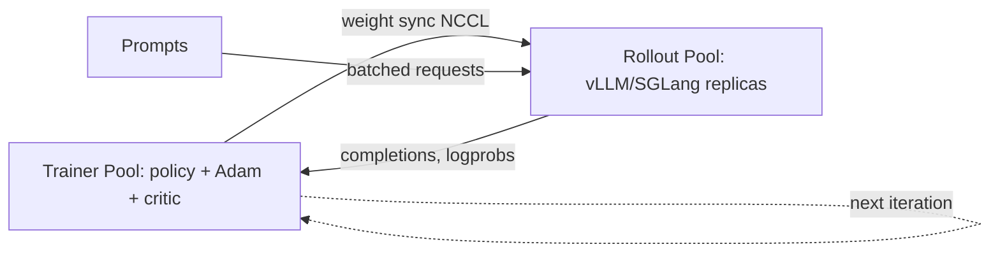

# Rollout Engines (vLLM as RL Backend)

<Mode is="learn">

In every RL training run for an LLM, ~70% of wall-clock time is *generating completions*. The training step itself is fast; rollouts dominate. The engine that does that generation — vLLM, SGLang, TensorRT-LLM, or a custom fork — is called the **rollout engine**. Knowing how to wire it into your trainer, sync weights to it efficiently, and squeeze throughput out of it is the single most impactful skill in RL infrastructure. It's also where your North inference-engineer experience translates 1:1 into RL-systems work — rollouts ARE inference under load.

## TL;DR

- A **rollout engine** is an inference server (typically vLLM or SGLang) that the trainer queries for completions during each RL step. Lives on a separate GPU pool from the trainer.
- **Weight syncing** is the hard part: the policy on the trainer updates every step, but the rollout engine is holding stale weights. Solutions: NCCL all-gather, RDMA push, slow-path checkpoint load.
- **Prefix caching across rollouts** matters enormously — same prompt sampled G times means G-1 chances to reuse the prefill. vLLM and SGLang both support this.
- **On-policy gap**: if the rollout engine is more than ~1 step behind the trainer, importance ratios explode. Sync strategy decides what "more than ~1 step" means in your setup.
- **Async vs sync**: sync = rollouts pause during weight update; async = rollouts continue with stale weights and importance-correct later. Async is more efficient but harder.

## Why this matters

For you specifically, post-North: your mini-vLLM IS a rollout engine. The W9-W10 capstone ("PPO/GRPO trainer with my rollout engine") is exactly this lesson, expressed as code. Every Anthropic RL Engineering interview question about "scaling RLHF" is a rollout-engine question in disguise.

## The concept

A modern RL training cluster has two GPU pools:

**Trainer pool**: holds the policy + critic + Adam state + activation memory for backward pass. FSDP/ZeRO-sharded. The bottleneck is *update step time* (gradient compute + optimizer step). 

**Rollout pool**: holds the policy as an *inference* engine — typically 1 replica per GPU, or sharded TP for large models. The bottleneck is *throughput* (completions/sec).

Each PPO/GRPO iteration:
1. Trainer broadcasts current weights to rollout pool.
2. Rollout pool generates N completions for N prompts (often G rollouts per prompt for GRPO).
3. Completions flow back to trainer.
4. Reward + KL computed.
5. Trainer takes gradient step.
6. Goto 1.

**Why a separate pool?** Two reasons. First, inference uses ~5× less memory than training (no Adam state, no gradients, no activation checkpointing) — wasteful to put rollouts on a fully-loaded trainer GPU. Second, inference is *throughput-bound* while training is *latency-bound* — they want different parallelism strategies.

## Weight syncing (the hard part)

The naive way:

```python
for step in range(N):
    rollouts = rollout_engine.generate(prompts)  # uses stale weights!
    grads = compute_gradients(rollouts)
    optimizer.step()
    sync_weights_to_rollout_engine(model)  # blocks both pools
```

Three problems:
1. **The sync is slow.** Sending a 7B model over network is GB-scale.
2. **The rollout pool is idle during sync.** Wasted GPU-time.
3. **The trainer is idle during rollout generation.** Also wasted.

Three solutions, each with tradeoffs:

**(a) NCCL collective sync** (verl, OpenRLHF). After each trainer step, the trainer's parameters are NCCL-broadcast to the rollout pool. Fast over NVLink/InfiniBand. Rollouts pause briefly.

**(b) RDMA point-to-point** (some custom setups). Per-tensor RDMA push from trainer to rollouts. Fastest. Most complex to set up.

**(c) Checkpoint shuttle** (TRL legacy). Trainer writes a checkpoint to disk; rollouts load from disk. Slow but simple. Used in early implementations.

The 2025-2026 standard is **NCCL all-gather** with **in-place receive on the rollout side** — vLLM 0.6+ and SGLang both expose APIs for this (`update_weights_from_disk`, `update_weights_from_distributed`).

## Prefix caching across rollouts

For GRPO with G=8 rollouts per prompt: you're running the prefill (the prompt) 8 times. With prefix caching, the rollout engine notices it's the same prefix and reuses the KV cache. Throughput improvement is huge — often 3-5× for typical RL prompt lengths.

vLLM's automatic prefix caching turns this on by default. SGLang's **RadixAttention** is even better — it tracks shared prefixes across all in-flight requests, not just same-prompt batches. For RL workloads where many prompts share system prompts or few-shot examples, RadixAttention is essentially free throughput.

## On-policy gap

If the rollout engine is using weights from $\pi_{step-K}$ while the trainer is at $\pi_{step}$, the importance ratio:

$$
\rho = \pi_{step}(a|s) / \pi_{step-K}(a|s)
$$

drifts away from 1.0. PPO's clip can handle small drift; large drift (K > 5 or so) makes the gradient estimator garbage.

**Strict on-policy** ($K = 0$): trainer waits for rollout pool to fully refresh weights before generating. Slow but stable.

**Mildly off-policy** ($K = 1-3$): rollouts continue with K-step-stale weights. Manageable with importance ratio.

**Async / very off-policy** ($K > 5$): needs careful staleness handling (see the async-rl-staleness lesson).

## Mental model



Two GPU pools, one network sync per iteration, completions flowing the other way.

## Key takeaways

1. **Rollout engine = vLLM or SGLang serving the policy.** Lives on a separate GPU pool from the trainer.
2. **Weight sync is the critical path.** NCCL all-gather is the modern standard.
3. **Prefix caching saves enormous compute** for GRPO (G rollouts per prompt). RadixAttention is the best-in-class.
4. **On-policy gap matters.** Strict on-policy is stable but slow; off-policy needs importance correction.
5. **Your North inference work directly transfers.** Mini-vLLM is the prototype of a rollout engine.

## Go deeper

<Resources
  items={[
    { kind: 'repo', href: 'https://github.com/vllm-project/vllm', title: 'vLLM', note: 'The dominant rollout backend in 2025-2026. Read engine/, scheduler/ for the production patterns.' },
    { kind: 'repo', href: 'https://github.com/sgl-project/sglang', title: 'SGLang', note: 'RadixAttention is best-in-class for RL. Read python/sglang/srt/managers/scheduler.py.' },
    { kind: 'repo', href: 'https://github.com/volcengine/verl', title: 'verl', note: 'Reference RL-trainer that uses vLLM as rollout backend. See verl/workers/rollout/vllm_rollout/.' },
    { kind: 'repo', href: 'https://github.com/OpenRLHF/OpenRLHF', title: 'OpenRLHF', note: 'Ray-based RL trainer using vLLM. See openrlhf/trainer/ray/ for the dual-pool architecture.' },
    { kind: 'paper', href: 'https://arxiv.org/abs/2309.06180', title: 'Kwon et al. — PagedAttention (vLLM paper)', note: 'The paper. KV cache as virtual memory — the foundation for prefix caching.' },
    { kind: 'paper', href: 'https://arxiv.org/abs/2312.07104', title: 'Zheng et al. — SGLang (RadixAttention)', note: 'The RadixAttention paper. Critical for RL workloads with shared prefixes.' },
    { kind: 'blog', href: 'https://blog.vllm.ai/2024/09/05/perf-update.html', title: 'vLLM v0.6 perf update', note: 'When vLLM\'s RL-relevant features (chunked prefill, prefix cache) matured.' },
    { kind: 'paper', href: 'https://arxiv.org/abs/2409.19256', title: 'Laminar — Async RL with Decoupled Rollout', note: '3.34× speedup over sync rollouts. The 2024 paper everyone in RL infra has read.' },
    { kind: 'paper', href: 'https://arxiv.org/abs/2502.01142', title: 'ROLL Flash — Volcano Engine', author: 'ByteDance (2025)', note: 'verl\'s own paper on rollout efficiency. 2.72× over previous baseline.' },
  ]}
/>

</Mode>

<Mode is="reference">

## TL;DR

- Two GPU pools: trainer (memory-heavy) + rollouts (throughput-heavy).
- vLLM/SGLang serve the policy; NCCL or RDMA sync weights every step.
- Prefix caching / RadixAttention is enormous for GRPO (G rollouts share prefix).
- On-policy gap (K-step staleness) must stay bounded for PPO clip to work.

## Why this matters

70% of RL wall-clock is rollouts. Rollout efficiency = training cost.

## Concrete walkthrough

**Typical sync code (verl-style):**

```python
# After trainer step
new_state_dict = fsdp_full_state_dict(policy)
for rollout_worker in rollout_pool:
    rollout_worker.update_weights_from_distributed.remote(new_state_dict)
torch.distributed.barrier()
```

**Pool sizing rule of thumb (7B model, GRPO with G=8):**

| Component | GPUs | Memory each | Notes |
| --- | --- | --- | --- |
| Trainer | 4-8 | 80 GB H100 | FSDP-2 for the policy + Adam + critic |
| Rollouts | 4-8 | 80 GB H100 | vLLM replicas, 1-2 per GPU; with quant, smaller |
| Verifier | CPU + sandbox | — | Code execution on CPU pool |

**Throughput math:**

If a rollout takes 3s with G=8 rollouts (8000 tokens total across them), and you have 8 rollout replicas, you can produce ~21 completions/sec. A PPO step uses 256 prompts → ~12s for rollouts. Training step ~5s. Total ~17s per iteration. Per day: ~5000 iterations.

Halving rollout time (prefix cache + better batch packing) doubles training throughput.

## Key takeaways

1. Two-pool architecture (trainer + rollout).
2. NCCL sync per step.
3. Prefix cache / RadixAttention for GRPO.
4. Bound the on-policy gap.

## Go deeper

<Resources
  items={[
    { kind: 'repo', href: 'https://github.com/volcengine/verl', title: 'verl', note: 'Reference architecture.' },
    { kind: 'repo', href: 'https://github.com/vllm-project/vllm', title: 'vLLM', note: 'Dominant backend.' },
    { kind: 'paper', href: 'https://arxiv.org/abs/2409.19256', title: 'Laminar', note: 'Async RL paper.' },
  ]}
/>

</Mode>

<LessonComplete />
